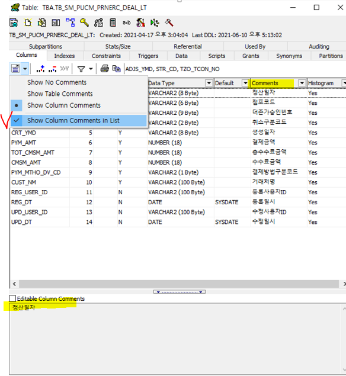

# 211118 - Toad for oracle 2


### 헷갈리거나 애매한 sql 이슈에 대해 정리

#### order by의 asc, desc

- 코드를 실행할 때는 직접 확인하면 돼서 별 문제가 없지만, 손코딩이나 손으로 짜게 될 경우 항상 헷갈리는 두개의 키워드

- 먼저 asc와 desc의 전체 스펠링은 ascending(오름차순), descending(내림차순)이다.

- 항상 오름차순과 내림차순의 의미가 헷갈리는데, 앞에 '값이 점점'을 붙이면 조금 이해가 쉽게 된다.

  - '값이 점점' 오름차순(asc) -> 1, 2, 3, ..., 9 | a, b, c, ..., z
  - '값이 점점' 내림차순(desc) -> 9, 8, 7, ..., 0 | z, x, y, ... a

- oracle 이나 mysql 기준으로 기본적인 order by 기준은 asc (오름차순)으로 정렬한다. 그래서 실질적으로 asc는 명시하지 않아도 작동한다.

  - 사실상 sql문에서는 desc만 잘 알고 있어도 사용하는데에는 문제없을듯 하다.

- sql 정렬시 대소문자 구분 여부는 db마다 정책이 다르다. (이 부분은 좀 더 검색이나 테스트가 필요함)

  - 대소문자 구분 - sqlite, oracle (A B C T a b c g)
    - 대문자가 먼저 나오는 이유는 개인적인 생각으로 askii 코드상으로 대문자가 앞 순위라서 일 것 같다. (A - 65, a - 97)
  - 구분 X - mysql (A a b B C c g T)
  - 그래서 SQL문 상으로 대소문자 구분을 없애거나 구분을 하고자 한다면 특정 키워드를 입력 or 정렬 기준 자체를 바꾸어서 진행해야한다.

  ```sql
  -- 구분 -> 구분 X
  SELECT * FROM table ORDER BY title ASC COLLATE NOCASE;
  -- ORDER BY TITLE COLLATE NOCASE ASC
  SELECT * FROM table ORDER BY LOWER(title) ASC -- 모든 row에 대한 LOWER작업이 소요되고, index 접근이 어려워지므로(index 값과 lower된 값이 달라지므로) 성능상 비추
  /* 참고 URL - 
  https://stackoverflow.com/questions/2413427/how-to-use-sql-order-by-statement-to-sort-results-case-insensitive/2413833
  https://wonyoung2.tistory.com/46 */
  ```

  ```sql
  -- 구분 X -> 구분
  -- 1번 BINARY - 대문자가 모두 나온 후에 소문자가 나오게 됨, 즉, 대문자와 소문자가 격리됨
  SELECT * FROM table ORDER BY BINARY title;
  -- 2번 BINARY 추가 - 대소문자 구별없이 정렬한 후, BINARY에 의해 대소문자 정렬
  -- 대문자 우선
  SELECT * FROM table ORDER BY title, BINARY title;
  -- 소문자 우선(DESC)
  SELECT * FROM table ORDER BY title, BINARY title DESC;
  /* 참고 URL - 
  https://zetawiki.com/wiki/MySQL_%EB%8C%80%EC%86%8C%EB%AC%B8%EC%9E%90_%EA%B5%AC%EB%B3%84%ED%95%98%EC%97%AC_%EC%A0%95%EB%A0%AC
  http://www.gurubee.net/article/81408
  ```


#### between a and b는 이상, 이하일까 초과, 미만일까?

- 구글링을 통한 검색, 실제 문장을 작성해서 실험해본 결과 a값 이상, b값 이하이다.

```sql
select empno, ename, sal, comm
from emp
-- 1000, 2000인 값도 제대로 나온다.
where (sal between 1000 and 2000 or comm is null);
```

- 문자열의 경우도 해당 a값을 포함한 문자열 이상, b값을 포함한 문자열 이하로 포함한다. (이는 날짜를 통한 비교를 할때 명확하게 확인 가능) 


#### 문자열을 비교 연산자로 비교했을 때 처리되는 과정

- 비교 연산자의 양쪽이 모두 CHAR 유형 타입인 경우
  - 길이가 서로 다른 CHAR형 타입이면 작은 쪽에 SPACE를 추가하여 길이를 같게 한 후에 비교한다.
  - 서로 다른 문자가 나올 때까지 비교한다.
  - 달라진 첫 번째 문자의 값에 따라 크기를 결정한다.
  - BLANK의 수만 다르다면 서로 같은 값으로 결정한다.

- 비교 연산자의 어느 한 쪽이 VARCHAR 유형 타입인 경우

  - 서로 다른 문자가 나올 때까지 비교한다.

  - 길이가 다르다면 짧은 것이 끝날 때까지만 비교한 후에 길이가 긴 것이 크다고 판단한다.

  - 길이가 같고 다른 것이 없다면 같다고 판단한다.

  - VARCHAR는 NOT NULL까지 길이를 말한다.

- 상수값과 비교할 경우

  - 상수 쪽을 변수 타입과 동일하게 바꾸고 비교한다.

- **[참고]** 문자 유형 칼럼의 경우 WHERE 문자유형칼럼 = K02 처럼 ' ' 표시가 없는 경우 에러가 발생하지만, 숫자 유형 칼럼의 경우 WHERE 숫자유형칼럼 = '170' 처럼 숫자로 변환이 가능한 문자열(Alpha Numeric)과 비교되면 상대 타입을 숫자 타입으로 바꾸어 비교한다. ('170'이 내부적으로 숫자 유형 170으로 바뀌어 처리됨.)

- 참고 url - https://kgvovc.tistory.com/21


#### 같은 sql문인데 invaild character 오류가 나던 이유

- 2-6 문제를 풀던 도중 같은 문장인데 한 곳에선 에러가 나오고 다른 줄에선 에러가 나지 않았음

```sql
-- 에러
select empno, ename, hiredate, to_char(hiredate, 'day')
from emp
where to_char(hiredate, 'day') in ('monday', 'tuesday');
-- where to_char(hiredate, 'd') in (2, 3)
-- where to_char(hiredate, 'day', 'NLS_DATE_LANGUAGE=korean') in ('월요일', '화요일')
-- where "요일" = 'monday' or "요일"  = 'tuesday'

-- 정상
select empno, ename, hiredate, to_char(hiredate, 'day') "요일"
from emp
-- where to_char(hiredate, 'd') in (2, 3)
where to_char(hiredate, 'day') in ('monday', 'tuesday');
```

- 원인을 찾아보니 위의 sql문을 보면 세미콜론 뒤에 주석으로 된 sql문이 존재하는데, Toad에서 세미콜론을 추가시켰을 경우, 뒤의 주석 처리된 부분까지 명령어를 읽게 되는 경우가 있다고 한다. https://stackoverflow.com/questions/27987882/how-can-i-solve-ora-00911-invalid-character-error/27990049
- 이 문제는 밑의 주석을 제거하거나 주석을 세미콜론 위치 보다 위에 올리기, 또는 세미콜론 자체를 쓰지 않는 방법으로 해결 가능하다.


### 오늘의 팁과 피드백

- 현재 oracle DB 관련 설정을 보는 법

```sql
select * from nls_session_parameters 
```

- CASE WHEN 문 작성시에 각 조건 마다 THEN으로 각각에 대응하는 값 연결하기
  - 끝났을 때 꼭 END "컬럼명" 적어주기

```sql
select empno, ename, hiredate, sal, 
    case when to_char(hiredate, 'yy') = '80' then sal*0.8
        when to_char(hiredate, 'yy') = '81' then sal*0.6
        when to_char(hiredate, 'yy') = '82' then sal*0.4
        else sal*0.1
    end "보너스"
from emp;
```

- sql의 substr은 python과 같이 -1(맨 뒤)부터 접근이 가능하다.

```sql
select ename, substr(ename, 0, 1) "첫글자", substr(ename, -1, 1) "마지막글자", length(ename) "글자수"
from emp
order by length(ename) desc, ename;
```

- oracle 에서는 limit 명령어가 없다.(12버전 이상에서는 지원) 따라서 유사한 기능인 rownum 명령어를 사용해야한다.

```sql
-- mysql에서 20개 가져오기
SELECT * FROM table LIMIT 20;
-- 오라클에서 20개 가져오기
SELECT * FROM 테이블 WHERE ROWNUM >= 1 AND ROWNUM <= 20;
-- 오라클 Rownum 응용 : 시작과 끝사이의 검색된 결과 20개 가져오기
SELECT * FROM 테이블 WHERE ROWNUM >= 1 AND ROWNUM <= 20 AND 컬럼 BETWEEN 시작 AND 끝;
select * from (select rownum , * from 테이블) A where a.rownum >=1 and rownum <=20;
-- 출처: https://solbel.tistory.com/171 [개발자의 끄적끄적]
/* 참고 url
https://gent.tistory.com/254
https://stackoverflow.com/questions/48780903/limit-clause-in-oracle-sql-sql-command-not-properly-ended */
```

- sql의 문자열은 0번 부터 시작하지만, row 숫자는 1번 부터 시작한다. (위의 2개의 예시 참조)

- oracle db에서 ''(홑따옴표)와 ""(쌍따옴표)의 차이
  - (')홑따옴표 - 문자열을 감싸주는 기호 ('문자열')
  - (")쌍따옴표 - 컬럼명 등을 감싸주는 기호 ("사용자명"."테이블명"."컬럼명")

- toad에서 F4를 통해 테이블 정보를 볼 때, 아래와 같은 설정을 통해 해당 컬럼이 어떤 의미인지 적혀 있는 주석을 확인할 수 있다.




- 휴가 청구 관련


- 야근을 하게 되었을시 법인카드를 가진 선임분에게 문의하여 저녁밥 or 택시비 등을 결제하고 나중에 사용 건에 대해 보고서?를 올리면 된다. 이 부분에 대해선 나중에 문의필요

