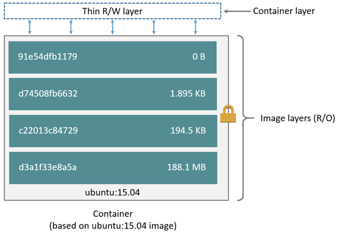
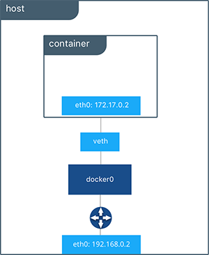
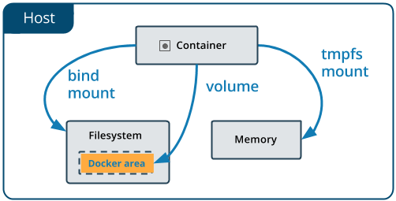

# DevOps를_위한_Docker_Kubernetes_2일차


- [2023 롯데정보통신 Docker, Kubernetes - Google Drive](https://drive.google.com/drive/folders/1KK68PJpsDHBn1dfAHhEboSXcQYceaEQp)

- https://bit.ly/448hA9q 


- 무선네트워크 GD_H - hhhhhhhh


- 컨테이너는 한번 생성하면 실행옵션을 변경할 수 없다 (삭제 후 재생성)


## 오전


- 컨테이너의 업데이트는 이미지의 교체로 업데이트 (뉴 버전의 이미지를 새로 다운로드 받음)
- 예를 들어 70mb의 이미지에 1mb의 업데이트를 했음에도 71mb의 새로운 이미지를 다운로드 받는건 파일저장소(이용 물리 서버) + 네트워크트래픽(도커 서버) 에 부담을 주므로 union mount filesystem을 채택하여 변경된 내역만 업데이트 할 수 있도록 파일시스템 구축


- 어제 진행내역 실습


- busybox 리눅스 필수 기능만 모아놓은 기본 이미지


#### 도커 이미지 삭제

```
docker image rm IMAGE_REPO:TAG
docker rmi IMAGE_REPO:TAG
```


```sh
[user@localhost ~]$ docker search centos
NAME                                         DESCRIPTION                                     STARS     OFFICIAL   AUTOMATED
centos                                       DEPRECATED; The official build of CentOS.       7600      [OK]       
kasmweb/centos-7-desktop                     CentOS 7 desktop for Kasm Workspaces            38                   
bitnami/centos-base-buildpack                Centos base compilation image                   0                    [OK]
couchbase/centos7-systemd                    centos7-systemd images with additional debug…   8                    [OK]
continuumio/centos5_gcc5_base                                                                3                    
datadog/centos-i386                                                                          0                    
dokken/centos-7                              CentOS 7 image for kitchen-dokken               5                    
dokken/centos-8                              CentOS 8 image for kitchen-dokken               3                    
spack/centos7                                CentOS 7 with Spack preinstalled                1                    
dokken/centos-6                              EOL: CentOS 6 image for kitchen-dokken          0                    
atlas/centos7-atlasos                        ATLAS CentOS 7 Software Development OS          0                    
spack/centos6                                CentOS 6 with Spack preinstalled                1                    
couchbase/centos-72-java-sdk                                                                 0                    
ustclug/centos                               Official CentOS Image with USTC Mirror          0                    
couchbase/centos-72-jenkins-core                                                             0                    
couchbase/centos-70-sdk-build                                                                0                    
couchbase/centos-69-sdk-build                                                                0                    
dokken/centos-stream-8                                                                       4                    
eclipse/centos_jdk8                          CentOS, JDK8, Maven 3, git, curl, nmap, mc, …   5                    [OK]
couchbase/centos-69-sdk-nodevtoolset-build                                                   0                    
adoptopenjdk/centos7_build_image                                                             1                    
corpusops/centos-bare                        https://github.com/corpusops/docker-images/     0                    
dokken/centos-stream-9                                                                       6                    
corpusops/centos                             centos corpusops baseimage                      0                    
adoptopenjdk/centos6_build_image                                                             0                    
[user@localhost ~]$ docker pull centos:7
7: Pulling from library/centos
2d473b07cdd5: Pull complete 
Digest: sha256:be65f488b7764ad3638f236b7b515b3678369a5124c47b8d32916d6487418ea4
Status: Downloaded newer image for centos:7
docker.io/library/centos:7
[user@localhost ~]$ docker images
REPOSITORY   TAG       IMAGE ID       CREATED         SIZE
centos       7         eeb6ee3f44bd   21 months ago   204MB
[user@localhost ~]$ docker run -it --name centos7-1 centos:7
[root@aadac1d664a3 /]# docker ps
bash: docker: command not found
[root@aadac1d664a3 /]# exit
exit
[user@localhost ~]$ docker ps -a
CONTAINER ID   IMAGE      COMMAND       CREATED              STATUS                       PORTS     NAMES
aadac1d664a3   centos:7   "/bin/bash"   About a minute ago   Exited (127) 4 seconds ago             centos7-1
[user@localhost ~]$ docker run -it --name centos7-1 centos:7
docker: Error response from daemon: Conflict. The container name "/centos7-1" is already in use by container "aadac1d664a3da5030b7ac3b8ac383464eba4d09d0a315534fa2d694b32c339b". You have to remove (or rename) that container to be able to reuse that name.
See 'docker run --help'.
[user@localhost ~]$ docker start -it centos7-1
unknown shorthand flag: 't' in -t
See 'docker start --help'.
[user@localhost ~]$ docker start -i -t centos7-1
unknown shorthand flag: 't' in -t
See 'docker start --help'.
[user@localhost ~]$ docker start -i centos7-1
[root@aadac1d664a3 /]# ps -ef
UID        PID  PPID  C STIME TTY          TIME CMD
root         1     0  0 00:46 pts/0    00:00:00 /bin/bash
root        15     1  0 00:46 pts/0    00:00:00 ps -ef
[root@aadac1d664a3 /]# exit
exit
[user@localhost ~]$ docker ps
CONTAINER ID   IMAGE     COMMAND   CREATED   STATUS    PORTS     NAMES
[user@localhost ~]$ docker ps -a
CONTAINER ID   IMAGE      COMMAND       CREATED         STATUS                     PORTS     NAMES
aadac1d664a3   centos:7   "/bin/bash"   4 minutes ago   Exited (0) 5 seconds ago             centos7-1
[user@localhost ~]$ docker run -it --name centos7-2d centos:7
[root@454c4afa9a89 /]# exit
exit
[user@localhost ~]$ docker rm centos7-2d
centos7-2d
[user@localhost ~]$ docker run -dt --name centos7-2d centos:7
8424a6bd7cfce568ee1c7967b34dce59261eb73b954fe6a5f27de176c155f952
[user@localhost ~]$ docker ps
CONTAINER ID   IMAGE      COMMAND       CREATED         STATUS         PORTS     NAMES
8424a6bd7cfc   centos:7   "/bin/bash"   4 seconds ago   Up 3 seconds             centos7-2d
[user@localhost ~]$ docker ps -a
CONTAINER ID   IMAGE      COMMAND       CREATED          STATUS                      PORTS     NAMES
8424a6bd7cfc   centos:7   "/bin/bash"   24 minutes ago   Up 24 minutes                         centos7-2d
aadac1d664a3   centos:7   "/bin/bash"   30 minutes ago   Exited (0) 26 minutes ago             centos7-1
[user@localhost ~]$ docker rm centos7-2d
Error response from daemon: You cannot remove a running container 8424a6bd7cfce568ee1c7967b34dce59261eb73b954fe6a5f27de176c155f952. Stop the container before attempting removal or force remove
[user@localhost ~]$ docker stop centos7-wd
Error response from daemon: No such container: centos7-wd
[user@localhost ~]$ docker stop centos7-2d
centos7-2d
[user@localhost ~]$ docker rm centos7-2d
centos7-2d
[user@localhost ~]$ docker ps -a
CONTAINER ID   IMAGE      COMMAND       CREATED          STATUS                      PORTS     NAMES
aadac1d664a3   centos:7   "/bin/bash"   31 minutes ago   Exited (0) 27 minutes ago             centos7-1
[user@localhost ~]$ docker rm ^C
[user@localhost ~]$ docker rm aadac1d664a3
aadac1d664a3
[user@localhost ~]$ docker ps -a
CONTAINER ID   IMAGE     COMMAND   CREATED   STATUS    PORTS     NAMES
[user@localhost ~]$ docker pull busybox:latest
latest: Pulling from library/busybox
71d064a1ac7d: Pull complete 
Digest: sha256:6e494387c901caf429c1bf77bd92fb82b33a68c0e19f6d1aa6a3ac8d27a7049d
Status: Downloaded newer image for busybox:latest
docker.io/library/busybox:latest
[user@localhost ~]$ docker images
REPOSITORY   TAG       IMAGE ID       CREATED         SIZE
busybox      latest    b539af69bc01   10 days ago     4.86MB
centos       7         eeb6ee3f44bd   21 months ago   204MB
[user@localhost ~]$ docker rmi busybox
Untagged: busybox:latest
Untagged: busybox@sha256:6e494387c901caf429c1bf77bd92fb82b33a68c0e19f6d1aa6a3ac8d27a7049d
Deleted: sha256:b539af69bc01c6c1c1eae5474a94b0abaab36b93c165c0cf30b7a0ab294135a3
Deleted: sha256:0b7d464440dc672e08617a7520ac064ba1d6db2c855c185a2a71f1b20e728875

```


### Union Mount Filesystem

 파일 시스템을 각 레이어로 구분하고 각 레이어를 합쳐서 마치 하나의 파일시스템이 동작하는 것처럼 보이도록 하는 파일시스템

참조 : https://docs.docker.com/storage/storagedriver/ 

교재 참고 : pp. 161 ~ 165

##### Union Mount Filesystem

- AUFS
- Btrfs
- OverlayFS




### 컨테이너 활용

#### 쉘 환경변수를 지정하여 컨테이너 실행

```sh
$ docker container run -e VARIABLE1=VALUE1 -e VARIABLE2=VALUE2 --name CONTAINER IMAGE_REPO:TAG # -e 환경변수 element?

docker container run -e MYSQL_ROOT_PASSWORD=test1234 -d -p 3306:3306 --name mysql-db mysql:latest # 초기 진행시 비밀번호 입력해서 진입 (이후에 알아볼 수 없음?)

root@98e6d4ed3df6:/# mysql -u root -p

Enter password: 

mysql> exit
```

##### 환경변수 확인

```bash
[user@localhost ~]$ docker container run -dt -e VARIABLE1=VALUE1 --name centos7-3d centos:7
3f4492b7970156041a0d5dac0b193738e686e8067a4dd5305c72714822c1cd98
[user@localhost ~]$ docker ps
CONTAINER ID   IMAGE      COMMAND       CREATED              STATUS              PORTS     NAMES
3f4492b79701   centos:7   "/bin/bash"   About a minute ago   Up About a minute             centos7-3d
[user@localhost ~]$ docker exec -it centos7-3d /bin/bash
[root@3f4492b79701 /]# ps -ef
UID        PID  PPID  C STIME TTY          TIME CMD
root         1     0  0 01:27 pts/0    00:00:00 /bin/bash
root        15     0  0 01:29 pts/1    00:00:00 /bin/bash
root        29    15  0 01:29 pts/1    00:00:00 ps -ef
[root@3f4492b79701 /]# env  
HOSTNAME=3f4492b79701
TERM=xterm
LS_COLORS=rs=0:di=01;34:ln=01;36:mh=00:pi=40;33:so=01;35:do=01;35:bd=40;33;01:cd=40;33;01:or=40;31;01:mi=01;05;37;41:su=37;41:sg=30;43:ca=30;41:tw=30;42:ow=34;42:st=37;44:ex=01;32:*.tar=01;31:*.tgz=01;31:*.arc=01;31:*.arj=01;31:*.taz=01;31:*.lha=01;31:*.lz4=01;31:*.lzh=01;31:*.lzma=01;31:*.tlz=01;31:*.txz=01;31:*.tzo=01;31:*.t7z=01;31:*.zip=01;31:*.z=01;31:*.Z=01;31:*.dz=01;31:*.gz=01;31:*.lrz=01;31:*.lz=01;31:*.lzo=01;31:*.xz=01;31:*.bz2=01;31:*.bz=01;31:*.tbz=01;31:*.tbz2=01;31:*.tz=01;31:*.deb=01;31:*.rpm=01;31:*.jar=01;31:*.war=01;31:*.ear=01;31:*.sar=01;31:*.rar=01;31:*.alz=01;31:*.ace=01;31:*.zoo=01;31:*.cpio=01;31:*.7z=01;31:*.rz=01;31:*.cab=01;31:*.jpg=01;35:*.jpeg=01;35:*.gif=01;35:*.bmp=01;35:*.pbm=01;35:*.pgm=01;35:*.ppm=01;35:*.tga=01;35:*.xbm=01;35:*.xpm=01;35:*.tif=01;35:*.tiff=01;35:*.png=01;35:*.svg=01;35:*.svgz=01;35:*.mng=01;35:*.pcx=01;35:*.mov=01;35:*.mpg=01;35:*.mpeg=01;35:*.m2v=01;35:*.mkv=01;35:*.webm=01;35:*.ogm=01;35:*.mp4=01;35:*.m4v=01;35:*.mp4v=01;35:*.vob=01;35:*.qt=01;35:*.nuv=01;35:*.wmv=01;35:*.asf=01;35:*.rm=01;35:*.rmvb=01;35:*.flc=01;35:*.avi=01;35:*.fli=01;35:*.flv=01;35:*.gl=01;35:*.dl=01;35:*.xcf=01;35:*.xwd=01;35:*.yuv=01;35:*.cgm=01;35:*.emf=01;35:*.axv=01;35:*.anx=01;35:*.ogv=01;35:*.ogx=01;35:*.aac=01;36:*.au=01;36:*.flac=01;36:*.mid=01;36:*.midi=01;36:*.mka=01;36:*.mp3=01;36:*.mpc=01;36:*.ogg=01;36:*.ra=01;36:*.wav=01;36:*.axa=01;36:*.oga=01;36:*.spx=01;36:*.xspf=01;36:
PATH=/usr/local/sbin:/usr/local/bin:/usr/sbin:/usr/bin:/sbin:/bin
PWD=/
SHLVL=1
HOME=/root
# 환경변수 확인
VARIABLE1=VALUE1
_=/usr/bin/env
```


#### CPU 개수(Core 개수) 성능을 제한하여 컨테이너 실행

- 리소스를 많이 잡아먹는 컨테이너의 경우 다른 컨테이너에 영향을 줄이기 위해 cpu 등에 제한을 줄 수 있음

```sh
# CPUS - 갯수
docker container run --cpus CPUS --name CONTAINER IMAGE
# 30%
docker container run -it --cpus 0.3 --name centos7_3 centos:7
```

##### 확인

```bash
[user@localhost ~]$ docker run -dt --cpus 0.3 --name centos7-4d centos:7
de6c87560579d8f8d7db9b4a2adb0d0a79e5c62dec0ff945261d13594450dc31
[user@localhost ~]$ docker container inspect centos7-4d
[
    {
        "Id": "de6c87560579d8f8d7db9b4a2adb0d0a79e5c62dec0ff945261d13594450dc31",
        "Created": "2023-06-20T01:36:54.529437687Z",
        "Path": "/bin/bash",
        "Args": [],
        "State": {
            "Status": "running",
            "Running": true,
            "Paused": false,
            "Restarting": false,
            "OOMKilled": false,
            "Dead": false,
            "Pid": 6663,
            "ExitCode": 0,
            "Error": "",
            "StartedAt": "2023-06-20T01:36:54.995149234Z",
            "FinishedAt": "0001-01-01T00:00:00Z"
        },
        "Image": "sha256:eeb6ee3f44bd0b5103bb561b4c16bcb82328cfe5809ab675bb17ab3a16c517c9",
        "ResolvConfPath": "/var/lib/docker/containers/de6c87560579d8f8d7db9b4a2adb0d0a79e5c62dec0ff945261d13594450dc31/resolv.conf",
        "HostnamePath": "/var/lib/docker/containers/de6c87560579d8f8d7db9b4a2adb0d0a79e5c62dec0ff945261d13594450dc31/hostname",
        "HostsPath": "/var/lib/docker/containers/de6c87560579d8f8d7db9b4a2adb0d0a79e5c62dec0ff945261d13594450dc31/hosts",
        "LogPath": "/var/lib/docker/containers/de6c87560579d8f8d7db9b4a2adb0d0a79e5c62dec0ff945261d13594450dc31/de6c87560579d8f8d7db9b4a2adb0d0a79e5c62dec0ff945261d13594450dc31-json.log",
        "Name": "/centos7-4d",
        "RestartCount": 0,
        "Driver": "overlay2",
        "Platform": "linux",
        "MountLabel": "",
        "ProcessLabel": "",
        "AppArmorProfile": "",
        "ExecIDs": null,
        "HostConfig": {
            "Binds": null,
            "ContainerIDFile": "",
            "LogConfig": {
                "Type": "json-file",
                "Config": {}
            },
            "NetworkMode": "default",
            "PortBindings": {},
            "RestartPolicy": {
                "Name": "no",
                "MaximumRetryCount": 0
            },
            "AutoRemove": false,
            "VolumeDriver": "",
            "VolumesFrom": null,
            "ConsoleSize": [
                31,
                131
            ],
            "CapAdd": null,
            "CapDrop": null,
            "CgroupnsMode": "host",
            "Dns": [],
            "DnsOptions": [],
            "DnsSearch": [],
            "ExtraHosts": null,
            "GroupAdd": null,
            "IpcMode": "private",
            "Cgroup": "",
            "Links": null,
            "OomScoreAdj": 0,
            "PidMode": "",
            "Privileged": false,
            "PublishAllPorts": false,
            "ReadonlyRootfs": false,
            "SecurityOpt": null,
            "UTSMode": "",
            "UsernsMode": "",
            "ShmSize": 67108864,
            "Runtime": "runc",
            "Isolation": "",
            "CpuShares": 0,
            "Memory": 0,
            "NanoCpus": 300000000,
            "CgroupParent": "",
            "BlkioWeight": 0,
            "BlkioWeightDevice": [],
            "BlkioDeviceReadBps": [],
            "BlkioDeviceWriteBps": [],
            "BlkioDeviceReadIOps": [],
            "BlkioDeviceWriteIOps": [],
            "CpuPeriod": 0,
            "CpuQuota": 0,
            "CpuRealtimePeriod": 0,
            "CpuRealtimeRuntime": 0,
            "CpusetCpus": "",
            "CpusetMems": "",
            "Devices": [],
            "DeviceCgroupRules": null,
            "DeviceRequests": null,
            "MemoryReservation": 0,
            "MemorySwap": 0,
            "MemorySwappiness": null,
            "OomKillDisable": false,
            "PidsLimit": null,
            "Ulimits": null,
            "CpuCount": 0,
            "CpuPercent": 0,
            "IOMaximumIOps": 0,
            "IOMaximumBandwidth": 0,
            "MaskedPaths": [
                "/proc/asound",
                "/proc/acpi",
                "/proc/kcore",
                "/proc/keys",
                "/proc/latency_stats",
                "/proc/timer_list",
                "/proc/timer_stats",
                "/proc/sched_debug",
                "/proc/scsi",
                "/sys/firmware"
            ],
            "ReadonlyPaths": [
                "/proc/bus",
                "/proc/fs",
                "/proc/irq",
                "/proc/sys",
                "/proc/sysrq-trigger"
            ]
        },
        "GraphDriver": {
            "Data": {
                "LowerDir": "/var/lib/docker/overlay2/bbfdc9adfe502621eb55d80e8f137b1f1081f19c00be2e77a25d40634fe45e63-init/diff:/var/lib/docker/overlay2/cf428d6fa0526ea93152ac5423a4c697c582713f3348888e6e573f49050e0c26/diff",
                "MergedDir": "/var/lib/docker/overlay2/bbfdc9adfe502621eb55d80e8f137b1f1081f19c00be2e77a25d40634fe45e63/merged",
                "UpperDir": "/var/lib/docker/overlay2/bbfdc9adfe502621eb55d80e8f137b1f1081f19c00be2e77a25d40634fe45e63/diff",
                "WorkDir": "/var/lib/docker/overlay2/bbfdc9adfe502621eb55d80e8f137b1f1081f19c00be2e77a25d40634fe45e63/work"
            },
            "Name": "overlay2"
        },
        "Mounts": [],
        "Config": {
            "Hostname": "de6c87560579",
            "Domainname": "",
            "User": "",
            "AttachStdin": false,
            "AttachStdout": false,
            "AttachStderr": false,
            "Tty": true,
            "OpenStdin": false,
            "StdinOnce": false,
            "Env": [
                "PATH=/usr/local/sbin:/usr/local/bin:/usr/sbin:/usr/bin:/sbin:/bin"
            ],
            "Cmd": [
                "/bin/bash"
            ],
            "Image": "centos:7",
            "Volumes": null,
            "WorkingDir": "",
            "Entrypoint": null,
            "OnBuild": null,
            "Labels": {
                "org.label-schema.build-date": "20201113",
                "org.label-schema.license": "GPLv2",
                "org.label-schema.name": "CentOS Base Image",
                "org.label-schema.schema-version": "1.0",
                "org.label-schema.vendor": "CentOS",
                "org.opencontainers.image.created": "2020-11-13 00:00:00+00:00",
                "org.opencontainers.image.licenses": "GPL-2.0-only",
                "org.opencontainers.image.title": "CentOS Base Image",
                "org.opencontainers.image.vendor": "CentOS"
            }
        },
        "NetworkSettings": {
            "Bridge": "",
            "SandboxID": "8a1753e1268a7287aed1b4f18a2142e172db5819c0d2f4acd2e4758deaa47c5e",
            "HairpinMode": false,
            "LinkLocalIPv6Address": "",
            "LinkLocalIPv6PrefixLen": 0,
            "Ports": {},
            "SandboxKey": "/var/run/docker/netns/8a1753e1268a",
            "SecondaryIPAddresses": null,
            "SecondaryIPv6Addresses": null,
            "EndpointID": "280835e04aa3ff9115f34746391f776c0d9abfeb727add5051cb4484adc1be23",
            "Gateway": "172.17.0.1",
            "GlobalIPv6Address": "",
            "GlobalIPv6PrefixLen": 0,
            "IPAddress": "172.17.0.3",
            "IPPrefixLen": 16,
            "IPv6Gateway": "",
            "MacAddress": "02:42:ac:11:00:03",
            "Networks": {
                "bridge": {
                    "IPAMConfig": null,
                    "Links": null,
                    "Aliases": null,
                    "NetworkID": "c25f1966a32d3aec23d74192849ab063092e5aaaec203888c3d0ec882a3b53d2",
                    "EndpointID": "280835e04aa3ff9115f34746391f776c0d9abfeb727add5051cb4484adc1be23",
                    "Gateway": "172.17.0.1",
                    "IPAddress": "172.17.0.3",
                    "IPPrefixLen": 16,
                    "IPv6Gateway": "",
                    "GlobalIPv6Address": "",
                    "GlobalIPv6PrefixLen": 0,
                    "MacAddress": "02:42:ac:11:00:03",
                    "DriverOpts": null
                }
            }
        }
    }
]
[user@localhost ~]$ docker stats 
# cpu 사용 x라 0이지만 30% 제한 걸림
CONTAINER ID   NAME         CPU %     MEM USAGE / LIMIT     MEM %     NET I/O     BLOCK I/O     PIDS
de6c87560579   centos7-4d   0.00%     408KiB / 1.795GiB     0.02%     656B / 0B   0B / 0B       1
3f4492b79701   centos7-3d   0.00%     3.469MiB / 1.795GiB   0.19%     656B / 0B   6.37MB / 0B   1
```


#### 최대 메모리 용량 제한하여 컨테이너 실행

```sh
docker container run -it -m MAX_MEM --name CONTAINER IMAGE

docker container run -it -m 512m --name centos7_4 centos:7
```

```bash
[user@localhost ~]$ docker run -dt -m 512m --name centos7-5d centos:7
3f2313d3f97441d2f9c5344f6ae0f4287608a00f846ceff6808e11362c583a2f
[user@localhost ~]$ docker stats 
# 메모리 차이 확인 가능
CONTAINER ID   NAME         CPU %     MEM USAGE / LIMIT     MEM %     NET I/O     BLOCK I/O     PIDS
3f2313d3f974   centos7-5d   0.00%     404KiB / 512MiB       0.08%     586B / 0B   0B / 0B       1
de6c87560579   centos7-4d   0.00%     408KiB / 1.795GiB     0.02%     656B / 0B   0B / 0B       1
3f4492b79701   centos7-3d   0.00%     3.469MiB / 1.795GiB   0.19%     656B / 0B   6.37MB / 0B   1
```


#### HOST, CON 사전 세팅 

##### HOST

```bash

[user@localhost ~]$ docker run -dt --name centos7-6d centos:7
7ac35ffa141dd6d89fbd6071fe1d65b89f20027a7a38acbf0b9e749d5382675d
[user@localhost ~]$ ls -l /
total 24
lrwxrwxrwx.   1 root root    7 Sep 12  2021 bin -> usr/bin
dr-xr-xr-x.   5 root root 4096 Sep 12  2021 boot
drwxr-xr-x.  20 root root 3220 Jun 20 09:24 dev
drwxr-xr-x. 141 root root 8192 Jun 20 09:24 etc
drwxr-xr-x.   3 root root   18 Sep 12  2021 home
lrwxrwxrwx.   1 root root    7 Sep 12  2021 lib -> usr/lib
lrwxrwxrwx.   1 root root    9 Sep 12  2021 lib64 -> usr/lib64
drwxr-xr-x.   2 root root    6 Apr 11  2018 media
drwxr-xr-x.   2 root root    6 Apr 11  2018 mnt
drwxr-xr-x.   5 root root   67 Jun 20 06:43 opt
dr-xr-xr-x. 242 root root    0 Jun 20 09:24 proc
dr-xr-x---.  15 root root 4096 Jun 20 06:44 root
drwxr-xr-x.  43 root root 1400 Jun 20 09:29 run
lrwxrwxrwx.   1 root root    8 Sep 12  2021 sbin -> usr/sbin
drwxr-xr-x.   2 root root    6 Apr 11  2018 srv
dr-xr-xr-x.  13 root root    0 Jun 20 09:24 sys
drwxrwxrwt.  25 root root 4096 Jun 20 10:49 tmp
drwxr-xr-x.  13 root root  155 Sep 12  2021 usr
drwxr-xr-x.  20 root root  282 Sep 12  2021 var
```

##### CONTAINER (centos7-6d)

```bash
[user@localhost ~]$ docker exec -it centos7-6d /bin/bash
[root@7ac35ffa141d /]# ls -l /
total 12
-rw-r--r--.   1 root root 12114 Nov 13  2020 anaconda-post.log
lrwxrwxrwx.   1 root root     7 Nov 13  2020 bin -> usr/bin
drwxr-xr-x.   5 root root   360 Jun 20 01:46 dev
drwxr-xr-x.   1 root root    66 Jun 20 01:46 etc
drwxr-xr-x.   2 root root     6 Apr 11  2018 home
lrwxrwxrwx.   1 root root     7 Nov 13  2020 lib -> usr/lib
lrwxrwxrwx.   1 root root     9 Nov 13  2020 lib64 -> usr/lib64
drwxr-xr-x.   2 root root     6 Apr 11  2018 media
drwxr-xr-x.   2 root root     6 Apr 11  2018 mnt
drwxr-xr-x.   2 root root     6 Apr 11  2018 opt
dr-xr-xr-x. 247 root root     0 Jun 20 01:46 proc
dr-xr-x---.   2 root root   114 Nov 13  2020 root
drwxr-xr-x.  11 root root   148 Nov 13  2020 run
lrwxrwxrwx.   1 root root     8 Nov 13  2020 sbin -> usr/sbin
drwxr-xr-x.   2 root root     6 Apr 11  2018 srv
dr-xr-xr-x.  13 root root     0 Jun 20 00:24 sys
drwxrwxrwt.   7 root root   132 Nov 13  2020 tmp
drwxr-xr-x.  13 root root   155 Nov 13  2020 usr
drwxr-xr-x.  18 root root   238 Nov 13  2020 var
[root@7ac35ffa141d /]# echo "container write test" > containerfile1.txt
[root@7ac35ffa141d /]# ls -l /
total 16
-rw-r--r--.   1 root root 12114 Nov 13  2020 anaconda-post.log
lrwxrwxrwx.   1 root root     7 Nov 13  2020 bin -> usr/bin
-rw-r--r--.   1 root root    21 Jun 20 01:49 containerfile1.txt
drwxr-xr-x.   5 root root   360 Jun 20 01:46 dev
drwxr-xr-x.   1 root root    66 Jun 20 01:46 etc
drwxr-xr-x.   2 root root     6 Apr 11  2018 home
lrwxrwxrwx.   1 root root     7 Nov 13  2020 lib -> usr/lib
lrwxrwxrwx.   1 root root     9 Nov 13  2020 lib64 -> usr/lib64
drwxr-xr-x.   2 root root     6 Apr 11  2018 media
drwxr-xr-x.   2 root root     6 Apr 11  2018 mnt
drwxr-xr-x.   2 root root     6 Apr 11  2018 opt
dr-xr-xr-x. 241 root root     0 Jun 20 01:46 proc
dr-xr-x---.   2 root root   114 Nov 13  2020 root
drwxr-xr-x.  11 root root   148 Nov 13  2020 run
lrwxrwxrwx.   1 root root     8 Nov 13  2020 sbin -> usr/sbin
drwxr-xr-x.   2 root root     6 Apr 11  2018 srv
dr-xr-xr-x.  13 root root     0 Jun 20 00:24 sys
drwxrwxrwt.   7 root root   132 Nov 13  2020 tmp
drwxr-xr-x.  13 root root   155 Nov 13  2020 usr
drwxr-xr-x.  18 root root   238 Nov 13  2020 var
```


##### Docker Host에서 컨테이너로 파일 복사

`docker container cp [OPTION] DOCKER_HOST_SOURCE CONTAINER:DEST_PATH`

```bash
[user@localhost ~]$ docker cp centos7-6d:/containerfile1.txt .
Successfully copied 2.05kB to /home/user/.
[user@localhost ~]$ ls- l
bash: ls-: command not found...
[user@localhost ~]$ ls -l
total 4
-rw-r--r--. 1 user user 21 Jun 20 10:49 containerfile1.txt
drwxr-xr-x. 2 user user  6 Jun 20 06:45 Desktop
drwxr-xr-x. 2 user user  6 Jun 20 06:45 Documents
drwxr-xr-x. 2 user user  6 Jun 20 06:45 Downloads
drwxr-xr-x. 2 user user  6 Jun 20 06:45 Music
drwxr-xr-x. 2 user user  6 Jun 20 06:45 Pictures
drwxr-xr-x. 2 user user  6 Jun 20 06:45 Public
drwxr-xr-x. 2 user user  6 Jun 20 06:45 Templates
drwxr-xr-x. 2 user user  6 Jun 20 06:45 Videos
[user@localhost ~]$ cat containerfile1.txt 
container write test
```


##### 컨테이너에서 Docker Host로 파일 복사

`docker container cp [OPTION] CONTAINER:SOURCE DOCKER_HOST_DEST_PATH `

```bash
# host
[user@localhost ~]$ echo "docker host write file" > docker-host-file1.txt
[user@localhost ~]$ cat docker-host-file1.txt 
docker host write file
[user@localhost ~]$ docker cp docker-host-file1.txt centos7-6d:/root
Successfully copied 2.05kB to centos7-6d:/root
```

```bash
# con
[root@7ac35ffa141d /]# ls -l /root
total 8
-rw-------. 1 root root 3416 Nov 13  2020 anaconda-ks.cfg
-rw-rw-r--. 1 1000 1000   23 Jun 20 01:57 docker-host-file1.txt
[root@7ac35ffa141d /]# cat /root/docker-host-file1.txt 
docker host write file
[root@7ac35ffa141d /]# 
```


##### 컨테이너의 파일 변경 사항 확인

`docker container diff CONTAINER`

 \* 컨테이너 이미지로부터 변경된 사항 확인

#####  컨테이너 변경 사항

  A : 새로 추가된 파일/디렉터리

  C : 기존 파일/디렉터리가 수정된 항목

  D : 기존 파일/디렉터리가 제거된 항목

```bash
# con
[root@7ac35ffa141d /]# cd /etc/
[root@7ac35ffa141d etc]# rm issue issue.net yum.conf
rm: remove regular file 'issue'? y
rm: remove regular file 'issue.net'? y
rm: remove regular file 'yum.conf'? y
[root@7ac35ffa141d etc]# rm -rf dbus-1
```

```bash
# host
[user@localhost ~]$ docker container diff centos7-6d
A /containerfile1.txt
C /etc
D /etc/yum.conf
D /etc/dbus-1
D /etc/issue
D /etc/issue.net
C /root
A /root/docker-host-file1.txt
```


### 도커 네트워크

#### 도커 네트워크 유형

##### Bridge network

- Docker 내부에 네트워크를 구성하고 호스트의 인터페이스를 사용해서 외부 네트워크와 연결될 수 있는 네트워크
- Docker Host의 기본 브리지 네트워크 인터페이스 : docker0 - 호스트 네트워크 카드와 연결(물리) nat를 통해 내보냄
- Docker Container의 기본 브리지 인터페이스 : vethXXX



##### Host network

- Docker Host의 네트워크를 직접 공유하는 네트워크
- Docker Host 주소를 사용하여 Docker 컨테이너에서 사용중인 포트로 접근할 수 있음
- 컨테이너가 호스트인것 마냥 사용함 (호스트 이름, ip, 포트 사용)

##### Null network (none)

- 네트워크가 필요하지 않은 도커 컨테이너에서 사용하는 네트워크 유형으로 외부와 단절됨

##### MAC VLAN network

- 호스트의 네트워크 인터페이스와 같은 네트워크에 연결하는 네트워크 유형


#### 도커 네트워크 목록 확인

```bash
$ docker network ls
NETWORK ID   NAME   DRIVER  SCOPE
c889bcf61287  bridge  bridge  local
988dc3e91487  host   host   local
0df71e410787  none   null   local
```


#### 도커 네트워크 세부 정보 확인

`$ docker network inspect NETWORK`

```bash
[user@localhost ~]$ docker network inspect bridge
[
    {
        "Name": "bridge",
        "Id": "c25f1966a32d3aec23d74192849ab063092e5aaaec203888c3d0ec882a3b53d2",
        "Created": "2023-06-20T09:25:02.172147427+09:00",
        "Scope": "local",
        "Driver": "bridge",
        "EnableIPv6": false,
        "IPAM": {
            "Driver": "default",
            "Options": null,
            "Config": [
                {
                    "Subnet": "172.17.0.0/16",
                    "Gateway": "172.17.0.1"
                }
            ]
        },
        "Internal": false,
        "Attachable": false,
        "Ingress": false,
        "ConfigFrom": {
            "Network": ""
        },
        "ConfigOnly": false,
        # 이 네트워크 방식으로 연결된 컨테이너들
        "Containers": {
            "3f2313d3f97441d2f9c5344f6ae0f4287608a00f846ceff6808e11362c583a2f": {
                "Name": "centos7-5d",
                "EndpointID": "68467483f4ba93064a11044aa25084814519c9bf765f4beed9d24d7f46e9d812",
                "MacAddress": "02:42:ac:11:00:04",
                "IPv4Address": "172.17.0.4/16",
                "IPv6Address": ""
            },
            "3f4492b7970156041a0d5dac0b193738e686e8067a4dd5305c72714822c1cd98": {
                "Name": "centos7-3d",
                "EndpointID": "df05c8e729209c14ef36d5ae171d9f422ac3db9599e41b1b1de385adcdfc9932",
                "MacAddress": "02:42:ac:11:00:02",
                "IPv4Address": "172.17.0.2/16",
                "IPv6Address": ""
            },
            "7ac35ffa141dd6d89fbd6071fe1d65b89f20027a7a38acbf0b9e749d5382675d": {
                "Name": "centos7-6d",
                "EndpointID": "62d250f63f3815053aefafb97dead0e2eff8f73b5cb28d6c349d39cc187de976",
                "MacAddress": "02:42:ac:11:00:05",
                "IPv4Address": "172.17.0.5/16",
                "IPv6Address": ""
            },
            "de6c87560579d8f8d7db9b4a2adb0d0a79e5c62dec0ff945261d13594450dc31": {
                "Name": "centos7-4d",
                "EndpointID": "280835e04aa3ff9115f34746391f776c0d9abfeb727add5051cb4484adc1be23",
                "MacAddress": "02:42:ac:11:00:03",
                "IPv4Address": "172.17.0.3/16",
                "IPv6Address": ""
            }
        },
        "Options": {
            "com.docker.network.bridge.default_bridge": "true",
            "com.docker.network.bridge.enable_icc": "true",
            "com.docker.network.bridge.enable_ip_masquerade": "true",
            "com.docker.network.bridge.host_binding_ipv4": "0.0.0.0",
            "com.docker.network.bridge.name": "docker0",
            "com.docker.network.driver.mtu": "1500"
        },
        "Labels": {}
    }
]

```


#### 도커 컨테이너 세부 정보 확인

`$ docker container inspect CONTAINER`

```bash
[user@localhost ~]$ docker container inspect centos7-6d
[
    {
        "Id": "7ac35ffa141dd6d89fbd6071fe1d65b89f20027a7a38acbf0b9e749d5382675d",
        "Created": "2023-06-20T01:46:07.481621783Z",
        "Path": "/bin/bash",
        "Args": [],
        "State": {
            "Status": "running",
            "Running": true,
            "Paused": false,
            "Restarting": false,
            "OOMKilled": false,
            "Dead": false,
            "Pid": 7002,
            "ExitCode": 0,
            "Error": "",
            "StartedAt": "2023-06-20T01:46:07.871853537Z",
            "FinishedAt": "0001-01-01T00:00:00Z"
        },
        "Image": "sha256:eeb6ee3f44bd0b5103bb561b4c16bcb82328cfe5809ab675bb17ab3a16c517c9",
        "ResolvConfPath": "/var/lib/docker/containers/7ac35ffa141dd6d89fbd6071fe1d65b89f20027a7a38acbf0b9e749d5382675d/resolv.conf",
        "HostnamePath": "/var/lib/docker/containers/7ac35ffa141dd6d89fbd6071fe1d65b89f20027a7a38acbf0b9e749d5382675d/hostname",
        "HostsPath": "/var/lib/docker/containers/7ac35ffa141dd6d89fbd6071fe1d65b89f20027a7a38acbf0b9e749d5382675d/hosts",
        "LogPath": "/var/lib/docker/containers/7ac35ffa141dd6d89fbd6071fe1d65b89f20027a7a38acbf0b9e749d5382675d/7ac35ffa141dd6d89fbd6071fe1d65b89f20027a7a38acbf0b9e749d5382675d-json.log",
        "Name": "/centos7-6d",
        "RestartCount": 0,
        "Driver": "overlay2",
        "Platform": "linux",
        "MountLabel": "",
        "ProcessLabel": "",
        "AppArmorProfile": "",
        "ExecIDs": [
            "97eb124c858d7b70b8e7b9200457ece4846979d7cdf9eaade24736cb48c60240"
        ],
        "HostConfig": {
            "Binds": null,
            "ContainerIDFile": "",
            "LogConfig": {
                "Type": "json-file",
                "Config": {}
            },
            "NetworkMode": "default",
            "PortBindings": {},
            "RestartPolicy": {
                "Name": "no",
                "MaximumRetryCount": 0
            },
            "AutoRemove": false,
            "VolumeDriver": "",
            "VolumesFrom": null,
            "ConsoleSize": [
                31,
                131
            ],
            "CapAdd": null,
            "CapDrop": null,
            "CgroupnsMode": "host",
            "Dns": [],
            "DnsOptions": [],
            "DnsSearch": [],
            "ExtraHosts": null,
            "GroupAdd": null,
            "IpcMode": "private",
            "Cgroup": "",
            "Links": null,
            "OomScoreAdj": 0,
            "PidMode": "",
            "Privileged": false,
            "PublishAllPorts": false,
            "ReadonlyRootfs": false,
            "SecurityOpt": null,
            "UTSMode": "",
            "UsernsMode": "",
            "ShmSize": 67108864,
            "Runtime": "runc",
            "Isolation": "",
            "CpuShares": 0,
            "Memory": 0,
            "NanoCpus": 0,
            "CgroupParent": "",
            "BlkioWeight": 0,
            "BlkioWeightDevice": [],
            "BlkioDeviceReadBps": [],
            "BlkioDeviceWriteBps": [],
            "BlkioDeviceReadIOps": [],
            "BlkioDeviceWriteIOps": [],
            "CpuPeriod": 0,
            "CpuQuota": 0,
            "CpuRealtimePeriod": 0,
            "CpuRealtimeRuntime": 0,
            "CpusetCpus": "",
            "CpusetMems": "",
            "Devices": [],
            "DeviceCgroupRules": null,
            "DeviceRequests": null,
            "MemoryReservation": 0,
            "MemorySwap": 0,
            "MemorySwappiness": null,
            "OomKillDisable": false,
            "PidsLimit": null,
            "Ulimits": null,
            "CpuCount": 0,
            "CpuPercent": 0,
            "IOMaximumIOps": 0,
            "IOMaximumBandwidth": 0,
            "MaskedPaths": [
                "/proc/asound",
                "/proc/acpi",
                "/proc/kcore",
                "/proc/keys",
                "/proc/latency_stats",
                "/proc/timer_list",
                "/proc/timer_stats",
                "/proc/sched_debug",
                "/proc/scsi",
                "/sys/firmware"
            ],
            "ReadonlyPaths": [
                "/proc/bus",
                "/proc/fs",
                "/proc/irq",
                "/proc/sys",
                "/proc/sysrq-trigger"
            ]
        },
        "GraphDriver": {
            "Data": {
                "LowerDir": "/var/lib/docker/overlay2/fe0b7e25f0de7b48f30d6900cd35411ef000951273bab730e43099f1c5bd8b1a-init/diff:/var/lib/docker/overlay2/cf428d6fa0526ea93152ac5423a4c697c582713f3348888e6e573f49050e0c26/diff",
                "MergedDir": "/var/lib/docker/overlay2/fe0b7e25f0de7b48f30d6900cd35411ef000951273bab730e43099f1c5bd8b1a/merged",
                "UpperDir": "/var/lib/docker/overlay2/fe0b7e25f0de7b48f30d6900cd35411ef000951273bab730e43099f1c5bd8b1a/diff",
                "WorkDir": "/var/lib/docker/overlay2/fe0b7e25f0de7b48f30d6900cd35411ef000951273bab730e43099f1c5bd8b1a/work"
            },
            "Name": "overlay2"
        },
        "Mounts": [],
        "Config": {
            "Hostname": "7ac35ffa141d",
            "Domainname": "",
            "User": "",
            "AttachStdin": false,
            "AttachStdout": false,
            "AttachStderr": false,
            "Tty": true,
            "OpenStdin": false,
            "StdinOnce": false,
            "Env": [
                "PATH=/usr/local/sbin:/usr/local/bin:/usr/sbin:/usr/bin:/sbin:/bin"
            ],
            "Cmd": [
                "/bin/bash"
            ],
            "Image": "centos:7",
            "Volumes": null,
            "WorkingDir": "",
            "Entrypoint": null,
            "OnBuild": null,
            "Labels": {
                "org.label-schema.build-date": "20201113",
                "org.label-schema.license": "GPLv2",
                "org.label-schema.name": "CentOS Base Image",
                "org.label-schema.schema-version": "1.0",
                "org.label-schema.vendor": "CentOS",
                "org.opencontainers.image.created": "2020-11-13 00:00:00+00:00",
                "org.opencontainers.image.licenses": "GPL-2.0-only",
                "org.opencontainers.image.title": "CentOS Base Image",
                "org.opencontainers.image.vendor": "CentOS"
            }
        },
        "NetworkSettings": {
            "Bridge": "",
            "SandboxID": "3a63803e7d5dbc7c0f3972bd79ab28f2c3303e04ee4fe923db9a29dcbf2f6435",
            "HairpinMode": false,
            "LinkLocalIPv6Address": "",
            "LinkLocalIPv6PrefixLen": 0,
            "Ports": {},
            "SandboxKey": "/var/run/docker/netns/3a63803e7d5d",
            "SecondaryIPAddresses": null,
            "SecondaryIPv6Addresses": null,
            "EndpointID": "62d250f63f3815053aefafb97dead0e2eff8f73b5cb28d6c349d39cc187de976",
            "Gateway": "172.17.0.1",
            "GlobalIPv6Address": "",
            "GlobalIPv6PrefixLen": 0,
            "IPAddress": "172.17.0.5",
            "IPPrefixLen": 16,
            "IPv6Gateway": "",
            "MacAddress": "02:42:ac:11:00:05",
            "Networks": {
                "bridge": {
                    "IPAMConfig": null,
                    "Links": null,
                    "Aliases": null,
                    "NetworkID": "c25f1966a32d3aec23d74192849ab063092e5aaaec203888c3d0ec882a3b53d2",
                    "EndpointID": "62d250f63f3815053aefafb97dead0e2eff8f73b5cb28d6c349d39cc187de976",
                    "Gateway": "172.17.0.1",
                    "IPAddress": "172.17.0.5",
                    "IPPrefixLen": 16,
                    "IPv6Gateway": "",
                    "GlobalIPv6Address": "",
                    "GlobalIPv6PrefixLen": 0,
                    "MacAddress": "02:42:ac:11:00:05",
                    "DriverOpts": null
                }
            }
        }
    }
]
```


#### 네트워크 생성

`$ docker network create [OPTION]... NETWORK`

```bash
[user@localhost ~]$ docker network create --help

Usage:  docker network create [OPTIONS] NETWORK

Create a network

Options:
      --attachable           Enable manual container attachment
      --aux-address map      Auxiliary IPv4 or IPv6 addresses used by Network driver (default map[])
      --config-from string   The network from which to copy the configuration
      --config-only          Create a configuration only network
      # 네트워크 유형 지정(기본값 : bridge)
  -d, --driver string        Driver to manage the Network (default "bridge")
      # 게이트웨이 주소 지정 - 보통 대역 맨 첫번째나 마지막으로 지정함
      --gateway strings      IPv4 or IPv6 Gateway for the master subnet
      --ingress              Create swarm routing-mesh network
      --internal             Restrict external access to the network
      --ip-range strings     Allocate container ip from a sub-range
      --ipam-driver string   IP Address Management Driver (default "default")
      --ipam-opt map         Set IPAM driver specific options (default map[])
      --ipv6                 Enable IPv6 networking
      --label list           Set metadata on a network
  -o, --opt map              Set driver specific options (default map[])
      --scope string         Control the network's scope
      # 네트워크의 서브넷(네트워크 대역) 지정(CIDR 표기법)
      --subnet strings       Subnet in CIDR format that represents a network segment 
      # 192.168.0.0/24 -> 255.255.255.0 서브넷마스크
[user@localhost ~]$ docker network create -d bridge --subnet 172.18.0.0/16 --gateway 172.18.255.254 my_bridge
168e9afe769aa5cc200f8e44175838b25fc3ec1ee34ec3c7f5c90aa2a251e08e
[user@localhost ~]$ docker network ls
NETWORK ID     NAME        DRIVER    SCOPE
c25f1966a32d   bridge      bridge    local
47b7a7ddaf38   host        host      local
168e9afe769a   my_bridge   bridge    local
3a3598e5629c   none        null      local
[user@localhost ~]$ docker network inspect my_bridge
[
    {
        "Name": "my_bridge",
        "Id": "168e9afe769aa5cc200f8e44175838b25fc3ec1ee34ec3c7f5c90aa2a251e08e",
        "Created": "2023-06-20T11:44:52.246551089+09:00",
        "Scope": "local",
        "Driver": "bridge",
        "EnableIPv6": false,
        "IPAM": {
            "Driver": "default",
            "Options": {},
            "Config": [
                {
                    "Subnet": "172.18.0.0/16",
                    "Gateway": "172.18.255.254"
                }
            ]
        },
        "Internal": false,
        "Attachable": false,
        "Ingress": false,
        "ConfigFrom": {
            "Network": ""
        },
        "ConfigOnly": false,
        "Containers": {},
        "Options": {},
        "Labels": {}
    }
]
```


## 오후


### 도커 네트워크 이어서

#### 네트워크 지정하여 컨테이너 실행

`$ docker container run -d -t **--network NETWORK** --name CONTAINER IMAGE `


Centos

 `$ yum install net-tools -y`

#### [Bridge network 실습]

```bash
$ docker network create -d bridge my_bridge

$ docker container run -dt --network my_bridge --name centos_net11 centos:7
$ docker container run -dt --network my_bridge --name centos_net12 centos:7

$ docker network inspect my_bridge 
$ docker container inspect centos_net11
$ docker container inspect centos_net12
# centos_net11)

[root@0a3b81b4b6c7 /]# ping -c 3 8.8.8.8

# centos_net12)
[root@b6027b025673 /]# ping -c 3 172.18.0.2
[root@b6027b025673 /]# ping -c 3 8.8.8.8

```


- 컨테이너는 가상머신보다 가벼운 단위므로 가상머신(OS) 내에 들어간 기능을 모두 추가하면 사이즈가 너무 커지므로 기본적인 기능들을 제거했을 가능성이 높음

```bash
[user@localhost ~]$ docker exec -it centos7_net11 /bin/bash
[root@e85b0fc00c58 /]# ifconfig
bash: ifconfig: command not found
[root@e85b0fc00c58 /]# ip address show
bash: ip: command not found
[root@e85b0fc00c58 /]# 

# host 정상작동
[user@localhost ~]$ ip address show
1: lo: <LOOPBACK,UP,LOWER_UP> mtu 65536 qdisc noqueue state UNKNOWN group default qlen 1000
    link/loopback 00:00:00:00:00:00 brd 00:00:00:00:00:00
    inet 127.0.0.1/8 scope host lo
       valid_lft forever preferred_lft forever
    inet6 ::1/128 scope host 
       valid_lft forever preferred_lft forever
2: enp0s3: <BROADCAST,MULTICAST,UP,LOWER_UP> mtu 1500 qdisc pfifo_fast state UP group default qlen 1000
    link/ether 08:00:27:a7:c2:40 brd ff:ff:ff:ff:ff:ff
    inet 10.0.2.15/24 brd 10.0.2.255 scope global noprefixroute dynamic enp0s3
       valid_lft 85609sec preferred_lft 85609sec
    inet6 fe80::d5f8:8f90:83d0:a38b/64 scope link noprefixroute 
       valid_lft forever preferred_lft forever
3: enp0s8: <BROADCAST,MULTICAST,UP,LOWER_UP> mtu 1500 qdisc pfifo_fast state UP group default qlen 1000
    link/ether 08:00:27:70:e7:47 brd ff:ff:ff:ff:ff:ff
    inet 192.168.56.101/24 brd 192.168.56.255 scope global noprefixroute dynamic enp0s8
       valid_lft 564sec preferred_lft 564sec
    inet6 fe80::d2ce:c59d:a79:c7ed/64 scope link noprefixroute 
       valid_lft forever preferred_lft forever
4: virbr0: <NO-CARRIER,BROADCAST,MULTICAST,UP> mtu 1500 qdisc noqueue state DOWN group default qlen 1000
    link/ether 52:54:00:05:57:8f brd ff:ff:ff:ff:ff:ff
    inet 192.168.122.1/24 brd 192.168.122.255 scope global virbr0
       valid_lft forever preferred_lft forever
5: virbr0-nic: <BROADCAST,MULTICAST> mtu 1500 qdisc pfifo_fast master virbr0 state DOWN group default qlen 1000
    link/ether 52:54:00:05:57:8f brd ff:ff:ff:ff:ff:ff
6: br-168e9afe769a: <BROADCAST,MULTICAST,UP,LOWER_UP> mtu 1500 qdisc noqueue state UP group default 
    link/ether 02:42:6f:3a:71:a6 brd ff:ff:ff:ff:ff:ff
    inet 172.18.255.254/16 brd 172.18.255.255 scope global br-168e9afe769a
       valid_lft forever preferred_lft forever
    inet6 fe80::42:6fff:fe3a:71a6/64 scope link 
       valid_lft forever preferred_lft forever
7: docker0: <NO-CARRIER,BROADCAST,MULTICAST,UP> mtu 1500 qdisc noqueue state DOWN group default 
    link/ether 02:42:ed:f9:a3:45 brd ff:ff:ff:ff:ff:ff
    inet 172.17.0.1/16 brd 172.17.255.255 scope global docker0
       valid_lft forever preferred_lft forever
9: vethf0ba173@if8: <BROADCAST,MULTICAST,UP,LOWER_UP> mtu 1500 qdisc noqueue master br-168e9afe769a state UP group default 
    link/ether 76:4a:7f:47:cd:5d brd ff:ff:ff:ff:ff:ff link-netnsid 0
    inet6 fe80::744a:7fff:fe47:cd5d/64 scope link 
       valid_lft forever preferred_lft forever
11: veth342e2e1@if10: <BROADCAST,MULTICAST,UP,LOWER_UP> mtu 1500 qdisc noqueue master br-168e9afe769a state UP group default 
    link/ether f6:4c:42:47:02:3d brd ff:ff:ff:ff:ff:ff link-netnsid 1
    inet6 fe80::f44c:42ff:fe47:23d/64 scope link 
       valid_lft forever preferred_lft forever
```

- 필요한 경우 해당 패키지만 설치해서 사용 가능

```bash
[root@e85b0fc00c58 /]# yum install net-tools -y
Loaded plugins: fastestmirror, ovl
Determining fastest mirrors
 * base: mirror.kakao.com
 * extras: mirror.kakao.com
 * updates: mirror.kakao.com
base                                                                                        | 3.6 kB  00:00:00     
extras                                                                                      | 2.9 kB  00:00:00     
updates                                                                                     | 2.9 kB  00:00:00     
(1/4): extras/7/x86_64/primary_db                                                           | 249 kB  00:00:00     
(2/4): base/7/x86_64/group_gz                                                               | 153 kB  00:00:01     
(3/4): base/7/x86_64/primary_db                                                             | 6.1 MB  00:00:08     
(4/4): updates/7/x86_64/primary_db                                                          |  21 MB  00:00:18     
Resolving Dependencies
--> Running transaction check
---> Package net-tools.x86_64 0:2.0-0.25.20131004git.el7 will be installed
--> Finished Dependency Resolution

Dependencies Resolved

===================================================================================================================
 Package                  Arch                  Version                                  Repository           Size
===================================================================================================================
Installing:
 net-tools                x86_64                2.0-0.25.20131004git.el7                 base                306 k

Transaction Summary
===================================================================================================================
Install  1 Package

Total download size: 306 k
Installed size: 917 k
Downloading packages:
warning: /var/cache/yum/x86_64/7/base/packages/net-tools-2.0-0.25.20131004git.el7.x86_64.rpm: Header V3 RSA/SHA256 Signature, key ID f4a80eb5: NOKEY
Public key for net-tools-2.0-0.25.20131004git.el7.x86_64.rpm is not installed
net-tools-2.0-0.25.20131004git.el7.x86_64.rpm                                               | 306 kB  00:00:00     
Retrieving key from file:///etc/pki/rpm-gpg/RPM-GPG-KEY-CentOS-7
Importing GPG key 0xF4A80EB5:
 Userid     : "CentOS-7 Key (CentOS 7 Official Signing Key) <security@centos.org>"
 Fingerprint: 6341 ab27 53d7 8a78 a7c2 7bb1 24c6 a8a7 f4a8 0eb5
 Package    : centos-release-7-9.2009.0.el7.centos.x86_64 (@CentOS)
 From       : /etc/pki/rpm-gpg/RPM-GPG-KEY-CentOS-7
Running transaction check
Running transaction test
Transaction test succeeded
Running transaction
  Installing : net-tools-2.0-0.25.20131004git.el7.x86_64                                                       1/1 
  Verifying  : net-tools-2.0-0.25.20131004git.el7.x86_64                                                       1/1 

Installed:
  net-tools.x86_64 0:2.0-0.25.20131004git.el7                                                                      

Complete!
[root@e85b0fc00c58 /]# ifconfig
eth0: flags=4163<UP,BROADCAST,RUNNING,MULTICAST>  mtu 1500
        inet 172.18.0.1  netmask 255.255.0.0  broadcast 172.18.255.255
        ether 02:42:ac:12:00:01  txqueuelen 0  (Ethernet)
        RX packets 12337  bytes 29673842 (28.2 MiB)
        RX errors 0  dropped 0  overruns 0  frame 0
        TX packets 9463  bytes 514420 (502.3 KiB)
        TX errors 0  dropped 0 overruns 0  carrier 0  collisions 0

lo: flags=73<UP,LOOPBACK,RUNNING>  mtu 65536
        inet 127.0.0.1  netmask 255.0.0.0
        loop  txqueuelen 1000  (Local Loopback)
        RX packets 76  bytes 5974 (5.8 KiB)
        RX errors 0  dropped 0  overruns 0  frame 0
        TX packets 76  bytes 5974 (5.8 KiB)
        TX errors 0  dropped 0 overruns 0  carrier 0  collisions 0
```

```bash
# net12
[user@localhost ~]$ docker exec -it centos7_net12 /bin/bash
[root@6470f5235e4b /]# yum install net-tools -y
Loaded plugins: fastestmirror, ovl
Determining fastest mirrors
 * base: mirror.navercorp.com
 * extras: mirror.navercorp.com
 * updates: ftp.iij.ad.jp
base                                                                                        | 3.6 kB  00:00:00     
extras                                                                                      | 2.9 kB  00:00:00     
updates                                                                                     | 2.9 kB  00:00:00     
(1/4): base/7/x86_64/group_gz                                                               | 153 kB  00:00:00     
(2/4): extras/7/x86_64/primary_db                                                           | 249 kB  00:00:00     
(3/4): base/7/x86_64/primary_db                                                             | 6.1 MB  00:00:01     
(4/4): updates/7/x86_64/primary_db                                                          |  21 MB  00:00:09     
Resolving Dependencies
--> Running transaction check
---> Package net-tools.x86_64 0:2.0-0.25.20131004git.el7 will be installed
--> Finished Dependency Resolution

Dependencies Resolved

===================================================================================================================
 Package                  Arch                  Version                                  Repository           Size
===================================================================================================================
Installing:
 net-tools                x86_64                2.0-0.25.20131004git.el7                 base                306 k

Transaction Summary
===================================================================================================================
Install  1 Package

Total download size: 306 k
Installed size: 917 k
Downloading packages:
warning: /var/cache/yum/x86_64/7/base/packages/net-tools-2.0-0.25.20131004git.el7.x86_64.rpm: Header V3 RSA/SHA256 Signature, key ID f4a80eb5: NOKEY
Public key for net-tools-2.0-0.25.20131004git.el7.x86_64.rpm is not installed
net-tools-2.0-0.25.20131004git.el7.x86_64.rpm                                               | 306 kB  00:00:00     
Retrieving key from file:///etc/pki/rpm-gpg/RPM-GPG-KEY-CentOS-7
Importing GPG key 0xF4A80EB5:
 Userid     : "CentOS-7 Key (CentOS 7 Official Signing Key) <security@centos.org>"
 Fingerprint: 6341 ab27 53d7 8a78 a7c2 7bb1 24c6 a8a7 f4a8 0eb5
 Package    : centos-release-7-9.2009.0.el7.centos.x86_64 (@CentOS)
 From       : /etc/pki/rpm-gpg/RPM-GPG-KEY-CentOS-7
Running transaction check
Running transaction test
Transaction test succeeded
Running transaction
  Installing : net-tools-2.0-0.25.20131004git.el7.x86_64                                                       1/1 
  Verifying  : net-tools-2.0-0.25.20131004git.el7.x86_64                                                       1/1 

Installed:
  net-tools.x86_64 0:2.0-0.25.20131004git.el7                                                                      

Complete!
[root@6470f5235e4b /]# ifconfig
eth0: flags=4163<UP,BROADCAST,RUNNING,MULTICAST>  mtu 1500
        inet 172.18.0.2  netmask 255.255.0.0  broadcast 172.18.255.255
        ether 02:42:ac:12:00:02  txqueuelen 0  (Ethernet)
        RX packets 6113  bytes 29336517 (27.9 MiB)
        RX errors 0  dropped 0  overruns 0  frame 0
        TX packets 5798  bytes 316521 (309.1 KiB)
        TX errors 0  dropped 0 overruns 0  carrier 0  collisions 0

lo: flags=73<UP,LOOPBACK,RUNNING>  mtu 65536
        inet 127.0.0.1  netmask 255.0.0.0
        loop  txqueuelen 1000  (Local Loopback)
        RX packets 78  bytes 6042 (5.9 KiB)
        RX errors 0  dropped 0  overruns 0  frame 0
        TX packets 78  bytes 6042 (5.9 KiB)
        TX errors 0  dropped 0 overruns 0  carrier 0  collisions 0
```


- 컨테이너 재할당시 네트워크 주소 변경될 수 있음


```bash
# net11
[root@e85b0fc00c58 /]# ping -c 3 172.18.0.2
PING 172.18.0.2 (172.18.0.2) 56(84) bytes of data.
64 bytes from 172.18.0.2: icmp_seq=1 ttl=64 time=0.070 ms
64 bytes from 172.18.0.2: icmp_seq=2 ttl=64 time=0.077 ms
64 bytes from 172.18.0.2: icmp_seq=3 ttl=64 time=0.075 ms

--- 172.18.0.2 ping statistics ---
3 packets transmitted, 3 received, 0% packet loss, time 2000ms
rtt min/avg/max/mdev = 0.070/0.074/0.077/0.003 ms
[root@e85b0fc00c58 /]# ping -c 3 8.8.8.8
PING 8.8.8.8 (8.8.8.8) 56(84) bytes of data.
64 bytes from 8.8.8.8: icmp_seq=1 ttl=111 time=30.2 ms
64 bytes from 8.8.8.8: icmp_seq=2 ttl=111 time=30.1 ms
64 bytes from 8.8.8.8: icmp_seq=3 ttl=111 time=30.2 ms

--- 8.8.8.8 ping statistics ---
3 packets transmitted, 3 received, 0% packet loss, time 2004ms
rtt min/avg/max/mdev = 30.196/30.237/30.299/0.205 ms

# net12
[root@6470f5235e4b /]# ping -c 3 172.18.0.1
PING 172.18.0.1 (172.18.0.1) 56(84) bytes of data.
64 bytes from 172.18.0.1: icmp_seq=1 ttl=64 time=0.064 ms
64 bytes from 172.18.0.1: icmp_seq=2 ttl=64 time=0.077 ms
64 bytes from 172.18.0.1: icmp_seq=3 ttl=64 time=0.076 ms

--- 172.18.0.1 ping statistics ---
3 packets transmitted, 3 received, 0% packet loss, time 1999ms
rtt min/avg/max/mdev = 0.064/0.072/0.077/0.009 ms
[root@6470f5235e4b /]# ping -c 3 8.8.8.8
PING 8.8.8.8 (8.8.8.8) 56(84) bytes of data.
64 bytes from 8.8.8.8: icmp_seq=1 ttl=111 time=29.9 ms
64 bytes from 8.8.8.8: icmp_seq=2 ttl=111 time=30.1 ms
64 bytes from 8.8.8.8: icmp_seq=3 ttl=111 time=30.1 ms

--- 8.8.8.8 ping statistics ---
3 packets transmitted, 3 received, 0% packet loss, time 2003ms
rtt min/avg/max/mdev = 29.979/30.074/30.130/0.211 ms

```


#### 서로 다른 도커 네트워크 간 통신 불가

```bash
# host
[user@localhost ~]$ docker network inspect bridge
[
    {
        "Name": "bridge",
        "Id": "a8fbefdf5cbeb14627416303febd7e7ce3443b00b123f4f8ad06bec7126560c5",
        "Created": "2023-06-20T13:05:03.773168763+09:00",
        "Scope": "local",
        "Driver": "bridge",
        "EnableIPv6": false,
        "IPAM": {
            "Driver": "default",
            "Options": null,
            "Config": [
                {
                    "Subnet": "172.17.0.0/16",
                    "Gateway": "172.17.0.1"
                }
            ]
        },
        "Internal": false,
        "Attachable": false,
        "Ingress": false,
        "ConfigFrom": {
            "Network": ""
        },
        "ConfigOnly": false,
        "Containers": {
            "7ac35ffa141dd6d89fbd6071fe1d65b89f20027a7a38acbf0b9e749d5382675d": {
                "Name": "centos7-6d",
                "EndpointID": "ba796e85d7d9e8c97d19f365a760eb9ff406d1b5b9e28dbdd884ca0df58a665f",
                "MacAddress": "02:42:ac:11:00:02",
                "IPv4Address": "172.17.0.2/16",
                "IPv6Address": ""
            }
        },
        "Options": {
            "com.docker.network.bridge.default_bridge": "true",
            "com.docker.network.bridge.enable_icc": "true",
            "com.docker.network.bridge.enable_ip_masquerade": "true",
            "com.docker.network.bridge.host_binding_ipv4": "0.0.0.0",
            "com.docker.network.bridge.name": "docker0",
            "com.docker.network.driver.mtu": "1500"
        },
        "Labels": {}
    }
]
# my_bridge <-> bridge 간 통신 안됨
# net11  통신에러
[root@e85b0fc00c58 /]# ping -c 3 172.17.0.2
PING 172.17.0.2 (172.17.0.2) 56(84) bytes of data.

--- 172.17.0.2 ping statistics ---
3 packets transmitted, 0 received, 100% packet loss, time 1999ms

# net12
[root@6470f5235e4b /]# ping -c 3 172.17.0.2
PING 172.17.0.2 (172.17.0.2) 56(84) bytes of data.

--- 172.17.0.2 ping statistics ---
3 packets transmitted, 0 received, 100% packet loss, time 2000ms

```


—

#### [Host network 실습]

```bash
[root@localhost ~]# docker container run -d -t --network host --name centos_net21 centos:7
[root@localhost ~]# docker container exec -i -t centos_net21 /bin/bash
[root@localhost /]# ls -l /root
total 12
-rw-------. 1 root root 2361 Sep 15 14:17 anaconda-ks.cfg
-rw-r--r--. 1 root root  608 Sep 15 14:17 anaconda-post.log
-rw-------. 1 root root 2059 Sep 15 14:17 original-ks.cfg
  (Docker Container 내부임을 확인)

  (Docker Host와 Hostname. IP 주소 동일)
[root@localhost /]# hostname
localhost.localdomain
[root@localhost /]# ifconfig
 (IP 주소 확인)
```


```bash
[user@localhost ~]$ docker container run -d -t --network host --name centos_net21 centos:7
f5d1cefc1251265f06d022fab64978e16014a506b45980babb160c29c3ec6835
[user@localhost ~]$ docker ps
CONTAINER ID   IMAGE      COMMAND       CREATED          STATUS          PORTS     NAMES
f5d1cefc1251   centos:7   "/bin/bash"   15 seconds ago   Up 14 seconds             centos_net21
6470f5235e4b   centos:7   "/bin/bash"   25 minutes ago   Up 25 minutes             centos7_net12
e85b0fc00c58   centos:7   "/bin/bash"   26 minutes ago   Up 26 minutes             centos7_net11
7ac35ffa141d   centos:7   "/bin/bash"   3 hours ago      Up 8 minutes              centos7-6d
[user@localhost ~]$ docker container exec -it centos_net21 /bin/bash
[root@localhost /]# ps -ef
UID        PID  PPID  C STIME TTY          TIME CMD
root         1     0  0 04:35 pts/0    00:00:00 /bin/bash
root        15     0  0 04:36 pts/1    00:00:00 /bin/bash
root        29    15  0 04:38 pts/1    00:00:00 ps -ef
[root@localhost /]# yum install net-tools -y
Loaded plugins: fastestmirror, ovl
Determining fastest mirrors
 * base: ftp.tsukuba.wide.ad.jp
 * extras: ftp.iij.ad.jp
 * updates: mirror.elice.io
base                                                                                        | 3.6 kB  00:00:00     
extras                                                                                      | 2.9 kB  00:00:00     
updates                                                                                     | 2.9 kB  00:00:00     
(1/4): extras/7/x86_64/primary_db                                                           | 249 kB  00:00:00     
(2/4): base/7/x86_64/group_gz                                                               | 153 kB  00:00:01     
(3/4): base/7/x86_64/primary_db                                                             | 6.1 MB  00:00:19     
(4/4): updates/7/x86_64/primary_db                                                          |  21 MB  00:00:27     
Resolving Dependencies
--> Running transaction check
---> Package net-tools.x86_64 0:2.0-0.25.20131004git.el7 will be installed
--> Finished Dependency Resolution

Dependencies Resolved

===================================================================================================================
 Package                  Arch                  Version                                  Repository           Size
===================================================================================================================
Installing:
 net-tools                x86_64                2.0-0.25.20131004git.el7                 base                306 k

Transaction Summary
===================================================================================================================
Install  1 Package

Total download size: 306 k
Installed size: 917 k
Downloading packages:
warning: /var/cache/yum/x86_64/7/base/packages/net-tools-2.0-0.25.20131004git.el7.x86_64.rpm: Header V3 RSA/SHA256 Signature, key ID f4a80eb5: NOKEY
Public key for net-tools-2.0-0.25.20131004git.el7.x86_64.rpm is not installed
net-tools-2.0-0.25.20131004git.el7.x86_64.rpm                                               | 306 kB  00:00:00     
Retrieving key from file:///etc/pki/rpm-gpg/RPM-GPG-KEY-CentOS-7
Importing GPG key 0xF4A80EB5:
 Userid     : "CentOS-7 Key (CentOS 7 Official Signing Key) <security@centos.org>"
 Fingerprint: 6341 ab27 53d7 8a78 a7c2 7bb1 24c6 a8a7 f4a8 0eb5
 Package    : centos-release-7-9.2009.0.el7.centos.x86_64 (@CentOS)
 From       : /etc/pki/rpm-gpg/RPM-GPG-KEY-CentOS-7
Running transaction check
Running transaction test
Transaction test succeeded
Running transaction
  Installing : net-tools-2.0-0.25.20131004git.el7.x86_64                                                       1/1 
  Verifying  : net-tools-2.0-0.25.20131004git.el7.x86_64                                                       1/1 

Installed:
  net-tools.x86_64 0:2.0-0.25.20131004git.el7                                                                      

Complete!
[root@localhost /]# ifconfig
br-168e9afe769a: flags=4163<UP,BROADCAST,RUNNING,MULTICAST>  mtu 1500
        inet 172.18.255.254  netmask 255.255.0.0  broadcast 172.18.255.255
        inet6 fe80::42:6fff:fe3a:71a6  prefixlen 64  scopeid 0x20<link>
        ether 02:42:6f:3a:71:a6  txqueuelen 0  (Ethernet)
        RX packets 0  bytes 0 (0.0 B)
        RX errors 0  dropped 0  overruns 0  frame 0
        TX packets 21  bytes 2424 (2.3 KiB)
        TX errors 0  dropped 0 overruns 0  carrier 0  collisions 0

docker0: flags=4163<UP,BROADCAST,RUNNING,MULTICAST>  mtu 1500
        inet 172.17.0.1  netmask 255.255.0.0  broadcast 172.17.255.255
        inet6 fe80::42:edff:fef9:a345  prefixlen 64  scopeid 0x20<link>
        ether 02:42:ed:f9:a3:45  txqueuelen 0  (Ethernet)
        RX packets 0  bytes 0 (0.0 B)
        RX errors 0  dropped 0  overruns 0  frame 0
        TX packets 13  bytes 1768 (1.7 KiB)
        TX errors 0  dropped 0 overruns 0  carrier 0  collisions 0

enp0s3: flags=4163<UP,BROADCAST,RUNNING,MULTICAST>  mtu 1500
        inet 10.0.2.15  netmask 255.255.255.0  broadcast 10.0.2.255
        inet6 fe80::d5f8:8f90:83d0:a38b  prefixlen 64  scopeid 0x20<link>
        ether 08:00:27:a7:c2:40  txqueuelen 1000  (Ethernet)
        RX packets 62779  bytes 90429356 (86.2 MiB)
        RX errors 0  dropped 0  overruns 0  frame 0
        TX packets 24745  bytes 1503045 (1.4 MiB)
        TX errors 0  dropped 0 overruns 0  carrier 0  collisions 0

enp0s8: flags=4163<UP,BROADCAST,RUNNING,MULTICAST>  mtu 1500
        inet 192.168.56.101  netmask 255.255.255.0  broadcast 192.168.56.255
        inet6 fe80::d2ce:c59d:a79:c7ed  prefixlen 64  scopeid 0x20<link>
        ether 08:00:27:70:e7:47  txqueuelen 1000  (Ethernet)
        RX packets 21  bytes 6096 (5.9 KiB)
        RX errors 0  dropped 0  overruns 0  frame 0
        TX packets 47  bytes 7807 (7.6 KiB)
        TX errors 0  dropped 0 overruns 0  carrier 0  collisions 0

lo: flags=73<UP,LOOPBACK,RUNNING>  mtu 65536
        inet 127.0.0.1  netmask 255.0.0.0
        inet6 ::1  prefixlen 128  scopeid 0x10<host>
        loop  txqueuelen 1000  (Local Loopback)
        RX packets 0  bytes 0 (0.0 B)
        RX errors 0  dropped 0  overruns 0  frame 0
        TX packets 0  bytes 0 (0.0 B)
        TX errors 0  dropped 0 overruns 0  carrier 0  collisions 0

veth2d54f18: flags=4163<UP,BROADCAST,RUNNING,MULTICAST>  mtu 1500
        inet6 fe80::7cb8:28ff:fe3b:fc1b  prefixlen 64  scopeid 0x20<link>
        ether 7e:b8:28:3b:fc:1b  txqueuelen 0  (Ethernet)
        RX packets 0  bytes 0 (0.0 B)
        RX errors 0  dropped 0  overruns 0  frame 0
        TX packets 21  bytes 2424 (2.3 KiB)
        TX errors 0  dropped 0 overruns 0  carrier 0  collisions 0

veth342e2e1: flags=4163<UP,BROADCAST,RUNNING,MULTICAST>  mtu 1500
        inet6 fe80::f44c:42ff:fe47:23d  prefixlen 64  scopeid 0x20<link>
        ether f6:4c:42:47:02:3d  txqueuelen 0  (Ethernet)
        RX packets 5815  bytes 317907 (310.4 KiB)
        RX errors 0  dropped 0  overruns 0  frame 0
        TX packets 6127  bytes 29337609 (27.9 MiB)
        TX errors 0  dropped 0 overruns 0  carrier 0  collisions 0

vethf0ba173: flags=4163<UP,BROADCAST,RUNNING,MULTICAST>  mtu 1500
        inet6 fe80::744a:7fff:fe47:cd5d  prefixlen 64  scopeid 0x20<link>
        ether 76:4a:7f:47:cd:5d  txqueuelen 0  (Ethernet)
        RX packets 9480  bytes 515806 (503.7 KiB)
        RX errors 0  dropped 0  overruns 0  frame 0
        TX packets 12352  bytes 29674976 (28.3 MiB)
        TX errors 0  dropped 0 overruns 0  carrier 0  collisions 0

virbr0: flags=4099<UP,BROADCAST,MULTICAST>  mtu 1500
        inet 192.168.122.1  netmask 255.255.255.0  broadcast 192.168.122.255
        ether 52:54:00:05:57:8f  txqueuelen 1000  (Ethernet)
        RX packets 0  bytes 0 (0.0 B)
        RX errors 0  dropped 0  overruns 0  frame 0
        TX packets 0  bytes 0 (0.0 B)
        TX errors 0  dropped 0 overruns 0  carrier 0  collisions 0

[root@localhost /]# hostname
localhost.localdomain
```


#### [Host network 관련 실습]

##### Docker Host에서 Apache Webserver 시작 후 Host 네트워크의 컨테이너가 localhost로 접근(Docker Host에서)

```bash
# host
[user@localhost ~]$ sudo -i

We trust you have received the usual lecture from the local System
Administrator. It usually boils down to these three things:

    #1) Respect the privacy of others.
    #2) Think before you type.
    #3) With great power comes great responsibility.

[sudo] password for user: 
Sorry, try again.
[sudo] password for user: 
Sorry, try again.
[sudo] password for user: 
[root@localhost ~]# yum install httpd -y
Loaded plugins: fastestmirror, langpacks
Loading mirror speeds from cached hostfile
epel/x86_64/metalink                                                                        | 3.9 kB  00:00:00     
 * base: mirror.anigil.com
 * epel: ftp.riken.jp
 * extras: mirror.anigil.com
 * updates: mirror.anigil.com
base                                                                                        | 3.6 kB  00:00:00     
docker-ce-stable                                                                            | 3.5 kB  00:00:00     
epel                                                                                        | 4.7 kB  00:00:00     
extras                                                                                      | 2.9 kB  00:00:00     
updates                                                                                     | 2.9 kB  00:00:00     
epel/x86_64/primary_db         FAILED                                            ]  0.0 B/s | 192 kB  --:--:-- ETA 
https://mirror.lzu.edu.cn/epel/7/x86_64/repodata/b7ee291b0fd9999383732eaffe567ebe3827c236870273169ce76920ddaf7214-primary.sqlite.bz2: [Errno 14] HTTPS Error 404 - Not Found
Trying other mirror.
To address this issue please refer to the below wiki article 

https://wiki.centos.org/yum-errors

If above article doesn't help to resolve this issue please use https://bugs.centos.org/.

(1/2): epel/x86_64/updateinfo                                                               | 1.0 MB  00:00:01     
epel/x86_64/primary_db         FAILED                                          
https://epel.excellmedia.net/7/x86_64/repodata/b7ee291b0fd9999383732eaffe567ebe3827c236870273169ce76920ddaf7214-primary.sqlite.bz2: [Errno 14] curl#60 - "Peer's Certificate has expired."
Trying other mirror.
It was impossible to connect to the CentOS servers.
This could mean a connectivity issue in your environment, such as the requirement to configure a proxy,
or a transparent proxy that tampers with TLS security, or an incorrect system clock.
You can try to solve this issue by using the instructions on https://wiki.centos.org/yum-errors
If above article doesn't help to resolve this issue please use https://bugs.centos.org/.

(2/2): epel/x86_64/primary_db                                                               | 7.0 MB  00:00:02     
Resolving Dependencies
--> Running transaction check
---> Package httpd.x86_64 0:2.4.6-99.el7.centos.1 will be installed
--> Processing Dependency: httpd-tools = 2.4.6-99.el7.centos.1 for package: httpd-2.4.6-99.el7.centos.1.x86_64
--> Processing Dependency: /etc/mime.types for package: httpd-2.4.6-99.el7.centos.1.x86_64
--> Processing Dependency: libaprutil-1.so.0()(64bit) for package: httpd-2.4.6-99.el7.centos.1.x86_64
--> Processing Dependency: libapr-1.so.0()(64bit) for package: httpd-2.4.6-99.el7.centos.1.x86_64
--> Running transaction check
---> Package apr.x86_64 0:1.4.8-7.el7 will be installed
---> Package apr-util.x86_64 0:1.5.2-6.el7_9.1 will be installed
---> Package httpd-tools.x86_64 0:2.4.6-99.el7.centos.1 will be installed
---> Package mailcap.noarch 0:2.1.41-2.el7 will be installed
--> Finished Dependency Resolution

Dependencies Resolved

===================================================================================================================
 Package                   Arch                 Version                                Repository             Size
===================================================================================================================
Installing:
 httpd                     x86_64               2.4.6-99.el7.centos.1                  updates               2.7 M
Installing for dependencies:
 apr                       x86_64               1.4.8-7.el7                            base                  104 k
 apr-util                  x86_64               1.5.2-6.el7_9.1                        updates                92 k
 httpd-tools               x86_64               2.4.6-99.el7.centos.1                  updates                94 k
 mailcap                   noarch               2.1.41-2.el7                           base                   31 k

Transaction Summary
===================================================================================================================
Install  1 Package (+4 Dependent packages)

Total download size: 3.0 M
Installed size: 10 M
Downloading packages:
(1/5): apr-1.4.8-7.el7.x86_64.rpm                                                           | 104 kB  00:00:00     
(2/5): httpd-tools-2.4.6-99.el7.centos.1.x86_64.rpm                                         |  94 kB  00:00:00     
(3/5): httpd-2.4.6-99.el7.centos.1.x86_64.rpm                                               | 2.7 MB  00:00:00     
(4/5): mailcap-2.1.41-2.el7.noarch.rpm                                                      |  31 kB  00:00:00     
(5/5): apr-util-1.5.2-6.el7_9.1.x86_64.rpm                                                  |  92 kB  00:00:05     
-------------------------------------------------------------------------------------------------------------------
Total                                                                              517 kB/s | 3.0 MB  00:00:06     
Running transaction check
Running transaction test
Transaction test succeeded
Running transaction
  Installing : apr-1.4.8-7.el7.x86_64                                                                          1/5 
  Installing : apr-util-1.5.2-6.el7_9.1.x86_64                                                                 2/5 
  Installing : httpd-tools-2.4.6-99.el7.centos.1.x86_64                                                        3/5 
  Installing : mailcap-2.1.41-2.el7.noarch                                                                     4/5 
  Installing : httpd-2.4.6-99.el7.centos.1.x86_64                                                              5/5 
  Verifying  : httpd-2.4.6-99.el7.centos.1.x86_64                                                              1/5 
  Verifying  : mailcap-2.1.41-2.el7.noarch                                                                     2/5 
  Verifying  : apr-1.4.8-7.el7.x86_64                                                                          3/5 
  Verifying  : httpd-tools-2.4.6-99.el7.centos.1.x86_64                                                        4/5 
  Verifying  : apr-util-1.5.2-6.el7_9.1.x86_64                                                                 5/5 

Installed:
  httpd.x86_64 0:2.4.6-99.el7.centos.1                                                                             

Dependency Installed:
  apr.x86_64 0:1.4.8-7.el7        apr-util.x86_64 0:1.5.2-6.el7_9.1   httpd-tools.x86_64 0:2.4.6-99.el7.centos.1  
  mailcap.noarch 0:2.1.41-2.el7  

Complete!
[root@localhost ~]# systemctl start httpd.service
[root@localhost ~]# echo "Docker Host index.html" > /var/www/html/index.html
[root@localhost ~]# cat /var//www/html/index.html 
Docker Host index.html
[root@localhost ~]# curl http://localhost
Docker Host index.html
```

##### (Host 네트워크의 컨테이너에서)

```bash
# net21
[root@localhost /]# ps -ef
UID        PID  PPID  C STIME TTY          TIME CMD
root         1     0  0 04:35 pts/0    00:00:00 /bin/bash
root        15     0  0 04:36 pts/1    00:00:00 /bin/bash
root        72    15  0 04:49 pts/1    00:00:00 ps -ef
[root@localhost /]# curl http://localhost
Docker Host index.html
```

##### Host 네트워크의 컨테이너에서 Webserver 시작 후 Docker Host에서 localhost로 접근 (Docker Host에서) 실행중인 웹 서비스 종료

```bash
[root@localhost ~]# systemctl stop httpd.service
[root@localhost ~]# curl http://localhost
curl: (7) Failed connect to localhost:80; Connection refused
# 서비스 종료 된 상태 확인
```

##### (Host 네트워크의 컨테이너 내에서)

```bash
[root@localhost /]# systemctl start httpd.service
Failed to get D-Bus connection: Operation not permitted
[root@localhost /]# ps -ef
UID        PID  PPID  C STIME TTY          TIME CMD
root         1     0  0 04:35 pts/0    00:00:00 /bin/bash
root        15     0  0 04:36 pts/1    00:00:00 /bin/bash
root       118    15  0 04:55 pts/1    00:00:00 ps -ef
[root@localhost /]#  /usr/sbin/httpd -DFOREGROUND&
[1] 119
[root@localhost /]# AH00558: httpd: Could not reliably determine the server's fully qualified domain name, using localhost.localdomain. Set the 'ServerName' directive globally to suppress this message
[root@localhost /]# /usr/sbin/httpd -DFOREGROUND&
[2] 125
[root@localhost /]# AH00558: httpd: Could not reliably determine the server's fully qualified domain name, using localhost.localdomain. Set the 'ServerName' directive globally to suppress this message
httpd (pid 119) already running
[root@localhost /]# ps -ef
UID        PID  PPID  C STIME TTY          TIME CMD
root         1     0  0 04:35 pts/0    00:00:00 /bin/bash
root        15     0  0 04:36 pts/1    00:00:00 /bin/bash
root       119    15  0 04:55 pts/1    00:00:00 /usr/sbin/httpd -DFOREGROUND
apache     120   119  0 04:55 pts/1    00:00:00 /usr/sbin/httpd -DFOREGROUND
apache     121   119  0 04:55 pts/1    00:00:00 /usr/sbin/httpd -DFOREGROUND
apache     122   119  0 04:55 pts/1    00:00:00 /usr/sbin/httpd -DFOREGROUND
apache     123   119  0 04:55 pts/1    00:00:00 /usr/sbin/httpd -DFOREGROUND
apache     124   119  0 04:55 pts/1    00:00:00 /usr/sbin/httpd -DFOREGROUND
root       126    15  0 04:55 pts/1    00:00:00 ps -ef
[2]+  Done                    /usr/sbin/httpd -DFOREGROUND
[root@localhost /]# echo "Docker Container(Host network) index.html" > /var/www/html/index.html
[root@localhost /]# cat /var/www/html/index.html 
Docker Container(Host network) index.html
[root@localhost /]# curl http://localhost
Docker Container(Host network) index.html
```

 /usr/sbin/httpd -DFOREGROUND&


```bash
[root@localhost ~]# systemctl start httpd.service
Job for httpd.service failed because the control process exited with error code. See "systemctl status httpd.service" and "journalctl -xe" for details.
[root@localhost ~]# systemctl status httpd.service
● httpd.service - The Apache HTTP Server
   Loaded: loaded (/usr/lib/systemd/system/httpd.service; disabled; vendor preset: disabled)
   Active: failed (Result: exit-code) since Tue 2023-06-20 13:58:06 KST; 8s ago
     Docs: man:httpd(8)
           man:apachectl(8)
  Process: 5471 ExecStart=/usr/sbin/httpd $OPTIONS -DFOREGROUND (code=exited, status=1/FAILURE)
 Main PID: 5471 (code=exited, status=1/FAILURE)

Jun 20 13:58:06 localhost.localdomain systemd[1]: Starting The Apache HTTP Server...
Jun 20 13:58:06 localhost.localdomain httpd[5471]: AH00558: httpd: Could not reliably determine the server's...sage
Jun 20 13:58:06 localhost.localdomain httpd[5471]: (98)Address already in use: AH00072: make_sock: could not...]:80
Jun 20 13:58:06 localhost.localdomain httpd[5471]: (98)Address already in use: AH00072: make_sock: could not...0:80
Jun 20 13:58:06 localhost.localdomain httpd[5471]: no listening sockets available, shutting down
Jun 20 13:58:06 localhost.localdomain httpd[5471]: AH00015: Unable to open logs
Jun 20 13:58:06 localhost.localdomain systemd[1]: httpd.service: main process exited, code=exited, status=1/FAILURE
Jun 20 13:58:06 localhost.localdomain systemd[1]: Failed to start The Apache HTTP Server.
Jun 20 13:58:06 localhost.localdomain systemd[1]: Unit httpd.service entered failed state.
Jun 20 13:58:06 localhost.localdomain systemd[1]: httpd.service failed.
Hint: Some lines were ellipsized, use -l to show in full.
```

##### (Docker Host에서) Container의 웹 서버 종료를 위한 컨테이너 종료

```bash
[root@localhost ~]# docker stop centos_net21
centos_net21
```


- 보안적으로 문제가 있음 (호스트로 직접 접근하므로)


### Docker Null 네트워크

#### [Null network 실습]

\# docker container run -d -t --network none --name my_centos4 centos:latest 

\# docker container ls

\# docker container exec my_centos4 ip address show

```bash
[user@localhost ~]$ docker container run -dt --network none --name my_centos4 centos:7
e4c168d5022b4750034a574ad4396f1ef2382da22b8e83b9832a78726d12f2ab
[user@localhost ~]$ docker container ls
CONTAINER ID   IMAGE      COMMAND       CREATED             STATUS             PORTS     NAMES
e4c168d5022b   centos:7   "/bin/bash"   34 seconds ago      Up 34 seconds                my_centos4
6470f5235e4b   centos:7   "/bin/bash"   About an hour ago   Up About an hour             centos7_net12
e85b0fc00c58   centos:7   "/bin/bash"   About an hour ago   Up About an hour             centos7_net11
7ac35ffa141d   centos:7   "/bin/bash"   4 hours ago         Up 56 minutes                centos7-6d
[user@localhost ~]$ docker container exec my_centos4 ip address show
OCI runtime exec failed: exec failed: unable to start container process: exec: "ip": executable file not found in $PATH: unknown
[user@localhost ~]$ docker container exec my_centos4 ifconfig
OCI runtime exec failed: exec failed: unable to start container process: exec: "ifconfig": executable file not found in $PATH: unknown
[root@localhost ~]# docker exec -it my_centos4 /bin/bash
[root@e4c168d5022b /]# yum install net-tools -y
Loaded plugins: fastestmirror, ovl
Determining fastest mirrors
Could not retrieve mirrorlist http://mirrorlist.centos.org/?release=7&arch=x86_64&repo=os&infra=container error was
14: curl#6 - "Could not resolve host: mirrorlist.centos.org; Unknown error"


 One of the configured repositories failed (Unknown),
 and yum doesn't have enough cached data to continue. At this point the only
 safe thing yum can do is fail. There are a few ways to work "fix" this:

     1. Contact the upstream for the repository and get them to fix the problem.

     2. Reconfigure the baseurl/etc. for the repository, to point to a working
        upstream. This is most often useful if you are using a newer
        distribution release than is supported by the repository (and the
        packages for the previous distribution release still work).

     3. Run the command with the repository temporarily disabled
            yum --disablerepo=<repoid> ...

     4. Disable the repository permanently, so yum won't use it by default. Yum
        will then just ignore the repository until you permanently enable it
        again or use --enablerepo for temporary usage:

            yum-config-manager --disable <repoid>
        or
            subscription-manager repos --disable=<repoid>

     5. Configure the failing repository to be skipped, if it is unavailable.
        Note that yum will try to contact the repo. when it runs most commands,
        so will have to try and fail each time (and thus. yum will be be much
        slower). If it is a very temporary problem though, this is often a nice
        compromise:

            yum-config-manager --save --setopt=<repoid>.skip_if_unavailable=true

Cannot find a valid baseurl for repo: base/7/x86_64
# NULL Network 이므로 외부 통신 불가
```


```bash
# docker container run -d -t --network none --name test1 busybox:latest

# docker container ls
# docker container exec test1 ip address show
1: lo: <LOOPBACK,UP,LOWER_UP> mtu 65536 qdisc noqueue …

# docker container exec test1 ping -c 3 www.google.com
 ping: www.google.com: Name or service not known
 (null network 컨테이너는 외부 접속 불가함)

# docker container exec test1 ping -c 3 192.168.56.9
 connect: Network is unreachable
 (null network 컨테이너는 Docker Host와 통신 불가함)

# docker container exec test1 ping -c 3 10.0.2.15
 connect: Network is unreachable
 (null network 컨테이너는 Docker Host와 통신 불가함)


# docker container exec my_centos ping -c 3 192.168.56.9
 (다른 컨테이너는 Docker Host와 통신 가능함)

# docker container exec my_centos ping -c 3 10.0.2.15
 (다른 컨테이너는 Docker Host와 통신 가능함)


컨테이너에 네트워크 연결
# docker network connect NETWORK CONTAINER
# docker network connect bridge my_centos

컨테이너에서 네트워크 연결 해제
# docker network disconnect NETWORK CONTAINER 
# docker network disconnect my_bridge my_centos 

컨테이너 네트워크 삭제
 (사전에 연결된 컨테이너 연결해제 또는 제거 후 진행)
# docker network disconnect NETWORK CONTAINER
# docker network rm NETWORK

사용중이지 않은 컨테이너 네트워크 제거
# docker network prune
```


```bash
[user@localhost ~]$ docker container run -dt --network none --name test1 busybox:latest
Unable to find image 'busybox:latest' locally
latest: Pulling from library/busybox
71d064a1ac7d: Pull complete 
Digest: sha256:6e494387c901caf429c1bf77bd92fb82b33a68c0e19f6d1aa6a3ac8d27a7049d
Status: Downloaded newer image for busybox:latest
bed63372e4e37ec65bc9434119762bf8ee583ca2ef7c49cb7a16fbe73bb17954
[user@localhost ~]$ docker ps
CONTAINER ID   IMAGE            COMMAND       CREATED             STATUS             PORTS     NAMES
bed63372e4e3   busybox:latest   "sh"          4 seconds ago       Up 3 seconds                 test1
e4c168d5022b   centos:7         "/bin/bash"   7 minutes ago       Up 7 minutes                 my_centos4
6470f5235e4b   centos:7         "/bin/bash"   About an hour ago   Up About an hour             centos7_net12
e85b0fc00c58   centos:7         "/bin/bash"   About an hour ago   Up About an hour             centos7_net11
7ac35ffa141d   centos:7         "/bin/bash"   4 hours ago         Up About an hour             centos7-6d
[user@localhost ~]$ docker container exec test1 ping -c 3 www.google.com
ping: bad address 'www.google.com'
[user@localhost ~]$ docker container exec test1 ping -c 3 192.168.56.101
ping: sendto: Network is unreachable
PING 192.168.56.101 (192.168.56.101): 56 data bytes
[user@localhost ~]$ docker container exec centos7-6d ping -c 3 www.google.com
PING www.google.com (172.217.161.228) 56(84) bytes of data.
64 bytes from kix06s05-in-f4.1e100.net (172.217.161.228): icmp_seq=1 ttl=111 time=29.1 ms
64 bytes from kix06s05-in-f4.1e100.net (172.217.161.228): icmp_seq=2 ttl=111 time=39.6 ms
64 bytes from kix06s05-in-f4.1e100.net (172.217.161.228): icmp_seq=3 ttl=111 time=37.7 ms

--- www.google.com ping statistics ---
3 packets transmitted, 3 received, 0% packet loss, time 2004ms
rtt min/avg/max/mdev = 29.148/35.519/39.622/4.569 ms
[user@localhost ~]$ docker container exec test1 ifconfig
# 연결 네트워크 없음 (null)
lo        Link encap:Local Loopback  
          inet addr:127.0.0.1  Mask:255.0.0.0
          UP LOOPBACK RUNNING  MTU:65536  Metric:1
          RX packets:0 errors:0 dropped:0 overruns:0 frame:0
          TX packets:0 errors:0 dropped:0 overruns:0 carrier:0
          collisions:0 txqueuelen:1000 
          RX bytes:0 (0.0 B)  TX bytes:0 (0.0 B)
```


### 도커 볼륨

-  컨테이너에 저장공간을 제공하는 오브젝트



1. Bind Mount : 도커 호스트의 파일시스템 저장공간을 제공 (공용 공간 비슷하게)
2. Docker Volume 

- 도커 이미지 업데이트시 이미지 자체가 교체되므로 기존 컨테이너 내역이 모두 삭제 되는데, 컨테이너 내부의 로컬저장소 내역도 모두 날아가므로 컨테이너 내부의 데이터는 보존하면서 업데이트하기 위한 방안을 위해 mount, volume 두 가지 기법으로 진행
- 호스트의 일부 공간을 할당받아 해당 공간에 접근 및 추가, 삭제 가능
- 접근에 따라 권한이 꼬일수 있음
- bind mount 가 먼저 등장하였으나 권한 문제 등의 이유로 도커에선 권장하지 않음
- 동일한 컨텐츠(파일 등)을 필요로 하는 여러 서버가 있을때, bind mount와 docker volume을 사용할만한 상황이 됨 (or 컨테이너 교체 등)


#### [Bind Mount 실습]

`\# echo "Hello apache" > index.html`

`\# cat index.html `

#####  (Bind Mount 전에 컨테이너로 데이터 복사)

`docker container run -d -p 8080:80 --name httpd_1 httpd:2.4`

`# docker container cp index.html httpd_1:/usr/local/apache2/htdocs/`

`# curl http://localhost:8080`

 Hello apache

```bash
[user@localhost ~]$ echo "Hello apache" > index.html
[user@localhost ~]$ cat index.html 
Hello apache
[user@localhost ~]$ docker container run -d -p 8080:80 --name httpd_1 httpd:2.4
Unable to find image 'httpd:2.4' locally
2.4: Pulling from library/httpd
5b5fe70539cd: Pull complete 
1d40567696ba: Pull complete 
d6cb3e372b06: Pull complete 
fbc80fe62958: Pull complete 
3da840f9e96e: Pull complete 
Digest: sha256:f499227681dff576d6ae8c49550c57f11970b358ee720bb8557b9fa7daf3a06d
Status: Downloaded newer image for httpd:2.4
0cda245a64185d11e73a96b446251e07eba268df8fa81bae2c061e55bd059bdf
[user@localhost ~]$ docker container cp index.html httpd_1:/usr/local/apache2/htdocs/
Successfully copied 2.05kB to httpd_1:/usr/local/apache2/htdocs/
[user@localhost ~]$ curl http://localhost:8080
Hello apache
```


##### Bind Mount 전 컨테이너에 공유할 Docker Host Path 준비 (공유 공간 만들기)

```bash
# mkdir -p /home/user/data/web
# cp index.html /home/user/data/web

# docker container run -d -p HOST_PORT:CONTAINER_PORT --volume HOST_PATH:CONTAINER_PATH --name httpd_2 httpd:2.4

# docker container run -d -p 8081:80 --volume /home/user/data/web/:/usr/local/apache2/htdocs/ --name httpd_2 httpd:2.4 

# docker container run -d -p 8081:80 --volume /home/user/data/web/:/usr/local/apache2/htdocs/ --name httpd_3 httpd:2.4 

# docker container run -d -p 8082:80 --volume /home/user/data/web/:/usr/local/apache2/htdocs/ --name httpd_4 httpd:2.4

# curl http://localhost:8080
Hello apache
# curl http://localhost:8081
Hello apache
# curl http://localhost:8082
Hello apache

# ls -l /root/data/web/
total 4
-rw-r--r--. 1 root root 13 Jan 25 14:37 index.html
# touch data/web/test.html

(Docker Host의 경로 및 컨테이너 내부 경로 비교 및 확인 - 동일)
# ls -l /root/data/web/
# docker container exec httpd_2 ls -l /usr/local/apache2/htdocs/
# docker container exec httpd_3 ls -l /usr/local/apache2/htdocs/

Bind Mount 상태 확인
# docker container inspect CONTAINER
…
        "Mounts": [
            {
                "Type": "bind",
                "Source": "/root/data/web",
                "Destination": "/usr/local/apache2/htdocs",
                "Mode": "",
                "RW": true,
                "Propagation": "rprivate"
            }
        ],
…
```


```bash
[user@localhost ~]$ echo "Hello apache" > index.html
[user@localhost ~]$ cat index.html 
Hello apache
[user@localhost ~]$ docker container run -d -p 8080:80 --name httpd_1 httpd:2.4
Unable to find image 'httpd:2.4' locally
2.4: Pulling from library/httpd
5b5fe70539cd: Pull complete 
1d40567696ba: Pull complete 
d6cb3e372b06: Pull complete 
fbc80fe62958: Pull complete 
3da840f9e96e: Pull complete 
Digest: sha256:f499227681dff576d6ae8c49550c57f11970b358ee720bb8557b9fa7daf3a06d
Status: Downloaded newer image for httpd:2.4
0cda245a64185d11e73a96b446251e07eba268df8fa81bae2c061e55bd059bdf
[user@localhost ~]$ docker container cp index.html httpd_1:/usr/local/apache2/htdocs/
Successfully copied 2.05kB to httpd_1:/usr/local/apache2/htdocs/
[user@localhost ~]$ curl http://localhost:8080
Hello apache
[user@localhost ~]$ mkdir -p /home/user/data/web
[user@localhost ~]$ cp index.html /home/user/data/web/
[user@localhost ~]$ docker container run -d -p 8081:80 --volume /home/user/data/web:/usr/local/apache2/htdocs/ --name httpd_2 httpd:2.4
3ac1b50eb6bcc7653ab06d969bdd17e86530ab6188da8b6fbf8feec4f1e3b391
[user@localhost ~]$ docker container run -d -p 8082:80 --volume /home/user/data/web:/usr/local/apache2/htdocs/ --name httpd_3 httpd:2.4
32e73ffd9740ca2f236d53cf184fbd5e0de443b4c0e612bc1f28839c9461cd0c
[user@localhost ~]$ curl http://localhost:8081
Hello apache
[user@localhost ~]$ curl http://localhost:8082
Hello apache
[user@localhost ~]$ ls -l /home/user/data/web/
total 4
-rw-rw-r--. 1 user user 13 Jun 20 15:17 index.html
[user@localhost ~]$ touch /home/user/data/web/test.html
[user@localhost ~]$ ls -l /home/user/data/web/
total 4
-rw-rw-r--. 1 user user 13 Jun 20 15:17 index.html
-rw-rw-r--. 1 user user  0 Jun 20 15:25 test.html
[user@localhost ~]$ docker container exec httpd_2 ls -l /usr/local/apache2/htdocs
total 4
-rw-rw-r--. 1 1000 1000 13 Jun 20 06:17 index.html
-rw-rw-r--. 1 1000 1000  0 Jun 20 06:25 test.html
[user@localhost ~]$ docker container exec httpd_3 ls -l /usr/local/apache2/htdocs
total 4
-rw-rw-r--. 1 1000 1000 13 Jun 20 06:17 index.html
-rw-rw-r--. 1 1000 1000  0 Jun 20 06:25 test.html
[user@localhost ~]$ docker container inspect httpd_2
[
    {
        "Id": "3ac1b50eb6bcc7653ab06d969bdd17e86530ab6188da8b6fbf8feec4f1e3b391",
        "Created": "2023-06-20T06:23:19.075346645Z",
        "Path": "httpd-foreground",
        "Args": [],
        "State": {
            "Status": "running",
            "Running": true,
            "Paused": false,
            "Restarting": false,
            "OOMKilled": false,
            "Dead": false,
            "Pid": 7905,
            "ExitCode": 0,
            "Error": "",
            "StartedAt": "2023-06-20T06:23:19.588081152Z",
            "FinishedAt": "0001-01-01T00:00:00Z"
        },
        "Image": "sha256:ad303d7f80f968a856f91e6216f8af2376d8b173f3d1d07ea11e2f810430c1af",
        "ResolvConfPath": "/var/lib/docker/containers/3ac1b50eb6bcc7653ab06d969bdd17e86530ab6188da8b6fbf8feec4f1e3b391/resolv.conf",
        "HostnamePath": "/var/lib/docker/containers/3ac1b50eb6bcc7653ab06d969bdd17e86530ab6188da8b6fbf8feec4f1e3b391/hostname",
        "HostsPath": "/var/lib/docker/containers/3ac1b50eb6bcc7653ab06d969bdd17e86530ab6188da8b6fbf8feec4f1e3b391/hosts",
        "LogPath": "/var/lib/docker/containers/3ac1b50eb6bcc7653ab06d969bdd17e86530ab6188da8b6fbf8feec4f1e3b391/3ac1b50eb6bcc7653ab06d969bdd17e86530ab6188da8b6fbf8feec4f1e3b391-json.log",
        "Name": "/httpd_2",
        "RestartCount": 0,
        "Driver": "overlay2",
        "Platform": "linux",
        "MountLabel": "",
        "ProcessLabel": "",
        "AppArmorProfile": "",
        "ExecIDs": null,
        "HostConfig": {
            "Binds": [
                "/home/user/data/web:/usr/local/apache2/htdocs/"
            ],
            "ContainerIDFile": "",
            "LogConfig": {
                "Type": "json-file",
                "Config": {}
            },
            "NetworkMode": "default",
            "PortBindings": {
                "80/tcp": [
                    {
                        "HostIp": "",
                        "HostPort": "8081"
                    }
                ]
            },
            "RestartPolicy": {
                "Name": "no",
                "MaximumRetryCount": 0
            },
            "AutoRemove": false,
            "VolumeDriver": "",
            "VolumesFrom": null,
            "ConsoleSize": [
                36,
                115
            ],
            "CapAdd": null,
            "CapDrop": null,
            "CgroupnsMode": "host",
            "Dns": [],
            "DnsOptions": [],
            "DnsSearch": [],
            "ExtraHosts": null,
            "GroupAdd": null,
            "IpcMode": "private",
            "Cgroup": "",
            "Links": null,
            "OomScoreAdj": 0,
            "PidMode": "",
            "Privileged": false,
            "PublishAllPorts": false,
            "ReadonlyRootfs": false,
            "SecurityOpt": null,
            "UTSMode": "",
            "UsernsMode": "",
            "ShmSize": 67108864,
            "Runtime": "runc",
            "Isolation": "",
            "CpuShares": 0,
            "Memory": 0,
            "NanoCpus": 0,
            "CgroupParent": "",
            "BlkioWeight": 0,
            "BlkioWeightDevice": [],
            "BlkioDeviceReadBps": [],
            "BlkioDeviceWriteBps": [],
            "BlkioDeviceReadIOps": [],
            "BlkioDeviceWriteIOps": [],
            "CpuPeriod": 0,
            "CpuQuota": 0,
            "CpuRealtimePeriod": 0,
            "CpuRealtimeRuntime": 0,
            "CpusetCpus": "",
            "CpusetMems": "",
            "Devices": [],
            "DeviceCgroupRules": null,
            "DeviceRequests": null,
            "MemoryReservation": 0,
            "MemorySwap": 0,
            "MemorySwappiness": null,
            "OomKillDisable": false,
            "PidsLimit": null,
            "Ulimits": null,
            "CpuCount": 0,
            "CpuPercent": 0,
            "IOMaximumIOps": 0,
            "IOMaximumBandwidth": 0,
            "MaskedPaths": [
                "/proc/asound",
                "/proc/acpi",
                "/proc/kcore",
                "/proc/keys",
                "/proc/latency_stats",
                "/proc/timer_list",
                "/proc/timer_stats",
                "/proc/sched_debug",
                "/proc/scsi",
                "/sys/firmware"
            ],
            "ReadonlyPaths": [
                "/proc/bus",
                "/proc/fs",
                "/proc/irq",
                "/proc/sys",
                "/proc/sysrq-trigger"
            ]
        },
        "GraphDriver": {
            "Data": {
                "LowerDir": "/var/lib/docker/overlay2/a431f42dadf86dcb791fbcd9f44fdc4697d51a7720b7b872d32fd6699ccea8ad-init/diff:/var/lib/docker/overlay2/a9909c71fddb4da908cb623303f91073375e8ed6e9c4157e2e51d914a4ebe070/diff:/var/lib/docker/overlay2/93057867ee894bf58b754a0d7c6efe2ddbf5647892c71a686dd436a9f3d511b7/diff:/var/lib/docker/overlay2/db559f6e1999266650ad1b8a010e98457978aadc90044e17f2702bfbcaad4140/diff:/var/lib/docker/overlay2/901d37c348b4106315b5c56a2b13bc4690c3ab30b7c3859b0ae48ac65aad9384/diff:/var/lib/docker/overlay2/5c6b4057535c07fc9108c30c3c2e60e59ff6af500a9d88fb3a8e9e85a0e1fde8/diff",
                "MergedDir": "/var/lib/docker/overlay2/a431f42dadf86dcb791fbcd9f44fdc4697d51a7720b7b872d32fd6699ccea8ad/merged",
                "UpperDir": "/var/lib/docker/overlay2/a431f42dadf86dcb791fbcd9f44fdc4697d51a7720b7b872d32fd6699ccea8ad/diff",
                "WorkDir": "/var/lib/docker/overlay2/a431f42dadf86dcb791fbcd9f44fdc4697d51a7720b7b872d32fd6699ccea8ad/work"
            },
            "Name": "overlay2"
        },
        "Mounts": [
            {
                "Type": "bind",
                "Source": "/home/user/data/web",
                "Destination": "/usr/local/apache2/htdocs",
                "Mode": "",
                "RW": true,
                "Propagation": "rprivate"
            }
        ],
        "Config": {
            "Hostname": "3ac1b50eb6bc",
            "Domainname": "",
            "User": "",
            "AttachStdin": false,
            "AttachStdout": false,
            "AttachStderr": false,
            "ExposedPorts": {
                "80/tcp": {}
            },
            "Tty": false,
            "OpenStdin": false,
            "StdinOnce": false,
            "Env": [
                "PATH=/usr/local/apache2/bin:/usr/local/sbin:/usr/local/bin:/usr/sbin:/usr/bin:/sbin:/bin",
                "HTTPD_PREFIX=/usr/local/apache2",
                "HTTPD_VERSION=2.4.57",
                "HTTPD_SHA256=dbccb84aee95e095edfbb81e5eb926ccd24e6ada55dcd83caecb262e5cf94d2a",
                "HTTPD_PATCHES=rewrite-windows-testchar-h.patch 1d5620574fa03b483262dc5b9a66a6906553389952ab5d3070a02f887cc20193"
            ],
            "Cmd": [
                "httpd-foreground"
            ],
            "Image": "httpd:2.4",
            "Volumes": null,
            "WorkingDir": "/usr/local/apache2",
            "Entrypoint": null,
            "OnBuild": null,
            "Labels": {},
            "StopSignal": "SIGWINCH"
        },
        "NetworkSettings": {
            "Bridge": "",
            "SandboxID": "36def1fd8e5858696872c499cb64a2963c3f57cbe45d28c913ab0d73a673d5bf",
            "HairpinMode": false,
            "LinkLocalIPv6Address": "",
            "LinkLocalIPv6PrefixLen": 0,
            "Ports": {
                "80/tcp": [
                    {
                        "HostIp": "0.0.0.0",
                        "HostPort": "8081"
                    },
                    {
                        "HostIp": "::",
                        "HostPort": "8081"
                    }
                ]
            },
            "SandboxKey": "/var/run/docker/netns/36def1fd8e58",
            "SecondaryIPAddresses": null,
            "SecondaryIPv6Addresses": null,
            "EndpointID": "57b8a52bcb4ace0331a0670232177012448f21b6359053e2ca7e669946d79e7c",
            "Gateway": "172.17.0.1",
            "GlobalIPv6Address": "",
            "GlobalIPv6PrefixLen": 0,
            "IPAddress": "172.17.0.4",
            "IPPrefixLen": 16,
            "IPv6Gateway": "",
            "MacAddress": "02:42:ac:11:00:04",
            "Networks": {
                "bridge": {
                    "IPAMConfig": null,
                    "Links": null,
                    "Aliases": null,
                    "NetworkID": "a8fbefdf5cbeb14627416303febd7e7ce3443b00b123f4f8ad06bec7126560c5",
                    "EndpointID": "57b8a52bcb4ace0331a0670232177012448f21b6359053e2ca7e669946d79e7c",
                    "Gateway": "172.17.0.1",
                    "IPAddress": "172.17.0.4",
                    "IPPrefixLen": 16,
                    "IPv6Gateway": "",
                    "GlobalIPv6Address": "",
                    "GlobalIPv6PrefixLen": 0,
                    "MacAddress": "02:42:ac:11:00:04",
                    "DriverOpts": null
                }
            }
        }
    }
]
[user@localhost ~]$ curl http://localhost:8081
Hello apache
[user@localhost ~]$ curl http://localhost:8081/test.html
[user@localhost ~]$ curl http://localhost:8082/test.html
[user@localhost ~]$ vim data/web/test.html
[user@localhost ~]$ curl http://localhost:8081/test.html
1234 test
[user@localhost ~]$ curl http://localhost:8082/test.html
1234 test
```


#### bind mount 와 volume 의 차이

- bind mount는 호스트의 파일 경로와 직접 연결 -> 권한이나 보안쪽에서 문제점 존재
- volume은 직접 연결 X


#### Volume

```bash
도커 볼륨 생성
# docker volume create VOLNAME

도커 볼륨 오브젝트 목록 확인
# docker volume ls

도커 볼륨 세부 정보 확인
# docker volume inspect VOLNAME
…
        "Driver": "local",
        "Labels": {},
        "Mountpoint": "/var/lib/docker/volumes/VOLNAME/_data",
        "Name": "testvol",
…

도커 컨테이너에 볼륨 연결
# docker container run -d -p HOST_PORT:CONTAINER_PORT --volume VOLUME:CONTAINER_PATH --name httpd_4 httpd:2.4
# docker container run -d -p 8083:80 --volume testvol:/usr/local/apache2/htdocs --name httpd_4 httpd:2.4

# docker container run -d -p 8084:80 --volume testvol:/usr/local/apache2/htdocs --name httpd_5 httpd:2.4

# curl http://localhost:8083
 <html><body><h1>It works!</h1></body></html>
# curl http://localhost:8084
 <html><body><h1>It works!</h1></body></html>
 Volume testvol에 연결한 컨테이너 터미널 접근
# docker container exec -i -t httpd_4 /bin/bash
root@a1436fd86032:/usr/local/apache2# cd htdocs/
root@a1436fd86032:/usr/local/apache2/htdocs# ls -l
total 4
-rw-r--r--. 1 504 staff 45 Jun 11  2007 index.html
root@a1436fd86032:/usr/local/apache2/htdocs# echo "hello docker volume" > index.html
root@a1436fd86032:/usr/local/apache2/htdocs# touch test.html
root@a1436fd86032:/usr/local/apache2/htdocs# echo "testvol test.html" > test.html
root@a1436fd86032:/usr/local/apache2/htdocs# exit
exit

각 컨테이너 웹 서비스에 접속해서 volume 내 파일 내용 확인
# curl http://localhost:8083
 hello docker volume
# curl http://localhost:8084
 hello docker volume
# curl http://localhost:8083/test.html
 testvol test.html
# curl http://localhost:8084/test.html
 testvol test.html
```


```bash
[user@localhost ~]$ docker volume create testvol
testvol
[user@localhost ~]$ docker volume ls
DRIVER    VOLUME NAME
local     testvol
[user@localhost ~]$ docker inspect testvol
[
    {
        "CreatedAt": "2023-06-20T15:35:55+09:00",
        "Driver": "local",
        "Labels": null,
        "Mountpoint": "/var/lib/docker/volumes/testvol/_data",
        "Name": "testvol",
        "Options": null,
        "Scope": "local"
    }
]
[user@localhost ~]$ docker container run -dp 8083:80 --volume testvol:/usr/local/apache2/htdocs --name httpd_4 httpd:2.4
160d9c4219cd4703c1b73f29625b48a9f89621a0c765519a8bdb624f8029a06a
[user@localhost ~]$ docker container run -dp 8084:80 --volume testvol:/usr/local/apache2/htdocs --name httpd_5 httpd:2.4
7913306d8489d3d1e2c8e967ecfec706cb3a12b463ea119d122cbd76ce980937
[user@localhost ~]$ curl http://localhost:8083
<html><body><h1>It works!</h1></body></html>
[user@localhost ~]$ curl http://localhost:8084
<html><body><h1>It works!</h1></body></html>
[user@localhost ~]$ docker container exec -it httpd_4 /bin/bash
root@160d9c4219cd:/usr/local/apache2# pwd
/usr/local/apache2
root@160d9c4219cd:/usr/local/apache2# ls -l
total 36
drwxr-xr-x. 2 root root 4096 Jun 14 20:45 bin
drwxr-xr-x. 2 root root  167 Jun 14 20:45 build
drwxr-xr-x. 2 root root   78 Jun 14 20:45 cgi-bin
drwxr-xr-x. 4 root root   84 Jun 14 20:45 conf
drwxr-xr-x. 3 root root 4096 Jun 14 20:45 error
drwxr-xr-x. 2 root root   24 Jun 20 06:37 htdocs
drwxr-xr-x. 3 root root 8192 Jun 14 20:45 icons
drwxr-xr-x. 2 root root 4096 Jun 14 20:45 include
drwxr-xr-x. 1 root root   23 Jun 20 06:37 logs
drwxr-xr-x. 2 root root 8192 Jun 14 20:45 modules
root@160d9c4219cd:/usr/local/apache2# cd htdocs/
root@160d9c4219cd:/usr/local/apache2/htdocs# ls -l
total 4
-rw-r--r--. 1 501 staff 45 Jun 11  2007 index.html
root@160d9c4219cd:/usr/local/apache2/htdocs# echo "hello docker volume" > index.html
root@160d9c4219cd:/usr/local/apache2/htdocs# touch test.html
root@160d9c4219cd:/usr/local/apache2/htdocs# echo ":"
:
root@160d9c4219cd:/usr/local/apache2/htdocs# echo "testvol test.html" > test.html
root@160d9c4219cd:/usr/local/apache2/htdocs# cat index.html
hello docker volume
root@160d9c4219cd:/usr/local/apache2/htdocs# cat test.html
testvol test.html
root@160d9c4219cd:/usr/local/apache2/htdocs# exit
exit
[user@localhost ~]$ curl http://localhost:8083
hello docker volume
[user@localhost ~]$ curl http://localhost:8084
hello docker volume
[user@localhost ~]$ curl http://localhost:8083/test.html
testvol test.html
[user@localhost ~]$ curl http://localhost:8084/test.html
testvol test.html

```


#### 도커 컨테이너 이미지

1. 명령어 기반 컨테이너 이미지 생성(실행중인 컨테이너)
2. Dockerfile을 이용한 이미지 생성

```bash
실행중인 컨테이너에서 이미지 생성
$ docker container commit CONTAINER IMAGE_REPO:TAG
$ docker commit CONTAINER IMAGE_REPO:TAG

[실행중인 컨테이너에서 이미지 생성]
[user@localhost ~]$ docker container exec -it httpd_1 /bin/bash
root@a6821449ae82:/usr/local/apache2# cd htdocs/
root@a6821449ae82:/usr/local/apache2/htdocs# ls
index.html
root@a6821449ae82:/usr/local/apache2/htdocs# cat index.html 
Hello apache
root@a6821449ae82:/usr/local/apache2/htdocs# echo custom container web image >>index.html
root@a6821449ae82:/usr/local/apache2/htdocs# touch test.html
root@a6821449ae82:/usr/local/apache2/htdocs# echo custom web test page > test.html
root@a6821449ae82:/usr/local/apache2/htdocs# exit

$ docker container commit httpd_1 new_httpd:v1

$ docker image ls
REPOSITORY              TAG       IMAGE ID           CREATED          SIZE
new_httpd                      v1        90dc6078898a   42 seconds ago   144MB

docker container stop $(docker container ls -q)
docker container rm $(docker container ls -a -q)


$ docker container run -d -p 8080:80 --name new_httpd_1 new_httpd:v1
$ curl http://localhost:8080
Hello apache
custom container web image
$ curl http://localhost:8080/test.html
custom web test page
```


- echo > 파일이 없으면 만들어서 넣고, 있으면 모든 내역 삭제 후 새로 만듬
- echo >> 파일이 없으면 만들어서 넣고, 있으면 기존 내용에 추가


```bash
[user@localhost ~]$ docker ps
CONTAINER ID   IMAGE            COMMAND              CREATED          STATUS          PORTS                                   NAMES
7913306d8489   httpd:2.4        "httpd-foreground"   28 minutes ago   Up 28 minutes   0.0.0.0:8084->80/tcp, :::8084->80/tcp   httpd_5
160d9c4219cd   httpd:2.4        "httpd-foreground"   29 minutes ago   Up 29 minutes   0.0.0.0:8083->80/tcp, :::8083->80/tcp   httpd_4
32e73ffd9740   httpd:2.4        "httpd-foreground"   43 minutes ago   Up 43 minutes   0.0.0.0:8082->80/tcp, :::8082->80/tcp   httpd_3
3ac1b50eb6bc   httpd:2.4        "httpd-foreground"   43 minutes ago   Up 43 minutes   0.0.0.0:8081->80/tcp, :::8081->80/tcp   httpd_2
0cda245a6418   httpd:2.4        "httpd-foreground"   55 minutes ago   Up 55 minutes   0.0.0.0:8080->80/tcp, :::8080->80/tcp   httpd_1
bed63372e4e3   busybox:latest   "sh"                 2 hours ago      Up 2 hours                                              test1
6470f5235e4b   centos:7         "/bin/bash"          3 hours ago      Up 3 hours                                              centos7_net12
e85b0fc00c58   centos:7         "/bin/bash"          3 hours ago      Up 3 hours                                              centos7_net11
7ac35ffa141d   centos:7         "/bin/bash"          5 hours ago      Up 3 hours                                              centos7-6d
[user@localhost ~]$ docker container exec -it httpd_1 /bin/bash
root@0cda245a6418:/usr/local/apache2# ls
bin  build  cgi-bin  conf  error  htdocs  icons  include  logs	modules
root@0cda245a6418:/usr/local/apache2# cat /etc/os-release 
PRETTY_NAME="Debian GNU/Linux 12 (bookworm)"
NAME="Debian GNU/Linux"
VERSION_ID="12"
VERSION="12 (bookworm)"
VERSION_CODENAME=bookworm
ID=debian
HOME_URL="https://www.debian.org/"
SUPPORT_URL="https://www.debian.org/support"
BUG_REPORT_URL="https://bugs.debian.org/"
root@0cda245a6418:/usr/local/apache2# cd htdocs/
root@0cda245a6418:/usr/local/apache2/htdocs# ls
index.html
root@0cda245a6418:/usr/local/apache2/htdocs# cat index.html
Hello apache
root@0cda245a6418:/usr/local/apache2/htdocs# echo "custom container web image" >> index.html
root@0cda245a6418:/usr/local/apache2/htdocs# cat index.html 
Hello apache
custom container web image
root@0cda245a6418:/usr/local/apache2/htdocs# touch test.html
root@0cda245a6418:/usr/local/apache2/htdocs# echo "custom web test page" > test.html
root@0cda245a6418:/usr/local/apache2/htdocs# cat test.html 
custom web test page
root@0cda245a6418:/usr/local/apache2/htdocs# exit
exit
[user@localhost ~]$ docker container commit httpd_1 new_httpd:v1
sha256:b2830d318bf3525c41d445885597b2255aa859e315915c514ab2496038d774c2
[user@localhost ~]$ docker image ls
REPOSITORY   TAG       IMAGE ID       CREATED          SIZE
new_httpd    v1        b2830d318bf3   51 seconds ago   168MB
httpd        2.4       ad303d7f80f9   5 days ago       168MB
busybox      latest    b539af69bc01   10 days ago      4.86MB
centos       7         eeb6ee3f44bd   21 months ago    204MB
[user@localhost ~]$ docker container ls -a
CONTAINER ID   IMAGE            COMMAND              CREATED             STATUS                     PORTS                                   NAMES
7913306d8489   httpd:2.4        "httpd-foreground"   36 minutes ago      Up 35 minutes              0.0.0.0:8084->80/tcp, :::8084->80/tcp   httpd_5
160d9c4219cd   httpd:2.4        "httpd-foreground"   36 minutes ago      Up 36 minutes              0.0.0.0:8083->80/tcp, :::8083->80/tcp   httpd_4
32e73ffd9740   httpd:2.4        "httpd-foreground"   50 minutes ago      Up 50 minutes              0.0.0.0:8082->80/tcp, :::8082->80/tcp   httpd_3
3ac1b50eb6bc   httpd:2.4        "httpd-foreground"   51 minutes ago      Up 51 minutes              0.0.0.0:8081->80/tcp, :::8081->80/tcp   httpd_2
0cda245a6418   httpd:2.4        "httpd-foreground"   About an hour ago   Up About an hour           0.0.0.0:8080->80/tcp, :::8080->80/tcp   httpd_1
bed63372e4e3   busybox:latest   "sh"                 2 hours ago         Up 2 hours                                                         test1
e4c168d5022b   centos:7         "/bin/bash"          2 hours ago         Exited (137) 2 hours ago                                           my_centos4
f5d1cefc1251   centos:7         "/bin/bash"          3 hours ago         Exited (137) 2 hours ago                                           centos_net21
6470f5235e4b   centos:7         "/bin/bash"          3 hours ago         Up 3 hours                                                         centos7_net12
e85b0fc00c58   centos:7         "/bin/bash"          3 hours ago         Up 3 hours                                                         centos7_net11
7ac35ffa141d   centos:7         "/bin/bash"          5 hours ago         Up 3 hours                                                         centos7-6d
3f2313d3f974   centos:7         "/bin/bash"          6 hours ago         Exited (0) 3 hours ago                                             centos7-5d
de6c87560579   centos:7         "/bin/bash"          6 hours ago         Exited (0) 3 hours ago                                             centos7-4d
3f4492b79701   centos:7         "/bin/bash"          6 hours ago         Exited (0) 3 hours ago                                             centos7-3d
[user@localhost ~]$ docker container stop $(docker container ls -q)
7913306d8489
160d9c4219cd
32e73ffd9740
3ac1b50eb6bc
0cda245a6418
bed63372e4e3
6470f5235e4b
e85b0fc00c58
7ac35ffa141d
[user@localhost ~]$ docker container ls -a
CONTAINER ID   IMAGE            COMMAND              CREATED             STATUS                        PORTS     NAMES
7913306d8489   httpd:2.4        "httpd-foreground"   37 minutes ago      Exited (0) 22 seconds ago               httpd_5
160d9c4219cd   httpd:2.4        "httpd-foreground"   37 minutes ago      Exited (0) 22 seconds ago               httpd_4
32e73ffd9740   httpd:2.4        "httpd-foreground"   52 minutes ago      Exited (0) 22 seconds ago               httpd_3
3ac1b50eb6bc   httpd:2.4        "httpd-foreground"   52 minutes ago      Exited (0) 22 seconds ago               httpd_2
0cda245a6418   httpd:2.4        "httpd-foreground"   About an hour ago   Exited (0) 22 seconds ago               httpd_1
bed63372e4e3   busybox:latest   "sh"                 2 hours ago         Exited (137) 13 seconds ago             test1
e4c168d5022b   centos:7         "/bin/bash"          2 hours ago         Exited (137) 2 hours ago                my_centos4
f5d1cefc1251   centos:7         "/bin/bash"          3 hours ago         Exited (137) 2 hours ago                centos_net21
6470f5235e4b   centos:7         "/bin/bash"          3 hours ago         Exited (137) 13 seconds ago             centos7_net12
e85b0fc00c58   centos:7         "/bin/bash"          3 hours ago         Exited (137) 13 seconds ago             centos7_net11
7ac35ffa141d   centos:7         "/bin/bash"          5 hours ago         Exited (137) 13 seconds ago             centos7-6d
3f2313d3f974   centos:7         "/bin/bash"          6 hours ago         Exited (0) 3 hours ago                  centos7-5d
de6c87560579   centos:7         "/bin/bash"          6 hours ago         Exited (0) 3 hours ago                  centos7-4d
3f4492b79701   centos:7         "/bin/bash"          6 hours ago         Exited (0) 3 hours ago                  centos7-3d
[user@localhost ~]$ docker container rm $(docker container ls -a -q)
7913306d8489
160d9c4219cd
32e73ffd9740
3ac1b50eb6bc
0cda245a6418
bed63372e4e3
e4c168d5022b
f5d1cefc1251
6470f5235e4b
e85b0fc00c58
7ac35ffa141d
3f2313d3f974
de6c87560579
3f4492b79701
[user@localhost ~]$ 

```


#### **Dockerfile을 이용한 컨테이너 이미지 생성**

##### Dockerfile (pp. 117 ~ )

| 명령어                   | 설명                                                       | 비고                                                         |
| ------------------------ | ---------------------------------------------------------- | ------------------------------------------------------------ |
| FROM 이미지[:태그]       | Base Image 지정                                            | 기본 이미지                                                  |
| RUN 명령어               | 명령어 실행                                                | 컨테이너 이미지를 빌드 시점에 실행                           |
| CMD 명령어               | 컨테이너 실행시 실행 명령어                                | 컨테이너 실행시점에 실행 (실행 어플리케이션 환경 변수, 옵션등을 지정하는 편) |
| LABEL 데이터             | 레이블 지정                                                |                                                              |
| EXPOSE 포트              | 포트를 공개                                                |                                                              |
| ENV                      | 환경변수 지정                                              |                                                              |
| ADD                      | 파일/디렉터리 추가                                         | url -> source 경로 지정하거나 압축 파일을 풀어서 넣는 등 다양한 옵션 가능 |
| COPY                     | 파일 복사                                                  | 파일 복사만 함                                               |
| ENTRYPOINT               | 컨테이너 시작시 기본 실행 명령어                           | 시작할 때 마다 자동 실행 (기본 실행 어플리케이션 등 지정)    |
| VOLUME 컨테이너_내부경로 | 볼륨 연결                                                  | 해당 이미지의 볼륨 설정 (이미지 생성시 자동으로 임의의 볼륨이 생성됨) 따라서 해당 이미지 실행시 볼륨 지정에 주의가 필요 (실행옵션에서 지정하거나, 도커파일에서 잘 만들거나) |
| USER                     | 사용자 지정(컨테이너에서 특정 사용자 권한으로 실행 필요시) |                                                              |
| WORKDIR 디렉터리         | 작업 디렉터리                                              | 별도 지정이 없을 경우 최상위 디렉토리에서 시작               |
| ARG                      | Dockerfile argument                                        | 빌드 명령어 실행시 argument 전달                             |
| ONBUILD                  | 빌드 완료시 실행 작업                                      |                                                              |
| STOPSIGNAL               | 종료 시그널 지정                                           |                                                              |
| HEALTHCHECK              | 컨테이너 헬스체크                                          |                                                              |
| SHELL                    | 기본 쉘 지정                                               |                                                              |

- CMD와 ENTRYPOINT 의 차이 - 하나만 사용할 경우 시작할때 실행하는 명령어로써 사용되지만, 두개 모두 사용되는 경우 ENTRYPOINT가 명령어, CMD가 환경변수, 옵션등을 지정할 때 사용된다. (`COMMAND [OPTION] [ARGUMENT] `)

##### 도커 컨테이너 이미지 빌드 명령어

```bash
$ docker image build **-t IMAGE:TAG BUILD_PATH** # -t 이미지 이름 설정 옵션

$ docker build **-t IMAGE:TAG BUILD_PATH**
```


#### Dockerfile을 이용한 이미지 빌드

```bash

# vim Dockerfile
FROM centos:7 # 기본 이미지
MAINTAINER "Hyoseok Cho"
RUN yum -y install httpd # 빌드 중 필요한 패키지 설치 -y 지정하지 않으면 빌드 중 멈춤 (입력값을 넣어줄 수 없으므로)
CMD /usr/sbin/httpd -D FOREGROUND # 명령어
EXPOSE 80 # 포트
COPY index.html /var/www/html/index.html # 이미지 카피


$ docker image build -t my_webserver:0.1 .

도커 경로 : /var/lib/docker
컨테이너 이미지 경로 : /var/lib/docker/image/overlay2

[root@localhost my_webserver]# docker container run -d -p 80:80 --name web1 my_webserver:0.1
4d435b8b158b6781d0f615161f764d7d442f56066cbd4e9d6fd377231b126a51
[root@localhost overlay2]# docker container ls
CONTAINER ID   IMAGE              COMMAND                  CREATED         STATUS         PORTS                               NAMES
4d435b8b158b   my_webserver:0.1   "/bin/sh -c '/usr/sb…"   7 seconds ago   Up 5 seconds   0.0.0.0:80->80/tcp, :::80->80/tcp   web1
[root@localhost overlay2]# curl http://localhost
hello web server image
[root@localhost ~]# docker image ls
REPOSITORY                     TAG       IMAGE ID       CREATED          SIZE
my_webserver                   0.1       5889c2282d4e   19 minutes ago   402MB
new_httpd                      v1        90dc6078898a   19 hours ago     144MB
mysql                          latest    667ee8fb158e   2 weeks ago      521MB
httpd                          2.4       118b6abfbf55   2 weeks ago      144MB
httpd                          latest    118b6abfbf55   2 weeks ago      144MB
hello-world                    latest    feb5d9fea6a5   6 months ago     13.3kB
centos                         7         eeb6ee3f44bd   7 months ago     204MB
devops2341/network-multitool   latest    181dc2ecbd11   7 months ago     102MB
[root@localhost ~]# docker image rm centos:7
Untagged: centos:7
Untagged:

```


```bash
[user@localhost ~]$ mkdir image_work
[user@localhost ~]$ cd image_work/
[user@localhost image_work]$ pwd
/home/user/image_work
[user@localhost image_work]$ mkdir my_webserver
[user@localhost image_work]$ cd my_webserver/
[user@localhost my_webserver]$ vim Dockerfile
[user@localhost my_webserver]$ cat Dockerfile 
FROM centos:7
MAINTAINER "Byeongjin An"
RUN yum -y install httpd
CMD /usr/sbin/httpd -DFOREGROUND
EXPOSE 80
COPY index.html /var/www/html/index.html
[user@localhost my_webserver]$ echo "my_webserver dockerfile image" > index.html
[user@localhost my_webserver]$ cat index.html 
my_webserver dockerfile image
[user@localhost my_webserver]$ docker image build -t my_webserver:0.1 .
[+] Building 35.9s (8/8) FINISHED                                                                                  
 => [internal] load build definition from Dockerfile                                                          0.0s
 => => transferring dockerfile: 247B                                                                          0.0s
 => [internal] load .dockerignore                                                                             0.0s
 => => transferring context: 2B                                                                               0.0s
 => [internal] load metadata for docker.io/library/centos:7                                                   0.0s
 => [1/3] FROM docker.io/library/centos:7                                                                     0.0s
 => [internal] load build context                                                                             0.1s
 => => transferring context: 126B                                                                             0.0s
 => [2/3] RUN yum -y install httpd                                                                           33.6s
 => [3/3] COPY index.html /var/www/html/index.html                                                            0.2s
 => exporting to image                                                                                        2.0s 
 => => exporting layers                                                                                       2.0s 
 => => writing image sha256:2e4265627cc3536d363750e6a9909d50ca7626b0902f655f205dde88940cf7a3                  0.0s 
 => => naming to docker.io/library/my_webserver:0.1                                                           0.0s 
[user@localhost my_webserver]$ docker image ls                                                                     
REPOSITORY     TAG       IMAGE ID       CREATED          SIZE
my_webserver   0.1       2e4265627cc3   2 minutes ago    445MB
new_httpd      v1        b2830d318bf3   41 minutes ago   168MB
httpd          2.4       ad303d7f80f9   5 days ago       168MB
busybox        latest    b539af69bc01   10 days ago      4.86MB
centos         7         eeb6ee3f44bd   21 months ago    204MB
[user@localhost my_webserver]$ docker container run -d -p 80:80 --name web1 my_webserver:0.1 
39a2fc1dc05e3c07dbf007908e1a8030d332e996ec77d5092bc7487b5f5d6027
[user@localhost my_webserver]$ docker ps
CONTAINER ID   IMAGE              COMMAND                  CREATED          STATUS          PORTS                                   NAMES
39a2fc1dc05e   my_webserver:0.1   "/bin/sh -c '/usr/sb…"   5 seconds ago    Up 4 seconds    0.0.0.0:80->80/tcp, :::80->80/tcp       web1
72bec63f0544   new_httpd:v1       "httpd-foreground"       38 minutes ago   Up 38 minutes   0.0.0.0:8080->80/tcp, :::8080->80/tcp   new_httpd_1
[user@localhost my_webserver]$ curl http:localhost
<!DOCTYPE HTML PUBLIC "-//IETF//DTD HTML 2.0//EN">
<HTML><HEAD>
<TITLE>403 Forbidden</TITLE>
</HEAD><BODY>
<H1>Forbidden</H1>
You don't have permission to access /
on this server.<P>
</BODY></HTML>
[user@localhost my_webserver]$ curl http://localhost
my_webserver dockerfile image
[user@localhost my_webserver]$ 
```


####  (이미지 버전 업데이트 작업 실습 예제)

```bash
# vim Dockerfile 
FROM centos:7
MAINTAINER "Hyoseok Cho"
RUN yum -y install httpd
CMD /usr/sbin/httpd -D FOREGROUND
EXPOSE 80
COPY index.html /var/www/html/
COPY test.html /var/www/html/


# echo "first webpage v0.2" > index.html
# touch test.html
# echo "test page v0.2" > test.html

# docker image build -t my_webserver:0.2 .
Sending build context to Docker daemon  4.096kB
Step 1/7 : FROM centos:7
 ---> eeb6ee3f44bd
Step 2/7 : MAINTAINER "Hyoseok Cho"
 ---> Using cache
 ---> 1de0a6280ecf
Step 3/7 : RUN yum -y install httpd
 ---> Using cache
 ---> ad91c196d7f3
Step 4/7 : CMD /usr/sbin/httpd -D FOREGROUND
 ---> Using cache
 ---> f7670e6897fd
Step 5/7 : EXPOSE 80
 ---> Using cache
 ---> fad831fa15cf
Step 6/7 : COPY index.html /var/www/html/
 ---> 9987e360084d
Step 7/7 : COPY test.html /var/www/html/
 ---> df1028420d47
Successfully built df1028420d47
Successfully tagged my_webserver:0.2
# docker images
REPOSITORY     TAG       IMAGE ID       CREATED              SIZE
my_webserver   0.2       df1028420d47   About a minute ago   391MB
```


```bash
[user@localhost my_webserver]$ vim Dockerfile 
[user@localhost my_webserver]$ echo "first webpage v0.2" > index.html
[user@localhost my_webserver]$ touch test.html
[user@localhost my_webserver]$ echo "test page v0.2" > test.html 
[user@localhost my_webserver]$ cat index.html 
first webpage v0.2
[user@localhost my_webserver]$ cat test.html 
test page v0.2
[user@localhost my_webserver]$ docker image build -t my_webserver:0.2 . 
[+] Building 0.5s (9/9) FINISHED                                                                                   
 => [internal] load build definition from Dockerfile                                                          0.0s
 => => transferring dockerfile: 267B                                                                          0.0s
 => [internal] load .dockerignore                                                                             0.0s
 => => transferring context: 2B                                                                               0.0s
 => [internal] load metadata for docker.io/library/centos:7                                                   0.0s
 => [1/4] FROM docker.io/library/centos:7                                                                     0.0s
 => [internal] load build context                                                                             0.0s
 => => transferring context: 227B                                                                             0.0s
 => CACHED [2/4] RUN yum -y install httpd                                                                     0.0s
 => [3/4] COPY index.html /var/www/html/                                                                      0.1s
 => [4/4] COPY test.html /var/www/html/                                                                       0.1s
 => exporting to image                                                                                        0.1s
 => => exporting layers                                                                                       0.1s
 => => writing image sha256:1956556b5237046cde75511ac8d3ba469f6aa8576b21a773f7473e3aa6289d63                  0.0s
 => => naming to docker.io/library/my_webserver:0.2                                                           0.0s
[user@localhost my_webserver]$ docker image ls
REPOSITORY     TAG       IMAGE ID       CREATED              SIZE
my_webserver   0.2       1956556b5237   About a minute ago   445MB
my_webserver   0.1       2e4265627cc3   27 minutes ago       445MB
new_httpd      v1        b2830d318bf3   About an hour ago    168MB
httpd          2.4       ad303d7f80f9   5 days ago           168MB
busybox        latest    b539af69bc01   10 days ago          4.86MB
centos         7         eeb6ee3f44bd   21 months ago        204MB
[user@localhost my_webserver]$ docker container run -d -p 81:80 --name web2 my_webserver:0.2
42b94d69b251a0fd32b5404cc2eaabdbef05d23cbb937e137aab65b66537a672
[user@localhost my_webserver]$ docker ps
CONTAINER ID   IMAGE              COMMAND                  CREATED             STATUS             PORTS                                   NAMES
42b94d69b251   my_webserver:0.2   "/bin/sh -c '/usr/sb…"   27 seconds ago      Up 26 seconds      0.0.0.0:81->80/tcp, :::81->80/tcp       web2
39a2fc1dc05e   my_webserver:0.1   "/bin/sh -c '/usr/sb…"   26 minutes ago      Up 26 minutes      0.0.0.0:80->80/tcp, :::80->80/tcp       web1
72bec63f0544   new_httpd:v1       "httpd-foreground"       About an hour ago   Up About an hour   0.0.0.0:8080->80/tcp, :::8080->80/tcp   new_httpd_1
[user@localhost my_webserver]$ curl http://localhost:81
first webpage v0.2
[user@localhost my_webserver]$ curl http://localhost:81/test.html
test page v0.2
```

- build 옵션에 nocache 를 넣으면 새롭게 이미지를 받아서 빌드함 (캐쉬 X)


#### 업데이트 예제 2

```bash
vim Dockerfile

FROM alpine:latest
RUN apk update && apk add figlet
ADD message.txt /
CMD cat /message.txt | figlet


# echo "hello docker" > message.txt
# docker image build -t hello:0.1 .
# docker images
REPOSITORY     TAG       IMAGE ID       CREATED          SIZE
hello          0.1       d57b22135cec   25 seconds ago   8.56MB
alpine         latest    c059bfaa849c   2 months ago     5.59MB

 컨테이너 실행 (일회성 실행)
# docker container run --rm --name hello hello:0.1
```


```bash
[user@localhost my_webserver]$ cd ..
[user@localhost image_work]$ mkdir figlet
[user@localhost image_work]$ cd figlet/
[user@localhost figlet]$ vim Dockerfile
[user@localhost figlet]$ echo "hello docker" > message.txt
[user@localhost figlet]$ cat message.txt 
hello docker
[user@localhost figlet]$ ls
Dockerfile  message.txt
[user@localhost figlet]$ docker image build -t hello:0.1 .
[+] Building 6.4s (8/8) FINISHED                                                                                   
 => [internal] load build definition from Dockerfile                                                          0.1s
 => => transferring dockerfile: 196B                                                                          0.0s
 => [internal] load .dockerignore                                                                             0.1s
 => => transferring context: 2B                                                                               0.0s
 => [internal] load metadata for docker.io/library/alpine:latest                                              3.0s
 => [1/3] FROM docker.io/library/alpine:latest@sha256:82d1e9d7ed48a7523bdebc18cf6290bdb97b82302a8a9c27d4fe88  1.0s
 => => resolve docker.io/library/alpine:latest@sha256:82d1e9d7ed48a7523bdebc18cf6290bdb97b82302a8a9c27d4fe88  0.0s
 => => sha256:25fad2a32ad1f6f510e528448ae1ec69a28ef81916a004d3629874104f8a7f70 528B / 528B                    0.0s
 => => sha256:c1aabb73d2339c5ebaa3681de2e9d9c18d57485045a4e311d9f8004bec208d67 1.47kB / 1.47kB                0.0s
 => => sha256:31e352740f534f9ad170f75378a84fe453d6156e40700b882d737a8f4a6988a3 3.40MB / 3.40MB                0.5s
 => => sha256:82d1e9d7ed48a7523bdebc18cf6290bdb97b82302a8a9c27d4fe885949ea94d1 1.64kB / 1.64kB                0.0s
 => => extracting sha256:31e352740f534f9ad170f75378a84fe453d6156e40700b882d737a8f4a6988a3                     0.3s
 => [internal] load build context                                                                             0.0s
 => => transferring context: 110B                                                                             0.0s
 => [2/3] RUN apk update && apk add figlet                                                                    2.0s
 => [3/3] ADD message.txt /                                                                                   0.2s
 => exporting to image                                                                                        0.1s 
 => => exporting layers                                                                                       0.1s 
 => => writing image sha256:986134e93a0b63e41fe3a1f83b0ff922b9e7c4fd7310d7349b5e858dd9273dc4                  0.0s 
 => => naming to docker.io/library/hello:0.1                                                                  0.0s 
[user@localhost figlet]$ docker images                                                                             
REPOSITORY     TAG       IMAGE ID       CREATED             SIZE
hello          0.1       986134e93a0b   29 seconds ago      9.88MB
my_webserver   0.2       1956556b5237   13 minutes ago      445MB
my_webserver   0.1       2e4265627cc3   39 minutes ago      445MB
new_httpd      v1        b2830d318bf3   About an hour ago   168MB
httpd          2.4       ad303d7f80f9   5 days ago          168MB
busybox        latest    b539af69bc01   10 days ago         4.86MB
centos         7         eeb6ee3f44bd   21 months ago       204MB
[user@localhost figlet]$ docker container run --rm --name hello hello:0.1 
 _          _ _             _            _             
| |__   ___| | | ___     __| | ___   ___| | _____ _ __ 
| '_ \ / _ \ | |/ _ \   / _` |/ _ \ / __| |/ / _ \ '__|
| | | |  __/ | | (_) | | (_| | (_) | (__|   <  __/ |   
|_| |_|\___|_|_|\___/   \__,_|\___/ \___|_|\_\___|_|   
                                                       
[user@localhost figlet]$ docker ps
CONTAINER ID   IMAGE              COMMAND                  CREATED             STATUS             PORTS                                   NAMES
42b94d69b251   my_webserver:0.2   "/bin/sh -c '/usr/sb…"   12 minutes ago      Up 12 minutes      0.0.0.0:81->80/tcp, :::81->80/tcp       web2
39a2fc1dc05e   my_webserver:0.1   "/bin/sh -c '/usr/sb…"   38 minutes ago      Up 38 minutes      0.0.0.0:80->80/tcp, :::80->80/tcp       web1
72bec63f0544   new_httpd:v1       "httpd-foreground"       About an hour ago   Up About an hour   0.0.0.0:8080->80/tcp, :::8080->80/tcp   new_httpd_1
```


### 도커 허브(도커 공식 레지스트리) 사용 - 회원 가입 무료

#### 이미지 이름 및 태그 지정

`$ docker image tag  SOURCE_IMAGENAME:TAG  NEW_IMAGENAME:TAG`

#### 도커 허브 로그인

`$ docker login `

  Username: xxxx

  Password: xxxx

#### 이미지 업로드

`$ docker image push IMAGE_REPO:TAG`

#### Union Mount Filesystem

- 파일 시스템을 각 레이어로 구분하고 각 레이어를 합쳐서 마치 하나의 파일시스템이 동작하는 것처럼 보이도록 하는 파일시스템

참조 :[ https://docs.docker.com/storage/storagedriver/](https://docs.docker.com/storage/storagedriver/) 

교재 참고 : pp. 161 ~ 165

Union Mount Filesystem

- AUFS
- Btrfs
- OverlayFS


#### 사설 레지스트리 (p.104)

 Docker registry v2 API : https://docs.docker.com/registry/spec/api/

```bash
사설 레지스트리 이미지 다운로드
# docker image pull registry:latest

사설 레지스트리 컨테이너 실행
# docker container run -d -p 5000:5000 --name registry registry:latest

이미지 태그 지정
# docker image tag  SOURCE_IMAGE:TAG  localhost:5000/IMAGE:TAG
$ docker image tag devops2341/my_webserver:0.1 my_webserver:0.1
$ docker image tag my_webserver:0.1 localhost:5000/my_webserver:0.1 # 사설 컨테이너를 로컬용 컨테이너로 이미지 생성
$ docker image ls
REPOSITORY                     TAG       IMAGE ID       CREATED        SIZE
my_webserver                   0.1       5889c2282d4e   3 hours ago    402MB
localhost:5000/my_webserver    0.1       5889c2282d4e   3 hours ago    402MB
devops2341/my_webserver        0.1       5889c2282d4e   3 hours ago    402MB

사설 레지스트리의 레포지토리 목록 확인
# curl -X GET http://localhost:5000/v2/_catalog
{"repositories":[]}

 이미지를 사설 레지스트리에 업로드
# docker image push localhost:5000/my_webserver:0.1 

사설 레지스트리에서 이미지 목록(레포지토리) 확인
# curl -X GET http://localhost:5000/v2/_catalog
{"repositories":["my_webserver"]}

 사설레지스리에서 특정 이미지 태그 목록(세부 이미지) 확인
# curl -X GET http://localhost:5000/v2/IMAGE/tags/list
# curl -X GET http://localhost:5000/v2/my_webserver/tags/list

docker container rm -f myweb2
 실행중인 컨테이너 종료 및 삭제, 이미지 삭제 # 이미지 삭제 없이 pull을 하면 pull 과정이 진행되지 않음 (이미 존재하므로)
docker image prune -a

$ docker image pull localhost:5000/my_webserver:0.1
$ docker container run -d -p 80:80 --name web11 localhost:5000/my_webserver:0.1 
```


- 이외에도 harbor 와 같은 사설 레지스트리가 존재 (웹으로 들어가서 수정 가능) - sds에서도 사용한다? - 기업에서 사설 레지스트리 생성할 때 구축해서 사용하기도 함
- [Harbor (goharbor.io)](https://goharbor.io/)


## 질문

- 질문 - macvlan과 host, bridge 의 장단점?
- volume 과 mount 의 장단점?
- dockerfile을 사용하는 이유 다시 듣기
- COMMAND [OPTION] [ARGUMENT] 
- bridge 에서 외부 서버로 요청시 외부서버에서 받는 실제 요청은 host의 ip로 요청을 받는지?
- http://localhost:5000 가 docker hub에서는 내 로그인 계정명/이미지:태그 로 저장되는게 맞는지?


## 수업 관련 찾아본 링크

- [[Centos\] 터미널 단축키 설정 Terminal shortcut (tistory.com)](https://latte-is-horse.tistory.com/69)
- [centos 터미널 탭 이동 - Google 검색](https://www.google.com/search?q=centos+터미널+탭+이동&ei=dwWRZJLPCYGRoASZmr2QBQ&ved=0ahUKEwjS5pXN3dD_AhWBCIgKHRlND1IQ4dUDCA8&uact=5&oq=centos+터미널+탭+이동&gs_lcp=Cgxnd3Mtd2l6LXNlcnAQAzIFCAAQogQyBQgAEKIEMgUIABCiBDIFCAAQogQ6CggAEEcQ1gQQsAM6DAghEKABEMMEEAoQKjoKCCEQoAEQwwQQCjoICCEQoAEQwwRKBAhBGABQlwdYlgtgrAxoAXABeACAAYsBiAHbA5IBAzAuNJgBAKABAcABAcgBCg&sclient=gws-wiz-serp)


- [[Docker\] 유니온 파일 시스템 (Union File System) (velog.io)](https://velog.io/@koo8624/Docker-유니온-파일-시스템-Union-File-System)
- [GraphDriver - Google 검색](https://www.google.com/search?q=GraphDriver&oq=GraphDriver&aqs=edge..69i57j0i512l3j0i30l5.834j0j1&sourceid=chrome&ie=UTF-8)
- [도커 컨테이너 까보기(4) - Docker Total Architecture - Rain.i (cloudrain21.com)](http://cloudrain21.com/examination-of-docker-total-architecture)


- [volume bind mount - Google 검색](https://www.google.com/search?q=volume+bind+mount&oq=volume+bind+mount&aqs=edge..69i57j0i5i30l8.8039j0j1&sourceid=chrome&ie=UTF-8)
- [[Docker\] 데이터 관리(1) Volume 과 Bind mounts (velog.io)](https://velog.io/@haeny01/Docker-데이터-관리1-Volume-과-Bind-mounts)


- [도커 컨테이너 실행옵션 변경 - Google 검색](https://www.google.com/search?q=도커+컨테이너+실행옵션+변경&ei=5E2RZJvdIsH1wAOSo7WQDA&ved=0ahUKEwib37PWotH_AhXBOnAKHZJRDcIQ4dUDCA8&uact=5&oq=도커+컨테이너+실행옵션+변경&gs_lcp=Cgxnd3Mtd2l6LXNlcnAQAzIFCAAQogQyBQgAEKIEMgUIABCiBDIFCAAQogQyBQgAEKIEOgoIABBHENYEELADOgUIABCABDoECAAQHjoGCAAQCBAeOgYIABAFEB46BQghEKABSgQIQRgAUJqSKliypipgsqcqaAtwAXgCgAGcAYgBvBGSAQQxLjE4mAEAoAEBwAEByAEK&sclient=gws-wiz-serp)
- [실행 중인 Docker 컨테이너의 구성 변경 – CloudSavvy IT (technoglitz.com)](https://technoglitz.com/korea/실행-중인-docker-컨테이너의-구성-변경-cloudsavvy-it/)
- [서버포럼 - Docker 컨테이너 사용 중 옵션 변경을 하려면 어떻게 해야할까요? (svrforum.com)](https://svrforum.com/svr/62907)
- [docker - container 옵션 변경 - mysql 기준 (velog.io)](https://velog.io/@nohsangwoo/docker-container-옵션-변경-mysql-기준)


- [macvlan host network 차이 - Google 검색](https://www.google.com/search?q=macvlan+host+network+차이&ei=cg6RZLPHB_ql1e8PwIqAiAk&ved=0ahUKEwizyLOV5tD_AhX6UvUHHUAFAJEQ4dUDCA8&uact=5&oq=macvlan+host+network+차이&gs_lcp=Cgxnd3Mtd2l6LXNlcnAQAzIFCAAQogQyBQgAEKIEMgUIABCiBDIFCAAQogQ6CggAEEcQ1gQQsANKBAhBGABQqAFYqAFg_ANoAXABeACAAWuIAWuSAQMwLjGYAQCgAQHAAQHIAQo&sclient=gws-wiz-serp)

- [[Docker\] 도커 네트워크 유형 비교 (feat. macvlan, promiscuous mode) (tistory.com)](https://imjeongwoo.tistory.com/114)
- [macvlan host network - Google 검색](https://www.google.com/search?q=macvlan+host+network&oq=macvlan+host+network&aqs=edge..69i57j69i59j0i546l4.3366j0j1&sourceid=chrome&ie=UTF-8)


- [게이트웨이 주소 - Google 검색](https://www.google.com/search?q=게이트웨이+주소&oq=게이트웨이+주소&aqs=edge..69i57.1986j0j1&sourceid=chrome&ie=UTF-8)

- [게이트웨이 - 해시넷 (hash.kr)](http://wiki.hash.kr/index.php/게이트웨이)