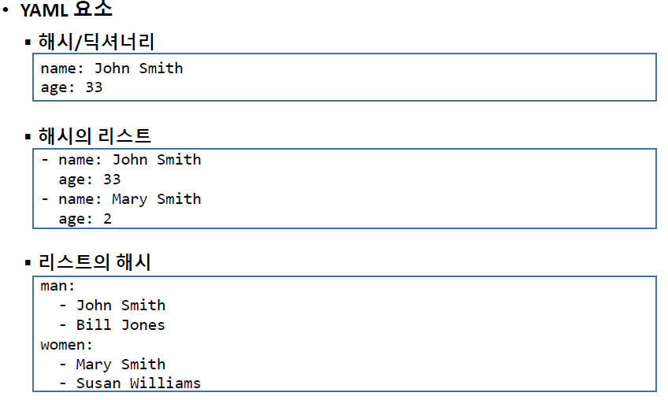

# DevOps를_위한_Docker_Kubernetes_3일차


## 오전


### Vagrant

- vagrant - 가상환경 구축에 도움을 주는 프로그램
- [Vagrant by HashiCorp (vagrantup.com)](https://www.vagrantup.com/)
- 리눅스와 같은 운영체제 이미지를 가지고 있고,  해당 이미지, 네트워크 세팅을 받아서 기본 가상환경을 빠르게 구축함
- 환경설정시 경로에 한글이름이 있으면 오류 발생함 (영어 사용자명)


- kube 설치 후 사용자 폴더에 `mkdir 폴더명` 생성
- vagrantfile 구글드라이브에서 받아서 생성한 폴더로 옮김

```
Vagrant 설정
C:\> cd C:\Users\user\kube
C:\Users\user\kube> vagrant plugin install vagrant-hostmanager
C:\Users\user\kube> vagrant plugin install vagrant-disksize

Vagrant를 이용한 가상머신 생성
C:\Users\user\kube> vagrant up

Microsoft Windows [Version 10.0.19044.2728]
(c) Microsoft Corporation. All rights reserved.

C:\Users\GOODEE>cd kube

C:\Users\GOODEE\kube>vagrant up
Bringing machine 'kube-control1' up with 'virtualbox' provider...
Bringing machine 'kube-node1' up with 'virtualbox' provider...
Bringing machine 'kube-node2' up with 'virtualbox' provider...
Bringing machine 'kube-node3' up with 'virtualbox' provider...
There are errors in the configuration of this machine. Please fix
the following errors and try again:

Vagrant:
* Unknown configuration section 'hostmanager'.


C:\Users\GOODEE\kube>vagrant plugin install vagrant-hostmanager
Installing the 'vagrant-hostmanager' plugin. This can take a few minutes...
Fetching vagrant-hostmanager-1.8.9.gem
Installed the plugin 'vagrant-hostmanager (1.8.9)'!

C:\Users\GOODEE\kube>vagrant plugin install vagrant-disksize
Installing the 'vagrant-disksize' plugin. This can take a few minutes...
Installed the plugin 'vagrant-disksize (0.1.3)'!

C:\Users\GOODEE\kube> vagrant destroy -f
==> kube-node3: VM not created. Moving on...
==> kube-node2: VM not created. Moving on...
==> kube-node1: VM not created. Moving on...
==> kube-control1: VM not created. Moving on...

C:\Users\GOODEE\kube>vagrant up
Bringing machine 'kube-control1' up with 'virtualbox' provider...
Bringing machine 'kube-node1' up with 'virtualbox' provider...
Bringing machine 'kube-node2' up with 'virtualbox' provider...
Bringing machine 'kube-node3' up with 'virtualbox' provider...
==> kube-control1: Importing base box 'ubuntu/focal64'...
==> kube-control1: Matching MAC address for NAT networking...
==> kube-control1: Checking if box 'ubuntu/focal64' version '20230619.0.0' is up to date...
==> kube-control1: Setting the name of the VM: kube-control1
Vagrant is currently configured to create VirtualBox synced folders with
the `SharedFoldersEnableSymlinksCreate` option enabled. If the Vagrant
guest is not trusted, you may want to disable this option. For more
information on this option, please refer to the VirtualBox manual:

  https://www.virtualbox.org/manual/ch04.html#sharedfolders

This option can be disabled globally with an environment variable:

  VAGRANT_DISABLE_VBOXSYMLINKCREATE=1

or on a per folder basis within the Vagrantfile:

  config.vm.synced_folder '/host/path', '/guest/path', SharedFoldersEnableSymlinksCreate: false
==> kube-control1: Clearing any previously set network interfaces...
==> kube-control1: Preparing network interfaces based on configuration...
    kube-control1: Adapter 1: nat
    kube-control1: Adapter 2: hostonly
==> kube-control1: Forwarding ports...
    kube-control1: 22 (guest) => 2222 (host) (adapter 1)
==> kube-control1: Running 'pre-boot' VM customizations...
==> kube-control1: Booting VM...
==> kube-control1: Waiting for machine to boot. This may take a few minutes...
    kube-control1: SSH address: 127.0.0.1:2222
    kube-control1: SSH username: vagrant
    kube-control1: SSH auth method: private key
    kube-control1: Warning: Connection aborted. Retrying...
    kube-control1: Warning: Connection reset. Retrying...
    kube-control1:
    kube-control1: Vagrant insecure key detected. Vagrant will automatically replace
    kube-control1: this with a newly generated keypair for better security.
    kube-control1:
    kube-control1: Inserting generated public key within guest...
    kube-control1: Removing insecure key from the guest if it's present...
    kube-control1: Key inserted! Disconnecting and reconnecting using new SSH key...
==> kube-control1: Machine booted and ready!
==> kube-control1: Checking for guest additions in VM...
==> kube-control1: Setting hostname...
==> kube-control1: Configuring and enabling network interfaces...
==> kube-control1: Mounting shared folders...
    kube-control1: /vagrant => C:/Users/GOODEE/kube
==> kube-control1: [vagrant-hostmanager:guests] Updating hosts file on active guest virtual machines...
==> kube-control1: Running provisioner: shell...
    kube-control1: Running: inline script
==> kube-node1: Importing base box 'ubuntu/focal64'...
==> kube-node1: Matching MAC address for NAT networking...
==> kube-node1: Checking if box 'ubuntu/focal64' version '20230619.0.0' is up to date...
==> kube-node1: Setting the name of the VM: kube-node1
==> kube-node1: Fixed port collision for 22 => 2222. Now on port 2200.
==> kube-node1: Clearing any previously set network interfaces...
==> kube-node1: Preparing network interfaces based on configuration...
    kube-node1: Adapter 1: nat
    kube-node1: Adapter 2: hostonly
==> kube-node1: Forwarding ports...
    kube-node1: 22 (guest) => 2200 (host) (adapter 1)
==> kube-node1: Running 'pre-boot' VM customizations...
==> kube-node1: Resized disk: old 40960 MB, req 51200 MB, new 51200 MB
==> kube-node1: You may need to resize the filesystem from within the guest.
==> kube-node1: Booting VM...
==> kube-node1: Waiting for machine to boot. This may take a few minutes...
    kube-node1: SSH address: 127.0.0.1:2200
    kube-node1: SSH username: vagrant
    kube-node1: SSH auth method: private key
    kube-node1: Warning: Connection reset. Retrying...
    kube-node1: Warning: Connection aborted. Retrying...
    kube-node1:
    kube-node1: Vagrant insecure key detected. Vagrant will automatically replace
    kube-node1: this with a newly generated keypair for better security.
    kube-node1:
    kube-node1: Inserting generated public key within guest...
    kube-node1: Removing insecure key from the guest if it's present...
    kube-node1: Key inserted! Disconnecting and reconnecting using new SSH key...
==> kube-node1: Machine booted and ready!
==> kube-node1: Checking for guest additions in VM...
==> kube-node1: Setting hostname...
==> kube-node1: Configuring and enabling network interfaces...
==> kube-node1: Mounting shared folders...
    kube-node1: /vagrant => C:/Users/GOODEE/kube
==> kube-node1: [vagrant-hostmanager:guests] Updating hosts file on active guest virtual machines...
==> kube-node1: Running provisioner: shell...
    kube-node1: Running: inline script
==> kube-node2: Importing base box 'ubuntu/focal64'...
==> kube-node2: Matching MAC address for NAT networking...
==> kube-node2: Checking if box 'ubuntu/focal64' version '20230619.0.0' is up to date...
==> kube-node2: Setting the name of the VM: kube-node2
==> kube-node2: Fixed port collision for 22 => 2222. Now on port 2201.
==> kube-node2: Clearing any previously set network interfaces...
==> kube-node2: Preparing network interfaces based on configuration...
    kube-node2: Adapter 1: nat
    kube-node2: Adapter 2: hostonly
==> kube-node2: Forwarding ports...
    kube-node2: 22 (guest) => 2201 (host) (adapter 1)
==> kube-node2: Running 'pre-boot' VM customizations...
==> kube-node2: Resized disk: old 40960 MB, req 51200 MB, new 51200 MB
==> kube-node2: You may need to resize the filesystem from within the guest.
==> kube-node2: Booting VM...
==> kube-node2: Waiting for machine to boot. This may take a few minutes...
    kube-node2: SSH address: 127.0.0.1:2201
    kube-node2: SSH username: vagrant
    kube-node2: SSH auth method: private key
    kube-node2: Warning: Connection reset. Retrying...
    kube-node2: Warning: Connection aborted. Retrying...
    kube-node2:
    kube-node2: Vagrant insecure key detected. Vagrant will automatically replace
    kube-node2: this with a newly generated keypair for better security.
    kube-node2:
    kube-node2: Inserting generated public key within guest...
    kube-node2: Removing insecure key from the guest if it's present...
    kube-node2: Key inserted! Disconnecting and reconnecting using new SSH key...
==> kube-node2: Machine booted and ready!
==> kube-node2: Checking for guest additions in VM...
==> kube-node2: Setting hostname...
==> kube-node2: Configuring and enabling network interfaces...
==> kube-node2: Mounting shared folders...
    kube-node2: /vagrant => C:/Users/GOODEE/kube
==> kube-node2: [vagrant-hostmanager:guests] Updating hosts file on active guest virtual machines...
==> kube-node2: Running provisioner: shell...
    kube-node2: Running: inline script
==> kube-node3: Importing base box 'ubuntu/focal64'...
==> kube-node3: Matching MAC address for NAT networking...
==> kube-node3: Checking if box 'ubuntu/focal64' version '20230619.0.0' is up to date...
==> kube-node3: Setting the name of the VM: kube-node3
==> kube-node3: Fixed port collision for 22 => 2222. Now on port 2202.
==> kube-node3: Clearing any previously set network interfaces...
==> kube-node3: Preparing network interfaces based on configuration...
    kube-node3: Adapter 1: nat
    kube-node3: Adapter 2: hostonly
==> kube-node3: Forwarding ports...
    kube-node3: 22 (guest) => 2202 (host) (adapter 1)
==> kube-node3: Running 'pre-boot' VM customizations...
==> kube-node3: Resized disk: old 40960 MB, req 51200 MB, new 51200 MB
==> kube-node3: You may need to resize the filesystem from within the guest.
==> kube-node3: Booting VM...
==> kube-node3: Waiting for machine to boot. This may take a few minutes...
    kube-node3: SSH address: 127.0.0.1:2202
    kube-node3: SSH username: vagrant
    kube-node3: SSH auth method: private key
    kube-node3: Warning: Connection reset. Retrying...
    kube-node3: Warning: Connection aborted. Retrying...
    kube-node3:
    kube-node3: Vagrant insecure key detected. Vagrant will automatically replace
    kube-node3: this with a newly generated keypair for better security.
    kube-node3:
    kube-node3: Inserting generated public key within guest...
    kube-node3: Removing insecure key from the guest if it's present...
    kube-node3: Key inserted! Disconnecting and reconnecting using new SSH key...
==> kube-node3: Machine booted and ready!
==> kube-node3: Checking for guest additions in VM...
==> kube-node3: Setting hostname...
==> kube-node3: Configuring and enabling network interfaces...
==> kube-node3: Mounting shared folders...
    kube-node3: /vagrant => C:/Users/GOODEE/kube
==> kube-node3: [vagrant-hostmanager:guests] Updating hosts file on active guest virtual machines...
==> kube-node3: Running provisioner: shell...
    kube-node3: Running: inline script
```


```bash
가상머신 사용자 계정
ID : vagrant
PW : vagrant
root 사용자 전환
   sudo -i
   
[설치 전]
모든 가상머신에서  Password로 ssh 로그인 가능하도록 설정
(vagrant 계정으로 접속 후)
$ sudo -i
# vim /etc/ssh/sshd_config
:set nu  (엔터)
58G (엔터)   - 58번 행으로 이동
i  (Insert Mode 진입)
(58번 행) PasswordAuthentication yes
[Esc] 키 입력하여 Command 모드로 복귀 후
:wq   (엔터)

설정 적용을 위해 SSH 서비스 데몬 재시작
# systemctl restart ssh.service
```


### Kubernetes

>  구글에서 개발하여 CNCF에서 관리하는 오픈소스 컨테이너 오케스트레이션 도구


#### 도커의 한계성

- cpu, 코어가 제한적인 물리 머신에서는 컨테이너 생성의 한도가 존재함 (물리적으로)
- 물리 서버를 추가해서 컨테이너를 여러개 띄우면 되지 않느냐 -> 호스트 내의 네트워크 통신은 문제가 없지만, 외부 호스트 내의 컨테이너와 통신이 어려움
- 물리 서버가 고장났을 때 해당 물리 서버 내에 있는 모든 컨테이너가 오류 발생


- 구글 내 많은 데이터센터를 관리할 도구의 필요성 인식 -> 데이터 센터를 관리를 위한 도구로 쿠버네티스를 만듬 -> CNCF(리눅스 재단)에 기부 및 오픈소스로 관리하도록 하여 현재는 다양한 개발자가 참여하여 개발


#### Kubernetes의 주요 기능

- Container Platform 

- Microservice Platform - 소규모 서비스 집합(컨테이너들)을 관리, 서비스하는 플랫폼

- 이식성 있는 Cloud Platform - 전통적인 개발환경(온프레미스) 및 클라우드 환경(퍼블릭, 사설)에서도 쿠버네티스 사용 가능 (단, 클라우드 서비스에 따라 제공되는 기능이 다를 순 있으나, 기본적인 기능은 대부분 사용 가능)

#### Kubernetes에서 제공하지 않는 기능

- CI/CD 파이프라인 기능 미제공 - 각 서비스별  CI/CD의 규모, 방식이 다르므로 사용자가 직접 구축

- 애플리케이션 레벨의 서비스 미제공 - 미들웨어, DB 등 별도 지원서비스는 없음 (내가 DB를 띄워서 사용하거나 해야함)

- 로깅, 모니터링, 경고 솔루션 미제공 - 최소한의 기능은 제공하지만 각 서비스별 로그, 모니터링, 경고 솔루션은 사용자가 직접 구축해야함

#### Kubernetes Architecture

- Kubernetes Cluster 구성 요소 : Control Plane, Nodes, Add-on
- 클러스터는 1개 이상의 CP, 여러개의 node, addon을 가짐


- Control Plane(구 master) : Kubernetes Cluster를 제어하는 서버, 1개 이상 필요 (보통 운영 서버는 3개 이상- 보통 홀수로 만듬)

- Node(Worker node, Minion) : Container를 실행하기 위한 Computing Resource를 제공하는 머신 (실제 컨테이너를 띄우는 머신 단위)

##### [Control Plane 주요 구성 요소]

- API Server(kube-apiserver) : Kubernetes Cluster의 모든 구성 요소들이 Control Plane에 위치하는 API Server를 거쳐 메시지를 주고 받음 (프론트엔드)
- etcd(엣씨디?) : Key-Value로 구성된 Kubernetes Cluster를 구성하는 데이터베이스
- API 서버에 요청하면 etcd에서 데이터 조회 및 변경 (API 서버와 etcd는 데이터 동기화)
- Scheduler(kube-scheduler) : 새로 생성되는 파드(Pod)를 감지하고 적절한 노드에 배정하는 역할 수행 (배정만 함)
  - Pod : 1개 이상의 컨테이너를 가진 쿠버네티스 실행 단위
- Controller Manager(kube-controller-manager) : Controller는 API Server를 통해 Cluster의 상태를 감시하고 필요한 상태로 유지하도록 하는 기능을 수행하며 Controller Manager는 Controller의 기능을 지원하기 위한 구성요소
- Cloud Controller Manager : Kubernetes를 Cloud 환경(AWS, GCP, Azure)에서 운영할 때 Cloud 서비스 제공자가 제공하는 서비스와 연동하기 위한 Controller Manager
  - 클라우드 별 업데이트 시기가 다르고, 쿠버네티스도 계속 업데이트가 되므로 별도의 관리자가 필요 (업데이트에 따라 서비스 연동이 안될 수도 있으므로)

##### [Node]

kubelet : Kubernetes Cluster의 Agent 역할 (cluster의 손, 발 역할)

Kubernetes Proxy(kube-proxy) : 각 노드의 네트워크 기능을 담당하는 구성요소로 Host level의 네트워크 규칙을 생성하고 외부 연결을 파드에 포워딩하는 역할을 담당함 - 노드의 트래픽 처리 (설정에 따라 바뀔 수 있음)

*** Kubernetes 교재 실습 예제 파일 :** 

  https://github.com/alicek106/start-docker-kubernetes 


- 간단한 사용은 kube mini?, docker desktop도 간단한 테스트용으론 가능
- 다만 실제 운영서버에서 사용과 다른 점이 있어 해당 부분 참고해서 진행해야 함


- 수업에서는 온프레미스에서 쿠버네티스를 구축하는 방법을 배움 (1. 수동으로 구축 2. 쿠브스프레이를 통한 자동 구축)


#### 쿠버네티스 배포 방법

- 수동으로 Kubernetes Cluster 배포 (kubeadm)

- kubespray를 통한 자동화 배포 - Ansible을 기반으로 Kubernetes Cluster를 구축


#### ssh, 터미널 추천

- [Xshell 다운로드 - NetSarang Website](https://www.netsarang.com/ko/xshell-download/)
- 

- [ssh 프로그램 - Google 검색](https://www.google.com/search?q=ssh+프로그램&oq=ssh+프로그램&aqs=edge..69i57j0i30l3j0i15i30l2j0i5i30l2.8002j0j1&sourceid=chrome&ie=UTF-8)


#### 쿠버네티스 기본 세팅 구성 (관리자, 노드)

- **가상메모리(스왑) 설정시 쿠버네티스에 이슈가 발생 할 수 있어서 OFF로 설정 - 쿠버네티스 설정시 반드시 확인**

```bash
[모든 노드에서 진행]
SWAP 설정 OFF
sudo swapoff -a

sudo vim /etc/fstab

추가 Repository 구성을 위한 패키지 설치
# 레포지토리 업데이트
sudo apt-get update -y 
# 필요 패키지 설치
sudo apt-get install apt-transport-https ca-certificates curl gnupg lsb-release -y


Docker 추가 Repository 구성(gpgkey keyring 설치, Repository 추가)
# apt에 도커 레포지토리 추가, 인증 키 추가
curl -fsSL https://download.docker.com/linux/ubuntu/gpg | sudo gpg --dearmor -o /usr/share/keyrings/docker-archive-keyring.gpg

echo \
  "deb [arch=amd64 signed-by=/usr/share/keyrings/docker-archive-keyring.gpg] https://download.docker.com/linux/ubuntu \
  $(lsb_release -cs) stable" | sudo tee /etc/apt/sources.list.d/docker.list > /dev/null


Docker 패키지 설치
# 도커 레포지토리 패키지 내역 업데이트
sudo apt-get update -y
# 도커 설치
sudo apt-get install docker-ce docker-ce-cli containerd.io -y

sudo docker info | grep -i cgroup

# 과거 도커 컨테이너 기준으로 런타임이 진행 -> 다양한 컨테이너 생기고
# 컨테이너 별 스펙이 다르므로 컨테이너 표준화가 필요
# 쿠버네티스도 도커 컨테이너 기반으로 진행되다가 현재는 표준 컨테이너 기반으로
# systemd 라는 (2.3.5?) cgroupdriver로 표준 컨테이너 런타임 진행??
# cgoupfs -> syst
cat <<EOF | sudo tee /etc/docker/daemon.json
{
  "exec-opts": ["native.cgroupdriver=systemd"],
  "log-driver": "json-file",
  "log-opts": {
    "max-size": "100m"
  },
  "storage-driver": "overlay2"
}
EOF

sudo systemctl daemon-reload

sudo systemctl restart docker.service

sudo docker info | grep -i cgroup
   Cgroup Driver: systemd

kubeadm, kubelet, kubectl 설치
Kubernetes 추가 Repository 구성(gpgkey keyring 설치, Repository 추가)

sudo curl -fssL https://packages.cloud.google.com/apt/doc/apt-key.gpg -o /usr/share/keyrings/kubernetes-archive-keyring.gpg

# 키 인증 이슈 발생 중임
echo "deb [signed-by=/usr/share/keyrings/kubernetes-archive-keyring.gpg] https://apt.kubernetes.io/ kubernetes-xenial main" | sudo tee /etc/apt/sources.list.d/kubernetes.list

* Kubernetes Repository Key 관련 이슈 임시 해결 방안
echo "deb [trusted=yes] https://apt.kubernetes.io/ kubernetes-xenial main" | sudo tee /etc/apt/sources.list.d/kubernetes.list

kubeadm, kubelet, kubectl 설치(버전 지정 및 고정)
sudo apt-get update -y

sudo apt-get install -y kubelet=1.23.5-00 kubeadm=1.23.5-00 kubectl=1.23.5-00

sudo apt-mark hold kubelet kubeadm kubectl

```


## 오후


#### 세팅 이어서

```bash
[Control Plane에서만 진행(kube-control1)]

Step 1.

(vagrant, VirtualBox 실습 환경인 경우에만 실행)
sudo kubeadm init --control-plane-endpoint 192.168.56.11 --pod-network-cidr 192.168.0.0/16 --apiserver-advertise-address 192.168.56.11


—--
Step 2. (vagrant, VirtualBox, VMware 실습 환경 공통)

Kubernetes Cluster 제어를 위한 인증 설정
# 쿠버네티스 내부 인증 과정
mkdir -p $HOME/.kube
# 인증 컨피그 파일 복사
sudo cp -i /etc/kubernetes/admin.conf $HOME/.kube/config
# 소유자, 소유그룹 사용자에게 부여
sudo chown $(id -u):$(id -g) $HOME/.kube/config


Kubernetes Cluster 네트워크 구성을 위한 Calico CNI 설치
# kubectl create -f https://docs.projectcalico.org/manifests/calico.yaml
kubectl create -f https://raw.githubusercontent.com/projectcalico/calico/v3.25.0/manifests/calico.yaml

(Kubernetes Cluster에 노드 가입 후) Kubernetes Cluster 노드 목록 확인
kubectl get nodes
NAME            STATUS     ROLES    AGE   VERSION
kube-control1   NotReady   master   54s   v1.22.10


—-
(일부 가상머신만 임포트 하신 경우) Kubernetes Cluster에서 노드 제거
kubectl delete node kube-node3
```

```bash
# 실제 진행 과정
vagrant@kube-control1:~$ echo "deb [trusted=yes] https://apt.kubernetes.io/ kubernetes-xenial main" | sudo tee /etc/apt/sources.list.d/kubernetes.list
deb [trusted=yes] https://apt.kubernetes.io/ kubernetes-xenial main
vagrant@kube-control1:~$ sudo apt-get update -y
Hit:5 https://download.docker.com/linux/ubuntu focal InRelease
Hit:1 http://mirror.kakao.com/ubuntu focal InRelease
Get:2 http://mirror.kakao.com/ubuntu focal-updates InRelease [114 kB]
Get:3 http://mirror.kakao.com/ubuntu focal-backports InRelease [108 kB]
Get:4 http://mirror.kakao.com/ubuntu focal-security InRelease [114 kB]
Get:7 http://mirror.kakao.com/ubuntu focal-updates/main amd64 Packages [2635 kB]
Get:8 http://mirror.kakao.com/ubuntu focal-updates/universe amd64 Packages [1074 kB]
Get:6 https://packages.cloud.google.com/apt kubernetes-xenial InRelease [8993 B]
Ign:6 https://packages.cloud.google.com/apt kubernetes-xenial InRelease
Get:9 https://packages.cloud.google.com/apt kubernetes-xenial/main amd64 Packages [67.3 kB]
Fetched 4121 kB in 2s (2671 kB/s)
Reading package lists... Done
W: GPG error: https://packages.cloud.google.com/apt kubernetes-xenial InRelease: The following signatures couldn't be verified because the public key is not available: NO_PUBKEY B53DC80D13EDEF05
vagrant@kube-control1:~$ sudo apt-get install -y kubelet=1.23.5-00 kubeadm=1.23.5-00 kubectl=1.23.5-00
Reading package lists... Done
Building dependency tree
Reading state information... Done
The following additional packages will be installed:
  conntrack cri-tools ebtables kubernetes-cni socat
Suggested packages:
  nftables
The following NEW packages will be installed:
  conntrack cri-tools ebtables kubeadm kubectl kubelet kubernetes-cni socat
0 upgraded, 8 newly installed, 0 to remove and 0 not upgraded.
Need to get 84.0 MB of archives.
After this operation, 341 MB of additional disk space will be used.
Get:1 http://mirror.kakao.com/ubuntu focal/main amd64 conntrack amd64 1:1.4.5-2 [30.3 kB]
Get:2 http://mirror.kakao.com/ubuntu focal/main amd64 ebtables amd64 2.0.11-3build1 [80.3 kB]
Get:3 http://mirror.kakao.com/ubuntu focal/main amd64 socat amd64 1.7.3.3-2 [323 kB]
Get:4 https://packages.cloud.google.com/apt kubernetes-xenial/main amd64 cri-tools amd64 1.26.0-00 [18.9 MB]
Get:5 https://packages.cloud.google.com/apt kubernetes-xenial/main amd64 kubernetes-cni amd64 1.2.0-00 [27.6 MB]
Get:6 https://packages.cloud.google.com/apt kubernetes-xenial/main amd64 kubelet amd64 1.23.5-00 [19.5 MB]
Get:7 https://packages.cloud.google.com/apt kubernetes-xenial/main amd64 kubectl amd64 1.23.5-00 [8931 kB]
Get:8 https://packages.cloud.google.com/apt kubernetes-xenial/main amd64 kubeadm amd64 1.23.5-00 [8582 kB]
Fetched 84.0 MB in 8s (10.2 MB/s)
Selecting previously unselected package conntrack.
(Reading database ... 63949 files and directories currently installed.)
Preparing to unpack .../0-conntrack_1%3a1.4.5-2_amd64.deb ...
Unpacking conntrack (1:1.4.5-2) ...
Selecting previously unselected package cri-tools.
Preparing to unpack .../1-cri-tools_1.26.0-00_amd64.deb ...
Unpacking cri-tools (1.26.0-00) ...
Selecting previously unselected package ebtables.
Preparing to unpack .../2-ebtables_2.0.11-3build1_amd64.deb ...
Unpacking ebtables (2.0.11-3build1) ...
Selecting previously unselected package kubernetes-cni.
Preparing to unpack .../3-kubernetes-cni_1.2.0-00_amd64.deb ...
Unpacking kubernetes-cni (1.2.0-00) ...
Selecting previously unselected package socat.
Preparing to unpack .../4-socat_1.7.3.3-2_amd64.deb ...
Unpacking socat (1.7.3.3-2) ...
Selecting previously unselected package kubelet.
Preparing to unpack .../5-kubelet_1.23.5-00_amd64.deb ...
Unpacking kubelet (1.23.5-00) ...
Selecting previously unselected package kubectl.
Preparing to unpack .../6-kubectl_1.23.5-00_amd64.deb ...
Unpacking kubectl (1.23.5-00) ...
Selecting previously unselected package kubeadm.
Preparing to unpack .../7-kubeadm_1.23.5-00_amd64.deb ...
Unpacking kubeadm (1.23.5-00) ...
Setting up conntrack (1:1.4.5-2) ...
Setting up kubectl (1.23.5-00) ...
Setting up ebtables (2.0.11-3build1) ...
Setting up socat (1.7.3.3-2) ...
Setting up cri-tools (1.26.0-00) ...
Setting up kubernetes-cni (1.2.0-00) ...
Setting up kubelet (1.23.5-00) ...
Created symlink /etc/systemd/system/multi-user.target.wants/kubelet.service → /lib/systemd/system/kubelet.service.
Setting up kubeadm (1.23.5-00) ...
Processing triggers for man-db (2.9.1-1) ...
vagrant@kube-control1:~$ sudo docker info | grep -i cgroup
WARNING: No swap limit support
 Cgroup Driver: systemd
 Cgroup Version: 1
vagrant@kube-control1:~$ sudo apt-mark hold kubelet kubeadm kubectl
kubelet set on hold.
kubeadm set on hold.
kubectl set on hold.
vagrant@kube-control1:~$ sudo docker info | grep -i cgroup
WARNING: No swap limit support
 Cgroup Driver: systemd
 Cgroup Version: 1
vagrant@kube-control1:~$ sudo kubeadm init --control-plane-endpoint 192.168.56.11 --pod-network-cidr 192.168.0.0/16 --apiserver-advertise-address 192.168.56.11
I0621 04:18:26.826009    7118 version.go:255] remote version is much newer: v1.27.3; falling back to: stable-1.23
[init] Using Kubernetes version: v1.23.17
[preflight] Running pre-flight checks
        [WARNING SystemVerification]: this Docker version is not on the list of validated versions: 24.0.2. Latest validated version: 20.10
[preflight] Pulling images required for setting up a Kubernetes cluster
[preflight] This might take a minute or two, depending on the speed of your internet connection
[preflight] You can also perform this action in beforehand using 'kubeadm config images pull'
[certs] Using certificateDir folder "/etc/kubernetes/pki"
[certs] Generating "ca" certificate and key
[certs] Generating "apiserver" certificate and key
[certs] apiserver serving cert is signed for DNS names [kube-control1 kubernetes kubernetes.default kubernetes.default.svc kubernetes.default.svc.cluster.local] and IPs [10.96.0.1 192.168.56.11]
[certs] Generating "apiserver-kubelet-client" certificate and key
[certs] Generating "front-proxy-ca" certificate and key
[certs] Generating "front-proxy-client" certificate and key
[certs] Generating "etcd/ca" certificate and key
[certs] Generating "etcd/server" certificate and key
[certs] etcd/server serving cert is signed for DNS names [kube-control1 localhost] and IPs [192.168.56.11 127.0.0.1 ::1]
[certs] Generating "etcd/peer" certificate and key
[certs] etcd/peer serving cert is signed for DNS names [kube-control1 localhost] and IPs [192.168.56.11 127.0.0.1 ::1]
[certs] Generating "etcd/healthcheck-client" certificate and key
[certs] Generating "apiserver-etcd-client" certificate and key
[certs] Generating "sa" key and public key
[kubeconfig] Using kubeconfig folder "/etc/kubernetes"
[kubeconfig] Writing "admin.conf" kubeconfig file
[kubeconfig] Writing "kubelet.conf" kubeconfig file
[kubeconfig] Writing "controller-manager.conf" kubeconfig file
[kubeconfig] Writing "scheduler.conf" kubeconfig file
[kubelet-start] Writing kubelet environment file with flags to file "/var/lib/kubelet/kubeadm-flags.env"
[kubelet-start] Writing kubelet configuration to file "/var/lib/kubelet/config.yaml"
[kubelet-start] Starting the kubelet
[control-plane] Using manifest folder "/etc/kubernetes/manifests"
[control-plane] Creating static Pod manifest for "kube-apiserver"
[control-plane] Creating static Pod manifest for "kube-controller-manager"
[control-plane] Creating static Pod manifest for "kube-scheduler"
[etcd] Creating static Pod manifest for local etcd in "/etc/kubernetes/manifests"
[wait-control-plane] Waiting for the kubelet to boot up the control plane as static Pods from directory "/etc/kubernetes/manifests". This can take up to 4m0s
[apiclient] All control plane components are healthy after 10.002802 seconds
[upload-config] Storing the configuration used in ConfigMap "kubeadm-config" in the "kube-system" Namespace
[kubelet] Creating a ConfigMap "kubelet-config-1.23" in namespace kube-system with the configuration for the kubelets in the cluster
NOTE: The "kubelet-config-1.23" naming of the kubelet ConfigMap is deprecated. Once the UnversionedKubeletConfigMap feature gate graduates to Beta the default name will become just "kubelet-config". Kubeadm upgrade will handle this transition transparently.
[upload-certs] Skipping phase. Please see --upload-certs
[mark-control-plane] Marking the node kube-control1 as control-plane by adding the labels: [node-role.kubernetes.io/master(deprecated) node-role.kubernetes.io/control-plane node.kubernetes.io/exclude-from-external-load-balancers]
[mark-control-plane] Marking the node kube-control1 as control-plane by adding the taints [node-role.kubernetes.io/master:NoSchedule]
[bootstrap-token] Using token: x2revv.xmyowi0q42oblxwp
[bootstrap-token] Configuring bootstrap tokens, cluster-info ConfigMap, RBAC Roles
[bootstrap-token] configured RBAC rules to allow Node Bootstrap tokens to get nodes
[bootstrap-token] configured RBAC rules to allow Node Bootstrap tokens to post CSRs in order for nodes to get long term certificate credentials
[bootstrap-token] configured RBAC rules to allow the csrapprover controller automatically approve CSRs from a Node Bootstrap Token
[bootstrap-token] configured RBAC rules to allow certificate rotation for all node client certificates in the cluster
[bootstrap-token] Creating the "cluster-info" ConfigMap in the "kube-public" namespace
[kubelet-finalize] Updating "/etc/kubernetes/kubelet.conf" to point to a rotatable kubelet client certificate and key
[addons] Applied essential addon: CoreDNS
[addons] Applied essential addon: kube-proxy

Your Kubernetes control-plane has initialized successfully!

To start using your cluster, you need to run the following as a regular user:

  mkdir -p $HOME/.kube
  sudo cp -i /etc/kubernetes/admin.conf $HOME/.kube/config
  sudo chown $(id -u):$(id -g) $HOME/.kube/config

Alternatively, if you are the root user, you can run:

  export KUBECONFIG=/etc/kubernetes/admin.conf

You should now deploy a pod network to the cluster.
Run "kubectl apply -f [podnetwork].yaml" with one of the options listed at:
  https://kubernetes.io/docs/concepts/cluster-administration/addons/

You can now join any number of control-plane nodes by copying certificate authorities
and service account keys on each node and then running the following as root:

  kubeadm join 192.168.56.11:6443 --token x2revv.xmyowi0q42oblxwp \
        --discovery-token-ca-cert-hash sha256:2c733155fbbf4b123a8316fdf93132bbbe9d3a40a25f9148463aca9bc06193fe \
        --control-plane

Then you can join any number of worker nodes by running the following on each as root:

kubeadm join 192.168.56.11:6443 --token x2revv.xmyowi0q42oblxwp \
        --discovery-token-ca-cert-hash sha256:2c733155fbbf4b123a8316fdf93132bbbe9d3a40a25f9148463aca9bc06193fe
        
vagrant@kube-control1:~$ mkdir -p $HOME/.kube
vagrant@kube-control1:~$ sudo cp -i /etc/kubernetes/admin.conf $H
$HISTCMD       $HISTFILE      $HISTSIZE      $HOSTNAME
$HISTCONTROL   $HISTFILESIZE  $HOME          $HOSTTYPE
vagrant@kube-control1:~$ sudo cp -i /etc/kubernetes/admin.conf \$HOME/.kube/config
cp: cannot create regular file '$HOME/.kube/config': No such file or directory
vagrant@kube-control1:~$ sudo cp -i /etc/kubernetes/admin.conf $HOME/.kube/config
vagrant@kube-control1:~$ sudo chown $(id -u):$(id -g) $HOME/.kube/config
vagrant@kube-control1:~$ kubectl create -f https://raw.githubusercontent.com/projectcalico/calico/v3.25.0/manifests/calico.yaml
poddisruptionbudget.policy/calico-kube-controllers created
serviceaccount/calico-kube-controllers created
serviceaccount/calico-node created
configmap/calico-config created
customresourcedefinition.apiextensions.k8s.io/bgpconfigurations.crd.projectcalico.org created
customresourcedefinition.apiextensions.k8s.io/bgppeers.crd.projectcalico.org created
customresourcedefinition.apiextensions.k8s.io/blockaffinities.crd.projectcalico.org created
customresourcedefinition.apiextensions.k8s.io/caliconodestatuses.crd.projectcalico.org created
customresourcedefinition.apiextensions.k8s.io/clusterinformations.crd.projectcalico.org created
customresourcedefinition.apiextensions.k8s.io/felixconfigurations.crd.projectcalico.org created
customresourcedefinition.apiextensions.k8s.io/globalnetworkpolicies.crd.projectcalico.org created
customresourcedefinition.apiextensions.k8s.io/globalnetworksets.crd.projectcalico.org created
customresourcedefinition.apiextensions.k8s.io/hostendpoints.crd.projectcalico.org created
customresourcedefinition.apiextensions.k8s.io/ipamblocks.crd.projectcalico.org created
customresourcedefinition.apiextensions.k8s.io/ipamconfigs.crd.projectcalico.org created
customresourcedefinition.apiextensions.k8s.io/ipamhandles.crd.projectcalico.org created
customresourcedefinition.apiextensions.k8s.io/ippools.crd.projectcalico.org created
customresourcedefinition.apiextensions.k8s.io/ipreservations.crd.projectcalico.org created
customresourcedefinition.apiextensions.k8s.io/kubecontrollersconfigurations.crd.projectcalico.org created
customresourcedefinition.apiextensions.k8s.io/networkpolicies.crd.projectcalico.org created
customresourcedefinition.apiextensions.k8s.io/networksets.crd.projectcalico.org created
clusterrole.rbac.authorization.k8s.io/calico-kube-controllers created
clusterrole.rbac.authorization.k8s.io/calico-node created
clusterrolebinding.rbac.authorization.k8s.io/calico-kube-controllers created
clusterrolebinding.rbac.authorization.k8s.io/calico-node created
daemonset.apps/calico-node created
deployment.apps/calico-kube-controllers created
vagrant@kube-control1:~$ kubectl get nodes
NAME            STATUS     ROLES                  AGE     VERSION
kube-control1   NotReady   control-plane,master   6m32s   v1.23.5
vagrant@kube-control1:~$ kubectl get nodes
NAME            STATUS     ROLES                  AGE     VERSION
kube-control1   NotReady   control-plane,master   7m17s   v1.23.5
vagrant@kube-control1:~$ kubectl get nodes
NAME            STATUS     ROLES                  AGE     VERSION
kube-control1   NotReady   control-plane,master   8m50s   v1.23.5
vagrant@kube-control1:~$ kubectl get nodes
NAME            STATUS   ROLES                  AGE    VERSION
kube-control1   Ready    control-plane,master   9m8s   v1.23.5
```


```bash
[kube-node1 ~ kube-node3(Worker Nodes)에서만 진행]

Kubernetes Cluster에 Nodes 가입 (kube-control1에서 2번째 kubeadm 명령어 복사 후 실행)

sudo kubeadm join 192.168.56.11:6443 --token XXXXXXX \
    --discovery-token-ca-cert-hash sha256:XXXXXX

sudo kubeadm join 192.168.56.11:6443 --token x2revv.xmyowi0q42oblxwp \
--discovery-token-ca-cert-hash sha256:2c733155fbbf4b123a8316fdf93132bbbe9d3a40a25f9148463aca9bc06193fe

—--

* Docker Pull limit Issue 해결을 위한 임시 조치(4개의 가상머신에 모두 적용)

cat <<EOF | sudo tee /etc/docker/daemon.json
{
  "exec-opts": ["native.cgroupdriver=systemd"],
  "log-driver": "json-file",
  "log-opts": {
    "max-size": "100m"
  },
  "storage-driver": "overlay2",
  # 도커 pull 제한 걸렸을때, 미러 서버(구글 gcr)에서 가져오도록 미러 레포지토리 등록
  "registry-mirrors": ["https://mirror.gcr.io"] 
}
EOF

sudo systemctl daemon-reload

sudo systemctl restart docker.service


Kubernetes Cluster에 추가 노드 가입
Kubernetes Cluster에 가입시 Control Plane IP, Token, Discovery Hash가 필요함.
이 중 Token은 24시간 후 만료되므로 이후 추가 멤버노드 구성시 새로운 토큰값을 생성해야함.
https://kubernetes.io/docs/setup/production-environment/tools/kubeadm/create-cluster-kubeadm/ 

[Control Plane에서 작업]

토큰 재생성
kubeadm token create

토큰 목록 확인
kubeadm token list

discovery-token-ca-cert-hash 확인 방법

openssl x509 -pubkey -in /etc/kubernetes/pki/ca.crt | openssl rsa -pubin -outform der 2>/dev/null | \
 openssl dgst -sha256 -hex | sed 's/^.* //'


[Kubernetes Cluster Member Node 가입] - 새로 추가할 노드에서
sudo kubeadm join CONTROL_PLANE_IP:6443 --token TOKEN --discovery-token-ca-cert-hash DISCOVERY_HASH
```


- node와 control-plane의 버전 차이로 인한 문제는 있을까? - 마이너 버전 2버전 차이까지는 클러스터로 묶일 수 있으나 안 묶일 가능성이 있으므로 가급적 같은 버전 사용을 권장

```bash
```


- 작년부터 도커에서 pull 리미트를 걸었음 (서버 부하를 줄이고자) - 같은 ip 대역대에 pull이 제한걸리지 않았나


#### 쿠버네티스 기본 오브젝트

- Pod : 쿠버네티스가 컨테이너를 다루는 기본 단위 하나이상의 컨테이너를 포함하는 단위

- Container

```bash
노드 확인
$ kubectl get nodes
$ kubectl get nodes -o wide

오브젝트 확인
# 오브젝트마다 이름 종류 버전 등이 있음 - 버전 관리 필요
$ kubectl api-resources
```


- 큐브DNS - kubernetes cluster 내부의 pod 들은 쿠버네티스 체계의 dns 이름을 받음 -> 컨테이너 종료 후 실행마다 ip 주소가 변동될 소지가 있음 -> 클러스터 내에 주소 체계 정리용 DNS (종류로는 CoreDNS 등이 있음)

```bash
vagrant@kube-control1:~$ kubectl get nodes
NAME            STATUS     ROLES                  AGE    VERSION
kube-control1   Ready      control-plane,master   114m   v1.23.5
kube-node1      Ready      <none>                 105m   v1.23.5
kube-node2      NotReady   <none>                 105m   v1.23.5
kube-node3      Ready      <none>                 105m   v1.23.5
vagrant@kube-control1:~$ kubectl cluster info
error: unknown command "cluster" for "kubectl"

Did you mean this?
        cluster-info
vagrant@kube-control1:~$ kubectl cluster-info
Kubernetes control plane is running at https://192.168.56.11:6443
CoreDNS is running at https://192.168.56.11:6443/api/v1/namespaces/kube-system/services/kube-dns:dns/proxy

To further debug and diagnose cluster problems, use 'kubectl cluster-info dump'.
vagrant@kube-control1:~$ kubectl get nodes -o wide
NAME            STATUS     ROLES                  AGE    VERSION   INTERNAL-IP     EXTERNAL-IP   OS-IMAGE             KERNEL-VERSION      CONTAINER-RUNTIME
kube-control1   Ready      control-plane,master   118m   v1.23.5   192.168.56.11   <none>        Ubuntu 20.04.6 LTS   5.4.0-152-generic   docker://24.0.2
kube-node1      Ready      <none>                 109m   v1.23.5   192.168.56.21   <none>        Ubuntu 20.04.6 LTS   5.4.0-152-generic   docker://24.0.2
kube-node2      NotReady   <none>                 109m   v1.23.5   192.168.56.22   <none>        Ubuntu 20.04.6 LTS   5.4.0-152-generic   docker://24.0.2
kube-node3      Ready      <none>                 109m   v1.23.5   192.168.56.23   <none>        Ubuntu 20.04.6 LTS   5.4.0-152-generic   docker://24.0.2
```


#### [실습] 디플로이먼트 생성해보기

```bash

디플로이먼트 생성
$ kubectl create deployment myapp --image=nginx:latest
deployment.apps/myapp created

Deployment,replicaset,pods 리소스 확인
$ kubectl get deployment,replicaset,pods
NAME                    READY   UP-TO-DATE   AVAILABLE   AGE
deployment.apps/myapp   1/1     1            1           42s

NAME                              DESIRED   CURRENT   READY   AGE
replicaset.apps/myapp-bbf496487   1         1         1       42s

NAME                        READY   STATUS    RESTARTS   AGE
pod/myapp-bbf496487-mw562   1/1     Running   0          42s

파드의 정보 확인
$ kubectl describe pod myapp-bbf496487-mw562

서비스 노출
# 서비스 오브젝트 생성하여 서비스 노출 (외부에서 접근할 수 있도록)
$ kubectl expose deployment myapp --port=80 --protocol=TCP --target-port=80 --name myapp-svc --type=NodePort
service/myapp-svc exposed

$ kubectl get services
NAME         TYPE        CLUSTER-IP     EXTERNAL-IP   PORT(S)        AGE
myapp-svc    NodePort    10.99.158.72   <none>        80:30934/TCP   3m35s
$ curl http://192.168.56.21:PORT

오브젝트 삭제
# 실습 후 필요없는 오브젝트 삭제
$ kubectl delete OBJECT RESOURCE_NAME 
$ kubectl delete deployment myapp 
$ kubectl delete service myapp-svc 
```


```bash
# 실습
vagrant@kube-control1:~$ kubectl create deployment myapp --image=nginx:latest
deployment.apps/myapp created
vagrant@kube-control1:~$ kube
kubeadm  kubectl  kubelet
vagrant@kube-control1:~$ kubectl get deployments,replicasets,pods
NAME                    READY   UP-TO-DATE   AVAILABLE   AGE
deployment.apps/myapp   0/1     1            0           41s

NAME                               DESIRED   CURRENT   READY   AGE
replicaset.apps/myapp-674798479b   1         1         0       41s

NAME                         READY   STATUS              RESTARTS   AGE
pod/myapp-674798479b-62pjd   0/1     ContainerCreating   0          41s
vagrant@kube-control1:~$ kubectl describe pod myapp-674798479b-62pjd
Name:           myapp-674798479b-62pjd
Namespace:      default
Priority:       0
Node:           kube-node3/192.168.56.23
Start Time:     Wed, 21 Jun 2023 06:31:49 +0000
Labels:         app=myapp
                pod-template-hash=674798479b
Annotations:    <none>
Status:         Pending
IP:
IPs:            <none>
Controlled By:  ReplicaSet/myapp-674798479b
Containers:
  nginx:
    Container ID:
    Image:          nginx:latest
    Image ID:
    Port:           <none>
    Host Port:      <none>
    State:          Waiting
      Reason:       ContainerCreating
    Ready:          False
    Restart Count:  0
    Environment:    <none>
    Mounts:
      /var/run/secrets/kubernetes.io/serviceaccount from kube-api-access-j9cj4 (ro)
Conditions:
  Type              Status
  Initialized       True
  Ready             False
  ContainersReady   False
  PodScheduled      True
Volumes:
  kube-api-access-j9cj4:
    Type:                    Projected (a volume that contains injected data from multiple sources)
    TokenExpirationSeconds:  3607
    ConfigMapName:           kube-root-ca.crt
    ConfigMapOptional:       <nil>
    DownwardAPI:             true
QoS Class:                   BestEffort
Node-Selectors:              <none>
Tolerations:                 node.kubernetes.io/not-ready:NoExecute op=Exists for 300s
                             node.kubernetes.io/unreachable:NoExecute op=Exists for 300s
Events:
  Type     Reason                  Age                    From               Message
  ----     ------                  ----                   ----               -------
  Normal   Scheduled               5m42s                  default-scheduler  Successfully assigned default/myapp-674798479b-62pjd to kube-node3
  Warning  FailedCreatePodSandBox  5m41s                  kubelet            Failed to create pod sandbox: rpc error: code = Unknown desc = failed to set up sandbox container "8bdb0ed08be2ed5482d33461091cd329df3875935920fcce609af493d2fa08fe" network for pod "myapp-674798479b-62pjd": networkPlugin cni failed to set up pod "myapp-674798479b-62pjd_default" network: stat /var/lib/calico/nodename: no such file or directory: check that the calico/node container is running and has mounted /var/lib/calico/
  Warning  FailedCreatePodSandBox  5m40s                  kubelet            Failed to create pod sandbox: rpc error: code = Unknown desc = failed to set up sandbox container "ada08ba2a91bd0e290147ad9d28e3adc4e91fb363f1c07b3c30fb83e9bdf6b4f" network for pod "myapp-674798479b-62pjd": networkPlugin cni failed to set up pod "myapp-674798479b-62pjd_default" network: stat /var/lib/calico/nodename: no such file or directory: check that the calico/node container is running and has mounted /var/lib/calico/
  Warning  FailedCreatePodSandBox  5m39s                  kubelet            Failed to create pod sandbox: rpc error: code = Unknown desc = failed to set up sandbox container "b484a442348dd6a4d8f4459f45bf368c2ce9f16235c2b311a55683c67eb7286f" network for pod "myapp-674798479b-62pjd": networkPlugin cni failed to set up pod "myapp-674798479b-62pjd_default" network: stat /var/lib/calico/nodename: no such file or directory: check that the calico/node container is running and has mounted /var/lib/calico/
  Warning  FailedCreatePodSandBox  5m38s                  kubelet            Failed to create pod sandbox: rpc error: code = Unknown desc = failed to set up sandbox container "752fdc800397354821ab14cbfca3f1112e041e780bcf693f3700e85e02ceb57f" network for pod "myapp-674798479b-62pjd": networkPlugin cni failed to set up pod "myapp-674798479b-62pjd_default" network: stat /var/lib/calico/nodename: no such file or directory: check that the calico/node container is running and has mounted /var/lib/calico/
  Warning  FailedCreatePodSandBox  5m37s                  kubelet            Failed to create pod sandbox: rpc error: code = Unknown desc = failed to set up sandbox container "e1719293ad52d15f935cbed34ee14f09b462f9b2c5dcf0e46730974891d51243" network for pod "myapp-674798479b-62pjd": networkPlugin cni failed to set up pod "myapp-674798479b-62pjd_default" network: stat /var/lib/calico/nodename: no such file or directory: check that the calico/node container is running and has mounted /var/lib/calico/
  Warning  FailedCreatePodSandBox  5m36s                  kubelet            Failed to create pod sandbox: rpc error: code = Unknown desc = failed to set up sandbox container "b9de5ee36f72b133d3a18e36d54a6d48dd00bd04786ce015cc3fd2356fa09697" network for pod "myapp-674798479b-62pjd": networkPlugin cni failed to set up pod "myapp-674798479b-62pjd_default" network: stat /var/lib/calico/nodename: no such file or directory: check that the calico/node container is running and has mounted /var/lib/calico/
  Warning  FailedCreatePodSandBox  5m35s                  kubelet            Failed to create pod sandbox: rpc error: code = Unknown desc = failed to set up sandbox container "71893d37794dff86088b1119e42779f42761ed923f971ca78a7fe263d055763d" network for pod "myapp-674798479b-62pjd": networkPlugin cni failed to set up pod "myapp-674798479b-62pjd_default" network: stat /var/lib/calico/nodename: no such file or directory: check that the calico/node container is running and has mounted /var/lib/calico/
  Warning  FailedCreatePodSandBox  5m34s                  kubelet            Failed to create pod sandbox: rpc error: code = Unknown desc = failed to set up sandbox container "8a1fca63e45b19ef89b58a8c5ba1cd54af75aa240a72f1416780eb5204fc5eea" network for pod "myapp-674798479b-62pjd": networkPlugin cni failed to set up pod "myapp-674798479b-62pjd_default" network: stat /var/lib/calico/nodename: no such file or directory: check that the calico/node container is running and has mounted /var/lib/calico/
  Warning  FailedCreatePodSandBox  5m33s                  kubelet            Failed to create pod sandbox: rpc error: code = Unknown desc = failed to set up sandbox container "4ca6202cdef8266b4630378f16db20ed34fe001b44bb41fbb86357fad272eeef" network for pod "myapp-674798479b-62pjd": networkPlugin cni failed to set up pod "myapp-674798479b-62pjd_default" network: stat /var/lib/calico/nodename: no such file or directory: check that the calico/node container is running and has mounted /var/lib/calico/
  Warning  FailedCreatePodSandBox  5m29s (x4 over 5m32s)  kubelet            (combined from similar events): Failed to create pod sandbox: rpc error: code = Unknown desc = failed to set up sandbox container "9f55ae0b1652a68dda166a54975666ce45a676f5bc03551da6a801d29d68c829" network for pod "myapp-674798479b-62pjd": networkPlugin cni failed to set up pod "myapp-674798479b-62pjd_default" network: stat /var/lib/calico/nodename: no such file or directory: check that the calico/node container is running and has mounted /var/lib/calico/
  Normal   SandboxChanged          41s (x285 over 5m41s)  kubelet            Pod sandbox changed, it will be killed and re-created.
vagrant@kube-control1:~$ kubectl expose deployment myapp --port=80 --protocol=TCP --target-port=8080 --name myapp-svc --
type=NodePort
service/myapp-svc exposed
vagrant@kube-control1:~$ kubectl get services
NAME         TYPE        CLUSTER-IP      EXTERNAL-IP   PORT(S)        AGE
kubernetes   ClusterIP   10.96.0.1       <none>        443/TCP        134m
myapp-svc    NodePort    10.97.153.103   <none>        80:30149/TCP   43s
vagrant@kube-control1:~$ curl http://192.168.56.21:80
curl: (7) Failed to connect to 192.168.56.21 port 80: Connection refused
vagrant@kube-control1:~$ kubectl delete deployments myapp
deployment.apps "myapp" deleted
vagrant@kube-control1:~$ kubectl delete services myapp-svc
service "myapp-svc" deleted
vagrant@kube-control1:~$ kubectl get deployments,replicasets,pods
No resources found in default namespace.
vagrant@kube-control1:~$ kubectl get services
NAME         TYPE        CLUSTER-IP   EXTERNAL-IP   PORT(S)   AGE
kubernetes   ClusterIP   10.96.0.1    <none>        443/TCP   136m
```


### Manifest File

- Manifest File : Kubernetes Object에 대해 정의한 텍스트 형태의 구성 파일로 일반적으로 YAML 언어를 사용하여 작성함.

#### YAML (Yaml ain’t Markup Language)

 데이터를 표현하기 위한 데이터 포맷 (json과 유사)

##### YAML 문법

- YAML의 문자열은 UTF-8 또는 UTF-16의 유니코드 문자 집합을 사용함.
- 공백 문자를 이용하여 들여 쓰기로 계층구조를 구분함.
- **탭 문자는 들여 쓰기에 사용하지 않음.**

- 하나의 스트림에 있는 여러 개의 YAML 문서를 구분하기 위해 시작은 하이픈 3개(---), 끝은 마침표 3개(...)를 사용함.

- 주석은 #으로 표시하며, 한 줄이 끝날 때까지 유효함.
- YAML 파일의 확장자는 yml 또는 yaml을 일반적으로 사용함.

##### YAML 파일 작성을 위한 VI Editor 설정

```bash
$ vim ~/.vimrc

#
# filetype-해당 타입만 지정 
# ts - \t 문자 몇자  sts -tab키 공백문자 몇자, sw - 공백 지울때 몇자를 지울지 << >> shift or indent 시의 공백 칸 이동
# 
syntax on
autocmd FileType yaml setlocal ts=2 sts=2 sw=2 expandtab autoindent


```




```yaml
Pod를 manifest 파일로 생성하기
# 작성시 들여쓰기 주의
$ vim myapp-pod.yaml
# 키: 밸류 (한칸 띄어쓰기)
apiVersion: v1 # api-resources 의 버전
kind: Pod # 종류
metadata:
  name: myapp-pod
spec:
  containers:
  - image: devops2341/go-myweb:latest # - 리스트 자료구조
    name: myapp
    ports:
    - containerPort: 8080
      protocol: TCP
```


```bash
Kubernetes 오브젝트 생성(Pod)
$ kubectl create -f myapp-pod.yaml 
pod/myapp-pod created

파드 실행 여부 확인
$ kubectl get pods
NAME        READY   STATUS    RESTARTS   AGE
myapp-pod   1/1     Running   0          14s

 파드 정보 확인
$ kubectl describe pods myapp-pod
IP:           192.168.9.65

$ curl http://192.168.9.65:8080
 Hello World!
 myapp-pod


파드의 라이프사이클
Pending -> Running -> Succeeded / Failed

Pending : 파드가 아직 실행되기 전 상태, 파드가 스케쥴링 되기 전, 이미지 풀링

Running : 실행 중
Succeeded : 정상 종료
Failed : 비정상 종료

컨테이너 상태
Waiting : 컨테이너가 Running 상태 혹은 Terminated 상태가 아닌 상태
Running : 실행중
Terminated : 컨테이너 실행 완료됨. 실패
```


#### Namespace

- Kubernetes Cluster를 논리적으로 분할하여 사용하는 것
- 네임스페이스 구축은 어려운 편이라, 그룹사의 경우 한 곳에서 네임스페이스 구축 후 같이 공유하는 방식으로도 사용하기도 함

```bash
Namespace 목록 확인

$ kubectl get namespaces
# 주로 default, kube-system 사용
NAME       STATUS  AGE
**default      Active  20h**
kube-node-lease  Active  20h
kube-public    Active  20h
kube-system    Active  20h

Kubernetes 파드 목록 확인 (default Namespace)
$ kubectl get pods
$ kubectl get pods -n default

특정 네임스페이스에 있는 파드 목록 확인
$ kubectl get pods -n NAMESPACE

특정 네임스페이스에 오브젝트 생성
$ kubectl create OBJECT RESOURCE_NAME -n NAMESPACE

네임스페이스 생성
 방법1)
$ kubectl create namespace NAMESPACE

 방법2) Manifest 파일 정의 및 생성
$ kubectl create -f  MANIFEST.yaml

$ kubectl delete namespace NAMESPACE
```


```bash
# 실습
vagrant@kube-control1:~/work$ kubectl create namespaces test1
Error: must specify one of -f and -k

error: unknown command "namespaces test1"
See 'kubectl create -h' for help and examples
vagrant@kube-control1:~/work$ kubectl create namespace test1
namespace/test1 created
vagrant@kube-control1:~/work$ kubectl get namespaces
NAME              STATUS   AGE
default           Active   3h3m
kube-node-lease   Active   3h3m
kube-public       Active   3h3m
kube-system       Active   3h3m
test1             Active   15s
vagrant@kube-control1:~/work$ kubectl describe namespaces test1
Name:         test1
Labels:       kubernetes.io/metadata.name=test1
Annotations:  <none>
Status:       Active

No resource quota.

No LimitRange resource.
vagrant@kube-control1:~/work$ vim test2-ns.yaml
vagrant@kube-control1:~/work$ cat test2-ns.yaml
apiVersion: v1
kind: Namespace
metadata:
  name: test2

vagrant@kube-control1:~/work$ kubectl create -f test2-ns.yaml
error: error validating "test2-ns.yaml": error validating data: kind not set; if you choose to ignore these errors, turn validation off with --validate=false
vagrant@kube-control1:~/work$ vim test2-ns.yaml
vagrant@kube-control1:~/work$ kubectl create -f test2-ns.yaml
namespace/test2 created
vagrant@kube-control1:~/work$ kubectl get namespaces
NAME              STATUS   AGE
default           Active   3h7m
kube-node-lease   Active   3h7m
kube-public       Active   3h7m
kube-system       Active   3h7m
test1             Active   4m5s
test2             Active   5s
vagrant@kube-control1:~/work$ kubectl delete namespace test1
namespace "test1" deleted
vagrant@kube-control1:~/work$ kubectl delete namespaces test1
Error from server (NotFound): namespaces "test1" not found
vagrant@kube-control1:~/work$ kubectl delete namespaces test2
namespace "test2" deleted
vagrant@kube-control1:~/work$ kubectl get namespaces
NAME              STATUS   AGE
default           Active   3h8m
kube-node-lease   Active   3h8m
kube-public       Active   3h8m
kube-system       Active   3h8m
```


#### Controller : 1개 이상의 Pod의 동작을 제어할 수 있는 Kubernetes Object (Pod의 상위호환 개념 오브젝트)

 ReplicationController : 일정 갯수의 파드를 유지하는 컨트롤러, **가장 먼저 나온 오브젝트**

 Replicaset : 일정 갯수의 파드를 유지하는 컨트롤러, **ReplicationController 의 개선 버전**

 Deployment : 1개 이상의 Replicaset을 포함하는 오브젝트, **Replicaset + 배포 관련 기능 추가**

 Daemonset : Worker Nodes에 **각각 파드 1개씩** 실행되도록 하는 컨트롤러

 Job : **배치 작업** 등을 처리하기에 적합한 컨트롤러

 CronJob : **일정 주기**마다 수행되어야 하는 작업을 **예약하여 수행**할 수 있는 컨트롤러

 Statefulset : **각기 다른 상태를 가지는 파드를 동작**시키는 컨트롤러


##### ReplicaSet (p. 301 ~ )

- 파드로만 띄우면 꺼지거나 삭제되면 수동으로 다시 띄워야하지만, ReplicaSet의 경우 설정한 갯수만큼 꺼지면 재실행 해줌

 ReplicationController : 일정 개수의 파드를 유지하는 컨트롤러

 ReplicaSet : 일정 개수의 파드를 유지하는 컨트롤러

> 레플리케이션 컨트롤러는 쿠버네티스 프로젝트 초기부터 존재했던 가장 기본적인 컨트롤러로써, 파드가 스펙과 동일하지 않게 존재할 경우 스펙과 동일한 상태가 되도록 관리합니다.
> 지금은 레플리케이션 컨트롤러보다 레플리카세트를 사용하고, 앱의 배포에는 디플로이먼트를 사용하는 것이 추세입니다.
>
> ### 차이점
>
> 1. 셀렉터
>    레플리케이션 컨트롤러는 등호 기반이므로 레이블을 선택할 때 같은지(=) 다른지(!=)만 비교합니다.
>    레플리카세트는 집합 기반으로써 in, notin, exists 같은 연산자를 지원합니다.
> 2. rolling-update
>    레플리케이션 컨트롤러는 rolling-update 옵션을 사용할 수 있지만 레플리카세트는 사용할 수 없습니다.
>    레플리카세트는 디플로이먼트를 통하여 rolling-update를 지원합니다.
>
> [ReplicaSet vs Replication Controller (레플리카세트 vs 레플리케이션 컨트롤러) (tistory.com)](https://skasha.tistory.com/96)
>
> [[Kubernetes\] #6 Replication Controller & ReplicaSet (tistory.com)](https://real-dongsoo7.tistory.com/136)
>
> [replicaset replication controller - Google 검색](https://www.google.com/search?q=replicaset+replication+controller&oq=Replicaset+re&aqs=edge.1.69i57j0i512l5j0i30l3.4775j0j1&sourceid=chrome&ie=UTF-8)

##### ReplicaSet Manifest 설명

replicas: 3 <- 파드 복제본의 갯수

##### replicaset 실습

```bash
$ cp ~/start-docker-kubernetes/chapter6/replicaset-nginx.yaml .
$ vim replicaset-nginx.yaml 
$ kubectl create -f replicaset-nginx.yaml 
replicaset.apps/replicaset-nginx created

$ kubectl get replicasets,pods
NAME                               DESIRED   CURRENT   READY   AGE
replicaset.apps/replicaset-nginx   3         3         3       31s

NAME                         READY   STATUS    RESTARTS   AGE
pod/myapp-pod                1/1     Running   0          27m
pod/replicaset-nginx-7txf8   1/1     Running   0          31s
pod/replicaset-nginx-fnhf6   1/1     Running   0          31s
pod/replicaset-nginx-kxjks   1/1     Running   0          31s

$ kubectl describe replicasets replicaset-nginx
Name:         replicaset-nginx
Namespace:    default
Selector:     app=my-nginx-pods-label
Labels:       <none>
Annotations:  <none>
Replicas:     3 current / 3 desired
Pods Status:  3 Running / 0 Waiting / 0 Succeeded / 0 Failed
Pod Template:
  Labels:  app=my-nginx-pods-label
  Containers:
   nginx:
    Image:        nginx:latest
    Port:         80/TCP
    Host Port:    0/TCP
    Environment:  <none>
    Mounts:       <none>
  Volumes:        <none>
Events:
  Type    Reason            Age    From                   Message
  ----    ------            ----   ----                   -------
  Normal  SuccessfulCreate  3m52s  replicaset-controller  Created pod: replicaset-nginx-7txf8
  Normal  SuccessfulCreate  3m52s  replicaset-controller  Created pod: replicaset-nginx-kxjks
  Normal  SuccessfulCreate  3m52s  replicaset-controller  Created pod: replicaset-nginx-fnhf6

$ kubectl describe pod replicaset-nginx-7txf8
IP:           192.168.9.66

$ curl http://192.168.9.66

 
$ kubectl describe pod replicaset-nginx-fnhf6
Status:       Running
IP:           192.168.119.130

$ curl http://192.168.119.130


Replicaset에서 Pod 임의 종료시 새로운 Pod 자동 실행 확인
$ kubectl delete pod replicaset-nginx-7txf8
pod "replicaset-nginx-7txf8" deleted

$ kubectl describe replicasets replicaset-nginx
Name:         replicaset-nginx
Namespace:    default
Selector:     app=my-nginx-pods-label
Labels:       <none>
Annotations:  <none>
Replicas:     3 current / 3 desired
Pods Status:  3 Running / 0 Waiting / 0 Succeeded / 0 Failed
Pod Template:
  Labels:  app=my-nginx-pods-label
  Containers:
   nginx:
    Image:        nginx:latest
    Port:         80/TCP
    Host Port:    0/TCP
    Environment:  <none>
    Mounts:       <none>
  Volumes:        <none>
Events:
  Type    Reason            Age   From                   Message
  ----    ------            ----  ----                   -------
  Normal  SuccessfulCreate  10m   replicaset-controller  Created pod: replicaset-nginx-7txf8
  Normal  SuccessfulCreate  10m   replicaset-controller  Created pod: replicaset-nginx-kxjks
  Normal  SuccessfulCreate  10m   replicaset-controller  Created pod: replicaset-nginx-fnhf6
  Normal  SuccessfulCreate  25s   replicaset-controller  Created pod: replicaset-nginx-drlk8
 
$ kubectl describe pod replicaset-nginx-drlk8
Status:       Running
IP:           192.168.9.67

$ curl http://192.168.9.67


kubectl scale 명령어로 복제본의 갯수 변경
$ kubectl scale replicaset replicaset-nginx --replicas=2
replicaset.apps/replicaset-nginx scaled

$ kubectl get pods
NAME                     READY   STATUS        RESTARTS   AGE
replicaset-nginx-g4b8r   1/1     Running       0          18m
replicaset-nginx-hlxtr   0/1     Terminating   0          12m
replicaset-nginx-phkjk   0/1     Terminating   0          18m
replicaset-nginx-r6gcb   1/1     Running       0          18m

$ kubectl get replicasets
NAME               DESIRED   CURRENT   READY   AGE
replicaset-nginx   2         2         2       18m


 실행중인 오브젝트 직접 수정
  $ kubectl edit OBJECT NAME
  $ kubectl edit replicaset replicaset-nginx
    replicaset.apps/replicaset-nginx edited

 $ kubectl get pods
NAME                     READY   STATUS    RESTARTS   AGE
myapp-pod                1/1     Running   1          17h
replicaset-nginx-g4b8r   1/1     Running   0          5m54s
replicaset-nginx-hlxtr   1/1     Running   0          11s
replicaset-nginx-phkjk   1/1     Running   0          5m54s
replicaset-nginx-r6gcb   1/1     Running   0          5m54s

 $ kubectl get replicaset
NAME               DESIRED   CURRENT   READY   AGE
replicaset-nginx   4         4         4       5m59s


$ vim MANIFEST
$ kubectl apply -f MAINFEST 
$ vim replicaset-nginx.yaml 
$ kubectl apply -f replicaset-nginx.yaml 
Warning: kubectl apply should be used on resource created by either kubectl create --save-config or kubectl apply
replicaset.apps/replicaset-nginx configured

$ kubectl get pods
NAME                     READY   STATUS    RESTARTS   AGE
myapp-pod                1/1     Running   1          17h
replicaset-nginx-4krkm   1/1     Running   0          17s
replicaset-nginx-g4b8r   1/1     Running   0          12m
replicaset-nginx-hlxtr   1/1     Running   0          6m27s
replicaset-nginx-phkjk   1/1     Running   0          12m
replicaset-nginx-r6gcb   1/1     Running   0          12m

$ kubectl get rs
NAME               DESIRED   CURRENT   READY   AGE
replicaset-nginx   5         5         5       12m
```


```yaml
#replicaset-nginx.yaml
apiVersion: apps/v1 # apps 그룹의 v1 버전
kind: ReplicaSet # 종류
metadata:
  name: replicaset-nginx # 해당 컨트롤러 이름
spec:
  replicas: 3 # pod 갯수
  selector: # 해당되는 pod를 구분하기 위한 기준 선정
    matchLabels: 
      app: my-nginx-pods-label # 이러한 레이블을 가진 pods를 관리하겠다.
  template: # 기본값? pod 생성시 기본값으로 붙을 것들
    metadata:
      name: my-nginx-pod # pod 이름 앞에 붙을 기본값
      labels:
        app: my-nginx-pods-label # pod 레이블에 붙을 기본값, matchLabels와 동일한 값을 가져야한다.
    spec: # 실제 실행할 내역들 (각 pod 실행시 실행할 내역들)
      containers: 
      - name: nginx
        image: nginx:latest
        ports:
        - containerPort: 80
```


```bash
vagrant@kube-control1:~/work$ vim replicaset-nginx.yaml
vagrant@kube-control1:~/work$ vim replicaset-nginx.yaml
vagrant@kube-control1:~/work$ kubectl create -f replicaset-nginx.yaml
replicaset.apps/replicaset-nginx created
vagrant@kube-control1:~/work$ kubectl get replicasets
# 이름			  설정 pod	현재 pod 레디상태pod
NAME               DESIRED   CURRENT   READY   AGE
replicaset-nginx   3         3         1       45s
vagrant@kube-control1:~/work$ kubectl get pods
NAME                     READY   STATUS    RESTARTS   AGE
myapp-pod                1/1     Running   0          79m
replicaset-nginx-fvvxc   1/1     Running   0          2m29s
replicaset-nginx-v9cmz   1/1     Running   0          2m29s
replicaset-nginx-w8xps   1/1     Running   0          2m29s
vagrant@kube-control1:~/work$ kubectl describe replicasets replicaset-nginx
Name:         replicaset-nginx
Namespace:    default
Selector:     app=my-nginx-pods-label
Labels:       <none>
Annotations:  <none>
Replicas:     3 current / 3 desired # 실행중 / 설정치
Pods Status:  3 Running / 0 Waiting / 0 Succeeded / 0 Failed
Pod Template: # 어떤 pod를 띄우는지에 대한 내역
  Labels:  app=my-nginx-pods-label
  Containers:
   nginx:
    Image:        nginx:latest
    Port:         80/TCP
    Host Port:    0/TCP
    Environment:  <none>
    Mounts:       <none>
  Volumes:        <none>
Events: # 실행, 삭제 내역 등 로그
  Type    Reason            Age    From                   Message
  ----    ------            ----   ----                   -------
  Normal  SuccessfulCreate  3m53s  replicaset-controller  Created pod: replicaset-nginx-v9cmz
  Normal  SuccessfulCreate  3m53s  replicaset-controller  Created pod: replicaset-nginx-w8xps
  Normal  SuccessfulCreate  3m53s  replicaset-controller  Created pod: replicaset-nginx-fvvxc
  
# 각 pod ip확인
vagrant@kube-control1:~/work$ kubectl describe pod replicaset-nginx-v9cmz
Name:         replicaset-nginx-v9cmz
Namespace:    default
Priority:     0
Node:         kube-node1/192.168.56.21
Start Time:   Wed, 21 Jun 2023 08:21:27 +0000
Labels:       app=my-nginx-pods-label
Annotations:  cni.projectcalico.org/containerID: 39f1b715988506b4e102cce152244eaee6a55dd0f5831b86341dde81e9b5d19b
              cni.projectcalico.org/podIP: 192.168.9.65/32
              cni.projectcalico.org/podIPs: 192.168.9.65/32
Status:       Running
IP:           192.168.9.65
IPs:
  IP:           192.168.9.65
Controlled By:  ReplicaSet/replicaset-nginx
Containers:
  nginx:
    Container ID:   docker://eb3a0c17eef309912b12d2b0721eb2658cd30511019ef373d2b9a1b801b5976a
    Image:          nginx:latest
    Image ID:       docker-pullable://nginx@sha256:593dac25b7733ffb7afe1a72649a43e574778bf025ad60514ef40f6b5d606247
    Port:           80/TCP
    Host Port:      0/TCP
    State:          Running
      Started:      Wed, 21 Jun 2023 08:22:20 +0000
    Ready:          True
    Restart Count:  0
    Environment:    <none>
    Mounts:
      /var/run/secrets/kubernetes.io/serviceaccount from kube-api-access-dfj6f (ro)
Conditions:
  Type              Status
  Initialized       True
  Ready             True
  ContainersReady   True
  PodScheduled      True
Volumes:
  kube-api-access-dfj6f:
    Type:                    Projected (a volume that contains injected data from multiple sources)
    TokenExpirationSeconds:  3607
    ConfigMapName:           kube-root-ca.crt
    ConfigMapOptional:       <nil>
    DownwardAPI:             true
QoS Class:                   BestEffort
Node-Selectors:              <none>
Tolerations:                 node.kubernetes.io/not-ready:NoExecute op=Exists for 300s
                             node.kubernetes.io/unreachable:NoExecute op=Exists for 300s
Events:
  Type    Reason     Age    From               Message
  ----    ------     ----   ----               -------
  Normal  Scheduled  7m15s  default-scheduler  Successfully assigned default/replicaset-nginx-v9cmz to kube-node1
  Normal  Pulling    7m13s  kubelet            Pulling image "nginx:latest"
  Normal  Pulled     6m22s  kubelet            Successfully pulled image "nginx:latest" in 51.299437746s
  Normal  Created    6m22s  kubelet            Created container nginx
  Normal  Started    6m22s  kubelet            Started container nginx
vagrant@kube-control1:~/work$ kubectl get pods -o wide
NAME                     READY   STATUS    RESTARTS   AGE     IP                NODE         NOMINATED NODE   READINESS GATES
myapp-pod                1/1     Running   0          85m     192.168.119.131   kube-node3   <none>           <none>
replicaset-nginx-fvvxc   1/1     Running   0          8m11s   192.168.233.193   kube-node2   <none>           <none>
replicaset-nginx-v9cmz   1/1     Running   0          8m11s   192.168.9.65      kube-node1   <none>           <none>
replicaset-nginx-w8xps   1/1     Running   0          8m11s   192.168.119.132   kube-node3   <none>           <none>

```


```bash
# 연결 확인
vagrant@kube-control1:~/work$ curl  http://192.168.233.193
<!DOCTYPE html>
<html>
<head>
<title>Welcome to nginx!</title>
<style>
html { color-scheme: light dark; }
body { width: 35em; margin: 0 auto;
font-family: Tahoma, Verdana, Arial, sans-serif; }
</style>
</head>
<body>
<h1>Welcome to nginx!</h1>
<p>If you see this page, the nginx web server is successfully installed and
working. Further configuration is required.</p>

<p>For online documentation and support please refer to
<a href="http://nginx.org/">nginx.org</a>.<br/>
Commercial support is available at
<a href="http://nginx.com/">nginx.com</a>.</p>

<p><em>Thank you for using nginx.</em></p>
</body>
</html>
```


```bash
# pod 종료
vagrant@kube-control1:~/work$ kubectl get pods -o wide
NAME                     READY   STATUS    RESTARTS   AGE     IP                NODE         NOMINATED NODE   READINESS GATES
myapp-pod                1/1     Running   0          85m     192.168.119.131   kube-node3   <none>           <none>
replicaset-nginx-fvvxc   1/1     Running   0          8m11s   192.168.233.193   kube-node2   <none>           <none>
replicaset-nginx-v9cmz   1/1     Running   0          8m11s   192.168.9.65      kube-node1   <none>           <none>
replicaset-nginx-w8xps   1/1     Running   0          8m11s   192.168.119.132   kube-node3   <none>           <none>

vagrant@kube-control1:~/work$ kubectl delete pod replicaset-nginx-fvvxc
pod "replicaset-nginx-fvvxc" deleted
vagrant@kube-control1:~/work$ kubectl get pods -o wide --watch
NAME                     READY   STATUS    RESTARTS   AGE   IP                NODE         NOMINATED NODE   READINESS GATES
myapp-pod                1/1     Running   0          88m   192.168.119.131   kube-node3   <none>           <none>
replicaset-nginx-v9cmz   1/1     Running   0          10m   192.168.9.65      kube-node1   <none>           <none>
replicaset-nginx-w8xps   1/1     Running   0          10m   192.168.119.132   kube-node3   <none>           <none>
replicaset-nginx-xqjbm   1/1     Running   0          13s   192.168.233.194   kube-node2   <none>           <none>
```


```bash
# pod 갯수 변경 1. scale 명령어, (replicas)
vagrant@kube-control1:~/work$ kubectl scale replicaset replicaset-nginx --replicas=2
replicaset.apps/replicaset-nginx scaled
vagrant@kube-control1:~/work$ kubectl get pods
NAME                     READY   STATUS    RESTARTS   AGE
myapp-pod                1/1     Running   0          91m
replicaset-nginx-v9cmz   1/1     Running   0          14m
replicaset-nginx-w8xps   1/1     Running   0          14m
# replicas 변경으로 인한 pod 삭제시 가장 최근 순으로 삭제 (오래된 pod 일수록 중요하다고 생각됨)

# pod 갯수 변경 2. edit 내 replicas 변경 후 저장
vagrant@kube-control1:~/work$ kubectl edit replicaset replicaset-nginx
replicaset.apps/replicaset-nginx edited
vagrant@kube-control1:~/work$ kubectl get replicas
error: the server doesn't have a resource type "replicas"
vagrant@kube-control1:~/work$ kubectl get replicaset
NAME               DESIRED   CURRENT   READY   AGE
replicaset-nginx   4         4         4       19m
vagrant@kube-control1:~/work$ kubectl get pods
NAME                     READY   STATUS    RESTARTS   AGE
myapp-pod                1/1     Running   0          97m
replicaset-nginx-4qh5v   1/1     Running   0          30s
replicaset-nginx-v9cmz   1/1     Running   0          20m
replicaset-nginx-w8xps   1/1     Running   0          20m
replicaset-nginx-wrxgz   1/1     Running   0          30s

# pod 갯수 변경 3. yaml 파일 내 replicas 변경 후 apply
vagrant@kube-control1:~/work$ vim replicaset-nginx.yaml
vagrant@kube-control1:~/work$ kubectl apply -f replicaset-nginx.yaml
Warning: resource replicasets/replicaset-nginx is missing the kubectl.kubernetes.io/last-applied-configuration annotation which is required by kubectl apply. kubectl apply should only be used on resources created declaratively by either kubectl create --save-config or kubectl apply. The missing annotation will be patched automatically.
replicaset.apps/replicaset-nginx configured
vagrant@kube-control1:~/work$ kubectl get replicaset
NAME               DESIRED   CURRENT   READY   AGE
replicaset-nginx   5         5         5       22m
vagrant@kube-control1:~/work$ kubectl get rs
NAME               DESIRED   CURRENT   READY   AGE
replicaset-nginx   5         5         5       23m
```


## 질문

- replicaset을 했을때 autoscale 을 못하지 않나? (pod 제한으로 인해)
- scaleout, scalein - 수동, 자동 방식 존재 (수동 - scale 명령어, 자동 -HPA 오브젝트를 통해 특정 조건에 스케일링 하도록 자동화)


## 찾아본 링크

- [ssh 프로그램 - Google 검색](https://www.google.com/search?q=ssh+프로그램&oq=ssh+프로그램&aqs=edge..69i57j0i30l3j0i15i30l2j0i5i30l2.8002j0j1&sourceid=chrome&ie=UTF-8)

- [vim 줄번호 - Google 검색](https://www.google.com/search?q=vim+줄번호&oq=vim+줄번호&aqs=edge..69i57j0i512l2.7810j0j1&sourceid=chrome&ie=UTF-8)
- [명령 프롬프트(CMD) vs 파워쉘 vs 윈도우 터미널 차이점 - IT하트 (junebest.com)](https://junetony.junebest.com/entry/명령-프롬프트-vs-파워쉘-vs-윈도우-터미널-차이점)
- [cmd powershell 차이 - Google 검색](https://www.google.com/search?q=cmd+powershell+차이&oq=cmd+power&aqs=edge.0.0i512j69i57j0i512l7.2999j0j1&sourceid=chrome&ie=UTF-8)


- [vagrant - Google 검색](https://www.google.com/search?q=vagrant&ei=Xj-SZOfkJv6p2roPqbWOgA4&ved=0ahUKEwjni8f7iNP_AhX-lFYBHamaA-AQ4dUDCA8&uact=5&oq=vagrant&gs_lcp=Cgxnd3Mtd2l6LXNlcnAQAzILCAAQgAQQsQMQgwEyBQgAEIAEMgUIABCABDIFCAAQgAQyBQgAEIAEMgUIABCABDIFCAAQgAQyBQgAEIAEMgUIABCABDIFCAAQgAQ6CggAEEcQ1gQQsAM6CwguEIAEELEDEIMBOggILhCABBDUAjoFCC4QgAQ6GQguEIAEELEDEIMBEJcFENwEEN4EEOAEGAE6GQgAEIoFEOoCELQCEIoDELcDENQDEOUCGAI6BwgAEIAEEAo6BwgAEIoFEEM6CAgAEIAEELEDOgQIABADOgsILhCABBCxAxDUAkoECEEYAFCWHlisLmCbMGgEcAF4AIABdIgB2QaSAQMxLjeYAQCgAQGwAQfAAQHIAQraAQYIARABGBTaAQQIAhgH&sclient=gws-wiz-serp)


- [alicek106/start-docker-kubernetes: 시작하세요! 도커, 그리고 쿠버네티스 책에서 사용되는 예제를 정리한 저장소입니다. (github.com)](https://github.com/alicek106/start-docker-kubernetes)


- [[Kubernetes\] kubeadm Master 3개 설정 (Haproxy) (velog.io)](https://velog.io/@pingping95/Kubernetes-kubeadm-Master-고가용성)
- [--control-plane-endpoint - Google 검색](https://www.google.com/search?q=--control-plane-endpoint&ei=J3qSZIqJNovr2roP1t-6iAk&ved=0ahUKEwjKuMyDwdP_AhWLtVYBHdavDpEQ4dUDCA8&uact=5&oq=--control-plane-endpoint&gs_lcp=Cgxnd3Mtd2l6LXNlcnAQAzoKCAAQRxDWBBCwA0oECEEYAFD_B1j_B2DFC2gDcAF4AIABnAGIAZwBkgEDMC4xmAEAoAECoAEBwAEByAEK&sclient=gws-wiz-serp)
- [kubeadm - Google 검색](https://www.google.com/search?q=kubeadm&oq=kubeadm&aqs=edge..69i57j0i512l8.823j0j1&sourceid=chrome&ie=UTF-8)


- [gcr.io docker 미러 - Google 검색](https://www.google.com/search?q=gcr.io+docker+미러&ei=YI-SZJGSBpOKhwPeipSoAw&ved=0ahUKEwiRwvCh1dP_AhUTxWEKHV4FBTUQ4dUDCA8&uact=5&oq=gcr.io+docker+미러&gs_lcp=Cgxnd3Mtd2l6LXNlcnAQAzIFCCEQoAEyBQghEKABMgUIIRCgAToKCAAQRxDWBBCwAzoFCAAQgAQ6BwgAEBMQgAQ6BggAEB4QEzoICAAQBRAeEBM6CAgAEAgQHhATOgkIABANEBMQgAQ6CQghEKABEAoQKjoHCCEQoAEQCkoECEEYAFCWBFj8JmDMKGgGcAF4AYABjQGIAagKkgEEMC4xMpgBAKABAcABAcgBCg&sclient=gws-wiz-serp)
- gcr.io


- [node roles in kubernetes - Google 검색](https://www.google.com/search?q=node+roles+in+kubernetes&ei=uX-SZPezBZaSoASZ_4ioDg&oq=node+roles&gs_lcp=Cgxnd3Mtd2l6LXNlcnAQAxgAMgUIABCABDIFCAAQgAQyBAgAEB4yBAgAEB4yBAgAEB4yBAgAEB4yBAgAEB4yBAgAEB4yBAgAEB4yBAgAEB46CggAEEcQ1gQQsANKBAhBGABQpwNYpwNg4w1oAXABeACAAaYBiAGmAZIBAzAuMZgBAKABAcABAcgBCg&sclient=gws-wiz-serp)

- [kubectl api-resources kind - Google 검색](https://www.google.com/search?q=kubectl+api-resources+kind&ei=uJiSZI_VG4qK-Aayja2wBQ&ved=0ahUKEwiPkdKW3tP_AhUKBd4KHbJGC1YQ4dUDCA8&uact=5&oq=kubectl+api-resources+kind&gs_lcp=Cgxnd3Mtd2l6LXNlcnAQAzIECAAQHjoKCAAQRxDWBBCwAzoFCAAQogRKBAhBGABQ9QhYzQ5ghBJoA3ABeACAAZoBiAH3ApIBAzAuM5gBAKABAcABAcgBBQ&sclient=gws-wiz-serp)


- [sts ts sw - Google 검색](https://www.google.com/search?q=sts+ts+sw&ei=gJ2SZOjNE86Y-AazzaHYAQ&ved=0ahUKEwjojZ3e4tP_AhVODN4KHbNmCBsQ4dUDCA8&uact=5&oq=sts+ts+sw&gs_lcp=Cgxnd3Mtd2l6LXNlcnAQAzIGCAAQCBAeOgoIABBHENYEELADOggIABCABBCxAzoFCAAQgAQ6BAgAEB46BggAEB4QCkoECEEYAFDODFiVJWDbJmgBcAF4AIABcIgBkwWSAQMwLjaYAQCgAQHAAQHIAQo&sclient=gws-wiz-serp)
- [Mint & Latte_. :: vim 유용한 팁 - 탭 설정 및 자동 들여쓰기 (tistory.com)](https://mintnlatte.tistory.com/entry/vim-유용한-팁-탭-설정-및-조정)
- [[ansible\] yaml(yml)을 위한 vi(vim) 꿀팁 설정 (tistory.com)](https://lifegoesonme.tistory.com/522)
- [autocmd FileType yaml - Google 검색](https://www.google.com/search?q=autocmd+FileType+yaml&ei=a6CSZMufB6e42roP6Yea6Aw&ved=0ahUKEwiLgarC5dP_AhUnnFYBHemDBs0Q4dUDCA8&uact=5&oq=autocmd+FileType+yaml&gs_lcp=Cgxnd3Mtd2l6LXNlcnAQAzIHCAAQExCABDIHCAAQExCABDIHCAAQExCABDIGCAAQHhATMggIABAFEB4QE0oECEEYAFAAWABguwJoAHABeACAAacBiAGnAZIBAzAuMZgBAKABAcABAQ&sclient=gws-wiz-serp)
- [expandtab - Google 검색](https://www.google.com/search?q=expandtab&oq=expandtab&aqs=edge..69i57j0i512l5j0i30l2j0i10i30.1062j0j1&sourceid=chrome&ie=UTF-8)