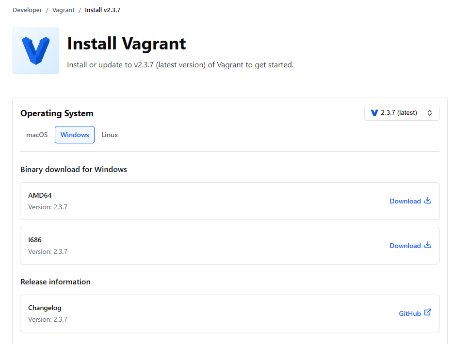
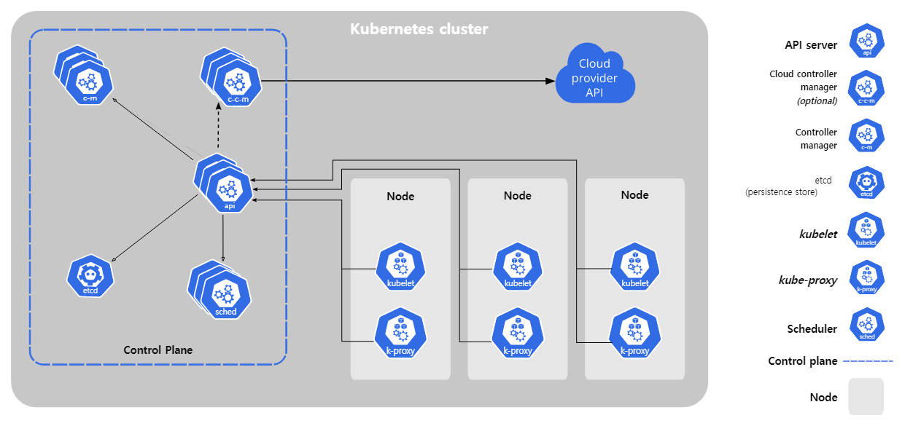
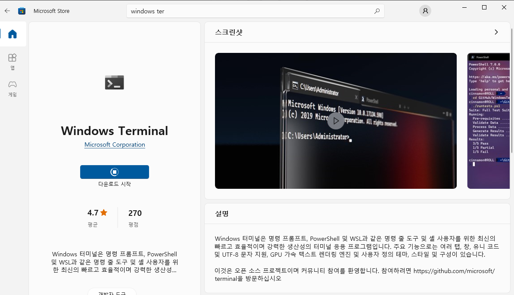

# DevOps를_위한_Docker_Kubernetes_3일차


## 오전


### Vagrant

- vagrant - 가상환경 구축에 도움을 주는 프로그램
- [Vagrant by HashiCorp (vagrantup.com)](https://www.vagrantup.com/)
- 리눅스와 같은 운영체제 이미지를 가지고 있고,  해당 이미지, 네트워크 세팅을 받아서 기본 가상환경을 빠르게 구축함
- 환경설정시 경로에 한글이름이 있으면 오류 발생함 (영어 사용자명)



- kube 설치 후 사용자 폴더에 `mkdir 폴더명` 생성
- vagrantfile 구글드라이브에서 받아서 생성한 폴더로 옮김

```
Vagrant 설정
C:\> cd C:\Users\user\kube
C:\Users\user\kube> vagrant plugin install vagrant-hostmanager
C:\Users\user\kube> vagrant plugin install vagrant-disksize

Vagrant를 이용한 가상머신 생성
C:\Users\user\kube> vagrant up

Microsoft Windows [Version 10.0.19044.2728]
(c) Microsoft Corporation. All rights reserved.

C:\Users\GOODEE>cd kube

C:\Users\GOODEE\kube>vagrant up
Bringing machine 'kube-control1' up with 'virtualbox' provider...
Bringing machine 'kube-node1' up with 'virtualbox' provider...
Bringing machine 'kube-node2' up with 'virtualbox' provider...
Bringing machine 'kube-node3' up with 'virtualbox' provider...
There are errors in the configuration of this machine. Please fix
the following errors and try again:

Vagrant:
* Unknown configuration section 'hostmanager'.


C:\Users\GOODEE\kube>vagrant plugin install vagrant-hostmanager
Installing the 'vagrant-hostmanager' plugin. This can take a few minutes...
Fetching vagrant-hostmanager-1.8.9.gem
Installed the plugin 'vagrant-hostmanager (1.8.9)'!

C:\Users\GOODEE\kube>vagrant plugin install vagrant-disksize
Installing the 'vagrant-disksize' plugin. This can take a few minutes...
Installed the plugin 'vagrant-disksize (0.1.3)'!

C:\Users\GOODEE\kube> vagrant destroy -f
==> kube-node3: VM not created. Moving on...
==> kube-node2: VM not created. Moving on...
==> kube-node1: VM not created. Moving on...
==> kube-control1: VM not created. Moving on...

C:\Users\GOODEE\kube>vagrant up
Bringing machine 'kube-control1' up with 'virtualbox' provider...
Bringing machine 'kube-node1' up with 'virtualbox' provider...
Bringing machine 'kube-node2' up with 'virtualbox' provider...
Bringing machine 'kube-node3' up with 'virtualbox' provider...
==> kube-control1: Importing base box 'ubuntu/focal64'...
==> kube-control1: Matching MAC address for NAT networking...
==> kube-control1: Checking if box 'ubuntu/focal64' version '20230619.0.0' is up to date...
==> kube-control1: Setting the name of the VM: kube-control1
Vagrant is currently configured to create VirtualBox synced folders with
the `SharedFoldersEnableSymlinksCreate` option enabled. If the Vagrant
guest is not trusted, you may want to disable this option. For more
information on this option, please refer to the VirtualBox manual:

  https://www.virtualbox.org/manual/ch04.html#sharedfolders

This option can be disabled globally with an environment variable:

  VAGRANT_DISABLE_VBOXSYMLINKCREATE=1

or on a per folder basis within the Vagrantfile:

  config.vm.synced_folder '/host/path', '/guest/path', SharedFoldersEnableSymlinksCreate: false
==> kube-control1: Clearing any previously set network interfaces...
==> kube-control1: Preparing network interfaces based on configuration...
    kube-control1: Adapter 1: nat
    kube-control1: Adapter 2: hostonly
==> kube-control1: Forwarding ports...
    kube-control1: 22 (guest) => 2222 (host) (adapter 1)
==> kube-control1: Running 'pre-boot' VM customizations...
==> kube-control1: Booting VM...
==> kube-control1: Waiting for machine to boot. This may take a few minutes...
    kube-control1: SSH address: 127.0.0.1:2222
    kube-control1: SSH username: vagrant
    kube-control1: SSH auth method: private key
    kube-control1: Warning: Connection aborted. Retrying...
    kube-control1: Warning: Connection reset. Retrying...
    kube-control1:
    kube-control1: Vagrant insecure key detected. Vagrant will automatically replace
    kube-control1: this with a newly generated keypair for better security.
    kube-control1:
    kube-control1: Inserting generated public key within guest...
    kube-control1: Removing insecure key from the guest if it's present...
    kube-control1: Key inserted! Disconnecting and reconnecting using new SSH key...
==> kube-control1: Machine booted and ready!
==> kube-control1: Checking for guest additions in VM...
==> kube-control1: Setting hostname...
==> kube-control1: Configuring and enabling network interfaces...
==> kube-control1: Mounting shared folders...
    kube-control1: /vagrant => C:/Users/GOODEE/kube
==> kube-control1: [vagrant-hostmanager:guests] Updating hosts file on active guest virtual machines...
==> kube-control1: Running provisioner: shell...
    kube-control1: Running: inline script
==> kube-node1: Importing base box 'ubuntu/focal64'...
==> kube-node1: Matching MAC address for NAT networking...
==> kube-node1: Checking if box 'ubuntu/focal64' version '20230619.0.0' is up to date...
==> kube-node1: Setting the name of the VM: kube-node1
==> kube-node1: Fixed port collision for 22 => 2222. Now on port 2200.
==> kube-node1: Clearing any previously set network interfaces...
==> kube-node1: Preparing network interfaces based on configuration...
    kube-node1: Adapter 1: nat
    kube-node1: Adapter 2: hostonly
==> kube-node1: Forwarding ports...
    kube-node1: 22 (guest) => 2200 (host) (adapter 1)
==> kube-node1: Running 'pre-boot' VM customizations...
==> kube-node1: Resized disk: old 40960 MB, req 51200 MB, new 51200 MB
==> kube-node1: You may need to resize the filesystem from within the guest.
==> kube-node1: Booting VM...
==> kube-node1: Waiting for machine to boot. This may take a few minutes...
    kube-node1: SSH address: 127.0.0.1:2200
    kube-node1: SSH username: vagrant
    kube-node1: SSH auth method: private key
    kube-node1: Warning: Connection reset. Retrying...
    kube-node1: Warning: Connection aborted. Retrying...
    kube-node1:
    kube-node1: Vagrant insecure key detected. Vagrant will automatically replace
    kube-node1: this with a newly generated keypair for better security.
    kube-node1:
    kube-node1: Inserting generated public key within guest...
    kube-node1: Removing insecure key from the guest if it's present...
    kube-node1: Key inserted! Disconnecting and reconnecting using new SSH key...
==> kube-node1: Machine booted and ready!
==> kube-node1: Checking for guest additions in VM...
==> kube-node1: Setting hostname...
==> kube-node1: Configuring and enabling network interfaces...
==> kube-node1: Mounting shared folders...
    kube-node1: /vagrant => C:/Users/GOODEE/kube
==> kube-node1: [vagrant-hostmanager:guests] Updating hosts file on active guest virtual machines...
==> kube-node1: Running provisioner: shell...
    kube-node1: Running: inline script
==> kube-node2: Importing base box 'ubuntu/focal64'...
==> kube-node2: Matching MAC address for NAT networking...
==> kube-node2: Checking if box 'ubuntu/focal64' version '20230619.0.0' is up to date...
==> kube-node2: Setting the name of the VM: kube-node2
==> kube-node2: Fixed port collision for 22 => 2222. Now on port 2201.
==> kube-node2: Clearing any previously set network interfaces...
==> kube-node2: Preparing network interfaces based on configuration...
    kube-node2: Adapter 1: nat
    kube-node2: Adapter 2: hostonly
==> kube-node2: Forwarding ports...
    kube-node2: 22 (guest) => 2201 (host) (adapter 1)
==> kube-node2: Running 'pre-boot' VM customizations...
==> kube-node2: Resized disk: old 40960 MB, req 51200 MB, new 51200 MB
==> kube-node2: You may need to resize the filesystem from within the guest.
==> kube-node2: Booting VM...
==> kube-node2: Waiting for machine to boot. This may take a few minutes...
    kube-node2: SSH address: 127.0.0.1:2201
    kube-node2: SSH username: vagrant
    kube-node2: SSH auth method: private key
    kube-node2: Warning: Connection reset. Retrying...
    kube-node2: Warning: Connection aborted. Retrying...
    kube-node2:
    kube-node2: Vagrant insecure key detected. Vagrant will automatically replace
    kube-node2: this with a newly generated keypair for better security.
    kube-node2:
    kube-node2: Inserting generated public key within guest...
    kube-node2: Removing insecure key from the guest if it's present...
    kube-node2: Key inserted! Disconnecting and reconnecting using new SSH key...
==> kube-node2: Machine booted and ready!
==> kube-node2: Checking for guest additions in VM...
==> kube-node2: Setting hostname...
==> kube-node2: Configuring and enabling network interfaces...
==> kube-node2: Mounting shared folders...
    kube-node2: /vagrant => C:/Users/GOODEE/kube
==> kube-node2: [vagrant-hostmanager:guests] Updating hosts file on active guest virtual machines...
==> kube-node2: Running provisioner: shell...
    kube-node2: Running: inline script
==> kube-node3: Importing base box 'ubuntu/focal64'...
==> kube-node3: Matching MAC address for NAT networking...
==> kube-node3: Checking if box 'ubuntu/focal64' version '20230619.0.0' is up to date...
==> kube-node3: Setting the name of the VM: kube-node3
==> kube-node3: Fixed port collision for 22 => 2222. Now on port 2202.
==> kube-node3: Clearing any previously set network interfaces...
==> kube-node3: Preparing network interfaces based on configuration...
    kube-node3: Adapter 1: nat
    kube-node3: Adapter 2: hostonly
==> kube-node3: Forwarding ports...
    kube-node3: 22 (guest) => 2202 (host) (adapter 1)
==> kube-node3: Running 'pre-boot' VM customizations...
==> kube-node3: Resized disk: old 40960 MB, req 51200 MB, new 51200 MB
==> kube-node3: You may need to resize the filesystem from within the guest.
==> kube-node3: Booting VM...
==> kube-node3: Waiting for machine to boot. This may take a few minutes...
    kube-node3: SSH address: 127.0.0.1:2202
    kube-node3: SSH username: vagrant
    kube-node3: SSH auth method: private key
    kube-node3: Warning: Connection reset. Retrying...
    kube-node3: Warning: Connection aborted. Retrying...
    kube-node3:
    kube-node3: Vagrant insecure key detected. Vagrant will automatically replace
    kube-node3: this with a newly generated keypair for better security.
    kube-node3:
    kube-node3: Inserting generated public key within guest...
    kube-node3: Removing insecure key from the guest if it's present...
    kube-node3: Key inserted! Disconnecting and reconnecting using new SSH key...
==> kube-node3: Machine booted and ready!
==> kube-node3: Checking for guest additions in VM...
==> kube-node3: Setting hostname...
==> kube-node3: Configuring and enabling network interfaces...
==> kube-node3: Mounting shared folders...
    kube-node3: /vagrant => C:/Users/GOODEE/kube
==> kube-node3: [vagrant-hostmanager:guests] Updating hosts file on active guest virtual machines...
==> kube-node3: Running provisioner: shell...
    kube-node3: Running: inline script
```


```bash
가상머신 사용자 계정
ID : vagrant
PW : vagrant
root 사용자 전환
   sudo -i
   
[설치 전]
모든 가상머신에서  Password로 ssh 로그인 가능하도록 설정
(vagrant 계정으로 접속 후)
$ sudo -i
# vim /etc/ssh/sshd_config
:set nu  (엔터)
58G (엔터)   - 58번 행으로 이동
i  (Insert Mode 진입)
(58번 행) PasswordAuthentication yes
[Esc] 키 입력하여 Command 모드로 복귀 후
:wq   (엔터)

설정 적용을 위해 SSH 서비스 데몬 재시작
# systemctl restart ssh.service
```


### Kubernetes

>  구글에서 개발하여 CNCF에서 관리하는 오픈소스 컨테이너 오케스트레이션 도구


#### 도커의 한계성

- cpu, 코어가 제한적인 물리 머신에서는 컨테이너 생성의 한도가 존재함 (물리적으로)
- 물리 서버를 추가해서 컨테이너를 여러개 띄우면 되지 않느냐 -> 호스트 내의 네트워크 통신은 문제가 없지만, 외부 호스트 내의 컨테이너와 통신이 어려움
- 물리 서버가 고장났을 때 해당 물리 서버 내에 있는 모든 컨테이너가 오류 발생


- 구글 내 많은 데이터센터를 관리할 도구의 필요성 인식 -> 데이터 센터를 관리를 위한 도구로 쿠버네티스를 만듬 -> CNCF(리눅스 재단)에 기부 및 오픈소스로 관리하도록 하여 현재는 다양한 개발자가 참여하여 개발


#### Kubernetes의 주요 기능

- Container Platform 

- Microservice Platform - 소규모 서비스 집합(컨테이너들)을 관리, 서비스하는 플랫폼

- 이식성 있는 Cloud Platform - 전통적인 개발환경(온프레미스) 및 클라우드 환경(퍼블릭, 사설)에서도 쿠버네티스 사용 가능 (단, 클라우드 서비스에 따라 제공되는 기능이 다를 순 있으나, 기본적인 기능은 대부분 사용 가능)

#### Kubernetes에서 제공하지 않는 기능

- CI/CD 파이프라인 기능 미제공 - 각 서비스별  CI/CD의 규모, 방식이 다르므로 사용자가 직접 구축

- 애플리케이션 레벨의 서비스 미제공 - 미들웨어, DB 등 별도 지원서비스는 없음 (내가 DB를 띄워서 사용하거나 해야함)

- 로깅, 모니터링, 경고 솔루션 미제공 - 최소한의 기능은 제공하지만 각 서비스별 로그, 모니터링, 경고 솔루션은 사용자가 직접 구축해야함

#### Kubernetes Architecture

- Kubernetes Cluster 구성 요소 : Control Plane, Nodes, Add-on
- 클러스터는 1개 이상의 CP, 여러개의 node, addon을 가짐



- Control Plane(구 master) : Kubernetes Cluster를 제어하는 서버, 1개 이상 필요 (보통 운영 서버는 3개 이상- 보통 홀수로 만듬)

- Node(Worker node, Minion) : Container를 실행하기 위한 Computing Resource를 제공하는 머신 (실제 컨테이너를 띄우는 머신 단위)

##### [Control Plane 주요 구성 요소]

- API Server(kube-apiserver) : Kubernetes Cluster의 모든 구성 요소들이 Control Plane에 위치하는 API Server를 거쳐 메시지를 주고 받음 (프론트엔드)
- etcd(엣씨디?) : Key-Value로 구성된 Kubernetes Cluster를 구성하는 데이터베이스
- API 서버에 요청하면 etcd에서 데이터 조회 및 변경 (API 서버와 etcd는 데이터 동기화)
- Scheduler(kube-scheduler) : 새로 생성되는 파드(Pod)를 감지하고 적절한 노드에 배정하는 역할 수행 (배정만 함)
  - Pod : 1개 이상의 컨테이너를 가진 쿠버네티스 실행 단위
- Controller Manager(kube-controller-manager) : Controller는 API Server를 통해 Cluster의 상태를 감시하고 필요한 상태로 유지하도록 하는 기능을 수행하며 Controller Manager는 Controller의 기능을 지원하기 위한 구성요소
- Cloud Controller Manager : Kubernetes를 Cloud 환경(AWS, GCP, Azure)에서 운영할 때 Cloud 서비스 제공자가 제공하는 서비스와 연동하기 위한 Controller Manager
  - 클라우드 별 업데이트 시기가 다르고, 쿠버네티스도 계속 업데이트가 되므로 별도의 관리자가 필요 (업데이트에 따라 서비스 연동이 안될 수도 있으므로)

##### [Node]

kubelet : Kubernetes Cluster의 Agent 역할 (cluster의 손, 발 역할)

Kubernetes Proxy(kube-proxy) : 각 노드의 네트워크 기능을 담당하는 구성요소로 Host level의 네트워크 규칙을 생성하고 외부 연결을 파드에 포워딩하는 역할을 담당함 - 노드의 트래픽 처리 (설정에 따라 바뀔 수 있음)

*** Kubernetes 교재 실습 예제 파일 :** 

  https://github.com/alicek106/start-docker-kubernetes 


- 간단한 사용은 kube mini?, docker desktop도 간단한 테스트용으론 가능
- 다만 실제 운영서버에서 사용과 다른 점이 있어 해당 부분 참고해서 진행해야 함


- 수업에서는 온프레미스에서 쿠버네티스를 구축하는 방법을 배움 (1. 수동으로 구축 2. 쿠브스프레이를 통한 자동 구축)


#### 쿠버네티스 배포 방법

- 수동으로 Kubernetes Cluster 배포 (kubeadm)

- kubespray를 통한 자동화 배포 - Ansible을 기반으로 Kubernetes Cluster를 구축


#### ssh, 터미널 추천

- [Xshell 다운로드 - NetSarang Website](https://www.netsarang.com/ko/xshell-download/)
- 

- [ssh 프로그램 - Google 검색](https://www.google.com/search?q=ssh+프로그램&oq=ssh+프로그램&aqs=edge..69i57j0i30l3j0i15i30l2j0i5i30l2.8002j0j1&sourceid=chrome&ie=UTF-8)


#### 쿠버네티스 기본 오브젝트

- Pod : 쿠버네티스가 컨테이너를 다루는 기본 단위 하나이상의 컨테이너를 포함하는 단위

- Container

노드 확인

$ kubectl get nodes

$ kubectl get nodes -o wide

오브젝트 확인

$ kubectl api-resources


#### 쿠버네티스 기본 세팅 구성 (관리자, 노드)

- **가상메모리(스왑) 설정시 쿠버네티스에 이슈가 발생 할 수 있어서 OFF로 설정 - 쿠버네티스 설정시 반드시 확인**

```bash
[모든 노드에서 진행]
SWAP 설정 OFF
sudo swapoff -a

sudo vim /etc/fstab

추가 Repository 구성을 위한 패키지 설치
# 레포지토리 업데이트
sudo apt-get update -y 
# 필요 패키지 설치
sudo apt-get install apt-transport-https ca-certificates curl gnupg lsb-release -y


Docker 추가 Repository 구성(gpgkey keyring 설치, Repository 추가)
# apt에 도커 레포지토리 추가, 인증 키 추가
curl -fsSL https://download.docker.com/linux/ubuntu/gpg | sudo gpg --dearmor -o /usr/share/keyrings/docker-archive-keyring.gpg

echo \
  "deb [arch=amd64 signed-by=/usr/share/keyrings/docker-archive-keyring.gpg] https://download.docker.com/linux/ubuntu \
  $(lsb_release -cs) stable" | sudo tee /etc/apt/sources.list.d/docker.list > /dev/null


Docker 패키지 설치
# 도커 레포지토리 패키지 내역 업데이트
sudo apt-get update -y
# 도커 설치
sudo apt-get install docker-ce docker-ce-cli containerd.io -y

sudo docker info | grep -i cgroup

# 과거 도커 컨테이너 기준으로 런타임이 진행 -> 다양한 컨테이너 생기고
# 컨테이너 별 스펙이 다르므로 컨테이너 표준화가 필요
# 쿠버네티스도 도커 컨테이너 기반으로 진행되다가 현재는 표준 컨테이너 기반으로
# systemd 라는 (2.3.5?) cgroupdriver로 표준 컨테이너 런타임 진행??
# cgoupfs -> syst
cat <<EOF | sudo tee /etc/docker/daemon.json
{
  "exec-opts": ["native.cgroupdriver=systemd"],
  "log-driver": "json-file",
  "log-opts": {
    "max-size": "100m"
  },
  "storage-driver": "overlay2"
}
EOF

sudo systemctl daemon-reload

sudo systemctl restart docker.service

sudo docker info | grep -i cgroup
   Cgroup Driver: systemd

kubeadm, kubelet, kubectl 설치
Kubernetes 추가 Repository 구성(gpgkey keyring 설치, Repository 추가)

sudo curl -fssL https://packages.cloud.google.com/apt/doc/apt-key.gpg -o /usr/share/keyrings/kubernetes-archive-keyring.gpg

# 키 인증 이슈 발생 중임
echo "deb [signed-by=/usr/share/keyrings/kubernetes-archive-keyring.gpg] https://apt.kubernetes.io/ kubernetes-xenial main" | sudo tee /etc/apt/sources.list.d/kubernetes.list

* Kubernetes Repository Key 관련 이슈 임시 해결 방안
echo "deb [trusted=yes] https://apt.kubernetes.io/ kubernetes-xenial main" | sudo tee /etc/apt/sources.list.d/kubernetes.list

kubeadm, kubelet, kubectl 설치(버전 지정 및 고정)
sudo apt-get update -y

sudo apt-get install -y kubelet=1.23.5-00 kubeadm=1.23.5-00 kubectl=1.23.5-00

sudo apt-mark hold kubelet kubeadm kubectl

```


## 오후