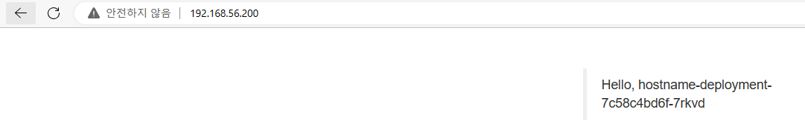
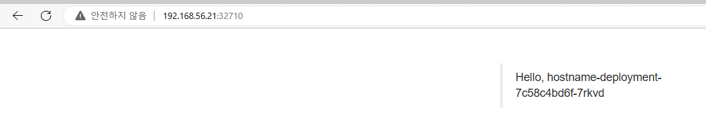
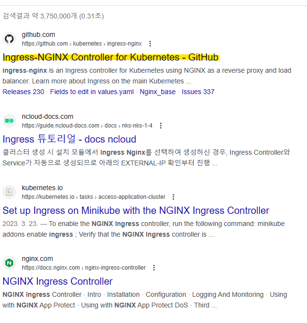
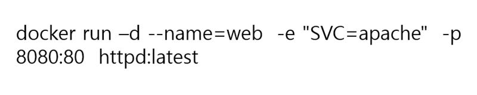

# DevOps를_위한_Docker_Kubernetes_4일차


## 오전


### Controller 이어서


##### 시작전

```bash
vagrant@kube-control1:~/work$ vim ~/.vimrc

# ~/.vimrc
syntax on
autocmd FileType yaml setlocal ts=2 sts=2 sw=2 expandtab (autoindent 제거)
```


```bash
vagrant@kube-control1:~/work$ kubectl get all -n kube-system
NAME                                           READY   STATUS    RESTARTS        AGE
pod/calico-kube-controllers-64cc74d646-jfnhc   1/1     Running   2 (2m52s ago)   19h
pod/calico-node-hz2wh                          1/1     Running   1 (2m25s ago)   19h
pod/calico-node-s8wf9                          1/1     Running   1 (2m40s ago)   19h
pod/calico-node-xbvwf                          1/1     Running   1 (2m30s ago)   19h
pod/calico-node-xqsjk                          1/1     Running   2 (2m52s ago)   19h
pod/coredns-64897985d-cnlf7                    1/1     Running   2 (2m52s ago)   19h
pod/coredns-64897985d-f8znk                    1/1     Running   2 (2m52s ago)   19h
pod/etcd-kube-control1                         1/1     Running   2 (2m52s ago)   19h
pod/kube-apiserver-kube-control1               1/1     Running   2 (2m52s ago)   19h
pod/kube-controller-manager-kube-control1      1/1     Running   2 (2m52s ago)   19h
pod/kube-proxy-m9q2x                           1/1     Running   2 (2m52s ago)   19h
pod/kube-proxy-mh8vq                           1/1     Running   2 (2m25s ago)   19h
pod/kube-proxy-vmdbg                           1/1     Running   2 (2m30s ago)   19h
pod/kube-proxy-xfg2j                           1/1     Running   2 (2m40s ago)   19h
pod/kube-scheduler-kube-control1               1/1     Running   2 (2m52s ago)   19h

NAME               TYPE        CLUSTER-IP   EXTERNAL-IP   PORT(S)                  AGE
service/kube-dns   ClusterIP   10.96.0.10   <none>        53/UDP,53/TCP,9153/TCP   19h

NAME                         DESIRED   CURRENT   READY   UP-TO-DATE   AVAILABLE   NODE SELECTOR            AGE
daemonset.apps/calico-node   4         4         4       4            4           kubernetes.io/os=linux   19h
daemonset.apps/kube-proxy    4         4         4       4            4           kubernetes.io/os=linux   19h

NAME                                      READY   UP-TO-DATE   AVAILABLE   AGE
deployment.apps/calico-kube-controllers   1/1     1            1           19h
deployment.apps/coredns                   2/2     2            2           19h

NAME                                                 DESIRED   CURRENT   READY   AGE
replicaset.apps/calico-kube-controllers-64cc74d646   1         1         1       19h
replicaset.apps/coredns-64897985d                    2         2         2       19h
```


#### Deployment : Replicaset, 파드의 배포를 관리하는 컨트롤러

> 기본 내역은 Replicaset + 배포 관련 기능을 추가한 컨트롤러

##### Deployment Strategy

- RollingUpdate : 버전 업데이트 시 일부의 파드를 부분적으로 업데이트를 진행하여 새로운 버전으로 전환하는 배포 전략으로 다운타임 없이 업데이트가 가능하며 다만 업데이트 중에는 기존버전과 신규 버전이 공존하는 시간이 존재한다. (파드를 하나 하나씩 업데이트 진행, 기존 버전과 신규 버전이 공존하는 과도기 존재, 대신 서비스 중단이 없음)
- Recreate : 버전 업데이트 시 기존 버전을 모두 폐기한 후 새로운 버전의 파드를 실행하여 업데이트 하는 방식으로 다운타임이 존재함. (모두 종료 후 업데이트 후 모두 실행 방식으로 모두 종료 ~ 업데이트 후 실행 사이에 서비스 불가)


#### [Deployment Rollback 관련 실습]

```bash
$ kubectl delete deployment my-nginx-deployment
deployment.apps "my-nginx-deployment" deleted
 
$ kubectl create -f deployment-nginx.yaml --record
deployment.apps/my-nginx-deployment created

$ kubectl get pods,rs,deployment
NAME                                       READY   STATUS    RESTARTS   AGE
pod/my-nginx-deployment-7484748b57-8k5wj   1/1     Running   0          13s
pod/my-nginx-deployment-7484748b57-9d6br   1/1     Running   0          13s
pod/my-nginx-deployment-7484748b57-tjnkf   1/1     Running   0          13s

NAME                                             DESIRED   CURRENT   READY   AGE
replicaset.apps/my-nginx-deployment-7484748b57   3         3         3       13s

NAME                                  READY   UP-TO-DATE   AVAILABLE   AGE
deployment.apps/my-nginx-deployment   3/3     3            3           13s

$ kubectl set image deployment my-nginx-deployment nginx=nginx:1.21 --record
deployment.apps/my-nginx-deployment image updated

$ kubectl get pods,rs,deployment
NAME                                       READY   STATUS              RESTARTS   AGE
pod/my-nginx-deployment-6cc6fd4885-db7dn   0/1     ContainerCreating   0          1s
pod/my-nginx-deployment-6cc6fd4885-h4svr   1/1     Running             0          6s
pod/my-nginx-deployment-7484748b57-8k5wj   1/1     Running             0          2m
pod/my-nginx-deployment-7484748b57-9d6br   1/1     Running             0          2m
pod/my-nginx-deployment-7484748b57-tjnkf   0/1     Terminating         0          2m

NAME                                             DESIRED   CURRENT   READY   AGE
replicaset.apps/my-nginx-deployment-6cc6fd4885   2         2         1       6s
replicaset.apps/my-nginx-deployment-7484748b57   2         2         2       2m

NAME                                  READY   UP-TO-DATE   AVAILABLE   AGE
deployment.apps/my-nginx-deployment   3/3     2            3           2m
$ kubectl get pods,rs,deployment
NAME                                       READY   STATUS    RESTARTS   AGE
pod/my-nginx-deployment-6cc6fd4885-db7dn   1/1     Running   0          24s
pod/my-nginx-deployment-6cc6fd4885-h4svr   1/1     Running   0          29s
pod/my-nginx-deployment-6cc6fd4885-mwrvt   1/1     Running   0          19s

NAME                                             DESIRED   CURRENT   READY   AGE
replicaset.apps/my-nginx-deployment-6cc6fd4885   3         3         3       29s
replicaset.apps/my-nginx-deployment-7484748b57   0         0         0       2m23s

NAME                                  READY   UP-TO-DATE   AVAILABLE   AGE
deployment.apps/my-nginx-deployment   3/3     3            3           2m23s

$ kubectl describe deployment my-nginx-deployment
Name:                   my-nginx-deployment
Namespace:              default
CreationTimestamp:      Fri, 28 Jan 2022 01:54:14 +0000
Labels:                 <none>
Annotations:            deployment.kubernetes.io/revision: 2
                        kubernetes.io/change-cause: kubectl set image deployment my-nginx-deployment nginx=nginx:1.21 --record=true
Selector:               app=my-nginx
Replicas:               3 desired | 3 updated | 3 total | 3 available | 0 unavailable
StrategyType:           RollingUpdate
MinReadySeconds:        0
RollingUpdateStrategy:  25% max unavailable, 25% max surge
Pod Template:
  Labels:  app=my-nginx
  Containers:
   nginx:
    Image:        nginx:1.21
    Port:         80/TCP
    Host Port:    0/TCP
    Environment:  <none>
    Mounts:       <none>
  Volumes:        <none>
Conditions:
  Type           Status  Reason
  ----           ------  ------
  Available      True    MinimumReplicasAvailable
  Progressing    True    NewReplicaSetAvailable
OldReplicaSets:  <none>
NewReplicaSet:   my-nginx-deployment-6cc6fd4885 (3/3 replicas created)
Events:
  Type    Reason             Age    From                   Message
  ----    ------             ----   ----                   -------
  Normal  ScalingReplicaSet  3m33s  deployment-controller  Scaled up replica set my-nginx-deployment-7484748b57 to 3
  Normal  ScalingReplicaSet  99s    deployment-controller  Scaled up replica set my-nginx-deployment-6cc6fd4885 to 1
  Normal  ScalingReplicaSet  94s    deployment-controller  Scaled down replica set my-nginx-deployment-7484748b57 to 2
  Normal  ScalingReplicaSet  94s    deployment-controller  Scaled up replica set my-nginx-deployment-6cc6fd4885 to 2
  Normal  ScalingReplicaSet  89s    deployment-controller  Scaled down replica set my-nginx-deployment-7484748b57 to 1
  Normal  ScalingReplicaSet  89s    deployment-controller  Scaled up replica set my-nginx-deployment-6cc6fd4885 to 3
  Normal  ScalingReplicaSet  84s    deployment-controller  Scaled down replica set my-nginx-deployment-7484748b57 to 0
$ 
$ kubectl rollout history deployment my-nginx-deployment
deployment.apps/my-nginx-deployment 
REVISION  CHANGE-CAUSE
1         kubectl create --filename=deployment-nginx.yaml --record=true
2         kubectl set image deployment my-nginx-deployment nginx=nginx:1.21 --record=true

$ 
$ kubectl rollout undo deployment my-nginx-deployment --to-revision=1
deployment.apps/my-nginx-deployment rolled back
$ 
$ kubectl get pods,rs,deployment
NAME                                       READY   STATUS        RESTARTS   AGE
pod/my-nginx-deployment-6cc6fd4885-mwrvt   0/1     Terminating   0          4m28s
pod/my-nginx-deployment-7484748b57-f4n6l   1/1     Running       0          14s
pod/my-nginx-deployment-7484748b57-s8njz   1/1     Running       0          17s
pod/my-nginx-deployment-7484748b57-sz9gh   1/1     Running       0          12s

NAME                                             DESIRED   CURRENT   READY   AGE
replicaset.apps/my-nginx-deployment-6cc6fd4885   0         0         0       4m38s
replicaset.apps/my-nginx-deployment-7484748b57   3         3         3       6m32s

NAME                                  READY   UP-TO-DATE   AVAILABLE   AGE
deployment.apps/my-nginx-deployment   3/3     3            3           6m32s
$ 
$ kubectl get replicasets --show-labels
NAME                             DESIRED   CURRENT   READY   AGE     LABELS
my-nginx-deployment-6cc6fd4885   0         0         0       5m40s   app=my-nginx,pod-template-hash=6cc6fd4885
my-nginx-deployment-7484748b57   3         3         3       7m34s   app=my-nginx,pod-template-hash=7484748b57

$ kubectl describe deployment my-nginx-deployment
Name:                   my-nginx-deployment
Namespace:              default
CreationTimestamp:      Fri, 28 Jan 2022 01:54:14 +0000
Labels:                 <none>
Annotations:            deployment.kubernetes.io/revision: 3
                        kubernetes.io/change-cause: kubectl create --filename=deployment-nginx.yaml --record=true
Selector:               app=my-nginx
Replicas:               3 desired | 3 updated | 3 total | 3 available | 0 unavailable
StrategyType:           RollingUpdate
MinReadySeconds:        0
RollingUpdateStrategy:  25% max unavailable, 25% max surge
Pod Template:
  Labels:  app=my-nginx
  Containers:
   nginx:
    Image:        nginx:1.10
    Port:         80/TCP
    Host Port:    0/TCP
    Environment:  <none>
    Mounts:       <none>
  Volumes:        <none>
Conditions:
  Type           Status  Reason
  ----           ------  ------
  Available      True    MinimumReplicasAvailable
  Progressing    True    NewReplicaSetAvailable
OldReplicaSets:  <none>
NewReplicaSet:   my-nginx-deployment-7484748b57 (3/3 replicas created)
Events:
  Type    Reason             Age                   From                   Message
  ----    ------             ----                  ----                   -------
  Normal  ScalingReplicaSet  6m35s                 deployment-controller  Scaled up replica set my-nginx-deployment-6cc6fd4885 to 1
  Normal  ScalingReplicaSet  6m30s                 deployment-controller  Scaled down replica set my-nginx-deployment-7484748b57 to 2
  Normal  ScalingReplicaSet  6m30s                 deployment-controller  Scaled up replica set my-nginx-deployment-6cc6fd4885 to 2
  Normal  ScalingReplicaSet  6m25s                 deployment-controller  Scaled down replica set my-nginx-deployment-7484748b57 to 1
  Normal  ScalingReplicaSet  6m25s                 deployment-controller  Scaled up replica set my-nginx-deployment-6cc6fd4885 to 3
  Normal  ScalingReplicaSet  6m20s                 deployment-controller  Scaled down replica set my-nginx-deployment-7484748b57 to 0
  Normal  ScalingReplicaSet  2m14s                 deployment-controller  Scaled up replica set my-nginx-deployment-7484748b57 to 1
  Normal  ScalingReplicaSet  2m11s                 deployment-controller  Scaled down replica set my-nginx-deployment-6cc6fd4885 to 2
  Normal  ScalingReplicaSet  2m9s (x2 over 8m29s)  deployment-controller  Scaled up replica set my-nginx-deployment-7484748b57 to 3
  Normal  ScalingReplicaSet  2m7s (x3 over 2m11s)  deployment-controller  (combined from similar events): Scaled down replica set my-nginx-deployment-6cc6fd4885 to 0
```


##### 실습

- [start-docker-kubernetes/chapter6/deployment-nginx.yaml at master · alicek106/start-docker-kubernetes · GitHub](https://github.com/alicek106/start-docker-kubernetes/blob/master/chapter6/deployment-nginx.yaml)

```yaml
# deployment-nginx.yaml
apiVersion: apps/v1
kind: Deployment
metadata:
  name: my-nginx-deployment
spec:
  replicas: 3
  selector:
    matchLabels:
      app: my-nginx
  template: # pod 정의 부분
    metadata:
      name: my-nginx-pod
      labels:
        app: my-nginx # matchLabels 과 동일해야 생성이 됨
    spec:
      containers:
      - name: nginx
        image: nginx:1.10
        ports:
        - containerPort: 80
```


```bash
# deployment 생성
vagrant@kube-control1:~/work$ kubectl create -f deployment-nginx.yaml --record
Flag --record has been deprecated, --record will be removed in the future
deployment.apps/my-nginx-deployment created
vagrant@kube-control1:~/work$ kubectl get pods,rs,deployment
NAME                                       READY   STATUS    RESTARTS      AGE
pod/my-nginx-deployment-6b4b7f7cdc-gt6vn   1/1     Running   0             8m41s
pod/my-nginx-deployment-6b4b7f7cdc-lkwxn   1/1     Running   0             8m41s
pod/my-nginx-deployment-6b4b7f7cdc-tqtbv   1/1     Running   0             8m41s
pod/replicaset-nginx-4qh5v                 1/1     Running   1 (45m ago)   16h
pod/replicaset-nginx-v9cmz                 1/1     Running   1 (45m ago)   16h
pod/replicaset-nginx-w8xps                 1/1     Running   1 (45m ago)   16h

NAME                                             DESIRED   CURRENT   READY   AGE
replicaset.apps/my-nginx-deployment-6b4b7f7cdc   3         3         3       8m41s
replicaset.apps/replicaset-nginx                 3         3         3       16h

NAME                                  READY   UP-TO-DATE   AVAILABLE   AGE
deployment.apps/my-nginx-deployment   3/3     3            3           8m41s

# 이미지 업데이트 -> pod 교체됨
vagrant@kube-control1:~/work$ kubectl set image deployment my-nginx-deployment nginx=nginx:1.21 --record
Flag --record has been deprecated, --record will be removed in the future
deployment.apps/my-nginx-deployment image updated
vagrant@kube-control1:~/work$ kubectl get pods,rs,deployment
NAME                                       READY   STATUS              RESTARTS      AGE
pod/my-nginx-deployment-5cdb4bc675-88xn2   1/1     Running             0             62s
pod/my-nginx-deployment-5cdb4bc675-p2j2z   1/1     Running             0             108s
pod/my-nginx-deployment-5cdb4bc675-x66bf   0/1     ContainerCreating   0             17s
pod/my-nginx-deployment-6b4b7f7cdc-lkwxn   1/1     Running             0             13m
pod/replicaset-nginx-4qh5v                 1/1     Running             1 (50m ago)   16h
pod/replicaset-nginx-v9cmz                 1/1     Running             1 (50m ago)   16h
pod/replicaset-nginx-w8xps                 1/1     Running             1 (49m ago)   16h

NAME                                             DESIRED   CURRENT   READY   AGE
replicaset.apps/my-nginx-deployment-5cdb4bc675   3         3         2       108s
replicaset.apps/my-nginx-deployment-6b4b7f7cdc   1         1         1       13m
replicaset.apps/replicaset-nginx                 3         3         3       16h

NAME                                  READY   UP-TO-DATE   AVAILABLE   AGE
deployment.apps/my-nginx-deployment   3/3     3            3           13m

vagrant@kube-control1:~/work$ kubectl describe deployment my-nginx-deployment
Name:                   my-nginx-deployment
Namespace:              default
CreationTimestamp:      Thu, 22 Jun 2023 00:43:04 +0000
Labels:                 <none>
Annotations:            deployment.kubernetes.io/revision: 2
                        kubernetes.io/change-cause: kubectl set image deployment my-nginx-deployment nginx=nginx:1.21 --record=true
Selector:               app=my-nginx
Replicas:               3 desired | 3 updated | 3 total | 3 available | 0 unavailable
StrategyType:           RollingUpdate
MinReadySeconds:        0
RollingUpdateStrategy:  25% max unavailable, 25% max surge # 업데이트 당시에 비활성화 할 pod 비율, 중간에 추가로 만들어질 pod 비율 (pod 3->4(구3 신1)->3(구2 신1) 이런식)
Pod Template:
  Labels:  app=my-nginx
  Containers:
   nginx:
    Image:        nginx:1.21
    Port:         80/TCP
    Host Port:    0/TCP
    Environment:  <none>
    Mounts:       <none>
  Volumes:        <none>
Conditions:
  Type           Status  Reason
  ----           ------  ------
  Available      True    MinimumReplicasAvailable
  Progressing    True    NewReplicaSetAvailable
OldReplicaSets:  <none>
NewReplicaSet:   my-nginx-deployment-5cdb4bc675 (3/3 replicas created)
Events:
  Type    Reason             Age   From                   Message
  ----    ------             ----  ----                   -------
  Normal  ScalingReplicaSet  39m   deployment-controller  Scaled up replica set my-nginx-deployment-6b4b7f7cdc to 3
  Normal  ScalingReplicaSet  27m   deployment-controller  Scaled up replica set my-nginx-deployment-5cdb4bc675 to 1
  Normal  ScalingReplicaSet  27m   deployment-controller  Scaled down replica set my-nginx-deployment-6b4b7f7cdc to 2
  Normal  ScalingReplicaSet  27m   deployment-controller  Scaled up replica set my-nginx-deployment-5cdb4bc675 to 2
  Normal  ScalingReplicaSet  26m   deployment-controller  Scaled down replica set my-nginx-deployment-6b4b7f7cdc to 1
  Normal  ScalingReplicaSet  26m   deployment-controller  Scaled up replica set my-nginx-deployment-5cdb4bc675 to 3
  Normal  ScalingReplicaSet  25m   deployment-controller  Scaled down replica set my-nginx-deployment-6b4b7f7cdc to 0
  
# rollout history (record) 내역 확인
vagrant@kube-control1:~/work$ kubectl rollout history deployment my-nginx-deployment
deployment.apps/my-nginx-deployment
REVISION  CHANGE-CAUSE
1         kubectl create --filename=deployment-nginx.yaml --record=true
2         kubectl set image deployment my-nginx-deployment nginx=nginx:1.21 --record=true

# rollout undo --to-revision (이전 버전 원복)
vagrant@kube-control1:~/work$ kubectl rollout undo deployment my-nginx-deployment --to-revision=1
deployment.apps/my-nginx-deployment rolled back
vagrant@kube-control1:~/work$ kubectl get pods,rs,deployment
NAME                                       READY   STATUS    RESTARTS      AGE
pod/my-nginx-deployment-6b4b7f7cdc-5xg5d   1/1     Running   0             31s
pod/my-nginx-deployment-6b4b7f7cdc-dzhvx   1/1     Running   0             32s
pod/my-nginx-deployment-6b4b7f7cdc-z99ss   1/1     Running   0             28s
pod/replicaset-nginx-4qh5v                 1/1     Running   1 (83m ago)   16h
pod/replicaset-nginx-v9cmz                 1/1     Running   1 (83m ago)   17h
pod/replicaset-nginx-w8xps                 1/1     Running   1 (83m ago)   17h

NAME                                             DESIRED   CURRENT   READY   AGE
replicaset.apps/my-nginx-deployment-5cdb4bc675   0         0         0       35m
replicaset.apps/my-nginx-deployment-6b4b7f7cdc   3         3         3       47m
replicaset.apps/replicaset-nginx                 3         3         3       17h

NAME                                  READY   UP-TO-DATE   AVAILABLE   AGE
deployment.apps/my-nginx-deployment   3/3     3            3           47m

# label 확인
vagrant@kube-control1:~/work$ kubectl get replicasets --show-labels
NAME                             DESIRED   CURRENT   READY   AGE   LABELS
my-nginx-deployment-5cdb4bc675   0         0         0       37m   app=my-nginx,pod-template-hash=5cdb4bc675 # hash kube에서 pod 레이블 구분하기 위해 자동생성
my-nginx-deployment-6b4b7f7cdc   3         3         3       48m   app=my-nginx,pod-template-hash=6b4b7f7cdc
replicaset-nginx                 3         3         3       17h   <none>

# deployment 원복으로 인해 로그 증가 확인 (describe)
vagrant@kube-control1:~/work$ kubectl describe deployments my-nginx-deployment
Name:                   my-nginx-deployment
Namespace:              default
CreationTimestamp:      Thu, 22 Jun 2023 00:43:04 +0000
Labels:                 <none>
Annotations:            deployment.kubernetes.io/revision: 3
                        kubernetes.io/change-cause: kubectl create --filename=deployment-nginx.yaml --record=true
Selector:               app=my-nginx
Replicas:               3 desired | 3 updated | 3 total | 3 available | 0 unavailable
StrategyType:           RollingUpdate
MinReadySeconds:        0
RollingUpdateStrategy:  25% max unavailable, 25% max surge
Pod Template:
  Labels:  app=my-nginx
  Containers:
   nginx:
    Image:        nginx:1.10
    Port:         80/TCP
    Host Port:    0/TCP
    Environment:  <none>
    Mounts:       <none>
  Volumes:        <none>
Conditions:
  Type           Status  Reason
  ----           ------  ------
  Available      True    MinimumReplicasAvailable
  Progressing    True    NewReplicaSetAvailable
OldReplicaSets:  <none>
NewReplicaSet:   my-nginx-deployment-6b4b7f7cdc (3/3 replicas created)
Events:
  Type    Reason             Age                  From                   Message
  ----    ------             ----                 ----                   -------
  Normal  ScalingReplicaSet  38m                  deployment-controller  Scaled up replica set my-nginx-deployment-5cdb4bc675 to 1
  Normal  ScalingReplicaSet  38m                  deployment-controller  Scaled down replica set my-nginx-deployment-6b4b7f7cdc to 2
  Normal  ScalingReplicaSet  38m                  deployment-controller  Scaled up replica set my-nginx-deployment-5cdb4bc675 to 2
  Normal  ScalingReplicaSet  37m                  deployment-controller  Scaled down replica set my-nginx-deployment-6b4b7f7cdc to 1
  Normal  ScalingReplicaSet  37m                  deployment-controller  Scaled up replica set my-nginx-deployment-5cdb4bc675 to 3
  Normal  ScalingReplicaSet  36m                  deployment-controller  Scaled down replica set my-nginx-deployment-6b4b7f7cdc to 0
  Normal  ScalingReplicaSet  3m55s                deployment-controller  Scaled up replica set my-nginx-deployment-6b4b7f7cdc to 1
  Normal  ScalingReplicaSet  3m54s                deployment-controller  Scaled down replica set my-nginx-deployment-5cdb4bc675 to 2
  Normal  ScalingReplicaSet  3m54s                deployment-controller  Scaled up replica set my-nginx-deployment-6b4b7f7cdc to 2
  Normal  ScalingReplicaSet  3m52s                deployment-controller  Scaled down replica set my-nginx-deployment-5cdb4bc675 to 1
  Normal  ScalingReplicaSet  3m51s (x2 over 50m)  deployment-controller  Scaled up replica set my-nginx-deployment-6b4b7f7cdc to 3
  Normal  ScalingReplicaSet  3m50s                deployment-controller  Scaled down replica set my-nginx-deployment-5cdb4bc675 to 0
```


#### Daemonset : 기본적으로 워커 노드에 반드시 한개씩 파드가 실행되도록 하는 컨트롤러

- control-plane 에는 특정 어플리케이션만 작동 taint toleration

#### [Daemonset 실습]

##### daemonset-example.yaml

```yaml
apiVersion: apps/v1 # 구현 api 버전
kind: DaemonSet
metadata: # 해당 daemonset 정의
  name: daemonset-example
spec: # 상세 정의, pod갯수 지정안함
  selector: # daemonset이 관리할 pod 들의 레이블 선택자 (해당 조건을 만족하는 pod 관리)
    matchLabels:
      name: my-daemonset-example
  template:
    metadata:
      labels:
        name: my-daemonset-example
    spec:
      containers:
      - name: daemonset-example
        image: busybox # 리눅스 필수 도구로만 만들어진 이미지 (최소한의 이미지), 제어 터미널이 없으면 실행 후 종료 (제어 쉘 함께 생성해야함)
        args: ["tail", "-f", "/dev/null"] # tail -f /dev/null 명령어 추가
        # tail 명령어 변경 내역 추적(로그) tail 명령어 지정시 해당 프로세스를 계속 잡고있어야함 -> busybox 종료가 되지 않도록 임의의 프로세스 유지 하기 위해 명령어 사용
```


```bash
$ vim daemonset-example.yaml
$ 
$ kubectl create -f daemonset-example.yaml 
daemonset.apps/daemonset-example created
$ 
$ kubectl get all
NAME                                       READY   STATUS    RESTARTS   AGE
pod/daemonset-example-6j22x                1/1     Running   0          17s
pod/daemonset-example-82ldv                1/1     Running   0          17s
pod/daemonset-example-r27c6                1/1     Running   0          17s
pod/my-nginx-deployment-7484748b57-f4n6l   1/1     Running   0          33m
pod/my-nginx-deployment-7484748b57-n9rf9   1/1     Running   0          15m
pod/my-nginx-deployment-7484748b57-s8njz   1/1     Running   0          33m
pod/my-nginx-deployment-7484748b57-sz9gh   1/1     Running   0          33m

NAME                 TYPE        CLUSTER-IP   EXTERNAL-IP   PORT(S)   AGE
service/kubernetes   ClusterIP   10.96.0.1    <none>        443/TCP   22h

NAME                               DESIRED   CURRENT   READY   UP-TO-DATE   AVAILABLE   NODE SELECTOR   AGE
daemonset.apps/daemonset-example   3         3         3       3            3           <none>          17s

NAME                                  READY   UP-TO-DATE   AVAILABLE   AGE
deployment.apps/my-nginx-deployment   4/4     4            4           40m

NAME                                             DESIRED   CURRENT   READY   AGE
replicaset.apps/my-nginx-deployment-6cc6fd4885   0         0         0       38m
replicaset.apps/my-nginx-deployment-7484748b57   4         4         4       40m
$ 
$ kubectl exec -it daemonset-example-82ldv /bin/sh
kubectl exec [POD] [COMMAND] is DEPRECATED and will be removed in a future version. Use kubectl exec [POD] -- [COMMAND] instead.
/ # ls /
bin   dev   etc   home  proc  root  sys   tmp   usr   var
/ # exit
$ 
$ kubectl get pods
NAME                                   READY   STATUS    RESTARTS   AGE
daemonset-example-6j22x                1/1     Running   0          4m23s
daemonset-example-82ldv                1/1     Running   0          4m23s
daemonset-example-r27c6                1/1     Running   0          4m23s
my-nginx-deployment-7484748b57-f4n6l   1/1     Running   0          37m
my-nginx-deployment-7484748b57-n9rf9   1/1     Running   0          19m
my-nginx-deployment-7484748b57-s8njz   1/1     Running   0          37m
my-nginx-deployment-7484748b57-sz9gh   1/1     Running   0          37m
$ kubectl get pods -o wide
NAME                                   READY   STATUS    RESTARTS   AGE     IP                NODE         NOMINATED NODE   READINESS GATES
daemonset-example-6j22x                1/1     Running   0          4m31s   192.168.119.142   kube-node3   <none>           <none>
daemonset-example-82ldv                1/1     Running   0          4m31s   192.168.233.211   kube-node2   <none>           <none>
daemonset-example-r27c6                1/1     Running   0          4m31s   192.168.9.77      kube-node1   <none>           <none>
my-nginx-deployment-7484748b57-f4n6l   1/1     Running   0          38m     192.168.119.141   kube-node3   <none>           <none>
my-nginx-deployment-7484748b57-n9rf9   1/1     Running   0          19m     192.168.233.210   kube-node2   <none>           <none>
my-nginx-deployment-7484748b57-s8njz   1/1     Running   0          38m     192.168.9.76      kube-node1   <none>           <none>
my-nginx-deployment-7484748b57-sz9gh   1/1     Running   0          38m     192.168.233.209   kube-node2   <none>           <none>
```


##### 실습

```bash
# daemonset 생성
vagrant@kube-control1:~/work$ vim daemonset-example.yaml
vagrant@kube-control1:~/work$ kubectl create -f daemonset-example.yaml
daemonset.apps/daemonset-example created
vagrant@kube-control1:~/work$ kubectl get all
NAME                                       READY   STATUS    RESTARTS       AGE
pod/daemonset-example-7v2mv                1/1     Running   0              103s
pod/daemonset-example-drvx5                1/1     Running   0              103s
pod/daemonset-example-wktxn                1/1     Running   0              103s
pod/my-nginx-deployment-6b4b7f7cdc-5xg5d   1/1     Running   0              17m
pod/my-nginx-deployment-6b4b7f7cdc-dzhvx   1/1     Running   0              17m
pod/my-nginx-deployment-6b4b7f7cdc-z99ss   1/1     Running   0              17m
pod/replicaset-nginx-4qh5v                 1/1     Running   1 (100m ago)   17h
pod/replicaset-nginx-v9cmz                 1/1     Running   1 (101m ago)   17h
pod/replicaset-nginx-w8xps                 1/1     Running   1 (100m ago)   17h

NAME                 TYPE        CLUSTER-IP   EXTERNAL-IP   PORT(S)   AGE
service/kubernetes   ClusterIP   10.96.0.1    <none>        443/TCP   21h

NAME                               DESIRED   CURRENT   READY   UP-TO-DATE   AVAILABLE   NODE SELECTOR   AGE
daemonset.apps/daemonset-example   3         3         3       3            3           <none>          103s # 현재 pod 만큼 생성

NAME                                  READY   UP-TO-DATE   AVAILABLE   AGE
deployment.apps/my-nginx-deployment   3/3     3            3           64m

NAME                                             DESIRED   CURRENT   READY   AGE
replicaset.apps/my-nginx-deployment-5cdb4bc675   0         0         0       52m
replicaset.apps/my-nginx-deployment-6b4b7f7cdc   3         3         3       64m
replicaset.apps/replicaset-nginx                 3         3         3       17h
# daemonset 내부 접속
vagrant@kube-control1:~/work$ kubectl exec -it daemonset-example-7v2mv /bin/sh
kubectl exec [POD] [COMMAND] is DEPRECATED and will be removed in a future version. Use kubectl exec [POD] -- [COMMAND] instead.
/ #
/ # ls
bin    dev    etc    home   lib    lib64  proc   root   sys    tmp    usr    var
/ # ps -ef
PID   USER     TIME  COMMAND
    1 root      0:00 tail -f /dev/null
    6 root      0:00 /bin/sh
   12 root      0:00 ps -ef
/ # exit
vagrant@kube-control1:~/work$ kubectl get pods -o wide
NAME                                   READY   STATUS    RESTARTS       AGE     IP                NODE         NOMINATED NODE   READINESS GATES
daemonset-example-7v2mv                1/1     Running   0              4m35s   192.168.233.201   kube-node2   <none>           <none>
daemonset-example-drvx5                1/1     Running   0              4m35s   192.168.119.138   kube-node3   <none>           <none>
daemonset-example-wktxn                1/1     Running   0              4m35s   192.168.9.71      kube-node1   <none>           <none>
my-nginx-deployment-6b4b7f7cdc-5xg5d   1/1     Running   0              20m     192.168.119.137   kube-node3   <none>           <none>
my-nginx-deployment-6b4b7f7cdc-dzhvx   1/1     Running   0              20m     192.168.233.200   kube-node2   <none>           <none>
my-nginx-deployment-6b4b7f7cdc-z99ss   1/1     Running   0              20m     192.168.9.70      kube-node1   <none>           <none>
replicaset-nginx-4qh5v                 1/1     Running   1 (103m ago)   17h     192.168.233.197   kube-node2   <none>           <none>
replicaset-nginx-v9cmz                 1/1     Running   1 (103m ago)   17h     192.168.9.67      kube-node1   <none>           <none>
replicaset-nginx-w8xps                 1/1     Running   1 (103m ago)   17h     192.168.119.133   kube-node3   <none>           <none>
```


### Kubernetes 네트워크

- 교재 (p 316~ 쿠버네티스 서비스)

- Docker Host가 여러개 있는 환경 (각 pod)
- 컨테이너 오케스트레이션 (각각 pod를 하나의 네트워크로 묶을 수 있음)


#### Ch06. 6.5-서비스(참조: p.318 ~ ) - 일반적인 서비스가 아닌 쿠버네티스 네트워크 서비스

- 서비스 오브젝트 - 일반적인 서비스와 구분하기 위해 명칭

#### 서비스 오브젝트(네트워크) 종류

- Cluster IP : 쿠버네티스 **클러스터 내부에서만 파드들에 접근**할 때 사용하는 서비스 오브젝트. 외부로 파드를 노출하지 않기 때문에 쿠버네티스 클러스터 내부에서만 사용되는 파드에 적합한 서비스 오브젝트

- Headless : 클러스터 내부에서 접근 가능한 서비스 오브젝트로 특정 파드에 대한 IP 주소를 제공하는 서비스 오브젝트(Cluster IP: None). **특정 파드에 직접 접근**해야하는 경우에 사용함 (특정 파드를 직접 명시하여 접근)

- NodePort : 파드에 접근할 수 있는 포트를 클러스터의 **모든 노드에 동일하게 개방**하여 외부에서 파드에 접근할 수 있는 서비스 오브젝트. 접근할 수 있는 포트는 기본적으로 랜덤(기본적으로 30000 ~ 35000 사이)으로 지정되나 특정 포트로 접근하도록 설정할 수도 있음. (Cluster IP 기능도 포함)

- LoadBalancer : 클라우드 플랫폼에서 제공하는 로드 밸런서를 동적으로 프로비저닝해 파드에 연결하는 서비스 오브젝트. NodePort 타입과 마찬가지로 외부에서 파드에 접근할 수 있는 서비스 타입이나 일반적으로 AWS. GCP 등의 클라우드 플랫폼 환경에서만 사용 가능함. (온프레미스에서는 일반적으로 로드밸런스가 어려움, 로드밸런서 사용가능환경에서 진행)

##### Port 관련 용어

- port : Kubernetes Cluster 내에서 접근 가능한 포트
- containerPort : 컨테이너가 개방하는 포트
- targetPort : 파드가 개방하는 포트
- nodeport: 외부에서 직접적으로 접근 가능한 포트 (클러스터 외부에서 접근)
- servicePort: ingress 에서 연결해주는 포트로 연결해주는 포트가 endpoint 의 포트(targetPort)가 됨.


#### [ClusterIP 실습]

##### 예제

```bash
$ vim deployment-hostname.yaml 
$ vim hostname-svc-clusterip.yaml 

$ kubectl create -f deployment-hostname.yaml 
deployment.apps/hostname-deployment created
$ kubectl create -f hostname-svc-clusterip.yaml 
service/hostname-svc-clusterip created

$ kubectl get deployment,pods,services
NAME                                  READY   UP-TO-DATE   AVAILABLE   AGE
deployment.apps/hostname-deployment   3/3     3            3           62s

NAME                                       READY   STATUS    RESTARTS   AGE
pod/hostname-deployment-7dfd748479-9hv85   1/1     Running   0          62s
pod/hostname-deployment-7dfd748479-kxznm   1/1     Running   0          62s
pod/hostname-deployment-7dfd748479-s7hv8   1/1     Running   0          62s

NAME                             TYPE        CLUSTER-IP      EXTERNAL-IP   PORT(S)    AGE
service/hostname-svc-clusterip   ClusterIP   10.103.64.125   <none>        8080/TCP   22s
service/kubernetes               ClusterIP   10.96.0.1       <none>        443/TCP    24h
$ kubectl get deployment,rs,pods,services
NAME                                  READY   UP-TO-DATE   AVAILABLE   AGE
deployment.apps/hostname-deployment   3/3     3            3           69s

NAME                                             DESIRED   CURRENT   READY   AGE
replicaset.apps/hostname-deployment-7dfd748479   3         3         3       69s

NAME                                       READY   STATUS    RESTARTS   AGE
pod/hostname-deployment-7dfd748479-9hv85   1/1     Running   0          69s
pod/hostname-deployment-7dfd748479-kxznm   1/1     Running   0          69s
pod/hostname-deployment-7dfd748479-s7hv8   1/1     Running   0          69s

NAME                             TYPE        CLUSTER-IP      EXTERNAL-IP   PORT(S)    AGE
service/hostname-svc-clusterip   ClusterIP   10.103.64.125   <none>        8080/TCP   29s
service/kubernetes               ClusterIP   10.96.0.1       <none>        443/TCP    24h
$ kubectl describe service hostname-svc-clusterip
Name:              hostname-svc-clusterip
Namespace:         default
Labels:            <none>
Annotations:       <none>
Selector:          app=webserver
Type:              ClusterIP
IP:                10.103.64.125
Port:              web-port  8080/TCP
TargetPort:        80/TCP
Endpoints:         192.168.119.144:80,192.168.233.212:80,192.168.9.78:80
Session Affinity:  None
Events:            <none>
$ 
$ kubectl describe pod hostname-deployment-7dfd748479-9hv85
Name:         hostname-deployment-7dfd748479-9hv85
IP:           192.168.9.78

$ kubectl describe pod hostname-deployment-7dfd748479-kxznm
IP:           192.168.119.144
$ kubectl describe pod hostname-deployment-7dfd748479-s7hv8
Name:         hostname-deployment-7dfd748479-s7hv8
IP:           192.168.233.212


$ kubectl run -it --rm debug --image=alicek106/ubuntu:curl --restart=Never -- bash
If you don't see a command prompt, try pressing enter.
root@debug:/# curl http://10.103.64.125:8080
<!DOCTYPE html>
<meta charset="utf-8" />
<link rel="stylesheet" type="text/css" href="./css/layout.css" />
<link rel="stylesheet" href="https://maxcdn.bootstrapcdn.com/bootstrap/3.3.2/css/bootstrap.min.css">

<div class="form-layout">
	<blockquote>
	<p>Hello,  hostname-deployment-7dfd748479-9hv85</p>	</blockquote>
</div>
root@debug:/# exit

$ curl http://10.103.64.125:8080
<!DOCTYPE html>
<meta charset="utf-8" />
<link rel="stylesheet" type="text/css" href="./css/layout.css" />
<link rel="stylesheet" href="https://maxcdn.bootstrapcdn.com/bootstrap/3.3.2/css/bootstrap.min.css">

<div class="form-layout">
	<blockquote>
	<p>Hello,  hostname-deployment-7dfd748479-kxznm</p>	</blockquote>
</div>
```


##### 실습

###### deployment-hostname.yaml

```yaml
# deployment-hostname.yaml
apiVersion: apps/v1
kind: Deployment
metadata:
  name: hostname-deployment
spec:
  replicas: 3
  selector:
    matchLabels:
      app: webserver
  template:
    metadata:
      name: my-webserver
      labels:
        app: webserver
    spec:
      containers:
      - name: my-webserver
        image: alicek106/rr-test:echo-hostname # pod 이름 host 이름 출력하는 간단한 이미지
        ports:
        - containerPort: 80
```


```bash
vagrant@kube-control1:~/work$ vim deployment-hostname.yaml
vagrant@kube-control1:~/work$ kubectl create -f deployment-hostname.yaml
deployment.apps/hostname-deployment created
```


###### hostname-svc-clusterip.yaml

```yaml
# hostname-svc-clusterip.yaml
apiVersion: v1
kind: Service
metadata:
  name: hostname-svc-clusterip
spec:
  ports:
    - name: web-port
      port: 8080 # 서비스 오브젝트 요청 받을때 사용 클러스터 내부에서 접근 포트
      targetPort: 80 # 컨테이너(pod)가 열고 있는 port (컨테이너 포트와 일치해야함)
  selector:
    app: webserver # 레이블 셀렉터 (셀렉터를 적지 않으면 endpoint 오브젝트 직접 정의 후 생성 필요)
  type: ClusterIP
```


```bash
vagrant@kube-control1:~/work$ vim hostname-svc-clusterip.yaml
vagrant@kube-control1:~/work$ kubectl create -f hostname-svc-clusterip.yaml
service/hostname-svc-clusterip created
vagrant@kube-control1:~/work$ kubectl get services
NAME                     TYPE        CLUSTER-IP       EXTERNAL-IP   PORT(S)    AGE
hostname-svc-clusterip   ClusterIP   10.105.169.243   <none>        8080/TCP   4s
kubernetes               ClusterIP   10.96.0.1        <none>        443/TCP    22h

# 상세내역
vagrant@kube-control1:~/work$ kubectl describe services hostname-svc-clusterip
Name:              hostname-svc-clusterip
Namespace:         default
Labels:            <none>
Annotations:       <none>
Selector:          app=webserver
Type:              ClusterIP
IP Family Policy:  SingleStack
IP Families:       IPv4
IP:                10.105.169.243
IPs:               10.105.169.243
Port:              web-port  8080/TCP
TargetPort:        80/TCP
Endpoints:         192.168.119.140:80,192.168.233.202:80 # 주소가 안나오면 문제 상황, 해당 포인트를 통해서 타겟에 요청이 들어감, 각 pod 별 가지고 있는 주소+타겟포트
Session Affinity:  None
Events:            <none>

# ip주소 맞는지 확인 (엔드포인트와 비교)
vagrant@kube-control1:~/work$ kubectl get pods -o wide
NAME                                   READY   STATUS             RESTARTS       AGE   IP                NODE         NOMINATED NODE   READINESS GATES
daemonset-example-7v2mv                1/1     Running            0              54m   192.168.233.201   kube-node2   <none>           <none>
daemonset-example-drvx5                1/1     Running            0              54m   192.168.119.138   kube-node3   <none>           <none>
daemonset-example-wktxn                1/1     Running            0              54m   192.168.9.71      kube-node1   <none>           <none>
hostname-deployment-7c58c4bd6f-7rkvd   1/1     Running            0              11m   192.168.119.140   kube-node3   <none>           <none>
hostname-deployment-7c58c4bd6f-dzmm2   1/1     Running            0              11m   192.168.233.202   kube-node2   <none>           <none>
hostname-deployment-7c58c4bd6f-tq688   0/1     ImagePullBackOff   0              11m   192.168.9.74      kube-node1   <none>           <none>
my-nginx-deployment-6b4b7f7cdc-5xg5d   1/1     Running            0              69m   192.168.119.137   kube-node3   <none>           <none>
my-nginx-deployment-6b4b7f7cdc-dzhvx   1/1     Running            0              70m   192.168.233.200   kube-node2   <none>           <none>
my-nginx-deployment-6b4b7f7cdc-z99ss   1/1     Running            0              69m   192.168.9.70      kube-node1   <none>           <none>
replicaset-nginx-4qh5v                 1/1     Running            1 (153m ago)   17h   192.168.233.197   kube-node2   <none>           <none>
replicaset-nginx-lw9sw                 1/1     Running            0              46m   192.168.119.139   kube-node3   <none>           <none>
replicaset-nginx-v9cmz                 1/1     Running            1 (153m ago)   18h   192.168.9.67      kube-node1   <none>           <none>
replicaset-nginx-w8xps                 1/1     Running            1 (153m ago)   18h   192.168.119.133   kube-node3   <none>           <none>

# curl로 연결 확인 (3개 중 랜덤으로 연결)
vagrant@kube-control1:~/work$ curl http://10.105.169.243:8080
<!DOCTYPE html>
<meta charset="utf-8" />
<link rel="stylesheet" type="text/css" href="./css/layout.css" />
<link rel="stylesheet" href="https://maxcdn.bootstrapcdn.com/bootstrap/3.3.2/css/bootstrap.min.css">

<div class="form-layout">
        <blockquote>
        <p>Hello,  hostname-deployment-7c58c4bd6f-dzmm2</p>     </blockquote>
</div>
vagrant@kube-control1:~/work$ curl http://10.105.169.243:8080
<!DOCTYPE html>
<meta charset="utf-8" />
<link rel="stylesheet" type="text/css" href="./css/layout.css" />
<link rel="stylesheet" href="https://maxcdn.bootstrapcdn.com/bootstrap/3.3.2/css/bootstrap.min.css">

<div class="form-layout">
        <blockquote>
        <p>Hello,  hostname-deployment-7c58c4bd6f-dzmm2</p>     </blockquote>
</div>
vagrant@kube-control1:~/work$ curl http://10.105.169.243:8080
<!DOCTYPE html>
<meta charset="utf-8" />
<link rel="stylesheet" type="text/css" href="./css/layout.css" />
<link rel="stylesheet" href="https://maxcdn.bootstrapcdn.com/bootstrap/3.3.2/css/bootstrap.min.css">

<div class="form-layout">
        <blockquote>
        <p>Hello,  hostname-deployment-7c58c4bd6f-7rkvd</p>     </blockquote>
</div>
vagrant@kube-control1:~/work$ curl http://10.105.169.243:8080
<!DOCTYPE html>
<meta charset="utf-8" />
<link rel="stylesheet" type="text/css" href="./css/layout.css" />
<link rel="stylesheet" href="https://maxcdn.bootstrapcdn.com/bootstrap/3.3.2/css/bootstrap.min.css">

<div class="form-layout">
        <blockquote>
        <p>Hello,  hostname-deployment-7c58c4bd6f-dzmm2</p>     </blockquote>
</div>
```


- 외부에서의 접근? - nodeport, loadbalancer 
- 특정세션과의 지속적인 연결? 세션어피니티?


## 오후


### Kubernetes Cluster 외부에 서비스 제공


#### [NodePort] p.326

##### 예제

```bash
$ cp start-docker-kubernetes/chapter6/hostname-svc-nodeport.yaml .
$ kubectl create -f deployment-hostname.yaml 
deployment.apps/hostname-deployment created
$ kubectl create -f hostname-svc-nodeport.yaml 
service/hostname-svc-nodeport created

$ vim hostname-svc-nodeport.yaml 

$ kubectl get services
NAME                    TYPE        CLUSTER-IP       EXTERNAL-IP   PORT(S)          AGE
hostname-svc-nodeport   NodePort    10.100.126.231   <none>        8080:31980/TCP   86s
kubernetes              ClusterIP   10.96.0.1        <none>        443/TCP          25h

$ kubectl get nodes -o wide
NAME            STATUS   ROLES    AGE   VERSION    INTERNAL-IP     EXTERNAL-IP   OS-IMAGE             KERNEL-VERSION     CONTAINER-RUNTIME
kube-control1   Ready    master   25h   v1.19.11   192.168.56.11   <none>        Ubuntu 20.04.3 LTS   5.4.0-96-generic   docker://20.10.12
kube-node1      Ready    <none>   25h   v1.19.11   192.168.56.21   <none>        Ubuntu 20.04.3 LTS   5.4.0-96-generic   docker://20.10.12
kube-node2      Ready    <none>   25h   v1.19.11   192.168.56.22   <none>        Ubuntu 20.04.3 LTS   5.4.0-96-generic   docker://20.10.12
kube-node3      Ready    <none>   25h   v1.19.11   192.168.56.23   <none>        Ubuntu 20.04.3 LTS   5.4.0-96-generic   docker://20.10.12

$ curl http://192.168.56.21:31980 --silence | grep Hello
curl: option --silence: is unknown
curl: try 'curl --help' or 'curl --manual' for more information
$ curl http://192.168.56.21:31980 --silent | grep Hello
	<p>Hello,  hostname-deployment-7dfd748479-s7zg8</p>	</blockquote>
$ curl http://192.168.56.22:31980 --silent | grep Hello
	<p>Hello,  hostname-deployment-7dfd748479-tkpgf</p>	</blockquote>
$ curl http://192.168.56.23:31980 --silent | grep Hello
	<p>Hello,  hostname-deployment-7dfd748479-s7zg8</p>	</blockquote>

$ kubectl get pods -o wide
NAME                                   READY   STATUS    RESTARTS   AGE    IP                NODE         NOMINATED NODE   READINESS GATES
hostname-deployment-7dfd748479-rshqx   1/1     Running   0          9m1s   192.168.9.80      kube-node1   <none>           <none>
hostname-deployment-7dfd748479-s7zg8   1/1     Running   0          9m1s   192.168.119.145   kube-node3   <none>           <none>
hostname-deployment-7dfd748479-tkpgf   1/1     Running   0          9m1s   192.168.233.213   kube-node2   <none>           <none>
```


##### 실습

###### hostname-svc-nodeport.yaml

```yaml
apiVersion: v1
kind: Service
metadata:
  name: hostname-svc-nodeport
spec:
  ports:
    - name: web-port
      port: 8080
      targetPort: 80
  selector:
    app: webserver
  type: NodePort # port 지정 없을시 30000~35000 사이에 랜덤으로 지정
```


```bash
vagrant@kube-control1:~/work$ kubectl create -f deployment-hostname.yaml ^C
vagrant@kube-control1:~/work$ vim hostname-svc-nodeport.yaml
vagrant@kube-control1:~/work$ kubectl create -f hostname-svc-nodeport.yaml
service/hostname-svc-nodeport created

vagrant@kube-control1:~/work$ kubectl get services
NAME                     TYPE        CLUSTER-IP       EXTERNAL-IP   PORT(S)          AGE
hostname-svc-clusterip   ClusterIP   10.105.169.243   <none>        8080/TCP         98m
hostname-svc-nodeport    NodePort    10.106.217.56    <none>        8080:32710/TCP   7s # 클러스터 외부에서 접근시 사용
kubernetes               ClusterIP   10.96.0.1        <none>        443/TCP          23h

# 외부에서 연결
vagrant@kube-control1:~/work$ kubectl get nodes -o wide
NAME            STATUS   ROLES                  AGE   VERSION   INTERNAL-IP     EXTERNAL-IP   OS-IMAGE             KERNEL-VERSION      CONTAINER-RUNTIME
kube-control1   Ready    control-plane,master   23h   v1.23.5   192.168.56.11   <none>        Ubuntu 20.04.6 LTS   5.4.0-152-generic   docker://24.0.2
kube-node1      Ready    <none>                 23h   v1.23.5   192.168.56.21   <none>        Ubuntu 20.04.6 LTS   5.4.0-152-generic   docker://24.0.2
kube-node2      Ready    <none>                 23h   v1.23.5   192.168.56.22   <none>        Ubuntu 20.04.6 LTS   5.4.0-152-generic   docker://24.0.2
kube-node3      Ready    <none>                 23h   v1.23.5   192.168.56.23   <none>        Ubuntu 20.04.6 LTS   5.4.0-152-generic   docker://24.0.2
# nodeport 설정시 모든 nort의 포트가 열림, 접속시점에 내가 어떤 node에 붙어있는지는 알기 어렵고, 트래픽에 따라 kube가 조절함
vagrant@kube-control1:~/work$ curl http://192.168.56.21:32710
<!DOCTYPE html>
<meta charset="utf-8" />
<link rel="stylesheet" type="text/css" href="./css/layout.css" />
<link rel="stylesheet" href="https://maxcdn.bootstrapcdn.com/bootstrap/3.3.2/css/bootstrap.min.css">

<div class="form-layout">
        <blockquote>
        <p>Hello,  hostname-deployment-7c58c4bd6f-tq688</p>     </blockquote>
</div>
vagrant@kube-control1:~/work$ curl http://192.168.56.22:32710
<!DOCTYPE html>
<meta charset="utf-8" />
<link rel="stylesheet" type="text/css" href="./css/layout.css" />
<link rel="stylesheet" href="https://maxcdn.bootstrapcdn.com/bootstrap/3.3.2/css/bootstrap.min.css">

<div class="form-layout">
        <blockquote>
        <p>Hello,  hostname-deployment-7c58c4bd6f-tq688</p>     </blockquote>
</div>
vagrant@kube-control1:~/work$ curl http://192.168.56.23:32710
<!DOCTYPE html>
<meta charset="utf-8" />
<link rel="stylesheet" type="text/css" href="./css/layout.css" />
<link rel="stylesheet" href="https://maxcdn.bootstrapcdn.com/bootstrap/3.3.2/css/bootstrap.min.css">

<div class="form-layout">
        <blockquote>
        <p>Hello,  hostname-deployment-7c58c4bd6f-7rkvd</p>     </blockquote>
</div>
```

traffic policy


- nodeport로 구성시 외부에 cluster 주소를 알려줘야하는 측면, port 번호적인 측면(실제 서비스에서 30000~35000의 포트를 직접입력해서 들어오게하기는 어려움) 등의 측면으로 실제 외부 연결용으로 많이 사용되진 않음 (회사 내부 업무 시스템 정도에 사용 가능할듯) 

- 그래서 실제로는 로드밸런서를 통해 구축을 많이함 (주소만 알려주면 알아서 내부로 진입가능)


#### 로드밸런서 실습


#### MetalLB (쿠버네티스 로드밸런서 오픈소스)

- [MetalLB, bare metal load-balancer for Kubernetes (universe.tf)](https://metallb.universe.tf/)

- [MetalLB](https://metallb.universe.tf/)는 베어메탈 환경에서 사용할 수 있는 로드 벨런서를 제공하는 오픈소스 프로젝트 입니다.
- 베어메탈 환경 - '베어메탈(Bare Metal)'이란 용어는 원래 **하드웨어 상에 어떤 소프트웨어도 설치되어 있지 않은 상태**를 뜻합니다. 즉, 베어메탈 서버는 가상화를 위한 하이퍼바이저 OS 없이 물리 서버를 그대로 제공하는 것을 말합니다. 따라서 하드웨어에 대한 직접 제어 및 OS 설정까지 가능합니다.
  - [베어메탈 - Google 검색](https://www.google.com/search?q=베어메탈&oq=qpdjapxkf&aqs=edge.1.69i57j0i512l8.2135j0j1&sourceid=chrome&ie=UTF-8)


#### MetalLB 설치 + 로드밸런서 세팅

##### 예제

```bash
== On-Premise 환경에서 LoadBalancer Type의 서비스 사용을 위한 LoadBalancer 설치 ==
metallb 
  - On-Premise 환경에서 LoadBalancer를 사용할 수 있도록 지원하는 오픈소스 프로젝트
  - 기본적으로 L2 LoadBalancing을 지원하지만 L4 LoadBalancing도 지원함.
  - https://metallb.universe.tf/

metallb Namespace 구성
$ kubectl create -f https://raw.githubusercontent.com/metallb/metallb/v0.10.3/manifests/namespace.yaml

metallb 설치
$ kubectl create -f https://raw.githubusercontent.com/metallb/metallb/v0.10.3/manifests/metallb.yaml

metallb 정상 설치 여부 확인
$ kubectl get namespaces
NAME              STATUS   AGE
default           Active   9d
kube-node-lease   Active   9d
kube-public       Active   9d
kube-system       Active   9d
metallb-system    Active   62s

$ kubectl get all -n metallb-system
NAME                             READY   STATUS    RESTARTS   AGE
pod/controller-f54fbc6f9-jrrtj   1/1     Running   0          66s
pod/speaker-5465x                1/1     Running   0          66s
pod/speaker-jq8rg                1/1     Running   0          66s
pod/speaker-l8cqm                1/1     Running   0          66s
pod/speaker-qr7dh                1/1     Running   0          66s

NAME                     DESIRED   CURRENT   READY   UP-TO-DATE   AVAILABLE   NODE SELECTOR            AGE
daemonset.apps/speaker   4         4         4       4            4           kubernetes.io/os=linux   66s

NAME                         READY   UP-TO-DATE   AVAILABLE   AGE
deployment.apps/controller   1/1     1            1           66s

NAME                                   DESIRED   CURRENT   READY   AGE
replicaset.apps/controller-f54fbc6f9   1         1         1       66s


metallb LoadBalancer 설정
$ mkdir metallb
$ vim metallb/metallb-config.yaml
apiVersion: v1
kind: ConfigMap
metadata:
  namespace: metallb-system
  name: config
data:
  config: |
    address-pools:
    - name: default
      protocol: layer2
      addresses:
      - 192.168.56.200-192.168.56.210

$ vim metallb/metallb-config.yaml
$ kubectl create -f metallb/metallb-config.yaml
 configmap/config created

$ kubectl get pods -n metallb-system
NAME                         READY   STATUS    RESTARTS   AGE
controller-f54fbc6f9-jrrtj   1/1     Running   0          5m48s
speaker-5465x                1/1     Running   0          5m48s
speaker-jq8rg                1/1     Running   0          5m48s
speaker-l8cqm                1/1     Running   0          5m48s
speaker-qr7dh                1/1     Running   0          5m48s

# LoadBalancer 실습

vagrant@kube-control1:~/work$ vim hostname-svc-lb.yaml
vagrant@kube-control1:~/work$ kubectl create -f hostname-svc-lb.yaml
service/hostname-svc-lb created
vagrant@kube-control1:~/work$
vagrant@kube-control1:~/work$ kubectl get services
NAME                     TYPE           CLUSTER-IP       EXTERNAL-IP      PORT(S)          AGE
hostname-svc-clusterip   ClusterIP      10.105.69.251    <none>           8080/TCP         129m
hostname-svc-lb          LoadBalancer   10.103.157.235   192.168.56.200   80:31678/TCP     7s
hostname-svc-nodeport    NodePort       10.102.80.74     <none>           8080:30520/TCP   32m
kubernetes               ClusterIP      10.96.0.1        <none>           443/TCP          24h
vagrant@kube-control1:~/work$
vagrant@kube-control1:~/work$ curl http://192.168.56.200
<!DOCTYPE html>
<meta charset="utf-8" />
<link rel="stylesheet" type="text/css" href="./css/layout.css" />
<link rel="stylesheet" href="https://maxcdn.bootstrapcdn.com/bootstrap/3.3.2/css/bootstrap.min.css">

<div class="form-layout">
        <blockquote>
        <p>Hello,  hostname-deployment-7c58c4bd6f-g8jgk</p>     </blockquote>
</div>
vagrant@kube-control1:~/work$ curl http://192.168.56.200
<!DOCTYPE html>
<meta charset="utf-8" />
<link rel="stylesheet" type="text/css" href="./css/layout.css" />
<link rel="stylesheet" href="https://maxcdn.bootstrapcdn.com/bootstrap/3.3.2/css/bootstrap.min.css">

<div class="form-layout">
        <blockquote>
        <p>Hello,  hostname-deployment-7c58c4bd6f-g8jgk</p>     </blockquote>
</div>
vagrant@kube-control1:~/work$ curl http://192.168.56.200
<!DOCTYPE html>
<meta charset="utf-8" />
<link rel="stylesheet" type="text/css" href="./css/layout.css" />
<link rel="stylesheet" href="https://maxcdn.bootstrapcdn.com/bootstrap/3.3.2/css/bootstrap.min.css">

<div class="form-layout">
        <blockquote>
        <p>Hello,  hostname-deployment-7c58c4bd6f-jwdhh</p>     </blockquote>
</div>
vagrant@kube-control1:~/work$
vagrant@kube-control1:~/work$ vim hostname-svc-lb.yaml
vagrant@kube-control1:~/work$ kubectl create -f hostname-svc-lb.yaml
service/hostname-svc-lb created
vagrant@kube-control1:~/work$
vagrant@kube-control1:~/work$ kubectl get services
NAME                     TYPE           CLUSTER-IP       EXTERNAL-IP      PORT(S)          AGE
hostname-svc-clusterip   ClusterIP      10.105.69.251    <none>           8080/TCP         129m
hostname-svc-lb          LoadBalancer   10.103.157.235   192.168.56.200   80:31678/TCP     7s
hostname-svc-nodeport    NodePort       10.102.80.74     <none>           8080:30520/TCP   32m
kubernetes               ClusterIP      10.96.0.1        <none>           443/TCP          24h
vagrant@kube-control1:~/work$
vagrant@kube-control1:~/work$ curl http://192.168.56.200
<!DOCTYPE html>
<meta charset="utf-8" />
<link rel="stylesheet" type="text/css" href="./css/layout.css" />
<link rel="stylesheet" href="https://maxcdn.bootstrapcdn.com/bootstrap/3.3.2/css/bootstrap.min.css">

<div class="form-layout">
        <blockquote>
        <p>Hello,  hostname-deployment-7c58c4bd6f-g8jgk</p>     </blockquote>
</div>
vagrant@kube-control1:~/work$ curl http://192.168.56.200
<!DOCTYPE html>
<meta charset="utf-8" />
<link rel="stylesheet" type="text/css" href="./css/layout.css" />
<link rel="stylesheet" href="https://maxcdn.bootstrapcdn.com/bootstrap/3.3.2/css/bootstrap.min.css">

<div class="form-layout">
        <blockquote>
        <p>Hello,  hostname-deployment-7c58c4bd6f-g8jgk</p>     </blockquote>
</div>
vagrant@kube-control1:~/work$ curl http://192.168.56.200
<!DOCTYPE html>
<meta charset="utf-8" />
<link rel="stylesheet" type="text/css" href="./css/layout.css" />
<link rel="stylesheet" href="https://maxcdn.bootstrapcdn.com/bootstrap/3.3.2/css/bootstrap.min.css">

<div class="form-layout">
        <blockquote>
        <p>Hello,  hostname-deployment-7c58c4bd6f-jwdhh</p>     </blockquote>
</div>
vagrant@kube-control1:~/work$

```


##### 실습

```bash
# metallb 설치
vagrant@kube-control1:~/work$ kubectl create -f https://raw.githubusercontent.com/metallb/metallb/v0.10.3/manifests/namespace.yaml
namespace/metallb-system created
vagrant@kube-control1:~/work$ kubectl create -f https://raw.githubusercontent.com/metallb/metallb/v0.10.3/manifests/metallb.yaml
Warning: policy/v1beta1 PodSecurityPolicy is deprecated in v1.21+, unavailable in v1.25+
podsecuritypolicy.policy/controller created
podsecuritypolicy.policy/speaker created
serviceaccount/controller created
serviceaccount/speaker created
clusterrole.rbac.authorization.k8s.io/metallb-system:controller created
clusterrole.rbac.authorization.k8s.io/metallb-system:speaker created
role.rbac.authorization.k8s.io/config-watcher created
role.rbac.authorization.k8s.io/pod-lister created
role.rbac.authorization.k8s.io/controller created
clusterrolebinding.rbac.authorization.k8s.io/metallb-system:controller created
clusterrolebinding.rbac.authorization.k8s.io/metallb-system:speaker created
rolebinding.rbac.authorization.k8s.io/config-watcher created
rolebinding.rbac.authorization.k8s.io/pod-lister created
rolebinding.rbac.authorization.k8s.io/controller created
daemonset.apps/speaker created
deployment.apps/controller created

# 설치, 세팅 확인
vagrant@kube-control1:~/work$ kubectl get all -n metallb-system
NAME                              READY   STATUS    RESTARTS   AGE
pod/controller-599fddf97d-phfh6   1/1     Running   0          105s
pod/speaker-7p5z7                 1/1     Running   0          105s
pod/speaker-mjcmq                 1/1     Running   0          105s
pod/speaker-vpqtw                 1/1     Running   0          105s
pod/speaker-zm2vz                 1/1     Running   0          105s

NAME                     DESIRED   CURRENT   READY   UP-TO-DATE   AVAILABLE   NODE SELECTOR            AGE
daemonset.apps/speaker   4         4         4       4            4           kubernetes.io/os=linux   105s

NAME                         READY   UP-TO-DATE   AVAILABLE   AGE
deployment.apps/controller   1/1     1            1           105s

NAME                                    DESIRED   CURRENT   READY   AGE
replicaset.apps/controller-599fddf97d   1         1         1       105s
```


- configmap secret?(인증서, 키) 볼륨

###### metallb-config.yaml

```yaml
apiVersion: v1
kind: ConfigMap
metadata:
  namespace: metallb-system
  name: config
data:
  config: |
    address-pools:
    - name: default
      protocol: layer2
      addresses:
      - 192.168.56.200-192.168.56.210 # 로드밸런스 ip 범위

```


```bash
# config 적용 (로드밸런스 범위)
vagrant@kube-control1:~/work$ mkdir metallb
vagrant@kube-control1:~/work$ vim metallb/metallb-config.yaml
vagrant@kube-control1:~/work$ cat metallb/metallb-config.yaml
apiVersion: v1
kind: ConfigMap
metadata:
  namespace: metallb-system
  name: config
data:
  config: |
    address-pools:
    - name: default
      protocol: layer2
      addresses:
      - 192.168.56.200-192.168.56.210
vagrant@kube-control1:~/work$ kubectl create -f metallb/metallb-config.yaml
configmap/config created

# 적용 확인
vagrant@kube-control1:~/work$ kubectl get all -n metallb-system
NAME                              READY   STATUS    RESTARTS   AGE
pod/controller-599fddf97d-phfh6   1/1     Running   0          7m46s
pod/speaker-7p5z7                 1/1     Running   0          7m46s
pod/speaker-mjcmq                 1/1     Running   0          7m46s
pod/speaker-vpqtw                 1/1     Running   0          7m46s
pod/speaker-zm2vz                 1/1     Running   0          7m46s

NAME                     DESIRED   CURRENT   READY   UP-TO-DATE   AVAILABLE   NODE SELECTOR            AGE
daemonset.apps/speaker   4         4         4       4            4           kubernetes.io/os=linux   7m46s

NAME                         READY   UP-TO-DATE   AVAILABLE   AGE
deployment.apps/controller   1/1     1            1           7m46s

NAME                                    DESIRED   CURRENT   READY   AGE
replicaset.apps/controller-599fddf97d   1         1         1       7m46s
```


###### hostname-svc-lb.yaml

```yaml
apiVersion: v1
kind: Service
metadata:
  name: hostname-svc-lb
spec:
  ports:
    - name: web-port
      port: 80
      targetPort: 80
  selector:
    app: webserver
  type: LoadBalancer # 로드밸런서
```

```bash
# 로드밸런서 생성
vagrant@kube-control1:~/work$ vim hostname-svc-lb.yaml
vagrant@kube-control1:~/work$ kubectl create -f hostname-svc-lb.yaml
service/hostname-svc-lb created
vagrant@kube-control1:~/work$ kubectl get services
NAME                     TYPE           CLUSTER-IP       EXTERNAL-IP      PORT(S)          AGE
hostname-svc-clusterip   ClusterIP      10.105.169.243   <none>           8080/TCP         129m
hostname-svc-lb          LoadBalancer   10.107.183.38    192.168.56.200   80:32691/TCP     7s
hostname-svc-nodeport    NodePort       10.106.217.56    <none>           8080:32710/TCP   30m
kubernetes               ClusterIP      10.96.0.1        <none>           443/TCP          24h
vagrant@kube-control1:~/work$ curl http://192.168.56.200
<!DOCTYPE html>
<meta charset="utf-8" />
<link rel="stylesheet" type="text/css" href="./css/layout.css" />
<link rel="stylesheet" href="https://maxcdn.bootstrapcdn.com/bootstrap/3.3.2/css/bootstrap.min.css">

<div class="form-layout">
        <blockquote>
        <p>Hello,  hostname-deployment-7c58c4bd6f-7rkvd</p>     </blockquote>
</div>
```


##### 클러스터 외부에서 (로컬에서) 확인 (로드밸런서, 노드포트)

- 
- 


### Ingress

- 모든 서비스들마다 로드밸런서를 적용시키면 비용적 측면이 커짐 
- 단순히 접속 주소만 나누고, 동일한 로드밸런서를 적용시키기 위한 기능이 존재
- ingress

- `http://www.example.com/app1/` 에서 /app1/ 과 같이 상세 주소에 따라 연결할 어플리케이션 서비스를 정의하고, 로드밸런서를 통해 제공할 수 있도록 함

- Ch08. 인그레스(Ingress) pp.376 ~


#### Ingress란

- 애플리케이션으로 트래픽이 전달되도록 정의하는 룰의 집합 (어떤 기준, 어떤 방식으로 어떤 어플리케이션에 전달할지에 대한 정의서)
- Kubernetes Cluster 외부에서 내부로 접근하는 요청에 대해 어떻게 처리할지 정의한 규칙의 모임
- Kubernetes Cluster에서 Ingress를 사용하기 위해서는 반드시 Ingress Controller가 필요함.
- 도메인 주소, 요청 리소스의 URL 경로 등으로 해당 애플리케이션으로 트래픽을 라우팅할 수 있음


#### Ingress Controller란

- Ingress Rule을 기준으로 애플리케이션으로 트래픽을 전달하는 역할을 수행하는 컴포넌트 (실제 수행 역할)
- Ingress Resource를 사용하기 위한 오브젝트


#### Ingress 설치 (kubenetes에서 관리하는 ingress-nginx 기준)

- [kubernetes/ingress-nginx: Ingress-NGINX Controller for Kubernetes (github.com)](https://github.com/kubernetes/ingress-nginx)



```bash
== ingress-nginx Controller 설치 (NodePort) ==
https://kubernetes.github.io/ingress-nginx/deploy/

ingress-nginx Controller 설치(Manifest)
$ kubectl create -f https://raw.githubusercontent.com/kubernetes/ingress-nginx/main/deploy/static/provider/baremetal/deploy.yaml


ingress-nginx Controller Pods 확인
$ kubectl get pods -n ingress-nginx
NAME                                        READY   STATUS      RESTARTS   AGE
ingress-nginx-admission-create-2mnjm        0/1     Completed   0          2m18s
ingress-nginx-admission-patch-qtb8j         0/1     Completed   0          2m18s
ingress-nginx-controller-6f78d6b695-8kxhn   1/1     Running     0          2m18s

$ kubectl get services -n ingress-nginx
NAME                             	TYPE    	CLUSTER-IP   	EXTERNAL-IP   PORT(S)                  	AGE
ingress-nginx-controller         	NodePort	10.107.146.244   <none>    	80:30101/TCP,443:32199/TCP   2m8s
ingress-nginx-controller-admission   ClusterIP   10.108.24.0  	<none>    	443/TCP                  	2m8s

ingress-nginx Controller Services 확인
$ kubectl get services -n ingress-nginx
NAME                                 TYPE        CLUSTER-IP       EXTERNAL-IP   PORT(S)                      AGE
ingress-nginx-controller             NodePort    10.108.115.117   <none>        80:32688/TCP,443:30879/TCP   3m11s
ingress-nginx-controller-admission   ClusterIP   10.102.141.225   <none>        443/TCP                      3m11s

ingress-nginx Controller Service Object 편집
$ kubectl edit services ingress-nginx-controller -n ingress-nginx
--- --- ---
...
 22 spec:
 23    clusterIP: X.X.X.X
 24    clusterIPs:
 25    - X.X.X.X
 26    externalIPs:
 27    - 192.168.56.21
 28    - 192.168.56.22
 29    - 192.168.56.23
 30   externalTrafficPolicy: Cluster
...
--- --- ---

$ kubectl get services -n ingress-nginx
NAME                                 TYPE        CLUSTER-IP       EXTERNAL-IP
  PORT(S)                      AGE
ingress-nginx-controller             NodePort    10.108.115.117   192.168.56.21,192.168.56.22,192.168.56.23   80:32688/TCP,443:30879/TCP   12m
ingress-nginx-controller-admission   ClusterIP   10.102.141.225   <none>
  443/TCP                      12m
 * ingress-nginx-controller 서비스에  External IP가 추가된 것을 확인할 수 있음.

===

—--
Default Ingress Class (Default Ingress Controller) 지정 방법

kubectl get ingressclasses
NAME	CONTROLLER         	PARAMETERS   AGE
nginx   k8s.io/ingress-nginx   <none>   	69m

kubectl edit ingressclasses nginx
=====
…
  7 metadata:
 19   annotations:
 20 	ingressclass.kubernetes.io/is-default-class: "true"
…
=====


ingress-nginx Controller 삭제(Manifest)
$ kubectl delete -f https://raw.githubusercontent.com/kubernetes/ingress-nginx/main/deploy/static/provider/baremetal/deploy.yaml
== ingress-nginx Controller 설치 (LoadBalancer) ==
https://kubernetes.github.io/ingress-nginx/deploy/

ingress-nginx Controller 설치(Manifest)
$ kubectl create -f https://raw.githubusercontent.com/kubernetes/ingress-nginx/main/deploy/static/provider/baremetal/deploy.yaml


ingress-nginx Controller Pods 확인
$ kubectl get pods -n ingress-nginx
NAME                                        READY   STATUS      RESTARTS   AGE
ingress-nginx-admission-create-2mnjm        0/1     Completed   0          2m18s
ingress-nginx-admission-patch-qtb8j         0/1     Completed   0          2m18s
ingress-nginx-controller-6f78d6b695-8kxhn   1/1     Running     0          2m18s

$ kubectl get services -n ingress-nginx
NAME                             	TYPE    	CLUSTER-IP   	EXTERNAL-IP   PORT(S)                  	AGE
ingress-nginx-controller         	NodePort	10.107.146.244   <none>    	80:30101/TCP,443:32199/TCP   2m8s
ingress-nginx-controller-admission   ClusterIP   10.108.24.0  	<none>    	443/TCP                  	2m8s

ingress-nginx Controller Services 확인
$ kubectl get services -n ingress-nginx
NAME                                 TYPE        CLUSTER-IP       EXTERNAL-IP   PORT(S)                      AGE
ingress-nginx-controller             NodePort    10.108.115.117   <none>        80:32688/TCP,443:30879/TCP   3m11s
ingress-nginx-controller-admission   ClusterIP   10.102.141.225   <none>        443/TCP                      3m11s


$ kubectl get services -n ingress-nginx
NAME                             	TYPE    	CLUSTER-IP  	EXTERNAL-IP   PORT(S)                  	AGE
ingress-nginx-controller         	NodePort	10.97.205.44	<none>    	80:31405/TCP,443:32455/TCP   5m4s
ingress-nginx-controller-admission   ClusterIP   10.111.133.56   <none>    	443/TCP                  	5m4s

ingress-nginx Controller Service Object 편집
$ kubectl edit services ingress-nginx-controller -n ingress-nginx
=====
(중략)
46   type: LoadBalancer
(중략)
=====

$ kubectl get services -n ingress-nginx
NAME                             	TYPE       	CLUSTER-IP  	EXTERNAL-IP  	PORT(S)                  	AGE
ingress-nginx-controller         	LoadBalancer   10.97.205.44	192.168.56.200   80:31405/TCP,443:32455/TCP   6m14s
ingress-nginx-controller-admission   ClusterIP  	10.111.133.56   <none>       	443/TCP                  	6m14s

Default Ingress Class (Default Ingress Controller) 지정 방법

kubectl get ingressclasses
NAME	CONTROLLER         	PARAMETERS   AGE
nginx   k8s.io/ingress-nginx   <none>   	69m

kubectl edit ingressclasses nginx
=====
…
  7 metadata:
 19   annotations:
 20 	ingressclass.kubernetes.io/is-default-class: "true"
…
=====

```

##### 실습

```bash
vagrant@kube-control1:~$ kubectl create -f https://raw.githubusercontent.com/kubernetes/ingress-nginx/main/deploy/static/provider/baremetal/deploy.yaml

vagrant@kube-control1:~$ kubectl get pods -n ingress-nginx
NAME                                        READY   STATUS              RESTARTS   AGE
ingress-nginx-admission-create-x6bf7        0/1     ContainerCreating   0          31s
ingress-nginx-admission-patch-4swpl         0/1     ContainerCreating   0          31s
ingress-nginx-controller-74d858bc6c-zb24q   0/1     ContainerCreating   0          31s
vagrant@kube-control1:~$ kubectl get pods -n ingress-nginx
NAME                                        READY   STATUS              RESTARTS   AGE
ingress-nginx-admission-create-x6bf7        0/1     Completed           0          82s
ingress-nginx-admission-patch-4swpl         0/1     Completed           0          82s
ingress-nginx-controller-74d858bc6c-zb24q   0/1     ContainerCreating   0          82s
vagrant@kube-control1:~$ kubectl get services -n ingress-nginx
NAME                                 TYPE        CLUSTER-IP       EXTERNAL-IP   PORT(S)                      AGE
ingress-nginx-controller             NodePort    10.103.197.157   <none>        80:31888/TCP,443:31805/TCP   2m32s
ingress-nginx-controller-admission   ClusterIP   10.107.116.234   <none>        443/TCP                      2m32s

# edit으로 type NodePort -> LoadBalancer로 변경
vagrant@kube-control1:~$ kubectl edit services ingress-nginx-controller -n ingress-nginx
 48L, 1279C written
service/ingress-nginx-controller edited

# 변경 확인 (LoadBalancer)
vagrant@kube-control1:~$ kubectl get services -n ingress-nginx
NAME                                 TYPE           CLUSTER-IP       EXTERNAL-IP      PORT(S)                      AGE
ingress-nginx-controller             LoadBalancer   10.103.197.157   192.168.56.200   80:31888/TCP,443:31805/TCP   6m19s
ingress-nginx-controller-admission   ClusterIP      10.107.116.234   <none>           443/TCP                      6m19s

# ingressclass (쿠버 버전 업으로 인한 신규?)
vagrant@kube-control1:~$ kubectl get ingressclasses
NAME    CONTROLLER             PARAMETERS   AGE
nginx   k8s.io/ingress-nginx   <none>       7m35s
vagrant@kube-control1:~$ kubectl describe ingressclasses nginx
Name:         nginx
Labels:       app.kubernetes.io/component=controller
              app.kubernetes.io/instance=ingress-nginx
              app.kubernetes.io/name=ingress-nginx
              app.kubernetes.io/part-of=ingress-nginx
              app.kubernetes.io/version=1.8.0
Annotations:  <none>
Controller:   k8s.io/ingress-nginx
Events:       <none>
# ingressclass 를 각각 지정하기 어렵다면 cluster에서 지정하도록 설정할 수 있음

# ingress 생성
vagrant@kube-control1:~/work$ vim ingress-example-k8s-latest.yaml
vagrant@kube-control1:~/work$ kubectl create -f ingress-example-k8s-latest.yaml
vagrant@kube-control1:~/work$ kubectl get ingresses
NAME              CLASS    HOSTS                   ADDRESS         PORTS   AGE
ingress-example   <none>   alicek106.example.com   192.168.56.23   80      117s
vagrant@kube-control1:~/work$ kubectl describe ingresses ingress-example
Name:             ingress-example
Labels:           <none>
Namespace:        default
Address:          192.168.56.23
Default backend:  default-http-backend:80 (<error: endpoints "default-http-backend" not found>)
Rules:
  Host                   Path  Backends
  ----                   ----  --------
  alicek106.example.com
                         /echo-hostname   hostname-service:80 (<error: endpoints "hostname-service" not found>)
Annotations:             kubernetes.io/ingress.class: nginx
                         nginx.ingress.kubernetes.io/rewrite-target: /
Events:
  Type    Reason  Age                 From                      Message
  ----    ------  ----                ----                      -------
  Normal  Sync    84s (x2 over 119s)  nginx-ingress-controller  Scheduled for sync
```


- hosts 파일 기준
- ssl vpn도 host 파일을 변경해서 접속?

- hosts 파일 변경하면 로컬 브라우저에서도 접근 가능함 (ingress)

- **실행 순서는 deployment -> service -> ingress 지켜야함**


#### [Ingress 실습]

##### 시작 전 띄워둔 서비스 종료 (이미 없다면 안해도 무방)

```bash
vagrant@kube-control1:~/work$ kubectl delete -f deployment-hostname.yaml
deployment.apps "hostname-deployment" deleted
vagrant@kube-control1:~/work$ kubectl delete -f deployment-nginx.yaml.yaml
error: the path "deployment-nginx.yaml.yaml" does not exist
vagrant@kube-control1:~/work$ kubectl delete -f deployment-nginx.yaml
deployment.apps "my-nginx-deployment" deleted
vagrant@kube-control1:~/work$ kubectl delete -f daemonset-example.yaml
daemonset.apps "daemonset-example" deleted
vagrant@kube-control1:~/work$ kubectl delete -f hostname-svc-clusterip.yaml
service "hostname-svc-clusterip" deleted
vagrant@kube-control1:~/work$ kubectl delete -f hostname-svc-nodeport.yaml
service "hostname-svc-nodeport" deleted
vagrant@kube-control1:~/work$ kubectl delete -f hostname-svc-lb.yaml
service "hostname-svc-lb" deleted
vagrant@kube-control1:~/work$ kubectl get all
NAME                         READY   STATUS    RESTARTS       AGE
pod/replicaset-nginx-4qh5v   1/1     Running   2 (104m ago)   20h
pod/replicaset-nginx-lw9sw   1/1     Running   1 (104m ago)   3h30m
pod/replicaset-nginx-v9cmz   1/1     Running   2 (104m ago)   21h
pod/replicaset-nginx-w8xps   1/1     Running   2 (104m ago)   21h

NAME                 TYPE        CLUSTER-IP   EXTERNAL-IP   PORT(S)   AGE
service/kubernetes   ClusterIP   10.96.0.1    <none>        443/TCP   24h

NAME                               DESIRED   CURRENT   READY   AGE
replicaset.apps/replicaset-nginx   4         4         4       21h
vagrant@kube-control1:~/work$ ls
daemonset-example.yaml    hostname-svc-clusterip.yaml  metallb                test2-ns.yaml
deployment-hostname.yaml  hostname-svc-lb.yaml         myapp-pod.yaml
deployment-nginx.yaml     hostname-svc-nodeport.yaml   replicaset-nginx.yaml
vagrant@kube-control1:~/work$ kubectl delete -f replicaset-nginx.yaml
replicaset.apps "replicaset-nginx" deleted
vagrant@kube-control1:~/work$ ls
daemonset-example.yaml    hostname-svc-clusterip.yaml  metallb                test2-ns.yaml
deployment-hostname.yaml  hostname-svc-lb.yaml         myapp-pod.yaml
deployment-nginx.yaml     hostname-svc-nodeport.yaml   replicaset-nginx.yaml
vagrant@kube-control1:~/work$ kubectl get all
NAME                 TYPE        CLUSTER-IP   EXTERNAL-IP   PORT(S)   AGE
service/kubernetes   ClusterIP   10.96.0.1    <none>        443/TCP   24h
```


##### 예제

```bash
[Ingress 실습]
$ cp start-docker-kubernetes/chapter8/hostname-deployment.yaml .
$ cp start-docker-kubernetes/chapter8/hostname-service.yaml . 
$ vim hostname-deployment.yaml 
$ vim hostname-service.yaml    


(1. Pod/RS/Deployment 생성 ->  2. 서비스 생성 -> 3. Ingress 생성)

$ kubectl create -f hostname-deployment.yaml 
$ kubectl create -f hostname-service.yaml 
$ kubectl create -f ingress-example.yaml 

$ 
$ kubectl get pods,services,replicaset,deployment
NAME                                       READY   STATUS    RESTARTS   AGE
pod/hostname-deployment-7dfd748479-rshqx   1/1     Running   0          83m
pod/hostname-deployment-7dfd748479-s7zg8   1/1     Running   0          83m
pod/hostname-deployment-7dfd748479-tkpgf   1/1     Running   0          83m

NAME                            TYPE        CLUSTER-IP       EXTERNAL-IP   PORT(S)          AGE
service/hostname-service        ClusterIP   10.103.134.20    <none>        80/TCP           41s
service/hostname-svc-nodeport   NodePort    10.100.126.231   <none>        8080:31980/TCP   83m
service/kubernetes              ClusterIP   10.96.0.1        <none>        443/TCP          26h

NAME                                             DESIRED   CURRENT   READY   AGE
replicaset.apps/hostname-deployment-7dfd748479   3         3         3       83m

NAME                                  READY   UP-TO-DATE   AVAILABLE   AGE
deployment.apps/hostname-deployment   3/3     3            3           83m
$ 
$ ls -l /etc/hosts
-rw-r--r-- 1 root root 461 Jan 26 07:29 /etc/hosts
$ vim /etc/hosts
$ 
Ingress로 애플리케이션 트래픽이 Ingress 규칙에 따라 서비스로 전달되는 지 여부 확인
$ curl --resolve alicek106.example.com:80:192.168.56.21 http://alicek106.example.com/
…  (ingress 오브젝트에 정의되지 않은 경로를 지정하여 404 에러 발생, ingress rule 비교 확인)
<center><h1>404 Not Found</h1></center>
<hr><center>nginx</center>
…
$

$ curl --resolve alicek106.example.com:80:192.168.56.21 http://alicek106.example.com/echo-hostname

curl --resolve DOMAIN_FQDN:PORT:INGRESS_IP http://alicek106.example.com/echo-hostname
------------------------ 
You accessed to path "/"
Access Server URL : http://alicek106.example.com/ 
Container Hostname : hostname-deployment-78db489b5c-kvn84 
Container IP : 192.168.9.83 
Original IP with Proxy : 10.0.2.15
Static string : /

------------------------ 
Flask received HTTP header : 
X-Request-Id: 98f37f4f51ba9b0293d96d2def2798aa
X-Real-Ip: 10.0.2.15
X-Forwarded-For: 10.0.2.15
Accept: */*
User-Agent: curl/7.68.0
X-Scheme: http
X-Forwarded-Proto: http
Host: alicek106.example.com
X-Forwarded-Host: alicek106.example.com
X-Forwarded-Port: 80


remote_addr : 192.168.9.82
------------------------
```


##### 실습

###### hostname-deployment.yaml, hostname-service.yaml

```yaml
# hostname-deployment.yaml
apiVersion: apps/v1
kind: Deployment
metadata:
  name: hostname-deployment
spec:
  replicas: 3
  selector:
    matchLabels:
      app: webserver
  template:
    metadata:
      name: my-webserver
      labels:
        app: webserver
    spec:
      containers:
      - name: my-webserver
        image: alicek106/ingress-annotation-test:0.0
        ports:
        - containerPort: 5000
          name: flask-port # name field 지정시 서비스에서도 같은 이름으로 포트 지정가능

# hostname-service.yaml
apiVersion: v1
kind: Service
metadata:
  name: hostname-service
spec:
  ports:
    - name: web-port
      port: 80
      targetPort: flask-port # deployment 에서 지정된 이름으로 pod 연결하여 포트 매핑
  selector:
    app: webserver
  type: ClusterIP
```


- kube 1.22 버전 이후로 ingress 관리나 클래스 변경 등 다양한 수정이 이루어짐 -> 주의해서 작성 필요 (책에는 1.22 버전 이후 소스로 반영돼있음)
- [start-docker-kubernetes/chapter8/ingress-example.yaml at master · alicek106/start-docker-kubernetes · GitHub](https://github.com/alicek106/start-docker-kubernetes/blob/master/chapter8/ingress-example.yaml)

```yaml
# 쿠버네티스 1.22 버전 이상부터 ingress의 스펙이 바뀌었으며, 아래의 매니페스트를 사용할 수 없게 변경되었습니다.
# 최신 버전의 쿠버네티스를 사용하고 있다면 ingress-example-k8s-latest.yaml 파일을 통해 실습을 진행해주세요.
# 참고 링크 : https://kubernetes.io/docs/reference/using-api/deprecation-guide/#ingress-v122
# ingress-example.yaml
apiVersion: networking.k8s.io/v1beta1
kind: Ingress
metadata:
  name: ingress-example
  annotations:
    nginx.ingress.kubernetes.io/rewrite-target: /
    kubernetes.io/ingress.class: "nginx"
spec:
  rules:
  - host: alicek106.example.com                   # [1]
    http:
      paths:
      - path: /echo-hostname                     # [2]
        backend:
          serviceName: hostname-service          # [3]
          servicePort: 80
          
# ingress-example-k8s-latest.yaml
apiVersion: networking.k8s.io/v1
kind: Ingress
metadata:
  name: ingress-example
  annotations: # 작동방식 지정
    nginx.ingress.kubernetes.io/rewrite-target: /
    kubernetes.io/ingress.class: "nginx"
spec:
  rules:
  - host: alicek106.example.com                   # [1] 메인주소
    http:
      paths:
      - path: /echo-hostname                     # [2] 상세주소(/이후 주소로 붙은)
        pathType: Prefix # 타입별 주소가 정확히 일치할지 해당 부분만 맞을지 타입
        backend: 
          service: 
            name: hostname-service               # [3] 서비스 이름
            port: 
              number: 80 # 포트지정
```


- **실행 순서는 deployment -> service -> ingress 지켜야함**

```bash
vagrant@kube-control1:~/work$ kubectl delete -f hostname-deployment.yaml
deployment.apps "hostname-deployment" deleted
vagrant@kube-control1:~/work$ kubectl delete -f hostname-service.yaml
service "hostname-service" deleted
vagrant@kube-control1:~/work$ kubectl delete -f ingress-example-k8s-latest.yaml
ingress.networking.k8s.io "ingress-example" deleted
vagrant@kube-control1:~/work$ kubectl create -f hostname-deployment.yaml
deployment.apps/hostname-deployment created
vagrant@kube-control1:~/work$ kubectl get deployment,pods
NAME                                  READY   UP-TO-DATE   AVAILABLE   AGE
deployment.apps/hostname-deployment   0/3     3            0           11s

NAME                                       READY   STATUS              RESTARTS   AGE
pod/hostname-deployment-8555869795-6c2t2   0/1     ContainerCreating   0          11s
pod/hostname-deployment-8555869795-99688   0/1     ContainerCreating   0          11s
pod/hostname-deployment-8555869795-slg6b   0/1     ContainerCreating   0          11s
vagrant@kube-control1:~/work$ kubectl get deployment,pods
NAME                                  READY   UP-TO-DATE   AVAILABLE   AGE
deployment.apps/hostname-deployment   0/3     3            0           3m46s

NAME                                       READY   STATUS              RESTARTS   AGE
pod/hostname-deployment-8555869795-6c2t2   0/1     ImagePullBackOff    0          3m46s
pod/hostname-deployment-8555869795-99688   0/1     ContainerCreating   0          3m46s
pod/hostname-deployment-8555869795-slg6b   0/1     ContainerCreating   0          3m46s
vagrant@kube-control1:~/work$ kubectl get deployment,pods
NAME                                  READY   UP-TO-DATE   AVAILABLE   AGE
deployment.apps/hostname-deployment   2/3     3            2           21m

NAME                                       READY   STATUS             RESTARTS   AGE
pod/hostname-deployment-8555869795-6c2t2   0/1     ImagePullBackOff   0          21m
pod/hostname-deployment-8555869795-99688   1/1     Running            0          21m
pod/hostname-deployment-8555869795-slg6b   1/1     Running            0          21m
vagrant@kube-control1:~/work$ kubectl -f hostname-service.yaml
error: unknown shorthand flag: 'f' in -f
See 'kubectl --help' for usage.
vagrant@kube-control1:~/work$ kubectl create -f hostname-service.yaml
service/hostname-service created
vagrant@kube-control1:~/work$ kubectl get deployment,pods
NAME                                  READY   UP-TO-DATE   AVAILABLE   AGE
deployment.apps/hostname-deployment   2/3     3            2           22m

NAME                                       READY   STATUS             RESTARTS   AGE
pod/hostname-deployment-8555869795-6c2t2   0/1     ImagePullBackOff   0          22m
pod/hostname-deployment-8555869795-99688   1/1     Running            0          22m
pod/hostname-deployment-8555869795-slg6b   1/1     Running            0          22m
vagrant@kube-control1:~/work$ kubectl create -f ingress-example-k8s-latest.yaml
ingress.networking.k8s.io/ingress-example created
vagrant@kube-control1:~/work$ kubectl get ingresses
NAME              CLASS    HOSTS                   ADDRESS   PORTS   AGE
ingress-example   <none>   alicek106.example.com             80      5s
vagrant@kube-control1:~/work$ kubectl get ingresses
NAME              CLASS    HOSTS                   ADDRESS         PORTS   AGE
ingress-example   <none>   alicek106.example.com   192.168.56.23   80      24s


# host 넣고 접속 시도
vagrant@kube-control1:~/work$ sudo vim /etc/hosts

# /etc/hosts
127.0.0.1       localhost

# The following lines are desirable for IPv6 capable hosts
::1     ip6-localhost   ip6-loopback
fe00::0 ip6-localnet
ff00::0 ip6-mcastprefix
ff02::1 ip6-allnodes
ff02::2 ip6-allrouters
ff02::3 ip6-allhosts
127.0.1.1       ubuntu-focal    ubuntu-focal

127.0.2.1 kube-control1 kube-control1

## vagrant-hostmanager-start
192.168.56.11   kube-control1

192.168.56.21   kube-node1

192.168.56.22   kube-node2

192.168.56.23   kube-node3

## vagrant-hostmanager-end
192.168.56.200	alicek106.example.com/


vagrant@kube-control1:~/work$ curl http://alicek106.example.com/echo-hostname
------------------------
You accessed to path "/"
Access Server URL : http://alicek106.example.com/
Container Hostname : hostname-deployment-8555869795-slg6b
Container IP : 192.168.233.209
Original IP with Proxy : 192.168.134.0
Static string : /

------------------------
Flask received HTTP header :
X-Scheme: http
Accept: */*
X-Forwarded-Proto: http
X-Forwarded-Scheme: http
X-Request-Id: 8b9f33495f04f5470ed20a262d3e2a11
Host: alicek106.example.com
X-Real-Ip: 192.168.134.0
X-Forwarded-Port: 80
X-Forwarded-Host: alicek106.example.com
User-Agent: curl/7.68.0
X-Forwarded-For: 192.168.134.0


remote_addr : 192.168.119.147
------------------------


# hosts 제거 후 진행
vagrant@kube-control1:~/work$ sudo vim /etc/hosts

# /etc/hosts
127.0.0.1       localhost

# The following lines are desirable for IPv6 capable hosts
::1     ip6-localhost   ip6-loopback
fe00::0 ip6-localnet
ff00::0 ip6-mcastprefix
ff02::1 ip6-allnodes
ff02::2 ip6-allrouters
ff02::3 ip6-allhosts
127.0.1.1       ubuntu-focal    ubuntu-focal

127.0.2.1 kube-control1 kube-control1

## vagrant-hostmanager-start
192.168.56.11   kube-control1

192.168.56.21   kube-node1

192.168.56.22   kube-node2

192.168.56.23   kube-node3

## vagrant-hostmanager-end

vagrant@kube-control1:~/work$ curl http://alicek106.example.com/echo-hostname
<!DOCTYPE HTML PUBLIC "-//IETF//DTD HTML 2.0//EN">
<HTML><HEAD>
<TITLE>403 Forbidden</TITLE>
</HEAD><BODY>
<H1>Forbidden</H1>
You don't have permission to access /echo-hostname
on this server.<P>
</BODY></HTML>
vagrant@kube-control1:~/work$ curl --resolve alicek106.example.com:80:192.168.56.23 http://alicek106.example.com/echo-ho
stname
curl: (7) Failed to connect to alicek106.example.com port 80: Connection refused
vagrant@kube-control1:~/work$ kubectl get all -n ingress-nginx
NAME                                            READY   STATUS      RESTARTS   AGE
pod/ingress-nginx-admission-create-x6bf7        0/1     Completed   0          56m
pod/ingress-nginx-admission-patch-4swpl         0/1     Completed   0          56m
pod/ingress-nginx-controller-74d858bc6c-zb24q   1/1     Running     0          56m

NAME                                         TYPE           CLUSTER-IP       EXTERNAL-IP      PORT(S)
   AGE
service/ingress-nginx-controller             LoadBalancer   10.103.197.157   192.168.56.200   80:31888/TCP,443:31805/TCP   56m
service/ingress-nginx-controller-admission   ClusterIP      10.107.116.234   <none>           443/TCP
   56m

NAME                                       READY   UP-TO-DATE   AVAILABLE   AGE
deployment.apps/ingress-nginx-controller   1/1     1            1           56m

NAME                                                  DESIRED   CURRENT   READY   AGE
replicaset.apps/ingress-nginx-controller-74d858bc6c   1         1         1       56m

NAME                                       COMPLETIONS   DURATION   AGE
job.batch/ingress-nginx-admission-create   1/1           48s        56m
job.batch/ingress-nginx-admission-patch    1/1           54s        56m
vagrant@kube-control1:~/work$ curl --resolve alicek106.example.com:80:192.168.56.200 http://alicek106.example.com/echo-h
ostname
------------------------
You accessed to path "/"
Access Server URL : http://alicek106.example.com/
Container Hostname : hostname-deployment-8555869795-slg6b
Container IP : 192.168.233.209
Original IP with Proxy : 192.168.134.0
Static string : /

------------------------
Flask received HTTP header :
X-Scheme: http
Accept: */*
X-Forwarded-Proto: http
X-Forwarded-Scheme: http
X-Request-Id: 84f2b46af35c2e1ce92736b97d612230
Host: alicek106.example.com
X-Real-Ip: 192.168.134.0
X-Forwarded-Port: 80
X-Forwarded-Host: alicek106.example.com
User-Agent: curl/7.68.0
X-Forwarded-For: 192.168.134.0


remote_addr : 192.168.119.147
------------------------
```


- apache 내에 virtual host라는 기능이 있음 (각 사이트 주소 마다 전달을 다르게, ip base, 도메인주소, port base, ip+port base)
- ingress 도 하나의 로드밸런서로 다양한 주소 + 어플리케이션 연결 처리

- https 까지 하게된다면 ssl 인증서 적용 필요


### Ch09. Kube Volume (pp. 397 ~ )

- 도커의 volume 처럼 외부에 저장할 공간을 지원

#### Volume 종류

- hostPath : 쿠버네티스 **노드의 디렉터리**를 파드에 공유 (노드별 디렉터리 설정, 각 파드가 접근 bindmount 와 유사)

- emptyDir : 파드 실행시 빈 디렉터리이며 파드 종료시 데이터 삭제, 파드 내의 컨테이너 끼리 데이터 공유시 사용 (파드 생성 주기 동안만 유지)
  - pod 실행시 pause 컨테이너가 자동 생성 (파드 내의 컨테이너끼리 연결시킴)

- PVC : 파드와 별개의 생명주기를 가지는 볼륨으로 쿠버네티스 클러스터 외부의 스토리지를 사용하기 위한 오브젝트

- PV(Persistent Volume) : **스토리지와 쿠버네티스와의 연결**을 연결을 담당하는 오브젝트

- PVC(Persistent Volume Claim) : **PV와 파드를 연결**하여 볼륨을 사용할 수 있도록 하는 오브젝트 (PV가 먼저 생성되어야 함)

\* PV, PVC 참고 문서 : https://kubernetes.io/docs/concepts/storage/persistent-volumes/


#### PV와 PVC 생명주기

1. Provisioning : PV 생성 단계 - 쿠버네티스에서 외부 스토리지와 연결을 위해 PV 준비
2. Binding : PVC를 PV에 연결하는 단계 - 쿠버네티스 <-> 외부스토리지 연결
3. Using : PVC를 파드에 연결하여 사용 - PV <- PVC -> pod 연결
4. Reclaiming : 사용이 끝난 PVC 회수

##### Reclaiming Policy

1. Retain : PV 리소스 삭제시에도 외부 스토리지 사용시 데이터 유지
2. Delete : PVC 리소스 삭제시 PV 리소스 및 외부 스토리지의 데이터도 같이 삭제

- PVC를 사용 후 다른 pod에 다시 연결해서 사용할 수 없음


- PVC 정적 프로비저닝 - PV 생성 -> PVC를 통해 연결 (순서대로 진행하지 않으면 진행 불가)
- PVC 동적 프로비저닝 - PVC 생성시 PV도 자동 매핑 생성 (시간 상 추후 혼자 공부)
- control-plane을 외부 스토리지 처럼 가정해서 실습
- nfs 프로토콜을 이용한 PV 생성?


#### [PVC 정적 프로비저닝을 위한 실습]

##### 예제

```bash
kube-control1에 NFS 서버 구성
$ sudo apt install -y nfs-kernel-server
$ sudo mkdir /nfs-volume
$ sudo mkdir /nfs-volume2

$ sudo vim /etc/exports 
/nfs-volume     *(rw,sync,no_subtree_check)
/nfs-volume2   *(rw,sync,no_subtree_check)


$ sudo chown -R nobody:nogroup /nfs-volume
$ sudo chmod 777 /nfs-volume
$ sudo chown -R nobody:nogroup /nfs-volume2
$ sudo chmod 777 /nfs-volume2

$ sudo systemctl restart nfs-kernel-server


NFS 방화벽 허용
$ sudo iptables -A INPUT -p tcp --dport 2049 -j ACCEPT
$ sudo iptables -A INPUT -p udp --dport 2049 -j ACCEPT


(각 노드에서) NFS 마운트를 위한 패키지 설치
$ sudo apt-get install -y nfs-common


(kube-control1에서)
$ vim myapp-pv-nfs.yaml
apiVersion: v1
kind: PersistentVolume
metadata:
  name: myapp-pv-nfs
spec:
  capacity:
    storage: 5Gi # 용량 5gb gibi
  accessModes:
    - ReadWriteMany
  persistentVolumeReclaimPolicy: Retain
  nfs:
    path: /nfs-volume
    server: 192.168.56.11


$ cp myapp-pv-nfs.yaml myapp-pv2-nfs.yaml 
$ vim myapp-pv2-nfs.yaml 
apiVersion: v1
kind: PersistentVolume
metadata:
  name: myapp-pv2-nfs
spec:
  capacity:
	storage: 5Gi
  accessModes:
	- ReadWriteMany
  persistentVolumeReclaimPolicy: Retain
  nfs:
	path: /nfs-volume2
	server: 192.168.56.11


$ kubectl create -f myapp-pv-nfs.yaml
persistentvolume/myapp-pv-nfs created
$ kubectl create -f myapp-pv2-nfs.yaml
persistentvolume/myapp-pv2-nfs created

$ kubectl get pv
NAME            CAPACITY   ACCESS MODES   RECLAIM POLICY   STATUS      CLAIM   STORAGECLASS   REASON   AGE
myapp-pv-nfs    5Gi        RWX            Retain           Available                                   12s 
myapp-pv2-nfs   5Gi        RWX            Retain           Available                                   9s
# available 사용하지 않은 상태
$ vim myapp-pvc-nfs.yaml
apiVersion: v1
kind: PersistentVolumeClaim
metadata:
  name: myapp-pvc-nfs
spec:
  accessModes:
    - ReadWriteMany
  resources:
    requests:
      storage: 5Gi
  volumeName: myapp-pv-nfs # 이름
  storageClassName: ''


$ cp myapp-pvc-nfs.yaml myapp-pvc2-nfs.yaml 
$ vim myapp-pvc2-nfs.yaml 
apiVersion: v1
kind: PersistentVolumeClaim
metadata:
  name: myapp-pvc2-nfs
spec:
  accessModes:
    - ReadWriteMany
  resources:
    requests:
      storage: 5Gi
  volumeName: myapp-pv2-nfs
  storageClassName: ''


$ kubectl create -f myapp-pvc-nfs.yaml
persistentvolumeclaim/myapp-pvc-nfs created
$ vim myapp-pvc2-nfs.yaml 
$ kubectl create -f myapp-pvc2-nfs.yaml
persistentvolumeclaim/myapp-pvc2-nfs created
$ kubectl get pv,pvc
NAME                             CAPACITY   ACCESS MODES   RECLAIM POLICY   STATUS   CLAIM                    STORAGECLASS   REASON   AGE
persistentvolume/myapp-pv-nfs    5Gi        RWX            Retain           Bound    default/myapp-pvc-nfs                            4m55s
persistentvolume/myapp-pv2-nfs   5Gi        RWX            Retain           Bound    default/myapp-pvc2-nfs                           4m52s

NAME                                   STATUS   VOLUME          CAPACITY   ACCESS MODES   STORAGECLASS   AGE
persistentvolumeclaim/myapp-pvc-nfs    Bound    myapp-pv-nfs    5Gi        RWX                           38s
persistentvolumeclaim/myapp-pvc2-nfs   Bound    myapp-pv2-nfs   5Gi        RWX                           16s
$ 
$ vim myapp-rs-nfs.yaml

apiVersion: apps/v1
kind: ReplicaSet
metadata:
  name: myapp-rs-nfs
spec:
  replicas: 2
  selector:
    matchLabels:
      app: myapp-rs-nfs
  template:
    metadata:
      labels:
        app: myapp-rs-nfs
    spec:
      containers:
      - name: myapp
        image: nginx
        volumeMounts:
        - name: nfs-share # 동일하게 지정
          mountPath: /usr/share/nginx/html
        ports:
        - containerPort: 80
      volumes:
      - name: nfs-share # 동일하게 지정
        persistentVolumeClaim:
          claimName: myapp-pvc-nfs # 사용할 pvc 이름


$ cp myapp-rs-nfs.yaml myapp-rs2-nfs.yaml 
$ vim myapp-rs2-nfs.yaml 

$ kubectl create -f myapp-rs-nfs.yaml
replicaset.apps/myapp-rs-nfs created
$ kubectl create -f myapp-rs2-nfs.yaml
replicaset.apps/myapp-rs2-nfs created

$ kubectl get rs
NAME              DESIRED   CURRENT   READY   AGE
myapp-785b78d86   3         3         3       5h40m
myapp-rs-nfs      2         2         2       21s
myapp-rs2-nfs     2         2         2       18s
$ kubectl get pods
NAME                      READY   STATUS    RESTARTS   AGE
daemonset-example-5kw4f   1/1     Running   0          62m
daemonset-example-v5xxw   1/1     Running   0          62m
myapp-785b78d86-5ztkl     1/1     Running   0          5h38m
myapp-785b78d86-d294m     1/1     Running   0          5h40m
myapp-785b78d86-mll55     1/1     Running   0          5h38m
myapp-rs-nfs-bcj74        1/1     Running   0          30s
myapp-rs-nfs-cpdzj        1/1     Running   0          30s
myapp-rs2-nfs-26z6n       1/1     Running   0          27s
myapp-rs2-nfs-74ntp       1/1     Running   0          27s

$ kubectl describe pv myapp-pv-nfs
Name:            myapp-pv-nfs
Labels:          <none>
Annotations:     pv.kubernetes.io/bound-by-controller: yes
Finalizers:      [kubernetes.io/pv-protection]
StorageClass:    
Status:          Bound
Claim:           default/myapp-pvc-nfs
Reclaim Policy:  Retain
Access Modes:    RWX
VolumeMode:      Filesystem
Capacity:        5Gi
Node Affinity:   <none>
Message:         
Source:
    Type:      NFS (an NFS mount that lasts the lifetime of a pod)
    Server:    192.168.56.11
    Path:      /nfs-volume
    ReadOnly:  false
Events:        <none>

$ kubectl describe pv myapp-pv2-nfs
Name:            myapp-pv2-nfs
Labels:          <none>
Annotations:     pv.kubernetes.io/bound-by-controller: yes
Finalizers:      [kubernetes.io/pv-protection]
StorageClass:    
Status:          Bound
Claim:           default/myapp-pvc2-nfs
Reclaim Policy:  Retain
Access Modes:    RWX
VolumeMode:      Filesystem
Capacity:        5Gi
Node Affinity:   <none>
Message:         
Source:
    Type:      NFS (an NFS mount that lasts the lifetime of a pod)
    Server:    192.168.56.11
    Path:      /nfs-volume2
    ReadOnly:  false
Events:        <none>

$ kubectl describe pvc myapp-pvc-nfs
Name:          myapp-pvc-nfs
Namespace:     default
StorageClass:  
Status:        Bound
Volume:        myapp-pv-nfs
Labels:        <none>
Annotations:   pv.kubernetes.io/bind-completed: yes
Finalizers:    [kubernetes.io/pvc-protection]
Capacity:      5Gi
Access Modes:  RWX
VolumeMode:    Filesystem
Mounted By:    myapp-rs-nfs-bcj74
               myapp-rs-nfs-cpdzj
Events:        <none>
$ kubectl describe pvc myapp-pvc2-nfs
Name:          myapp-pvc2-nfs
Namespace:     default
StorageClass:  
Status:        Bound
Volume:        myapp-pv2-nfs
Labels:        <none>
Annotations:   pv.kubernetes.io/bind-completed: yes
Finalizers:    [kubernetes.io/pvc-protection]
Capacity:      5Gi
Access Modes:  RWX
VolumeMode:    Filesystem
Mounted By:    myapp-rs2-nfs-26z6n
               myapp-rs2-nfs-74ntp
Events:        <none>

```


##### 실습

```bash
vagrant@kube-control1:~/work$ sudo vim /etc/exports
vagrant@kube-control1:~/work$  sudo chown -R nobody:nogroup /nfs-volume
chown: cannot access '/nfs-volume': No such file or directory
vagrant@kube-control1:~/work$ mkdir /nfs-volume
mkdir: cannot create directory ‘/nfs-volume’: Permission denied
vagrant@kube-control1:~/work$ sudo mkdir/nfs-volume
sudo: mkdir/nfs-volume: command not found
vagrant@kube-control1:~/work$ sudo mkdir /nfs-volume
vagrant@kube-control1:~/work$  sudo chown -R nobody:nogroup /nfs-volume
vagrant@kube-control1:~/work$ sudo chmod 777 /nfs-volume
vagrant@kube-control1:~/work$ sudo systemctl restart nfs-kernel-server
vagrant@kube-control1:~/work$ sudo iptables -A INPUT -p tcp --dport 2049 -j ACCEPT
vagrant@kube-control1:~/work$ sudo iptables -A INPUT -p udp --dport 2049 -j ACCEPT
vagrant@kube-control1:~/work$ vim myapp-pv-nfs.yaml
vagrant@kube-control1:~/work$ kubectl create -f myapp-pv-nfs.yaml
persistentvolume/myapp-pv-nfs created
vagrant@kube-control1:~/work$ kubectl get persistentvolumes
NAME           CAPACITY   ACCESS MODES   RECLAIM POLICY   STATUS      CLAIM   STORAGECLASS   REASON   AGE
myapp-pv-nfs   5Gi        RWX            Retain           Available                                   18s
vagrant@kube-control1:~/work$ kubectl get pvs
error: the server doesn't have a resource type "pvs"
vagrant@kube-control1:~/work$ kubectl get pv
NAME           CAPACITY   ACCESS MODES   RECLAIM POLICY   STATUS      CLAIM   STORAGECLASS   REASON   AGE
myapp-pv-nfs   5Gi        RWX            Retain           Available                                   25s
vagrant@kube-control1:~/work$ vim myapp-pvc-nfs.yaml

vagrant@kube-control1:~/work$ vim myapp-pvc-nfs.yaml
vagrant@kube-control1:~/work$ rm myapp-pvc-nfs.yaml
vagrant@kube-control1:~/work$ vim myapp-pvc-nfs.yaml
vagrant@kube-control1:~/work$ vim myapp-pvc-nfs.yaml
vagrant@kube-control1:~/work$ kubectl create -f myapp-pvc-nfs.yaml
persistentvolumeclaim/myapp-pvc-nfs created
vagrant@kube-control1:~/work$ kubectl get pv,pvc
NAME                            CAPACITY   ACCESS MODES   RECLAIM POLICY   STATUS   CLAIM                   STORAGECLASS   REASON   AGE
persistentvolume/myapp-pv-nfs   5Gi        RWX            Retain           Bound    default/myapp-pvc-nfs
            4m28s

NAME                                  STATUS   VOLUME         CAPACITY   ACCESS MODES   STORAGECLASS   AGE
persistentvolumeclaim/myapp-pvc-nfs   Bound    myapp-pv-nfs   5Gi        RWX                           7s

vagrant@kube-control1:~/work$ vim myapp-rs-nfs.yaml
 [New] 27L, 516C written
vagrant@kube-control1:~/work$ kubectl create -f myapp-rs-nfs.yaml
replicaset.apps/myapp-rs-nfs created
vagrant@kube-control1:~/work$ kubectl get rs
NAME                             DESIRED   CURRENT   READY   AGE
hostname-deployment-8555869795   3         3         3       79m
myapp-rs-nfs                     2         2         2       2m16s
vagrant@kube-control1:~/work$ kubectl get pods
NAME                                   READY   STATUS    RESTARTS   AGE
hostname-deployment-8555869795-6c2t2   1/1     Running   0          79m
hostname-deployment-8555869795-99688   1/1     Running   0          79m
hostname-deployment-8555869795-slg6b   1/1     Running   0          79m
myapp-rs-nfs-2lcss                     1/1     Running   0          2m22s
myapp-rs-nfs-pwbpc                     1/1     Running   0          2m22s
vagrant@kube-control1:~/work$ kubectl describe pv myapp-pv-nfs
Name:            myapp-pv-nfs
Labels:          <none>
Annotations:     pv.kubernetes.io/bound-by-controller: yes
Finalizers:      [kubernetes.io/pv-protection]
StorageClass:
Status:          Bound
Claim:           default/myapp-pvc-nfs
Reclaim Policy:  Retain
Access Modes:    RWX
VolumeMode:      Filesystem
Capacity:        5Gi
Node Affinity:   <none>
Message:
Source:
    Type:      NFS (an NFS mount that lasts the lifetime of a pod)
    Server:    192.168.56.11
    Path:      /nfs-volume
    ReadOnly:  false
Events:        <none>
vagrant@kube-control1:~/work$ kubectl describe pvc myapp-pvc-nfs
Name:          myapp-pvc-nfs
Namespace:     default
StorageClass:
Status:        Bound
Volume:        myapp-pv-nfs
Labels:        <none>
Annotations:   pv.kubernetes.io/bind-completed: yes
Finalizers:    [kubernetes.io/pvc-protection]
Capacity:      5Gi
Access Modes:  RWX
VolumeMode:    Filesystem
Used By:       myapp-rs-nfs-2lcss
               myapp-rs-nfs-pwbpc
Events:        <none>
```


### 번외

#### Kubernetes에서 부가적인 정보를 저장하는 방법

#####  레이블(Label)

- Kubernetes Object에 부가적인 정보를 붙여줌.
- Kubernetes에서 Object를 식별할 때 사용

##### 어노테이션(Annotation)

- Kubernetes Object에 부가적인 정보를 붙여줌.
- Kubernetes에서 Object를 식별하고 검색하지 않음.
- 일반적으로 디버깅 정보 등을 기록하는데 사용
- Kubernetes Object가 작동하는 방식을 지정하는 용도로 사용될 수 있음.


- 조효석 강사

  hscho@nobreak.co.kr


## 문제

**정답**

10/10 포인트

4

다음 중 컨테이너 기술에 대한 설명으로 옳지 않은 것은?

컨테이너는 컨테이너 내부의 Guest OS 커널을 별도로 구동해야 하므로 가상머신에 비해 성능이 낮다.

리눅스의 cgroup, namespace 기술을 사용하여 컨테이너 간 격리된 환경을 제공한다.

Docker는 컨테이너를 다루는 도구에 해당한다.

Docker는 사전에 제작되어 있는 이미지를 통해 컨테이너를 빠르게 배포할 수 있다.

**정답**

10/10 포인트

5

다음 중 Docker의 데이터 관리를 위한 볼륨에 대한 설명으로 옳지 않은 것은?

Bind mount 기능은 호스트의 특정 디렉토리를 컨테이너와 연결한다.

Volume 기능은 별도의 저장소 공간을 생성하며 컨테이너에 연결할 수 있다.

Bind mount 사용 시 호스트의 사용중인 파일시스템을 공유하므로 중요 파일 공유 등 보안상 문제가 발생할 소지가 있다.

Volume을 생성할 경우 볼륨의 데이터를 저장하는 장치 파일이 /dev에 생성된다.

**정답**

10/10 포인트

6

다음 중 Docker를 구성하는 다음 각 요소의 설명중 옳은 것은?

이미지: 단일 또는 여러 층(Layer)로 구성되어 있다.

저장소(Registry): 이미지를 공유할 수 있는 곳으로 Docker Hub만이 유일한 저장소에 해당한다.

컨테이너: 서버 가상화 기술을 사용하여 컨테이너 별 Guest OS를 컨테이너 내에서 별도로 구동한다.

컨테이너: 하나의 컨테이너에서 가능한 다수의 어플리케이션을 한꺼번에 구동하는 것을 권장한다.

**정답**

10/10 포인트

7

다음 중 컨테이너 생성시 컨테이너가 종료될 때 컨테이너가 자동으로 삭제되도록 정의한 명령어는?


docker run --del - busybox

docker run --read-only busybox

docker run --rm busybox

docker run --remove busybox

**정답**

10/10 포인트

8

다음 명령어에 대한 설명으로 옳지 않은 것은?



이 명령어는 이미지로부터 컨테이너를 생성하며 동시에 실행시킨다.

이 명령을 통해 생성된 컨테이너는 백그라운드로 실행되며 사용자는 명령 실행 후 쉘 프롬프트로 복귀한다.

이 컨테이너의 이름은 "apache" 이다.

이 컨테이너는 호스트 시스템의 8080 포트로 접근시 컨테이너의 80 포트로 연결을 전달한다.

**정답**

10/10 포인트

9

다음 중 쿠버네티스 클러스터의 각 노드에서 동작하면서 파드를 관리하고 실행 상태를 모니터링하는 컴포넌트는 무엇인가?

kube-apiserver

kubelet

kube-controller-manager

kube-proxy

**정답**

10/10 포인트

10

다음 중 ReplicaSet 워크로드 리소스가 관리할 파드를 매핑할 때 사용하는 것은?

Label - Label selector

Label - Annotation

Annotation - UID

Annotation - Node Label

**올바르지 않음**

0/10 포인트

11

다음 중 복제본의 개수를 지정하지 않는 워크로드 리소스는 무엇인가?

ReplicaSet

DaemonSet

Deployment

StatefulSet

**정답**

10/10 포인트

12

다음 중 쿠버네티스 클러스터 외부에서 쿠버네티스 클러스터 내부의 웹 애플리케이션에 접근할 때 요청 URL 주소를 기반으로 요청 호스트 주소 및 리소스 경로에 따라 특정 웹 애플리케이션으로 트래픽 요청을 전달하기 위한 규칙을 정의하는 쿠버네티스의 오브젝트는?

ClusterIP

NodePort

LoadBalancer

Ingress

**정답**

10/10 포인트

13

다음 중 쿠버네티스의 볼륨에 대한 설명 중 옳은 것은?

emptyDir은 파드에 빈 디렉토리로 저장공간을 제공하는 파드가 삭제되면 emptyDir의 데이터도 같이 삭제된다.

emptyDir, hostPath는 기본적으로 볼륨의 동적 프로비저닝이 가능하다.

hostPath는 쿠버네티스의 모든 노드에 동일한 저장 공간을 공유한다.

Kubernetes에서는 파드에서 실행되는 컨테이너의 기본 저장공간은 영구적으로 데이터 저장이 가능하며 파드가 삭제되어도 데이터는 유지된다.

응답을 저장하기 위해 로그인한 후에는 응답이 양식 소유자에게 익명으로 유지됩니다.


## 찾아본 링크

- [가보자가보자 :: Pod / Multiple Container Pod 생성. (tistory.com)](https://it-hangil.tistory.com/65)
- [쿠버네티스 여러개 컨테이너 - Google 검색](https://www.google.com/search?q=쿠버네티스+여러개+컨테이너&ei=A5OTZIzPF5WP2roPx9yQsA4&oq=쿠버네티스+여러+컨테이너&gs_lcp=Cgxnd3Mtd2l6LXNlcnAQAxgAMggIIRCgARDDBDIICCEQoAEQwwQyCAghEKABEMMEMggIIRCgARDDBDoKCAAQRxDWBBCwAzoFCAAQgAQ6CgghEKABEMMEEApKBAhBGABQ5gRY8gpg1RVoAnABeAGAAcQBiAGcB5IBAzAuNpgBAKABAcABAcgBCg&sclient=gws-wiz-serp)
- [쿠버네티스 pod 컨테이너 - Google 검색](https://www.google.com/search?q=쿠버네티스+pod+컨테이너&oq=쿠버네티스+pod+컨테이너&aqs=edge..69i57.11026j0j1&sourceid=chrome&ie=UTF-8)


- [윈도우 터미널(Windows Terminal) 테마 변경방법 (odinbox.co.kr)](https://odinbox.co.kr/380)
- [window terminal 테마 - Google 검색](https://www.google.com/search?q=window+terminal+테마&ei=W5OTZP_lJ_2k2roP15qO8AI&ved=0ahUKEwi__4SazdX_AhV9klYBHVeNAy4Q4dUDCA8&uact=5&oq=window+terminal+테마&gs_lcp=Cgxnd3Mtd2l6LXNlcnAQAzIFCAAQgARKBAhBGABQAFiaBWC6B2gBcAF4AIABrAGIAcAFkgEDMC42mAEAoAEBwAEB&sclient=gws-wiz-serp)
- [Windows Terminal Themes](https://windowsterminalthemes.dev/)


- [daemonset taint toleration - Google 검색](https://www.google.com/search?q=daemonset+taint+toleration&ei=9aWTZL2SH5DX2roP-4Sh6A4&oq=taint+toleration+demonset&gs_lcp=Cgxnd3Mtd2l6LXNlcnAQAxgAMggIABAIEB4QDToKCAAQRxDWBBCwAzoFCAAQgAQ6BwgAEIoFEEM6BAgAEB46BggAEAUQHjoGCAAQCBAeOgUIIRCgAUoECEEYAFDoT1iFXmDVZGgFcAF4AIABkQGIAZYIkgEDMC45mAEAoAEBwAEByAEK&sclient=gws-wiz-serp)
- [taint toleration - Google 검색](https://www.google.com/search?q=taint+toleration&oq=taint+t&aqs=edge.0.0i512j69i57j0i512l7.3935j0j1&sourceid=chrome&ie=UTF-8)


- [kubernetes network - Google 검색](https://www.google.com/search?q=kubernetes+network&oq=kubernetes+net&aqs=edge.1.69i57j0i512l7j69i60.6511j0j1&sourceid=chrome&ie=UTF-8)

- [쿠버네티스(Kubernetes) 네트워크 정리. Kubernetes Network | by ShinChul Bang | FINDA 기술블로그 | Medium](https://medium.com/finda-tech/kubernetes-네트워크-정리-fccd4fd0ae6)


- [port targetport - Google 검색](https://www.google.com/search?q=port+targetport&oq=port+tar&aqs=edge.1.69i57j0i512l8.12143j0j1&sourceid=chrome&ie=UTF-8)
- [8080:80 - Google 검색](https://www.google.com/search?q=8080%3A80&oq=8080%3A80&aqs=edge..69i57.1615j0j1&sourceid=chrome&ie=UTF-8)


- [session affinity - Google 검색](https://www.google.com/search?q=session+affinity&ei=WbeTZPSDF7WQ2roPn--A6Ak&oq=session+a&gs_lcp=Cgxnd3Mtd2l6LXNlcnAQAxgAMgUIABCABDIFCAAQgAQyBQgAEIAEMgUIABCABDIFCAAQgAQyBQgAEIAEMgUIABCABDIFCAAQgAQyBQgAEIAEMgUIABCABDoKCAAQRxDWBBCwAzoLCAAQgAQQsQMQgwE6EQguEIAEELEDEIMBEMcBENEDOggIABCABBCxAzoZCAAQigUQ6gIQtAIQigMQtwMQ1AMQ5QIYAToHCAAQigUQQzoNCC4QgAQQxwEQ0QMQCjoHCC4QigUQQzoLCC4QgwEQsQMQgAQ6CAguEIAEELEDOggILhCABBDUAjoKCAAQgAQQRhD_AUoECEEYAFD-AVieFGDtH2gDcAF4AIABjQGIAa8KkgEEMC4xMJgBAKABAbABCsABAcgBCtoBBAgBGAc&sclient=gws-wiz-serp)


- [external traffic policy kubernetes - Google 검색](https://www.google.com/search?q=external+traffic+policy+kubernetes&oq=traffic+policy+kube&aqs=edge.3.69i57j0i19i512j0i5i19i30l2j0i8i19i30l2.7470j0j1&sourceid=chrome&ie=UTF-8)


- [ingress-nginx - Google 검색](https://www.google.com/search?q=ingress-nginx+&ei=s-aTZKmqC8LR2roPyJaW-A4&ved=0ahUKEwjpz87XnNb_AhXCqFYBHUiLBe8Q4dUDCA8&uact=5&oq=ingress-nginx+&gs_lcp=Cgxnd3Mtd2l6LXNlcnAQAzIFCAAQgAQyBQgAEIAEMgUIABCABDIFCAAQgAQyBQgAEIAEMgUIABCABDIFCAAQgAQyBQgAEIAEMgUIABCABDIFCAAQgAQ6CggAEEcQ1gQQsAM6BggAEAUQHjoGCAAQCBAeSgQIQRgAUN0FWPwGYNwJaAFwAXgAgAFziAHeAZIBAzAuMpgBAKABAcABAcgBCg&sclient=gws-wiz-serp)

- [kubernetes/ingress-nginx: Ingress-NGINX Controller for Kubernetes (github.com)](https://github.com/kubernetes/ingress-nginx)


- [Example Domain](http://www.example.com/)


- [metallb - Google 검색](https://www.google.com/search?q=metallb&oq=metallb&aqs=edge..69i57j0i512l8.1735j0j1&sourceid=chrome&ie=UTF-8)
- [베어메탈 - Google 검색](https://www.google.com/search?q=베어메탈&oq=qpdjapxkf&aqs=edge.1.69i57j0i512l8.2135j0j1&sourceid=chrome&ie=UTF-8)


- [host 파일이란 - Google 검색](https://www.google.com/search?q=host+파일이란&oq=host+파일이란&aqs=edge..69i57.5776j0j1&sourceid=chrome&ie=UTF-8)


- [Gi 단위 - Google 검색](https://www.google.com/search?q=Gi+단위&oq=Gi+단위&aqs=edge..69i57j0i8i30j69i64.5352j0j1&sourceid=chrome&ie=UTF-8)