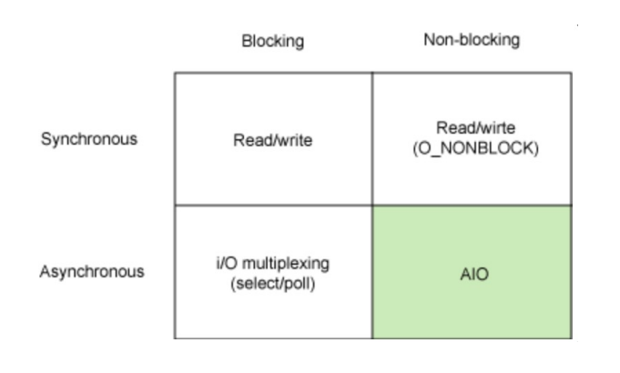
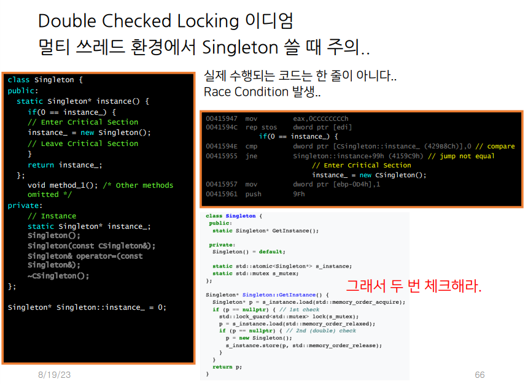
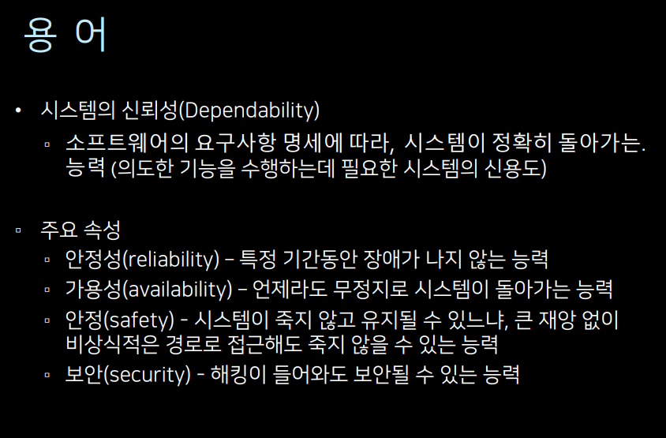
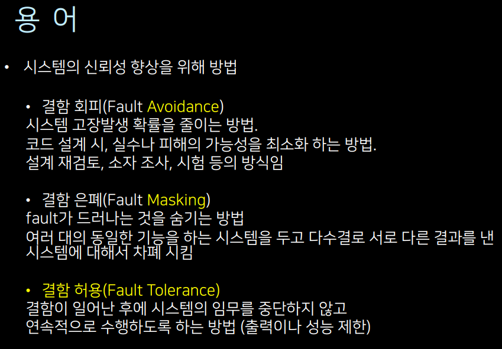
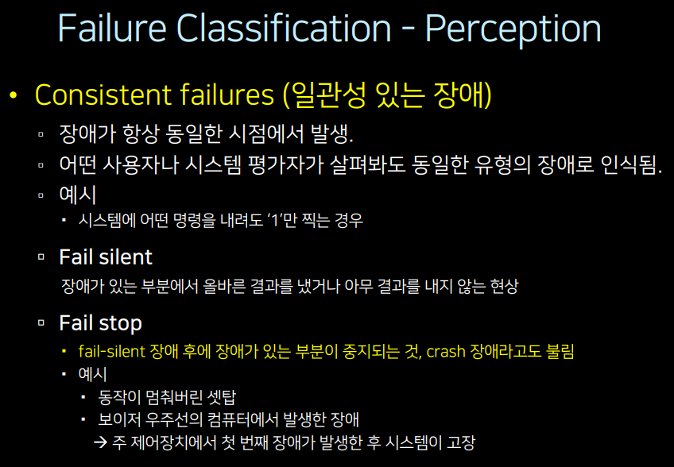
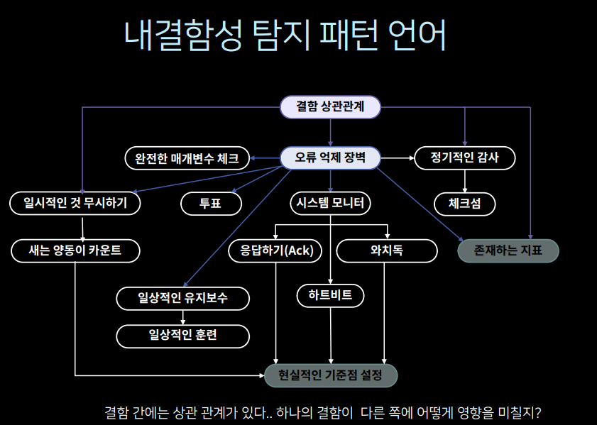
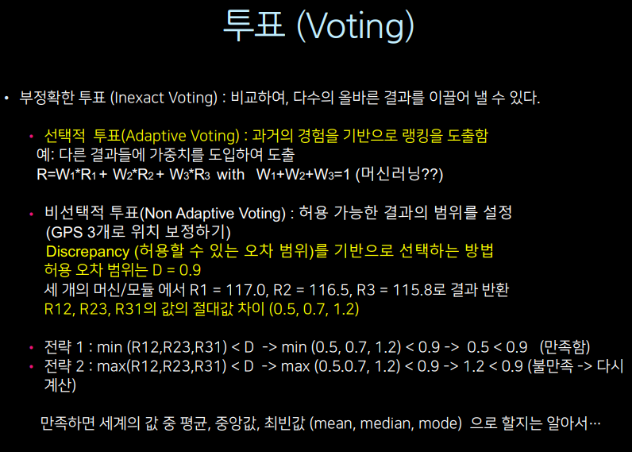
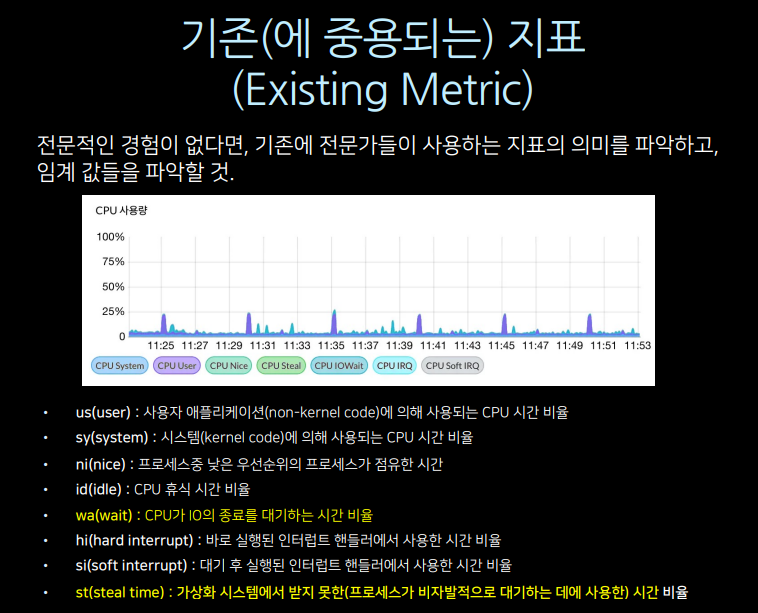

# 소프트웨어 아키텍처 설계_2일차

- 어제 복습
- lambda 
- kappa - lambda의 문제점 (과거 데이터가 추후에 들어올 경우 재조립 필요)
- geo hash - uniform grids(트래픽 상관없이 hash크기 동일) -> quad-tree (트래픽 많은곳 촘촘하게)

- layer 패턴 - 각 하위 레이어만 접근 가능 (복잡한 시스템이 될수록 하나의 소스 변경시 다른 소스에 영향 끼치는 부분을 최대한 완충, 다만 각 단계를 만들어야하므로 불필요한 시간 소요 + 자원 낭비)
- pipe filter (7layer 인터넷 생각하면 될듯)
- broker - apache thrift 예시 (자바 <-> 파이썬 과 같이 두 가지 플랫폼(언어) 데이터 연결에 있어 각 언어 호환되는 함수 생성 및 호출 하여 연결해줌) - 
  - android IDC 예시 (자바 코틀린, 앱과 앱과의 연결 등 + 중앙 통제소의 역할도 겸함(특정 앱의 cpu나 메모리 사용이 크면 통제할지 여부 등))
  - IDL(독립적인 인터페이스 랭귀지 필요), 데이터 마샬링/언마샬링 고려 (언어의 차이에 의한)
- master-slave - 대표적으로 db 레플리카셋 (기본적으로 쓰기-읽기 관계, 상황에 따라 특정지역-일부지역 이렇게 나눠서 쓰기도하는 등 다양하게 구축, 병렬처리)
- client-dispatcher
- pub-sub (publisher-subscriber) - 옵저버 패턴의 일종. 구독자가 구독을 하면 퍼블리셔가 해당 구독관련 내용의 데이터 변경이 일어났을 때, 구독자에게 내용 전달 
  - 대표적인 예시 - master-slave db간 데이터 백업 예시 (마스터 변경 후 slave에 전달하여 수정)
- event channel - pub-sub에서 이벤트 기능을 추가하여 좀 더 상세 조건에 따라 구독자에게 발송하도록
  - 현실적인 예시 - 모든 센서의 필터링 후 처리할 때, 우선순위 큐 등을 통해 이벤트 처리하도록 구축 가능 (자동차 자율주행 중 급브레이크 시스템 - 우선순위로 두도록)
- mvc
- pac - 화면 자체를 컨텐츠(컨텍스트)에 따라 UI를 바꿔서 보여주도록 (ppt) - 내용에 따라 메뉴가 바뀜
- command processor - gof의 command 패턴의 구체화. stack에 대한 부분을 추가, 윈도우 ctrl z와 같이 명령을 내렸을 때, 명령에 대한 부분을 스택에 저장해 두어서 되돌리기 등 내용 실행
- view handler - 안드로이드 프레그먼트, ios 뷰 등
- reflection - 런타임시에 특정 함수, 클래스를 생성할 수 있도록 함
  - 시스템 변경이 쉽다
  - 메타 레벨 수정이 잘못되면 손상, 늦은 속도문제 (런타임이므로) -> BCI를 선호함

- BCI - 소스코드 컴파일 단계에서 bytecode 자체에 내가 원하는 클래스나 함수, 기능 등을 추가하여 컴파일을 진행함 -> 성능이 빠름, ASM에서 지원하므로 편하게 사용 가능
  - apk = zip 파일 열어보면 dex -> dex.jar -> jar 리버싱 -> 소스코드 리버싱 가능(변조의 가능성 존재) -> 다만 소스를 보기 어렵게 하기 위해 난독화 - proguard, dexguard 
  - 금융권, 정부의 경우 변조 앱인지 확인을 하고(hashid) 서비스를 실행하도록 함 appiron

- blackboard - chain-of-responsibility 와 유사 
  - 문제 -> 해결1(가능한 가장 많은 문제를 해결 할 수 있도록) -> 해결2 -> 해결3 -> 해결4(해결 못할 경우 알림, 메세지 등 사용자에게 알리는 기능이 있으면 좋음) (앞단에서 해결하면 거기서 끝, 안되면 뒤로 옴)
- gof 알아야 할 부분(접착제) - 기본은 strategy를 기반으로 모든 패턴이 생성 - 하나의 문제에 대해 a, b 답을 상황에 따라 시행함 
  - bridge
  - decorate - 아이스크림 + 콘에 딸기시럽, 초코시럽을 추가한 것 같이 기본 뼈대에서 약간의 변경만 이루어 졌을 때
  - create - 실제 생성 관련 내용이 있을 때
- counted pointer - prototype 패턴 (이미 있는 a 객체를 메모리 카피하여 b 객체를 만듬, 아무 정보 없이 객체 생성은 리소스가 크게 드므로 -> 단순 a객체만 복사(shallow copy)하면 참조대상이 없어졌을 경우 레퍼런스 에러 발생할 수 있음 -> 레퍼런스 대상까지 복사해라(deep copy)) 
  - 나를 참조해서 사용하고 있는 객체(호출/사용)가 있는지 카운트하고 0이 될 경우 소멸

## POSA 2

- doublas C. schmidt
- 기본은 로봇 원격 조종 설계 + 통신 패턴 설계에 대한 이유를 설명한 책
- ACE/TAO 라이브러리? -> Boost.Io
- OS <-> 네트워크를 저수준에서도 개발하기 위한 지식을 얻을 수 있음 (os와 네트워크 사이에 연결고리를 설명하고 있음) 
- 고성능 소켓 통신 프레임워크(스프링 등)의 뼈대가 된 책 
- 번역이 어려움 - 너무 글을 어렵게 써서..

#### POSA2 패턴의 4대 카테고리

- 서비스 접근 및 설정/제어 - 개념만 간단히
- 이벤트 핸들러 (실습대상, 중요 핵심) - 운영체제와 네트워크 간의 이해 (Reactor, Proactor)
- 동시성 제어 (중요) - Active object, monitor object, leader/follower, thread-specific storage
- 동기화

### posa2 패턴의 동기

- real-time 통신에 대한 필요성으로 등장
- real-time - 실시간 통신(굉장히 높은 응답율)이 아님 -> 주어진 deadline 안에 응답하는 시스템
  - a문제를 해결할 때 5초 안에 해결해달라고 요청이 오면 real-time 은 5초 안에 해결할 수 있는 응답
  - 즉 설계자는 시간에 따라 응답할 수 있도록 다양한 선택지를 만들어야 함(30초, 20초, 10초)

### 서비스 접근 및 설정 제어

- wrapper facade - 운영 체제 별로 맞춰서 캡슐화 (껍데기로 싸다)
- component configurator - DI(dependency injection) container, Ioc - 런타임시에 특정 컴포넌트를 올렸다 내렸다 등 - 스프링 시작도 DI container로 시작
- interceptor - 특정 메세지, 내용에 대해 가로채서 추가 기능 제공
  - template method 패턴 - interface 대신 abstract class 사용. 부모 클래스에서 이미 doXX 와 같이 클래스에 대한 흐름을 결정함 do (child a(); child b(); child c();) 
    - Inversion of Control - 자식이 부모를 호출하는게 일반적인데, 부모가 자식을 지정해놓고 호출하는 케이스
    - 안드로이드의 경우 최상위 액티비티 -> 로그인액티비티 등 특정 기능별로 오버라이딩 하여 내 실제 기능 구현
    - 최근의 대부분 프레임워크는 template method 패턴으로 진행
    - 안드로이드 manifest 제어
  - 일반적인 패턴 - class -> interface -> implement 
  - 라이브러리 - 내가 호출하고 싶은 흐름을 제어 가능함
  - 프레임워크 - 이미 흐름은 짜여져 있고 수정하고자 하는 기능을 찾아 오버라이딩 하여 수정
  - 안드로이드 intent filter 로 앱 사용 중 전화오거나 했을 때 앞에 화면 뜨는 등 특정 기능 제공 (설정 파일 등)
  - TM -> 프레임워크의 뼈대가 되는 패턴 -> TM 특성상 흐름을 내가 결정할 수 없기 때문에(이미 부모클래스에서 결정됨, 나는 상속받아 사용만 가능), 중간에 특정 조건에 따른 특정 기능이 필요할 때 기능을 넣기 위해 interceptor 등장
- extension interface - I unknown - 만든 객체의 어떠한 메소드와 어떤 인터페이스, 클래스가 있는지 확인하기 위해

### 이벤트 핸들러 (디스패쳐 패턴)

### 들어가기 앞서

- sync/async
- blocking/non-blocking
- reactor(epoll)/proactor(i/o notification)
- 모든 프레임워크는 위의 특성을 골라서 가지고 있음 (각각 하나씩)
- 스프링 - sync, blocking, reactor - 성능이 안좋음
- webflux - 비동기, 논블럭킹, 프로액터
- 
- 동기 - 전화기, 순서대로 들어온대로 처리, 먼저 들어온 것 끝내면 다음 것 처리 .. 순서 
- 비동기 - 커피숍 주문시 부저(콜백), 순서대로 호출은 하지만 처리 종료는 보장 X, 처리 종료시 콜백으로 알려서 처리해야함
- 블락킹 - 커널과 유저레벨(어플리케이션) 커널의 io 작업이 진행 중일 때 (이미지 호출, 데이터 쓰기 등) io 결과물을 받을 때 까지 어플리케이션이 wait 상태가 됨 (다른 일을 못함)
  - cpu - system, user, io wait
- 넌블락킹 - io 작업 중일 때 cpu wait로 놔두지 않고 어플리케이션 내 다른 작업 하도록 배정
  - 리눅스 - epoll(advenced poll) 을 통해 주기적으로 io 완료 여부 확인 
  - 윈도우 - io 작업이 완료되면 콜백으로 응답 (+ 추가 기술로 리눅스 보다 2 ~ 4배 빠름)
    - iocp - 선언 시점에 유저 레벨이 아닌 커널 레벨에 메모리 할당 + 유저 레벨에서 해당 커널 레벨 메모리 접근하여 결과를 조회하므로 메모리 이중복사를 할 필요 없어짐
    - rio - 메모리 락, 언락 작업을 줄이기 위해 선언시 실제 커널 내 고정 메모리를 할당 (2기가 쓰겠다고 하면 2기가 다른 곳에서 할당 못하게 고정, 해당 작업만 계속 시킴)
  - epoll vs iocp
  - iocp vs rio - 메모리 락, 언락, 시스템콜, 컨텍스 스위치가 줄어들어 성능 1.5배 이상 빨라짐
- node.js 나 redis 가 event loop가 있는 이유 - 리눅스가 epoll 방식이기 때문에 io 종료 확인을 위한 event loop 만듬

- 넌블락킹 + 비동기가 성능은 제일 빠르나 코드가 너무 복잡해짐
- techempower
  - json serialization - json 생성 속도
  - single query - 네트워크에서 쿼리 읽고 받아올 때 까지 성능
  - multiple queries - 여러 쿼리
  - 동기, 비동기에 따른 성능차이 확인 가능 (nodeJs, spring, asp)
- 비동기에 넌블락킹 라이브러리를 써야하는 이유

#### Reactor 패턴

- Dispatcher 문서 - 요청에 대한 배분
  - 과거 프로토콜 방식 - 헤더|데이터|데이터
  - 디스패쳐 - 헤더를 읽어 각 프로토콜로 보냄
  - 일일히 헤더를 소스 단계에서 지정해서 처리하는건 매우 비효율적 (추가될 때 마다 소스에도 계속 추가해야함) - 예시 switch 문으로 계속 case 넣어야함
- HandleMap 을 통한 핸들러 추가 Key(Header)-Value(class)
  - 어떤 헤더에 어떤 핸들러를 붙일지 handlemap(xml 등) 에서 정의
- demultiplexer - 어떠한 헤더가 어떠한 핸들러와 연결할지 정의된 파일 (XML)
- handlemap - 실제 핸들러를 런타임에서 올려놓음
- handlerList.xml - 핸들러를 파일화 하여 바로 읽게끔 변환

- 처음에는 일일히 헤더 소스에서 지정 -> registhandler를 클래스로 구현(재사용은 가능하나 매번 추가될 때마다 추가 핸들러 생성 코드는 추가해야하므로 번거로움) -> xml파일 화 하여 파싱을해서 실시간으로 읽을 수 있게 변경 (이러면 이제 핸들러 생성 클래스는 한번만 호출해도 xml 리스트 읽어서 for문으로 자동 추가됨)
- 런타임시에 핸들러 변경(추가, 제거)을 용이하게 하기 위해서 등장한 개념 (위의 내용을 읽어보면 왜 등장했는지 알 수 있음)

#### reactor-thread 

- 단일 요청에 대한 단일 리턴이 아닌 스레드를 통한 여러개의 요청 처리
- 요청이 생길 때마다 스레드 하나씩 만들기 예제 소스
  - 여러 요청은 해결 됐지만 요청이 올 때 마다 스레드가 무한 증식함
- thread pool - 스레드 수를 지정해서 미리 만들어 두고 해당 스레드에 배정해서 처리하게 끔 하거나, java NIO(세팅해둔 갯수만큼 스레드를 자동으로 만들어주고 관리 해줌)

#### proactor 

- iocp를 염두해두고 만든 패턴
- 유저 레벨이 아닌 커널 레벨에서 바로 요청을 진행(io 작업) 이후에 작업이 끝난 부분을 유저에게 전달
- overlapped i/o 지원으로 비동기 및 병렬작업 지원
- io 작업이 필요할 경우 completion port 로 보냄 -> 스레드 생성하여 io 처리 -> 완료 후 completion queue에 넣어둠
- proactor 를 지원하기 위해 언어 별 지원 기능이 존재함 asynd channel (자바) - 전체 과정을 채널처럼 만들어서 캡슐화
- io작업이 필요한 부분을 일단 커널로 바로 보내서 작업을 시킴 -> 작업이 완료되면 콜백을 받아서 진행
- 채널 생성 -> 콜백 핸들러 달아서 보냄 -> 콜백 성공, 실패 처리 로직 작성 -> 성공시 읽기 핸들러를 통해 데이터 읽기 (핸들러로 안하면 여기서 또 io wait 걸리니 비동기로 처리하려면 여기도 핸들러 달아야함)

- reactor, proactor 비교
- 작은 단위에서는 reactor가 살짝 빠르지만 거의 동일
- throughput
- 파일사이즈가 크면 클수록 proactor가 더 처리속도가 좋아짐 (레이턴시)
- io 작업이 많아 질수록 proactor 추천

- go lang (c와 유사) + 채널 콜백
  - go routine (스레드 경량화 2kb 내외, 자바 스레드의 경우 200kb)
  - 병렬 처리, 정렬, 탐색의 경우 go의 스레드 경량화 덕분에 매우 좋은 퍼포먼스를 낼 수 있음

- spring도 nodejs의 비동기로 인해 우위점이 사라져 가자 spring + netty -> webflux = spring reactor 로 발전되어서 비동기 콜백 처리 방법을 추가함 
  - 콜백 구조를 캡슐화 하여 쓰기 사용하기 편하게 만듬
- go routine으로 정렬 등과 같은 속도에서 퍼포먼스가 줄어들자 자바에서도 경량 스레드를 지원하도록 업데이트함 (virtual thread)

#### acceptor(응답)-connector(연결)

- 다양한 프로토콜 지원용 (A프로토콜에 대한 연결, 응답 , B프로토콜에 대한 연결, 응답 각각 만드는 것) 

#### Asynchronous Completion Token

- 비동기 처리시 처리 결과 순서가 보장되지 않으므로 보낸 시간(나노미리급)에 대한 token 을 붙여서 요청함

### 동기화

- double checked locking 문제
- 멀티쓰레드 환경에서 singleton 쓸 때 주의
- 

- 싱글톤 소스에서는 한 줄이지만, 실제 어셈블리 언어에서는 2줄이기 때문에 2줄 사이에 다시 인스턴스 생성 요청이 들어오면 인스턴스 오류가 생겨서 장애 가능성이 높음

- Scokped Locking 이디엄
  - 생성자, 소멸자에 락을 걸고 해제하면 다른 곳에 락을 걸 필요가 없다
- thread-safe interface
  - 공용 인터페이스에만 락을 걸자

- 최근에는 비동기에 넌블럭킹으로 처리하기 때문에 동기화에 대한 처리가 크게 중요하진 않은편

### 동시성 제어

#### half-sync / half-async

- 프린터와 같은 예시
- 안드로이드 asynctask 있었다가 사라진 이유
  - 가벼운 작업에서만 쓰게끔 만들었는데, 개발자들이 무거운 작업에도 사용을 하다보니 아예 없애버림

#### active object

- half-sync / half-async 의 진화형
- 대부분의 플랫폼에 사용됨
- 요청이 들어오면 처리한 다음에 큐에 쌓아놓고 필요할 때 가져가서 씀
  - proactor 와의 비교 - 대부분은 유사하지만 proactor는 커널에 던지고 콜백만 받는거라면 액티브 오브젝트는 
- android looper, handler - 오래걸리는 작업은 mq에 넣기
- nodejs eventloop 
- redis
- netty (webflux)
- IOCP, IRO (윈도우)
  - thread specific storage 패턴 - 기본적으로 메모리에 쌓이면 주기적인 gc를 통해 제거하고 메모리마다 락을 거는 데, 이러한 비효율을 해결하고자 등장한 패턴
    - 스레드가 전용으로 사용할 수 있는 메모리를 제한
    - 메모리를 바둑판처럼 만들어두고 스레드에 필요한 만큼만 고정
    - 고정되어있기 때문에 메모리 락에 대한 문제를 해결
    - 안드로이드에도 run of slots 이 TSS 와 동일 패턴

#### leader/follower

- hikaricp
  - DB 커넥션 툴
  - maximumpoolsize (기본값 10개)
    - 커넥션 풀 내에서 필요에 따라 증가 했다가 watchdog이 풀이 너무 많을 때 갯수를 줄이는 식으로 메모리 관리
  - 스프링 서버 설정시 가장 중요한 것은 DB 풀 사이즈를 어떻게 설정 할지가 중요 - 최소 100이상
  - maxlifetime
    - 한번 만든 db 풀을 계속 쓰면 좋겠지만 계속 쓸수록 해당 스레드가 좀비가 되거나 오류가 생길 가능성이 높아지기 때문에 일정 주기가 지나면 제거해주도록 하는게 좋음 (기본값 30분)
    - 우리 서비스가 주기적으로 오류가 생긴다면 라이프타임을 줄여보는것도 고려
  - 맥시멈풀로 부하테스트 + 라이프타임 확인

- Boss TP - 스레드를 호출하는 대표 스레드
  - 문제점은 보스가 고장나면 회복되기 전까지 모든 스레드에 악영향을 끼침
- 그래서 Boss 쓰레드를 개선하기 위한 방안이 leader/follower
- 리더를 순차적으로 선출
- 요청이 들어옴 -> 리더가 처리 후 뒤로감 -> 리더 바로 뒤에 있는 팔로워가 리더가 됨 -> 해당 행위 반복하면서 라이프타임 + pool 사이즈로 자동 좀비스레드 관리됨

- 셀트리온 성능 테스트 - 커넥션 풀 테스트 조정으로 성능에도 차이가 있음 (30, 50, 100, 200 진행 시 100이 가장 속도가 빨랐음) + db 과부하

### 정리하며

- 반드시 알아둬야 할 패턴

- dispatcher 스타일, proactor, reactor
- leader/follower
- active object
- thread specific storage
- component configurator

- infoq - 기술 컨퍼런스 정보

## Sketch Massive Datasets

- Philippe Flajolet (필리프 프라졸레) - 유일한 수 추정 기법에 대한 연구,  확률론적 자료구조 개념 만듬
  - MAO로 하려면 풀스캔이 필요하지만 loglog 라는 라이브러리를 사용하면 매우 낮은 비용으로 0.003% 오차로 결과를 만들어냄

- 데이터 스케치 (확률론적 데이터 구조)
  - 거대한 데이터를 실제 측정하는게 아닌 스케치 처럼 근사치로 추정하여 표현하는 알고리즘
  - datasketches (apache)
  - Redis에도 최근에 Count-Min, hyper loglog 등 해당 기능 추가 
- 목적 - 빅데이터에서 사용(생긴지 얼마 안된 개념)
  - 네트워크 트래픽 모니터링
  - 데이터 스트림 처리
  - 큰 집합의 교집합 계산
  - 주어진 데이터의 빈도 및 통계 분석 등
- 분류
  - 빈도수 스케치
  - 분위수 및 분포 스케치
  - 카디널리티 스케치 (유일한 수)

- 멤버십 알고리즘 (스케치 조상)
  - 데이터의 존재 유무를 확인 (풀스캔 없이 해결하기 위한 방안을 궁리하다 나온 알고리즘)

### 멤버십 알고리즘

#### bloom filter (존재 여부 체크)

- 데이터가 있냐 없냐를 어떻게 빠르게 응답하기 위해 궁리
- 아이디어 - 같은 동물이라는 것을 어떻게 알 수 있을까?
- 동물의 특성에 따라 hash function을 만들기 (코 길이, 꼬리 길이, 뿔 길이)
- 거대한 데이터를 여러 개의 hash function 으로 실행해서 값을 비교한 뒤, 동일한 값으로 비교 통과 되면 같은 동물로 결과를 낸다

- 단점 - 데이터가 실제론 없지만 있다고 대답하는 경우도 종종 발생 (적은 오차긴 하지만)
  - 필터의 크기를 키우기 - 메모리 소모가 커짐
  - 해시 함수를 키움 - 계산 시간이 길어짐
- 적용 예시 - cassandra db 삽입시 동일 데이터 체크 로직
- cdn 사용시 중복 데이터를 캐시에 담지 않도록 체크 로직
- 브라우저 안에 악성 URL을 필터링할 때
- 세션 관리 (session store) - 존재하는 세션인지 체크 (해시)
- 적용시 고려해야 할 것들
  - 필터에서 없다고 하는 데이터는 실제 없는 것이 맞다
  - 하지만 데이터가 있다고 해서 실제로 데이터가 있을지는 확실치 않다 (false positive)
  - 개선을 위해 필터 크기 늘리거나, 해시 함수를 늘리거나

- [Bloom filter | Docs (redis.io)](https://redis.io/docs/latest/develop/data-types/probabilistic/bloom-filter/)

#### Counting Bloom Filter

- 기본 구조는 블룸 필터와 동일 바이트로 관리
- 각 필터별 카운트

#### Cuckoo 필터

- 아이템 추가 삭제에 효율적으로 제공
- 추방 방식
- 해쉬 결과에 따라 넣을 공간이 없을 경우 기존 데이터 하나를 꺼내서 추방 후 다른 곳에 저장 시킨 뒤, 본인이 삽입
- 단점
  - 거짓 음성 (데이터가 있음에도 없다고 하는 경우 발생)
  - 블룸필터와 같이 버킷을 키울수록 오차율이 줄어듬

### 빈도 수 측정하기

- Top-K, Heavy Hitter 와 같은 데이터를 DB 접근없이 적은 자원으로 추정할 수 있는 방법을 찾아보자

#### Count Min Sketch

- 해쉬 함수 결과물을 2차원 배열에 저장
- 적은 공간으로 효율적인 결과물을 만들어 낼 수 있음 (빈도 수 체크 용이)
- 적은 부하로 빠른 결과물
- Count Min Sketch with Heavy Hitter
  - 우선순위 큐, 해시 맵등을 통해 빈도수 상위권, 정렬 등을 효율적으로 가능하게 함
- CMS + DYADIC 범위를 활용한 Range query
  - 특정 범위나 시계열 데이터를 db 접근없이 추정하는 방안
  - 다이아드 or 이진 인터벌 (dyadic intervals)
  - 이진으로 각 계층으로 모든 CMS를 만듬
  - 굉장히 적은 메모리로 db 풀스캔한 결과와 유사하게 결과를 얻어 낼 수 있다.

### 100분위 분포 추정하기

- 분포를 매기는 것에 대해 빠른 성능을 내기 위해
- mean(산술평균), median(중앙값), mode(최빈값)
- median 을 주로 사용
- inter-quartile range - 사분위수 범위 중간 데이터가 얼마나 퍼져있는지
- 100분위 분포 - 전체적인 분포 확인, 이상치 탐지, 다른 데이터셋과 비교 및 벤치마킹(사용자 경험)

#### 히스토그램 (HDR histogram)

- 오차범위별로 버킷을 먼저 만듬 (1%, 5% 등, 로그 스케일링) -> 해당 범위 내에 있는 데이터를 버킷에 다 집어넣음 -> 특정 분포 % 에 해당하는 버킷에서 아무 값을 꺼내도 오차범위 내의 데이터 이므로 유효한 값으로 인식
- 최소, 최대값 입력 필수
- 카메라 hdr 기능 (0 ~ 255 rgb 값 존재)
- 통계정보 만들때 용이 (db 풀스캔 방지)

- 범위 제한을 알면 hdr histogram 모르면 다른 알고리즘 사용
- 정밀도 (오차범위) 입력 → 오차범위를 입력 받아서 동적으로 미리 버킷을 생성한다
- min, max를 알기 때문에 성능이 좋다
- 상위 버킷, 하위 버킷
- 버킷을 먼저 만들고 추가로 만들지 않기 때문에 확장성이 낮다.
- 단점
  - 과한 버킷팅 (메모리, 공간 오버헤드) - 상대 오차를 작게 할수록 과밀한 버킷이 생성될 가능성이 있음
  - 음수 미지원 (T-Digest 사용해야함)
  - 삽입 속도도 상대적으로 느리다

#### Dyna HIST

- HDR 히스토그램의 메모리 사용을 줄이기 위한 방안
- 특정 값 이상은 기하 급수로 버킷을 크게 만들고 특정 값 범위 내에는 절대값으로 일정한 간격으로 버킷 생성
- HDR 보다 약 44% 버킷 수 감소
- 삽입 속도 및 메모리양은 확실히 감소 다만 조회 속도는 hdr 보단 느림
- 

#### DDSketch (datadog)

- 로그 스케일링으로 버킷 생성 (히스토그램과 동일)
- 로그 범위를 넘어서는 값이 들어오면 새로운 버킷 생성 및 삽입
- 성능?

- T-digest - redis에서 지원

### 유일한 수 측정하기

#### hyperloglog

- 데이터 중에 LZC (leading zero count) 데이터 중에 연속된 0의 개수로 2^LZC로 갯수 추정
- LZC 가 최대 6개라면 2^6 = 64로 판단
- Union 으로 유용한 데이터를 추출 가능하게 됨
- 실제 데이터 크기의 4%미만의 메모리만 사용하여 유일한 수 추정 가능

- 값이 적을 때 오차율이 높다
  - hyperloglog++ (구글에서 보정 버전 추가) - 값이 적을 때 LZC가 아닌 다른 기법을 적용하여 오차율 감소

## Fault Tolerance Pattern

- 결함 허용 시스템
- 결함을 감지해서 복구 해결, 감지해서 작게 만들고 견디거나, 예방하거나
- 고장을 견뎌내는 시스템
  - 다운이 허용될 수 없는 시스템 (은행이나 이커머스)
  - 실시간 프로세스 제어시스템 (좌석 예약시스템)
  - 고장이 인명 손실에 영향을 주는 시스템(자동차, 병원)
  - 년 중 보수작업이 불가능한 시스템 (우주 항해 시스템)
  - 고장이 막대한 경제적 손실을 야기하는 시스템 (원전 시스템)
  - 일본은 아직 장애복구 관련된 대규모 시스템 처리가 미숙한 편 (은행 전산 마비, 도쿄올림픽 카드 결제(현대카드 망 사용), 장인정신이 만든 미묘한 문제점? 한번 만들면 잘 만들어야지)
- 일본사례 
  - 노인 진료 관련 체크하는 앱을 만들 여력이 안됨 -> 라인에서 일일히 사진찍어서 관리 -> 개인정보 이슈 발생 -> MDM 위치정보 제공하는 앱을 핸드폰에 설치해서 간호사 동선으로 관리

- 오류 감지 & 오류 완화
- 오류 감지 & 오류 복구 - 

### Fault tolerant system의 속성

- MTTR - 최초 고장부터 수리(복구) 까지 시간
- MTTF - 최초 수리로 붙터 다시 고장나기까지 시간
- MTBF - 최초 고장으로 부터 다시 고장나기까지 시간
- 안정성
- 가용성 - MTTF / MTTF + MTTR - MTTR이 작을수록 가용성이 좋다
  - 현기차와 렉서스(일본차) 예시 - 현기차 MTTF도 짧지만 MTTR도 작게해서 처리, 일본차 MTTF를 길게 가져감
- 오류 감지 -> 오류 복구 or 완화 -> 결함 치료

- 결함(fault) - 시스템에 존재하는 결점
- 오류(error) - 결점이 쌓여서 올바르지 않는 시스템의 동작
- 장애(failure) - 오류가 쌓여서 시스템 명세서대로 동작하지 않는 시스템의 동작

- 시스템 신뢰성 향상을 위한 방법
  - 결함회피
  - 결함은폐
  - 결함허용 (자동차 운전) - 주황색 - 가능한 빠르게 카센터, 빨간색 - 멈추거나 빠르게 카센터
- 

- 

- 일관성 있는 장애는 비교적 고치기 쉽지만 일관성 없는 장애는 원인 파악이 매우 어려움
- 일관성 없는 장애 Inconsistent failures (= 비잔티움 Byzantine 장애)
  - 비잔티움 장애 - 부하 중 누군가 스파이인지 알지 못할때 서로를 감시하게 하여 활동을 어렵게 함

- 가용성 (클라우드 약 99.95%의 가용성 100~300시간)
- 6시그마 - 99.9999% 고장시간 1분 미만

- 마르코프 모델
  - 시스템 상태 변이를 전이 행렬로 표현

- 성능
  - 과부하 견디는 정도

- 결함성 4단계 반복 - 탐지, 오류복구, 오류완화, 결함처리

### 내결함성 탐지 패턴

- 내결함성 탐지 패턴언어
- 

#### 결함 상관관계

- 여러 개의 오류를 분석해서 실제 활성화된 결함을 식별
- APM 히트맵을 통한 분석
  - 수직선 - db 락이 걸렸다가 풀렸을 때 (대부분의 경우)
  - 초기화로 인한 일시적 병목 - 한정 상품 판매 등 특정 시간에 트래픽이 몰릴 때 (캐시에 임의적으로 미리 데이터를 넣어서 요청을 완화)
  - 수평선 - 외부의 리소스가(서비스) 일괄적으로 늦게 응답할때, 외부 서비스 타임아웃으로 apm에서 정해진 시간 초과 하여 빨간색으로 표시
  - flying

- 이클립스 scouter - 무료 apm 분석 가능
- elastic apm (재판매는 안됨(elastic lotte apm), 모니터링으로 사용만하면 됨)

#### 오류 억제 장벽

- input guard / output guard - 데이터 입력시, 전달시 유효성 및 결함 체크
- fault container
- 에러 완화

#### 매개변수 확인

#### 투표

- 

#### 기존 지표 활용

- 
- steal time - 가상머신에서 물리머신에 cpu 할당 받을 때 까지 걸리는 시간
  - 특정 시간에 우리 steal time 이 올라가면 다른 vm 만들어서 이사 가야함... (다른 vm에서 그만큼 cpu 할당받아서 쓰고 있다는 것)

- 일시적인 것들은 무시하기
  - 여러 번 발생하면 그때 부터 체크하자
- 시스템 모니터링
- 하트비트 - 서비스 살아있는지 주기적으로 확인 (ping, push, pull)
- watchdog - 
- 일상적인 유지보수
  - simian army
  - chaos kong (넷플릭스, 한지역이 장애가 나도 인근 지역에 바로 데이터 이관해서 동작하게끔)

### 오류 복구 패턴

- 로켓페이 - pg사에 결제 요청을 적절히 분산해서 보냄
- 장애 조치 - 이중화, proxysql
- 체크포인트 - 중간중간(주기적으로) 상태정보 등을 저장
  - 스냅샷으로 저장 apache iceberg
- 세이브포인트 - 큰 작업, 중요한 시점 전에 저장

- 재시작, 건너뛰기, 롤백, 재시도 제한
- 크래시 리포트 (에러 핸들러)

### 내결함성 아키텍처 패턴