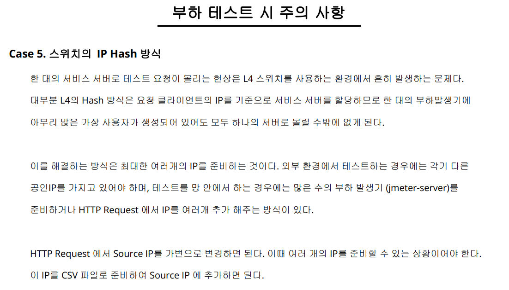

# 소프트웨어 아키텍처 설계 3일차

- bloom filter (데이터의 존재여부)
- mau, dau (유일성 분석) - hyperloglog
- dependency structure matrix (의존관계표현) - DSM


## 어제 이어서 내결함성 시스템

### 

### 부하 완화 패턴 언어

- 과부하 도구 상자
- 지연 가능한 작업
- 확장기반의 자동 제어
  - 동적 부하 처리 
    - lambda function / serverless fuction - 임시적으로 피크상황에서만 리소스 추가하여 처리
- 과부화 결정 평가 - jmeter 등으로 진행
- 공정한 자원 할당 - 자원을 우선 순위에 따라서 할당
- 리소스 할당해 대기시키기 (MQ 예시)

#### 보호 자동 제어

- 부하 억제 - 서킷브레이커
  - 넷플릭스 hystrix dashboard 사례 (스프링 클라우드에 포함)
  - 적절한 임계점을 찾아야함

- 천천히 하기
  - 히스테리시스 (이력현상) - scale out 시 cpu 50% 기준으로 클라우드에서 추가, 제거한다고하면 너무 50%를 기준으로 생기고 사라지면 충격이 발생
  - 약간의 완충을 두어 추가 제거의 충격 방지 (50% 기준이라면 추가는 53%, 제거는 48% 와 같이 어느정도 버퍼)
  - 에어컨 20도 유지할 때 20도를 기준으로 제어하는게 아닌 22도에서 냉각, 18도에서 정지와 같이 완충
- 진행 중인 작업 완료 - 리소스를 낭비하는 프로세스 적극적으로 찾아서 제거하기
  - db 락 제거 
  - 안드로이드 broker 패턴
- 새로운 일부터 하기
- 최종 처리 - 종료시에 프로세스 및 리소스를 완벽히 제거할 수 있도록 추가 기능을 고려


### 결함 처리 패턴

- 잠자는 개 건들지 말기 (긁어 부스럼 만들지 않기) - 멋모르는 오류를 수정하려다 오히려 새로운 오류가 발생할 수 있음

#### 재현가능한 오류 (centry 등을 통해 어디서 죽었는지)

- 회귀테스트로 자동화 (새로운 기능 + 기존 기능의 문제 여부 체크)
- lambdatest - 실제 디바이스 없이 특정 버전의 디바이스를 가상으로 사용하여 테스트 진행 가능
- mtworks - 1개월 5~6시간 무료?
- 사용자 행동 분석 도구 사용 - 장애 발생시 사용자가 어떻게 행동했는지
- uxcam
- 근본 원인 분석
  - 5why
  - 문제 원인 반복 질문을 통해 찾아가기 (실패 스퀀스)
  - 만조 서버 - 서버가 장애난 이유를 찾아보니 만조로 인해 레이더 재밍으로 서버가 먹통이 된것
  - 부산은행 - 광주쪽 지역에 앱 접속이 안됨 -> 원인 보니 kt 망 문제였음
  - 해저케이블을 물어 뜯어서 트래픽을 못 받았던 문제
  - 500마일 이메일 문제 - smtp 서버에 접속 대기시간이 3밀리초 여서 3밀리초 이후에는 발송 접속이 안되어 발송이 안됨 (3밀리초 = 558.8 마일)
  - 은행 문제 - 모바일 앱에서 메뉴를 xml이 아닌 dom으로 호출하여 메모리 낭비 (1m -> 10m)

#### 재통합

- canary 배포 (광산에서 카나리아 사용하듯) - 업데이트 전체 배포 전 일부 배포 하여 기존 버전과 성능 비교 후 성능 결과가 괜찮아야 점진적으로 기존 버전의 서버에도 배포

- 절차 수정하기 메뉴얼(gitbook)


- 작은 패치
  - 패치 내용을 너무 크게 만들지 말고 간단하게 빠른 패치, 변경 크기 줄이기


## POSA


### 분석

#### 정적 분석 도구

- sonarqube 오픈소스 설치형 - 코드 결함 분석
- pmd - 정적분석 도구
- klocwork


### 아키텍처 비주얼라이제이션

- 다양한 지표
- 
- Instability/Abstractness Graph - 특정 코드에 대한 움직임, 추상화
  - 측정 도구 - ndepend, jarchitect
  - instability - 특정 패키지의 움직일 수 있는 여력을 판단하는 지표 (내가 얼마나 많이 사용되고 있는지)
  - abstractness - 해당 패키지에 클래스를 얼마나 참조하고 있는지
    - 많이 사용하고 있으면 낮은 점수 -> 인터페이스를 달아서 호출하게 끔하여 충격 흡수하게 변경 필요
- DSM
- LOC (size of component) - 코드의 양
- cyclomatic complexity - if 문과 같은 분기문의 갯수
- WMC (weighted method per class) - 전체 클래스의 분기문의 수 (클래스 내 메서드 분기문의 갯수 총합과 유사)
- tangled - 역참조 개수 / 전체 참조 개수
- component dependency (CD, CCD, ACD) - 컴포넌트 참조 갯수 ccd(총합), acd(평균 비율)
- LCOM - 응집력 부족 지표
  - 클래스 간 사용하는 필드가 많이 겹칠수록 (교집합) 응집력이 높다
- DIT (자식의 갯수?)
- NOC (부모의 갯수)
- RPC - 클래스와 연관된 생성자, 메소드의 갯수
- stan4j


- 
- 상호 참조가 많은곳을 줄이자
- 패키징 되어있지않음 (패키지) - 한눈에 알아보기 어려움
- 
- 큰 패키지 -> 기능별 서브패키지 -> 기능


- jmeter 
- thread - 사용자
- sampler - 보낼 프로토콜
- listener - 응답 받았을때

- timer - 실제 사용자가 몇초 뒤에 누를 것이기 때문에 실제 사용자처럼 딜레이 추가

- 테스트 케이스 시나리오 처럼 진행


### 웹 화면 랜더링 최적화

- html -> dom tree (메모리에서 변환)
- layout 뼈대를 잡아줄 때는 cpu가 함, 색칠 및 기타 꾸미는 부분은 gpu가 함
- reflow가 안나게 (렌더 트리 재구성) 만드는게 최선
- 60fps = 16ms 안에 1프레임을 그리도록 권고
- 크롬은 빨리 그려주는 대신 (병렬처리) 자원을 많이 소모한다


- 브라우저 기준의 성능 측정
- DomcontentLoadedEventStart
- loadEventStart
- 브라우저, 모니터링 도구마다 표현은 다르지만 기본 틀은 같다 
- 


- 웹 성능 개선
- 빠르게 사용가능하게 + 빠른 반응, 동작
- 체감성능 향상 (일단 껍데기라도 보여주고)
- 로딩 성능 + 렌더링 성능
- 측정 - 크롬 개발자도구 (fp, fcp, lcp, dcl)
- 하나의 이미지를 통으로 받아서 실제 표현시에는 짤라서 표현하도록 하기도함
- png -> chrome,AOS(webP), ios(pngquant)


- 어떤걸 고치면 좋을지를 알 수 있는 지표 (구글 개발자 도구)
  - LCP - 빠른로딩
  - FID - 빠른상호작용
  - CLS - 시각적인 안정성
  - 크롬안에 지표 확인을 위한 도구가 있음 (light house)
    - FCP - 첫 번째 컨텐츠가 보여지는 시점 (일부라도)
    - SI (speed index) 최근에는 spa가 많아서 유용한 지표로 쓰진 않음 참고정도
    - TTI - 상호작용이 안정적으로 응답 가능한 시간
    - LCP - 가장 큰 화면이 그려지는 시간
    - TGT - FCP ~ TTI 까지의 시간
    - TBT 
    - CLS - 레이아웃이 움직이는 거리를 계산 (내가 취소 버튼눌렀는데 결제버튼이 눌러지는 경우)
  - 바니쉬? nginx 나


- 특허청 특실좌석 웹페이지 느린 이유 (실제 사례)
  - 넥사크로가 무겁고 db 제한된 연결
  - js만 받는데 (넥사 라이브러리) 1초 걸림 + 매번 요청마다 다운로드 받음
  - 한 화면에 하나의 스타일시트가 아닌 각각 컴포넌트 별로 스타일시트가 적용되고 있었다. (레이아웃 시프트)
  - 개선 - 넥사크로 라이브러리 캐시적용
  - 응답시 라이브러리를 여러번 요청함
  - db서버연결 풀 (10 -> 30)
  - DLC 시간 단축 - 파일 서버 캐시
  - 스타일시트 합쳐서 적용(공통 스타일)
  - 위젯이 위젯을 부르는 구조 개선 (병렬적으로)
  - 헤비 유저의 사용 패턴 후 개선


- 평가
- 네트워크 스위치 - 로드밸런서
- 관리 편의성
- spof -하나
- cqrs 명령과 조회
- Steal Time (st)
- Lambda
- cyclomatic complexility (분기문)
- instability / abstractness
- sampler - 네트워크 통신 컴포넌트
- active object - 실행 요청 분리하는 패턴


#### APM

- tps, 사용자
- 1000명이 들어왔을때 200tps = 5초당 1번
  - 사용자보다 tps 빈도가 더 중요함
  - 메모리 4gb 맥스 (garbage collector 가 4기가 이상일경우 이상하게 작동하는 경우가 많음)
  - 평균시간 * 빈도수 -> 가장 많은 시간을 차지하는 쿼리를 튜닝하는게 좋음
  - slow query 만을 잡는게 능사가 아님
    - 3초 * 10000 = 30000
    - 20초 * 100 = 2000 
    - 위의 3초짜리를 튜닝해야함
  - 히트맵을 파악해서 오류가 나는 부분 시간이 느려지는 부분 확인
- jmeter 부하 -> apm 을 통해 병목 구간, 고쳐야할 부분 개선점을 리포트로 제시 -> 해결 방안 


## Jmeter 실습

- 성능 테스트 개요

- jmeter 기본 실습

  - 구조 학습
  - api 요청 보내기
  - csv 활용하기
  - json 결과 파싱하기

- 기본 실습과제 (20분)

- jmeter 응용 실습

  - assertion

    - 시스템 상 4xx 에러 지만 클라이언트 문제로 200으로 처리하거나 데이터 조회시 0건이라 사실상 에러와 같은 예외 상황의 경우
    - jmeter 내 실패로 표기하기 위해 예외조건을 넣어둠

  - css or xpath selector

    - rest api 가 아닌 다른 방식으로 데이터를 끌어와야 할 경우가 생길 때

  - bean shell

    - base64 등 비밀번호 암호화가 필요한 경우

    - ```java
      import org.apache.commons.codec.binary.Base64;
      
      String emailIs= vars.get("session"); //vars - jemter에서 변수 모두를 가진 객체
      
      byte[] encryptedUid = Base64.encodeBase64(emailIs.getBytes()); // 암호화
      vars.put("genStringValue",new String(encryptedUid)); // 저장
      
      ```

    - 

  - logic controller

  - 

- 


#content > div.article > div.section2 > div.section_stock_market > div.section_stock > div.kospi_area.group_quot.quot_opn > div.heading_area > a > span > span.num


- 성능 테스트 
  - 하드웨어 성능
  - 소프트웨어 성능
  - 아키텍처 
  - 장애 대응/회복 - (복구시간 목표) + 설차적인 영역
- 성능 테스트의 종류
- 성능 테스트 순서
  - 계획 - 목표, 시나리오 및 성공 기술을 정의, 현실적인 테스트 시나리오 + 테스트 환경 및 리소스 (운영과 테스트 간의 차이, 운영에서 한다면 어떻게 할지, 유관 부서 통보 등등) 파악
  - 설계 - 성능 메트릭을 포함한 테스트 계획을 설계
  - 수행
  - 분석
  - 리포트
- 성능 테스트 도구


- postman


- 변수 지정 - ${변수명}
- 변수 루프 없애기 - eof 도달시 재순환 읽기 x, eof 도달시 읽기 중단 o
- 로그인 시 받는 토큰 (세션, 쿠키) 를 파싱해야함 (그래야 정상적인 post 요청이 가능해짐)
  - 사후추출기 -> json 추출기
  - $.documents[0].url - 루트의 document 0번째


- logic controller
  - 홈페이지
  - 로그인 
  - 회원가입 (한번만)
  - 메인 전시 상품 중 5개에서 하나를 선택 접속
  - 30% 장바구니에 담는다.
  - 50% 사용자가 다시 쇼핑
  - 1,2,3,4,5 상품을 랜덤으로 접속
  - 10% 사용자가 구매를 한다
- 처리량 컨트롤러 (처리 수준) - 사용 권장
  - if 컨트롤러는 리소스를 많이 먹어서 전체 시나리오에서 최대 1~2개 사용 권장


- 상수 타이머 (사용자가 실제 화면 or 다른 선택을 하기까지 평균 몇초정도 머무는지에 대한 전역 시간 설정)


- 플러그인 설치 (jmeter-plugin)
- 3 basic graphs
- stepping thread group


- 마사회 사례 (실제 사례)
  - 주요 장애 수직선 (위에 적음)
  - 초기화 병목, 수평선, 제


- 


tailscale?


- 자바 4기가 메모리


- 
- 과부하 다수의 서버가 필요할 때, 클라우드를 통해 여러대 서버로 진행
- jmeter client에 각 서버별로 저장된 데이터 확인 (백엔드 리스너)


[성능 부하 테스트 - Basic - Google Slides](https://docs.google.com/presentation/d/1BbsL54MPbO3bmtnyxQPKFW2EcScyaVjPhOZG8pZPRI8/edit#slide=id.ga9dee7eae9_1_956)

[성능 부하 테스트 - Advanced - Google Slides](https://docs.google.com/presentation/d/1YhP-WHJIFHCsP1w5E59AUoT0Z12SuyLYwsuSR6Os7dk/edit#slide=id.gac27bf14b2_0_30)

[was api 서버 차이 - Google 검색](https://www.google.com/search?q=was+api+서버+차이&oq=was+api&gs_lcrp=EgZjaHJvbWUqBwgBEAAYgAQyBggAEEUYOTIHCAEQABiABDIHCAIQABiABDIGCAMQABgeMggIBBAAGAgYHjIICAUQABgIGB4yCggGEAAYgAQYogQyCggHEAAYgAQYogQyCggIEAAYgAQYogTSAQg0NzU3ajBqMagCALACAA&sourceid=chrome&ie=UTF-8)

- [ttl time to live - 검색 (bing.com)](https://www.bing.com/search?q=ttl+time+to+live&qs=SS&pq=ttl+time&sc=10-8&cvid=D7E8FA68EFEC4601992513E31A28CD2B&FORM=QBRE&sp=1&ghc=1&lq=0)

- [ByteByteGo | Technical Interview Prep](https://bytebytego.com/pricing)
- [Lambda vs kappa 비교 - 검색 (bing.com)](https://www.bing.com/search?q=Lambda+vs+kappa+비교&qs=n&form=QBRE&sp=-1&ghc=1&lq=0&pq=lambda+vs+kappa+빅&sc=11-17&sk=&cvid=05072275857D4CA8A807BF0F7A778F6D&ghsh=0&ghacc=0&ghpl=)
- [lambda kappa 비교 - Google 검색](https://www.google.com/search?q=lambda+kappa+비교&sca_esv=dad2937f84c7a69c&sca_upv=1&source=hp&ei=Zs5vZqbwMrrL2roPtd2s-AQ&iflsig=AL9hbdgAAAAAZm_cdmh1QMYcyGFPE54reoyhD_DMnYVb&udm=&ved=0ahUKEwimu8K5-OGGAxW6pVYBHbUuC08Q4dUDCA8&uact=5&oq=lambda+kappa+비교&gs_lp=Egdnd3Mtd2l6IhNsYW1iZGEga2FwcGEg67mE6rWQMggQABiABBiiBDIIEAAYgAQYogQyCBAAGIAEGKIEMggQABiABBiiBEjVSVAAWJBIcAR4AJABAZgB5QGgAaYTqgEGMS4xOC4xuAEDyAEA-AEBmAIVoAL4EKgCCsICDRAuGIAEGNEDGMcBGArCAhEQLhiABBixAxjRAxiDARjHAcICCxAAGIAEGLEDGIMBwgILEC4YgAQYsQMYgwHCAgoQABgDGOoCGI8BwgIKEC4YAxjqAhiPAcICCBAAGIAEGLEDwgIEEAAYA8ICBRAuGIAEwgIOEC4YgAQYsQMY0QMYxwHCAgUQABiABMICCxAuGIAEGNEDGMcBwgIHEAAYgAQYCsICBBAAGB7CAgYQABgIGB7CAgUQIRigAZgDApIHBjQuMTYuMaAH9YEB&sclient=gws-wiz#ip=1)

- [람다 아키텍처 - 위키원 (wiki1.kr)](http://wiki1.kr/index.php?title=람다_아키텍처&mobileaction=toggle_view_desktop)


- [webtob 캐시 - Google 검색](https://www.google.com/search?q=webtob+캐시&sca_esv=518dda140f0233a9&sca_upv=1&ei=akJyZurEGM3m2roP5J21qAM&ved=0ahUKEwjqobCvz-aGAxVNs1YBHeRODTUQ4dUDCBA&uact=5&oq=webtob+캐시&gs_lp=Egxnd3Mtd2l6LXNlcnAiDXdlYnRvYiDsupDsi5wyBRAAGIAEMgUQABiABDIKEAAYgAQYQxiKBTIGEAAYCBgeMggQABiABBiiBDIIEAAYgAQYogRI8E9Qny1Yik1wBXgBkAEBmAHzAaABqAyqAQYwLjExLjG4AQPIAQD4AQGYAg6gAvwJqAIUwgIKEAAYsAMY1gQYR8ICBBAAGAPCAgsQABiABBixAxiDAcICERAuGIAEGLEDGNEDGIMBGMcBwgIIEAAYgAQYsQPCAh0QABiABBi0AhjUAxjlAhi3AxiKBRjqAhiKA9gBAcICEBAAGAMYtAIY6gIYjwHYAQLCAgsQLhiABBixAxiDAcICERAuGIAEGLEDGIMBGMcBGK8BmAMIiAYBkAYKugYECAEYB7oGBggCEAEYCpIHBTUuOC4xoAe4Sw&sclient=gws-wiz-serp)

- [캐시 nginx 반 - Google 검색](https://www.google.com/search?q=캐시+nginx+반&sca_esv=518dda140f0233a9&sca_upv=1&ei=Y0JyZq_IGMri2roPmIOESA&ved=0ahUKEwjvhYWsz-aGAxVKsVYBHZgBAQkQ4dUDCBA&uact=5&oq=캐시+nginx+반&gs_lp=Egxnd3Mtd2l6LXNlcnAiEOy6kOyLnCBuZ2lueCDrsJgyBRAhGKABMgUQIRigATIFECEYoAEyBRAhGKABSJ4bUMoBWJUUcAN4AZABAJgBgAKgAdMHqgEFMC41LjG4AQPIAQD4AQGYAgigAuAGwgIKEAAYsAMY1gQYR8ICBhAAGAgYHsICCRAhGKABGAoYKsICBxAhGKABGAqYAwCIBgGQBgqSBwUzLjQuMaAHtRk&sclient=gws-wiz-serp)
- [Varnish 이야기 (naver.com)](https://d2.naver.com/helloworld/352076)


- [아키텍처 공부 - Google 검색](https://www.google.com/search?q=아키텍처+공부&oq=아키텍처+공부&gs_lcrp=EgZjaHJvbWUyCQgAEEUYORiABDIKCAEQABiABBiiBDIKCAIQABiiBBiJBTIKCAMQABiABBiiBDIKCAQQABiABBiiBDIICAUQABgFGB4yCAgGEAAYBRge0gEINDI5MmowajGoAgCwAgE&sourceid=chrome&ie=UTF-8)
- [architecture101.blog](https://architecture101.blog/2012/05/15/uncle_bob_graph/)
- Instability/Abstractness
- [component configurator - Google 검색](https://www.google.com/search?q=component+configurator&oq=component+configurator&gs_lcrp=EgZjaHJvbWUyBggAEEUYOTIGCAEQABgeMgoIAhAAGIAEGKIEMgoIAxAAGIAEGKIEMgoIBBAAGIAEGKIEMgoIBRAAGIAEGKIEMggIBhAAGAUYHjIICAcQABgFGB4yCAgIEAAYBRge0gEHODYwajBqMagCALACAA&sourceid=chrome&ie=UTF-8#ip=1)

- [spring reactor 비동기 - Google 검색](https://www.google.com/search?q=spring+reactor+비동기&oq=spring+reactor+비동기&gs_lcrp=EgZjaHJvbWUyBggAEEUYOTIKCAEQABiABBiiBDIKCAIQABiABBiiBDIKCAMQABiABBiiBDIKCAQQABiABBiiBNIBCDI1OTBqMGoxqAIAsAIA&sourceid=chrome&ie=UTF-8)
- [스레드 경량화 - Google 검색](https://www.google.com/search?q=스레드+경량화&oq=스레드+경량화&gs_lcrp=EgZjaHJvbWUyBggAEEUYOTIKCAEQABiABBiiBDIKCAIQABiiBBiJBTIKCAMQABiABBiiBDIKCAQQABiABBiiBDIKCAUQABiABBiiBNIBCDI1MzdqMGoxqAIAsAIA&sourceid=chrome&ie=UTF-8)
- [HikariCP란? (tistory.com)](https://escapefromcoding.tistory.com/712)
- [virtual thread 자바 - Google 검색](https://www.google.com/search?q=virtual+thread+자바&oq=virtual+thread+자바&gs_lcrp=EgZjaHJvbWUyBggAEEUYOTIICAEQABgIGB4yCggCEAAYgAQYogQyCggDEAAYgAQYogQyCggEEAAYgAQYogQyCggFEAAYgAQYogTSAQg2MTIzajFqMagCALACAA&sourceid=chrome&ie=UTF-8)

- [nodejs의 내부 동작 원리 (libuv, 이벤트루프, 워커쓰레드, 비동기) (tistory.com)](https://sjh836.tistory.com/149)

- [nodejs event loop 리눅스 - Google 검색](https://www.google.com/search?q=nodejs+event+loop+리눅스&oq=nodejs+event+loop+리눅스&gs_lcrp=EgZjaHJvbWUyBggAEEUYOTIKCAEQABiABBiiBDIKCAIQABiABBiiBDIKCAMQABiABBiiBNIBCDg4OThqMGoxqAIAsAIA&sourceid=chrome&ie=UTF-8)
- [json serialization 성능 - Google 검색](https://www.google.com/search?q=json+serialization+성능&sca_esv=f036cc10b1c75f60&sca_upv=1&ei=I-5wZvC6Eovq1e8Px6e20AE&ved=0ahUKEwiw2MjtiuSGAxULdfUHHceTDRoQ4dUDCBA&uact=5&oq=json+serialization+성능&gs_lp=Egxnd3Mtd2l6LXNlcnAiGWpzb24gc2VyaWFsaXphdGlvbiDshLHriqUyBRAhGKABMgUQIRigAUjuD1DLAljzDnACeAGQAQCYAaABoAHtCKoBAzAuOLgBA8gBAPgBAZgCB6AC2AXCAgoQABiwAxjWBBhHwgIFEAAYgATCAgQQABgemAMAiAYBkAYKkgcDMi41oAfvHw&sclient=gws-wiz-serp)
- [위고비 - 나무위키 (namu.wiki)](https://namu.wiki/w/위고비)

- [c2유전자 - Google 검색](https://www.google.com/search?q=c2유전자&oq=c2유전자&gs_lcrp=EgZjaHJvbWUyBggAEEUYOTIKCAEQABiABBiiBDIKCAIQABiABBiiBDIKCAMQABiABBiiBDIKCAQQABiABBiiBNIBCDI3OTdqMGoxqAIAsAIA&sourceid=chrome&ie=UTF-8)

- [[Design pattern\] 많이 쓰는 14가지 핵심 GoF 디자인 패턴의 종류 - 한빛출판네트워크 (hanbit.co.kr)](https://m.hanbit.co.kr/channel/category/category_view.html?cms_code=CMS8616098823)
- [bridge decorate create 패턴 - Google 검색](https://www.google.com/search?q=bridge+decorate+create+패턴&sca_esv=b3f599f2fec3adbb&sca_upv=1&ei=ddlwZqOBJrmOvr0P24iUqAQ&ved=0ahUKEwjjj6yR9-OGAxU5h68BHVsEBUUQ4dUDCBA&uact=5&oq=bridge+decorate+create+패턴&gs_lp=Egxnd3Mtd2l6LXNlcnAiHWJyaWRnZSBkZWNvcmF0ZSBjcmVhdGUg7Yyo7YS0MggQABiABBiiBDIIEAAYgAQYogQyCBAAGIAEGKIEMggQABiABBiiBDIIEAAYgAQYogRI601QmC9YokxwB3gBkAEAmAGgAaAB7RGqAQQwLjE3uAEDyAEA-AEBmAIVoAKjD8ICChAAGLADGNYEGEfCAgYQABgIGB7CAgUQIRigAcICBBAhGBXCAgcQIRigARgKwgIJECEYoAEYChgqmAMAiAYBkAYIkgcENy4xNKAHwkE&sclient=gws-wiz-serp)

- [vapache mit bsd 라이센스 - Google 검색](https://www.google.com/search?q=vapache+mit+bsd+라이센스&sca_esv=dad2937f84c7a69c&sca_upv=1&source=hp&ei=Vd1vZpueArPi2roP16uFmAg&iflsig=AL9hbdgAAAAAZm_rZezHJ4ALfQTIWIGccZRE5GWLWfD8&udm=&ved=0ahUKEwjbnIvYhuKGAxUzsVYBHddVAYMQ4dUDCA8&uact=5&oq=vapache+mit+bsd+라이센스&gs_lp=Egdnd3Mtd2l6Ihx2YXBhY2hlIG1pdCBic2Qg65287J207IS87IqkMgcQABiABBgKMgsQABiABBixAxiDATILEAAYgAQYsQMYgwEyCBAAGIAEGLEDMggQABiABBixAzIIEAAYgAQYsQMyCBAAGIAEGLEDMgsQABiABBixAxiDATIHEC4YgAQYCjILEAAYgAQYsQMYgwFI-wdQAFiDB3AAeACQAQCYAZUBoAGVAaoBAzAuMbgBA8gBAPgBAfgBApgCAaACmwGYAwCSBwMwLjGgB6QH&sclient=gws-wiz)


- [RabbitMQ Tutorials | RabbitMQ](https://www.rabbitmq.com/tutorials)

- [[AMQP\][RabbitMQ]RabbitMQ아주 기초적이게 사용하기 - Java(feat.Hello World!) - (2) :: Kamang's IT Blog (tistory.com)](https://kamang-it.tistory.com/entry/AMQPRabbitMQRabbitMQ아주-기초적이게-사용하기-JavafeatHello-World-2)
- [사이드카 프록시로 구현한 서비스 인증 (linecorp.com)](https://engineering.linecorp.com/ko/blog/service-authentication-sidecar-proxy)

- [Bloom filter | Docs (redis.io)](https://redis.io/docs/latest/develop/data-types/probabilistic/bloom-filter/)

- [리액터패턴 / 프로액터패턴 (brunch.co.kr)](https://brunch.co.kr/@myner/42)


- [성능 부하 테스트 - Basic - Google Slides](https://docs.google.com/presentation/d/1BbsL54MPbO3bmtnyxQPKFW2EcScyaVjPhOZG8pZPRI8/edit#slide=id.ga158ae44ee_0_0)