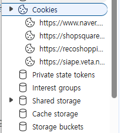
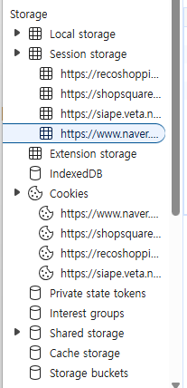
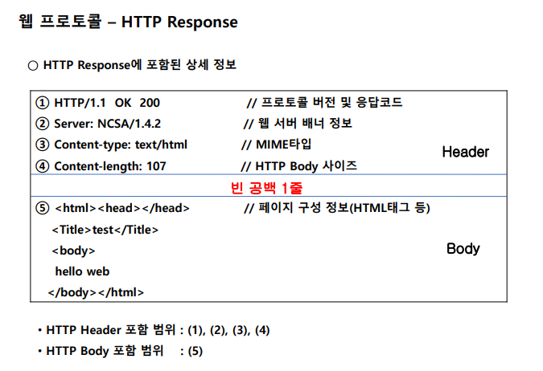
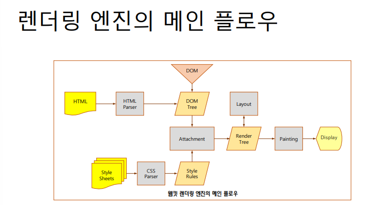
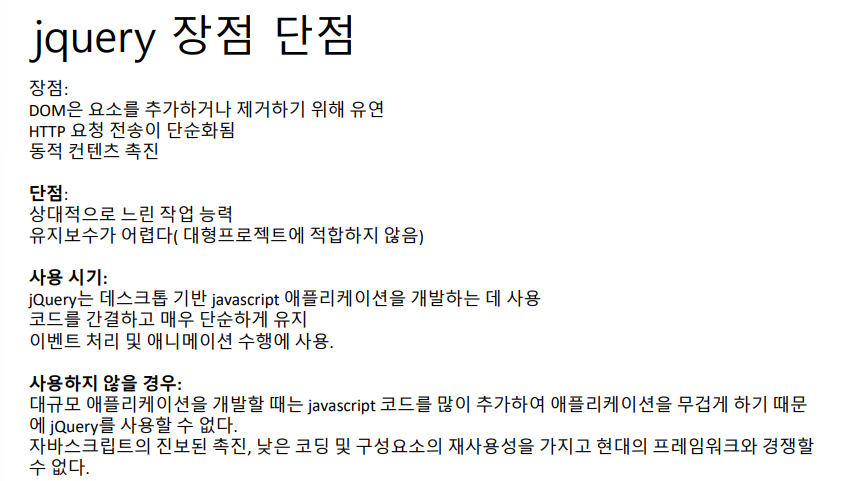
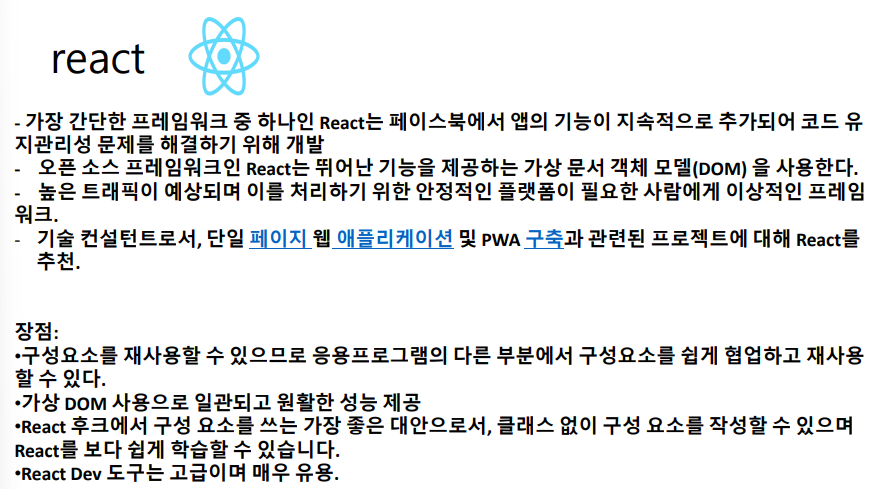
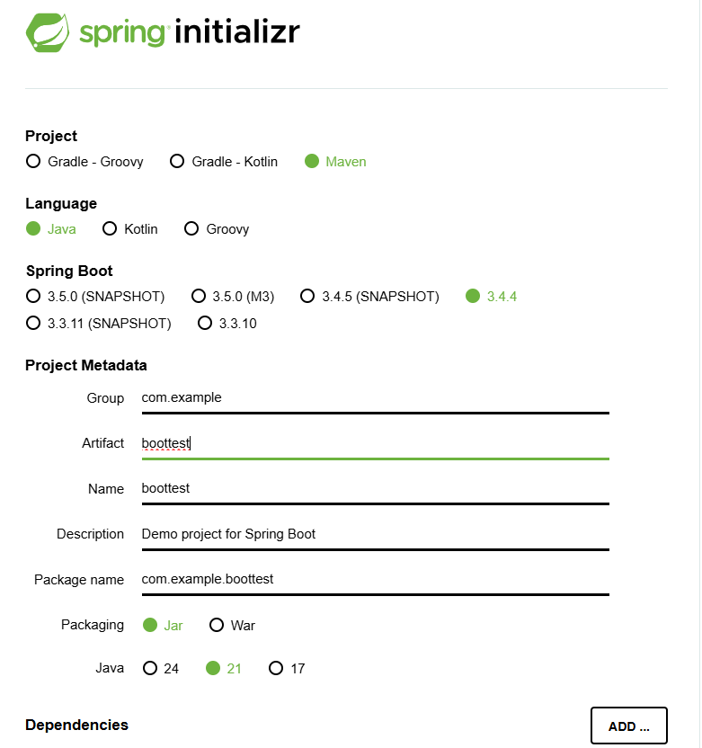
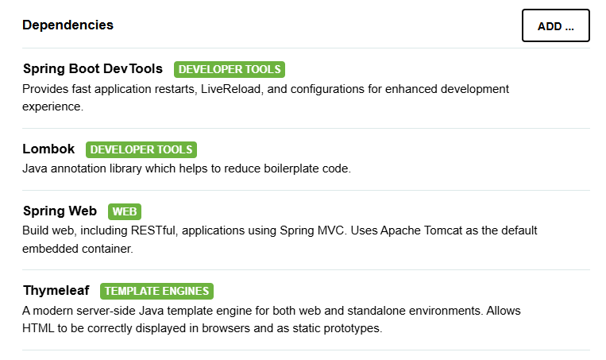

# API성능최적화1일

## 오전

- 김일한 강사님
- ilhank@naver.com

- 수업시간 : 09:00 ~ 18:00 (50분부터 퇴실가능, QR도 50분에 해야함)
- 쉬는시간 : 50분 ~ 00분
- 점심시간 : 11:50 ~ 13:00
- 과제 및 풀이 : 17:00 ~ 17:50 (제출해야함)

- vscode cursur?

- AI의 발전으로 코딩 실력은 AI를 통해 개발하고 개발자에게는 PM과 같은 전체적인 프로세스 및 도메인 지식 등 다양한 컴퓨터 공학 지식을 요구함 
- naive

- 최근 추세는 서버를 가볍게 하기 위해 클라이언트에 많은 일을 맡긴다 (프론트엔드 개발자의 중요성이 커짐)

### 웹어플리케이션 아키텍처

- 웹클라이언트 와 웹 서버간 통신 - HTTP
- HTML문서를 요청해서 HTML문서를 리턴 (정적 웹 - 과거에 자주 쓰던 방식, 최근엔 동적)
- 웹서버와 웹 어플리케이션(WAS), 그리고 DB 서버간의 통신 - 흔히 말하는 백엔드 쪽
  - web과 was 그리고 db 간의 통신을 지원하는 다양한 프레임워크 (django, jsp, spring 등)
- 스프링부트 - 스프링의 버전 및 라이브러리 종속성 문제를 해결하기 위해 기초적인 라이브러리를 선택에 따라 어느정도 통합 + 어노테이션을 많이 사용

- 웹서버는 톰캣, was는 스프링부트를 통해 강의 진행 + db 접근 방법 최적화 관련 배울 예정

- HTTP 프로토콜에 대해 잘 이해해야 강의 이해에 수월함

#### 웹 프로토콜

- 웹 브라우저 - HTTP Request(요청) 시 Header와 body를 담아서 요청

- HTML5 - 기존 HTML4에 플러그인으로 추가하던 기능들을 통합하여 새로운 웹 표준으로 나옴

- ##### request header에 포함된 정보 (라인별)

  - 요청 URL 정보 (메소드-get,post + 페이지 등)
  - 사용자 웹 브라우저 종류(사용자 기본정보)
  - 요청 데이터 타입 (accept)
  - 쿠키(인증 정보) - 과거에는 서버에 인증정보를 가지고 있었으나, 최근에는 클라이언트에 인증 정보를 넘기고 서버를 가볍게 하는 추세 (token, storage - html5 기능)
    - 

  - 경유지 URL
  - 요청 도메인

- GET Method - body는 비어있고 url뒤에 붙여서 요청 형식을 담아 전송 (2083자 제한)

- POST Method - body에 데이터를 담아서 전송 (길이 제한 X)

##### HTTP Response

- 응답코드 및 body 사이즈 등을 담아서 응답함

#### 브라우저 렌더링

- 응답받은 HTML 문서를 브라우저가 렌더링을 하여 DOM으로 만듬
  - 브라우저가 HTML문서를 읽어 구조화 한뒤 메모리에 객체로서 생성
- 유명한 브라우저 렌더링 엔진은 Webkit(애플사 개발, 오픈소스)으로 대부분의 렌더링은 Webkit을 사용하고 있음 (크롬, 사파리)
- HTML 문서와 CSS 스타일시트를 렌더링하여 합친뒤 화면에 보여줌
- 

- DOM이 객체로서 생성될때 개체 값과 속성이 만들어지는데, 해당 개체 값과 속성을 클라이언트에서 수정해서 리페인팅을 통해 화면의 변화를 가져오는 기능 (프론트엔드 동적웹)

- 프론트엔드 다이나믹웹 (JS로 사용됨)
- JS를 기반으로 다양한 프레임워크가 등장 (편하게 쓰기 위해 - jquery, vue, angular, react)
- jquery
- 

- react
- 

- 최근 추세는 서버를 가볍게 하려고 하기 때문에 json을 통해 응답받은 데이터를 화면에서 클라이언트가 Js를 통해 읽어서 표현하도록 함
- next.js? - 리액트 기반으로 백엔드 및 네트워크 라우팅 기능까지 추가된 개선 버전?

- 렌더링을 빠르게하기 위해 가상 돔을 채택 (리엑트, 뷰)
- vue.js - 가볍게 사용하기 좋으나 보안이슈(중국)로 대기업에서는 잘 사용하지 않음

- ajax - 비동기 통신으로 sao (server에서 search만 하고 json으로 응답) , 나머지는 클라이언트에서 반영

### 환경 설정

- JDK21, 이클립스 25-03, spring boot 3.44
- 

- spring boot devtools (소스 변경시 app 자동 재부팅 및 라이브 반영)
- lombok (어노테이션 지원 라이브러리) - entity, getter, setter 만들때 유용
- spring web - MVC 구조 및 restful 사용 시 필수 (거의 무조건 사용됨)
- thymeleaf - 템플릿 엔진 (보안에 유용함)
- 
