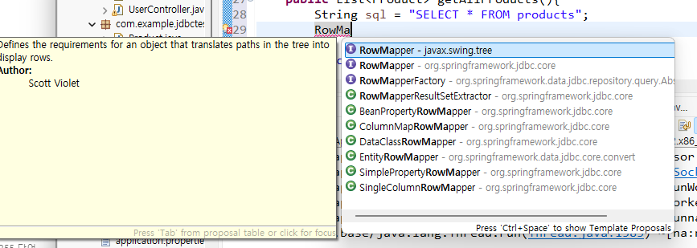

# API성능최적화1일


# 오전


- 김일한 강사님
- ilhank@naver.com

- 수업시간 : 09:00 ~ 18:00 (50분부터 퇴실가능, QR도 50분에 해야함)
- 쉬는시간 : 50분 ~ 00분
- 점심시간 : 11:50 ~ 13:00
- 과제 및 풀이 : 17:00 ~ 17:50 (제출해야함)


- vscode cursur?

- AI의 발전으로 코딩 실력은 AI를 통해 개발하고 개발자에게는 PM과 같은 전체적인 프로세스 및 도메인 지식 등 다양한 컴퓨터 공학 지식을 요구함 
- naive


- 최근 추세는 서버를 가볍게 하기 위해 클라이언트에 많은 일을 맡긴다 (프론트엔드 개발자의 중요성이 커짐)


### 웹어플리케이션 아키텍처

- 웹클라이언트 와 웹 서버간 통신 - HTTP
- HTML문서를 요청해서 HTML문서를 리턴 (정적 웹 - 과거에 자주 쓰던 방식, 최근엔 동적)
- 웹서버와 웹 어플리케이션(WAS), 그리고 DB 서버간의 통신 - 흔히 말하는 백엔드 쪽
  - web과 was 그리고 db 간의 통신을 지원하는 다양한 프레임워크 (django, jsp, spring 등)
- 스프링부트 - 스프링의 버전 및 라이브러리 종속성 문제를 해결하기 위해 기초적인 라이브러리를 선택에 따라 어느정도 통합 + 어노테이션을 많이 사용

- 웹서버는 톰캣, was는 스프링부트를 통해 강의 진행 + db 접근 방법 최적화 관련 배울 예정

- HTTP 프로토콜에 대해 잘 이해해야 강의 이해에 수월함


#### 웹 프로토콜

- 웹 브라우저 - HTTP Request(요청) 시 Header와 body를 담아서 요청

- HTML5 - 기존 HTML4에 플러그인으로 추가하던 기능들을 통합하여 새로운 웹 표준으로 나옴

- ##### request header에 포함된 정보 (라인별)

  - 요청 URL 정보 (메소드-get,post + 페이지 등)
  - 사용자 웹 브라우저 종류(사용자 기본정보)
  - 요청 데이터 타입 (accept)
  - 쿠키(인증 정보) - 과거에는 서버에 인증정보를 가지고 있었으나, 최근에는 클라이언트에 인증 정보를 넘기고 서버를 가볍게 하는 추세 (token, storage - html5 기능)
    - 

  - 경유지 URL
  - 요청 도메인

- GET Method - body는 비어있고 url뒤에 붙여서 요청 형식을 담아 전송 (2083자 제한)

- POST Method - body에 데이터를 담아서 전송 (길이 제한 X)

##### HTTP Response


- 응답코드 및 body 사이즈 등을 담아서 응답함


#### 브라우저 렌더링

- 응답받은 HTML 문서를 브라우저가 렌더링을 하여 DOM으로 만듬
  - 브라우저가 HTML문서를 읽어 구조화 한뒤 메모리에 객체로서 생성
- 유명한 브라우저 렌더링 엔진은 Webkit(애플사 개발, 오픈소스)으로 대부분의 렌더링은 Webkit을 사용하고 있음 (크롬, 사파리)
- HTML 문서와 CSS 스타일시트를 렌더링하여 합친뒤 화면에 보여줌
- 


- DOM이 객체로서 생성될때 개체 값과 속성이 만들어지는데, 해당 개체 값과 속성을 클라이언트에서 수정해서 리페인팅을 통해 화면의 변화를 가져오는 기능 (프론트엔드 동적웹)

- 프론트엔드 다이나믹웹 (JS로 사용됨)
- JS를 기반으로 다양한 프레임워크가 등장 (편하게 쓰기 위해 - jquery, vue, angular, react)
- jquery
- 

- react
- 

- 최근 추세는 서버를 가볍게 하려고 하기 때문에 json을 통해 응답받은 데이터를 화면에서 클라이언트가 Js를 통해 읽어서 표현하도록 함
- next.js? - 리액트 기반으로 백엔드 및 네트워크 라우팅 기능까지 추가된 개선 버전?

- 렌더링을 빠르게하기 위해 가상 돔을 채택 (리엑트, 뷰)
- vue.js - 가볍게 사용하기 좋으나 보안이슈(중국)로 대기업에서는 잘 사용하지 않음


- ajax - 비동기 통신으로 sao (server에서 search만 하고 json으로 응답) , 나머지는 클라이언트에서 반영


## 환경 설정 + 실습 1

- JDK21, 이클립스 25-03, spring boot 3.44
- 

- spring boot devtools (소스 변경시 app 자동 재부팅 및 라이브 반영)
- lombok (어노테이션 지원 라이브러리) - entity, getter, setter 만들때 유용
- spring web - MVC 구조 및 restful 사용 시 필수 (거의 무조건 사용됨)
- thymeleaf - 템플릿 엔진 (보안에 유용함)
- 

- generate 후 압축 풀기(워크스페이스 폴더에)
- eclipse에 소스 추가

- 

- 폰트크기 설정
- 


- MVC (model - 주로 db,  view + controller - 서버쪽)
- controller - 클라이언트로 부터 요청받는곳 (servlet)
- model - controller로 부터 db 쪽으로 데이터 관련 작업 요청 진행
- view - 응답결과 만들어서 사용자에 응답


- 실습
- 

- ctrl + space - 자동완성
- UserController 생성 - Model 객체 생성시 **스프링프레임워크의 모델로 생성해야함**
- 
- 
- 
- 


- 

- 


- 

- 


- 
- 


# 오후


## 실습 이어서

- 
- 생성자 만들기 (단축키 alt + shift + s)
- 
- 

- pom.xml boot는 해당 버전에 맞게 종속성 버전 자동 관리 (그래서 버전에 대한 별도 표기가 없음)
- 
- 롬복 설치시 데이터 확인을 위해선 한번 실행시켜줘야함 (이클립스의 경우, 인텔리제이는 자동 반영)
- 
- 

- lombok 추가후 project clean 진행 (과거버전으로 인식 제대로 못하는 경우도 있어서)
- 

- 
- getter, setter를 설정 안 해놓으면 해당 데이터 읽을 때 접근을 못하므로 반드시 getter, setter 설정해야함 (클래스 멤버함수로 호출, private 변수이므로)
- 타임리프(템플릿 엔진)을 통해 변수를 자동으로 매핑해서 담아서 던짐 (server side rendering)
- react, nextjs와 같이 client에서 렌더링하면 CSR(client side rendering)


- ctrl  + shift + / = html 주석
- 
- person 페이지를 만들지 않았으므로 에러 (서버 + html)
- 


- controller + view 실습 완료
- 

- 

- 


## 실습 2 - jdbc test

- 
- 
- H2 Database - 메모리에 올려서 사용하는 db (작고 가볍고 빠른 세팅)
- 


### DB 풀

- was 실행시 자동으로 connection 객체를 미리 pool에 생성해두고 대기, DB 접근시 pool을 따라 connection 객체를 사용 후 반환 (DB의 무제한 접근을 방지하기 위해 pool로 제한)

- DB 세팅 

- ```properties
  spring.application.name=jdbctest
  # if source code changed, then auto restart server
  spring.devtools.restart.enabled=true
  # change server port
  server.port=8089
  
  # thymeleaf setting
  spring.thymeleaf.prefix=classpath:/templates/
  spring.thymeleaf.suffix=.html
  # no chche
  spring.thymeleaf.cache=false
  
  spring.sql.init.mode=always
  
  # DB setting 
  spring.datasource.url=jdbc:h2:file:./data/testdb
  # DB driver
  spring.datasource.driver-class-name=org.h2.Driver
  spring.datasource.username=sa
  spring.datasource.password=1234
  # H2 DB schema check This URL or Using DBeaver for check Schema
  spring.h2.console.enabled=true
  spring.h2.console.path=/h2-console
  
  # DB pool setting - Default value = 5
  spring.datasource.hikari.minimum-idle=5     
  spring.datasource.hikari.maximum-pool-size=5 
  spring.datasource.hikari.idle-timeout=30000   
  spring.datasource.hikari.max-lifetime=1800000 
  spring.datasource.hikari.connection-timeout=30000
  ```

- 실습 1 참고하여 index까지 생성
- 


### DAO/DTO

- Data Access Object (Repository) - DB와 직접 접근하여 데이터 처리하는 부분

- ```java
  package com.example.jdbctest.repository;
  
  import org.springframework.jdbc.core.JdbcTemplate;
  import org.springframework.stereotype.Repository;
  
  // 
  @Repository
  public class ProductRepository {
  	private final JdbcTemplate jdbcTemplate; // 관리객체
  
  	public ProductRepository(JdbcTemplate jdbcTemplate) {
  		this.jdbcTemplate = jdbcTemplate;
  	}
  	
  	public int insertProduct(String name, Double price) {
  		// sql 문 작성
  		String sql = "INSERT INTO products(name, price) VALUES(?,?)";
  		// jdbc를 통한 반영 결과 값 리턴 (업데이트 갯수)
  		int cnt = jdbcTemplate.update(sql, name, price);
  		return cnt;
  	}
  	
  }
  ```

- Data Transfer Object (Model)

- ```java
  package com.example.jdbctest.model;
  
  public class Product {
  	private String name;
  	public String getName() {
  		return name;
  	}
  	public Product() {
  		// TODO Auto-generated constructor stub
  	}
  	public Product(String name, Double price) {
  		super();
  		this.name = name;
  		this.price = price;
  	}
  	public void setName(String name) {
  		this.name = name;
  	}
  	public Double getPrice() {
  		return price;
  	}
  	public void setPrice(Double price) {
  		this.price = price;
  	}
  	private Double price;
  }
  ```

- Service (실제 비즈니스 로직) 생성 - Controller에서 처리해도 되지만 프로젝트 관리, 유지보수 측면에서 별도로 생성해서 관리

- ```java
  package com.example.jdbctest.service;
  
  import org.springframework.stereotype.Service;
  
  import com.example.jdbctest.repository.ProductRepository;
  
  @Service
  public class ProductService {
  	private final ProductRepository productRepository;
  
  	public ProductService(ProductRepository productRepository) {
  		this.productRepository = productRepository;
  	}
  	
  	// 서비스에서 Repo(Dao) 호출
  	public int addProduct(String name, Double price) {
  		int cnt = productRepository.insertProduct(name, price);
  		return cnt;
  	}
  	
  }
  ```

- 요청을 받기 위한 Controller 생성

- ```java
  package com.example.jdbctest.controller;
  
  import org.springframework.stereotype.Controller;
  import org.springframework.ui.Model;
  import org.springframework.web.bind.annotation.GetMapping;
  import org.springframework.web.bind.annotation.ResponseBody;
  
  import com.example.jdbctest.service.ProductService;
  
  @Controller
  public class ProductController {
  	private final ProductService productService;
  	
  	
  	public ProductController(ProductService productService) {
  		this.productService = productService;
  	}
  
  
  	@GetMapping("/product")
  	@ResponseBody // response에서 바로 담아서 보냄
   	public String product(Model model) {
  		return "product call";
  	}
  	
  	@GetMapping("/insert")
  	public String insert(Model model) {
  		
  		// 오류 발생시 -1 리턴
  		int nCnt = productService.addProduct("컴퓨터", 20.2);
  		String result = nCnt>0? "insert success" : "insert fail";
  		model.addAttribute("result", result+":"+nCnt);
  		return "insert";
  	}
  }
  ```

- 


### Bean

- Spring 관리 객체

- 예제

- ```java
  package com.example.jdbctest.my;
  
  // bean 없이 생성
  public class MyClass {
  
  	public String hello() {
  		return "hello myclass";
  	}
  }
  ```

- ```java
  package com.example.jdbctest.controller;
  
  import org.springframework.stereotype.Controller;
  import org.springframework.ui.Model;
  import org.springframework.web.bind.annotation.GetMapping;
  
  import com.example.jdbctest.my.MyClass;
  
  @Controller
  public class UserController {
  	
  	@GetMapping("/")
  	public String index(Model model) {
  		MyClass obj = new MyClass();
  		String rst = obj.hello();
  		System.out.println(rst);
  		return "index";
  	}
  }
  

- 이렇게 생성했을 경우 obj는 지역변수 이므로 GC 대상이 됨(메모리)

- index는 자주 호출되는 대상이므로 new를 통한 객체 생성은 지역변수이므로 향후 GC가 자주 되므로 성능 저하의 원인이 됨

- 어노테이션을 통해 spring은 서버 실행시 선언된 어노테이션 들을 bean이라는 관리 객체로 미리 다 생성하여 GC를 하지 않도록 지원

- @Component 어노테이션을 통해 bean으로 생성된 객체를 사용하면 불필요한 GC 작업을 줄일 수 있음

- ```java
  package com.example.jdbctest.my;
  
  import org.springframework.stereotype.Component;
  
  @Component
  public class MyClass {
  
  	public String hello() {
  		return "hello myclass";
  	}
  }
  
  ```

- ```java
  package com.example.jdbctest.controller;
  
  import org.springframework.beans.factory.annotation.Autowired;
  import org.springframework.stereotype.Controller;
  import org.springframework.ui.Model;
  import org.springframework.web.bind.annotation.GetMapping;
  
  import com.example.jdbctest.my.MyClass;
  
  @Controller
  public class UserController {
  	@Autowired
  	MyClass obj;
  	
  	@GetMapping("/")
  	public String index(Model model) {
  //		MyClass obj = new MyClass();
  		String rst = obj.hello();
  		System.out.println(rst);
  		return "index";
  	}
  }
  
  ```

- @Authwired 를 통해 서버 생성시 자동으로 생성된 단일 객체(미리 어노테이션 대상은 다 생성되었으므로)를 참조로 하여 생성

- 생성자를 통한 객체 주입

- ```java
  package com.example.jdbctest.controller;
  
  import org.springframework.beans.factory.annotation.Autowired;
  import org.springframework.stereotype.Controller;
  import org.springframework.ui.Model;
  import org.springframework.web.bind.annotation.GetMapping;
  
  import com.example.jdbctest.my.MyClass;
  
  @Controller
  public class UserController {
  //	@Autowired
  //	MyClass obj;
  	private final MyClass obj;
  	
  	public UserController(MyClass obj) {
  		this.obj = obj;
  	}
  
  	@GetMapping("/")
  	public String index(Model model) {
  //		MyClass obj = new MyClass();
  		String rst = obj.hello();
  		System.out.println(rst);
  		return "index";
  	}
  }
  
  ```

- 


- 데이터 확인
- 


- 예제 실습 - form을 만들어서 form 입력값으로 insert 로직 만들기 (오전, 오후 배웠던 것 실습)
- 


- select 만들기 - RowMapper 선언시 swing 사용하지 않도록 주의 (윈도우 프로그래밍 쪽임)
- 

```java
package com.example.jdbctest.repository;

import java.util.List;

import org.springframework.jdbc.core.JdbcTemplate;
import org.springframework.jdbc.core.RowMapper;
import org.springframework.stereotype.Repository;

import com.example.jdbctest.model.Product;

// 
@Repository
public class ProductRepository {
	private final JdbcTemplate jdbcTemplate; // 관리객체로 생성

	public ProductRepository(JdbcTemplate jdbcTemplate) {
		this.jdbcTemplate = jdbcTemplate;
	}
	
	// INSERT
	public int insertProduct(String name, Double price) {
		// sql 문 작성
		String sql = "INSERT INTO products(name, price) VALUES(?,?)";
		// jdbc를 통한 반영 결과 값 리턴 (업데이트 갯수)
		int cnt = jdbcTemplate.update(sql, name, price);
		return cnt;
	}
	
	// SELECT
	public List<Product> getAllProducts(){
		String sql = "SELECT * FROM products";
		// lambda 함수로 데이터 결과 row 한 줄씩 매핑해서 집어넣기
		RowMapper<Product> rowMapper = (rs, rowNum) -> new Product(
				rs.getString("name"),
				rs.getDouble("price"));
		
		List<Product> arr = jdbcTemplate.query(sql, rowMapper);
		return arr;
	}
	
}

```

- ```java
  package com.example.jdbctest.service;
  
  import java.util.List;
  
  import org.springframework.stereotype.Service;
  
  import com.example.jdbctest.model.Product;
  import com.example.jdbctest.repository.ProductRepository;
  
  @Service
  public class ProductService {
  	private final ProductRepository productRepository;
  
  	public ProductService(ProductRepository productRepository) {
  		this.productRepository = productRepository;
  	}
  	
  	// 서비스에서 Repo(Dao) 호출
  	public int addProduct(String name, Double price) {
  		int cnt = productRepository.insertProduct(name, price);
  		return cnt;
  	}
  	
  	// SELECT
  	public List<Product> getAllProducts() {
  		List<Product> arr = productRepository.getAllProducts();
  		return arr;
  	}
  	
  }
  ```

- view 및 bootstrap 적용 (https://www.w3schools.com/bootstrap5/tryit.asp?filename=trybs_table_basic&stacked=h)

- 

- 


- 과제관련 체크 (iframe)

- ```html
  <!DOCTYPE html>
  <html>
  <head>
  <meta charset="UTF-8">
  <title>Insert title here</title>
  </head>
  <body>
  	<h1>입력양식</h1>
  	<!-- 별도로 method 입력하지 않으면 기본값은 get -->
  	<!-- /person?name=홍길동&age=20&birth=1999-10-12 -->
  	<form action="/person" method="get" target="myi">
  		<!-- for label이 어디에 사용되는지 id와 매핑해서 표기 = 안해도 되지만 웹 표준이긴함 + 유지보수 용이 -->
  		<label for="name">이름:</label> 
  		<input type="text" id="name" name="name"><br>
  		<label>나이:</label>
  		<input type="number" name="age"><br>
  		<label>생일:</label>
  		<input type="date" name="birth"><br>
  		<button>확인</button>
  	</form>
  	
  	<iframe name="myi" width="100%", height="500" frameborder="0"></iframe>
  	
  </body>
  </html>
  ```
