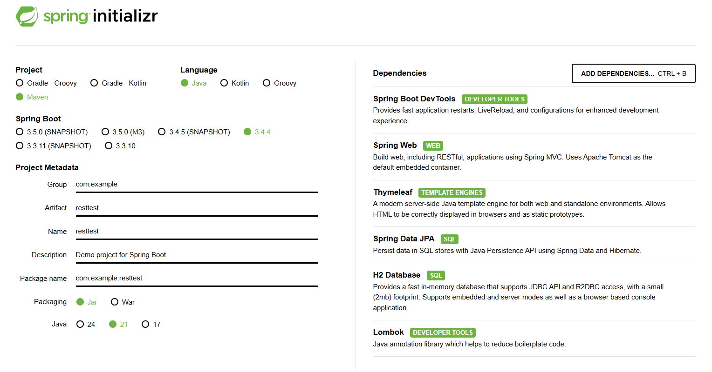
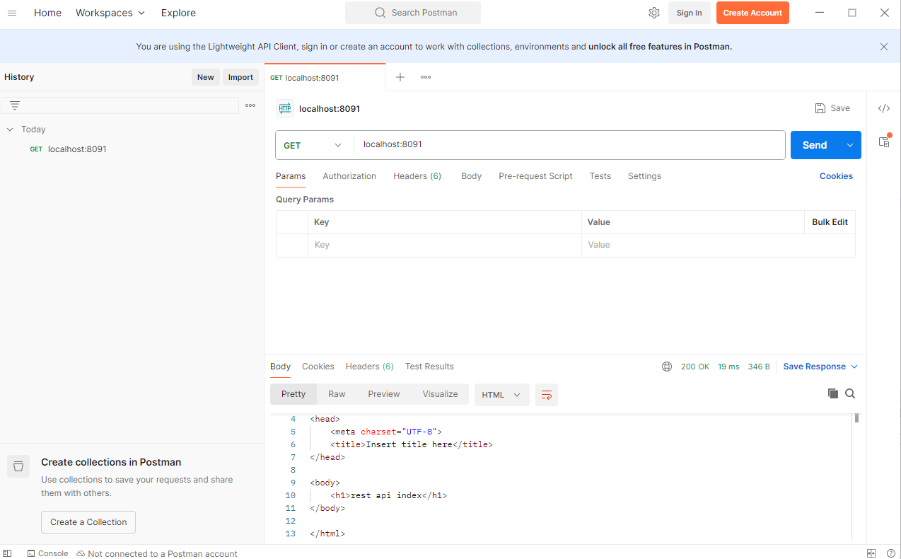
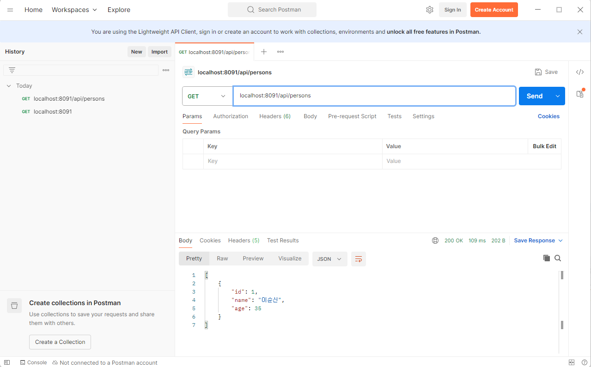
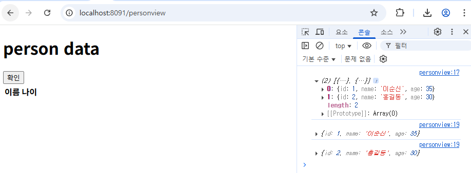

# 오전


## 과제풀이

- 어제 과제 풀이

- static(이미지, js, 스타일시트 등 고정 데이터) - 이미지 등 기본 폴더는 resources/static이 기본 경로.
  따라서 이미지 설정 시 images/이미지파일로 경로 지정하면 됨 (images 폴더 생성 후)
- 마찬가지로 뷰가 기본적으로 바라보는 위치는 resources/templates

- html form 에서 target의 경우 _self (새로운 창),  _balck(새 탭) 에서 염


- [HTML5test - How well does your browser support HTML5?](https://html5test.com/)

- [html 소수 - Google 검색](https://www.google.com/search?q=html+소수&sca_esv=02f67723ec48d2b9&ei=ku0FaMm1A4-y0-kPhLDP4AM&ved=0ahUKEwjJxqeix-iMAxUP2TQHHQTYEzwQ4dUDCBA&uact=5&oq=html+소수&gs_lp=Egxnd3Mtd2l6LXNlcnAiC2h0bWwg7IaM7IiYMgUQABiABDIEEAAYHjIEEAAYHjIEEAAYHjIEEAAYHjIFEAAY7wUyCBAAGKIEGIkFMgUQABjvBUjhCFC3BVioB3ADeAGQAQGYAXigAb0DqgEDMC40uAEDyAEA-AEBmAIFoAL7AcICChAAGLADGNYEGEeYAwCIBgGQBgqSBwMzLjKgB5gTsgcDMC4yuAftAQ&sclient=gws-wiz-serp)

- [[HTML\] number타입 INPUT입력창에 소수점 입력 허용 방법(step속성 활용)](https://curryyou.tistory.com/220)

- [vscode cursor - Google 검색](https://www.google.com/search?q=vscode+cursor&oq=vscode+cursor&gs_lcrp=EgRlZGdlKgkIABBFGDkYgAQyCQgAEEUYORiABDIHCAEQABiABDIHCAIQABiABDIHCAMQABiABDIHCAQQABiABDIHCAUQABiABDIHCAYQABiABDIHCAcQABiABNIBCDMyNzFqMGo0qAIAsAIB&sourceid=chrome&ie=UTF-8)

- [브라우저는 어떻게 작동하는가?](https://d2.naver.com/helloworld/59361)

- [프로젝트 이미지 위치](https://www.google.com/search?q=%ED%94%84%EB%A1%9C%EC%A0%9D%ED%8A%B8+%EC%9D%B4%EB%AF%B8%EC%A7%80+%EC%9C%84%EC%B9%98&oq=%ED%94%84%EB%A1%9C%EC%A0%9D%ED%8A%B8+%EC%9D%B4%EB%AF%B8%EC%A7%80+%EC%9C%84%EC%B9%98&gs_lcrp=EgZjaHJvbWUyBggAEEUYOTIHCAEQIRigATIHCAIQIRigATIHCAMQIRigAdIBCDYxNDhqMWo3qAIAsAIA&sourceid=chrome&ie=UTF-8)
- [타임리프 이미지경로](https://www.google.com/search?q=%ED%83%80%EC%9E%84+%EB%A6%AC%ED%94%84+%EC%9D%B4%EB%AF%B8%EC%A7%80+%EA%B2%BD%EB%A1%9C&sca_esv=722f758a1a99b9f3&ei=NwQGaN_CNbLk2roPwP3i8QU&oq=%EC%9D%B4%EB%AF%B8%EC%A7%80+%EA%B2%BD%EB%A1%9C&gs_lp=Egxnd3Mtd2l6LXNlcnAaAhgCIhDsnbTrr7jsp4Ag6rK966GcKgIICDIGEAAYBxgeMgYQABgHGB4yBhAAGAcYHjIGEAAYBxgeMgYQABgHGB4yBhAAGAcYHjIGEAAYBxgeMgYQABgHGB4yBhAAGAcYHjIGEAAYBxgeSIBPUNIgWMk8cAh4AJABAZgBeaAB4QyqAQQxLjE0uAEByAEA-AEBmAIRoAK3CKgCBMICChAAGLADGNYEGEfCAgsQABiABBixAxiDAcICDhAuGIAEGLEDGNEDGMcBwgIHEC4YgAQYCsICERAuGIAEGLEDGNEDGIMBGMcBwgIdEAAYgAQYtAIY1AMY5QIYtwMYigUY6gIYigPYAQHCAgsQLhiABBixAxiDAcICBBAAGAPCAg4QABiABBixAxiDARiLA8ICBxAAGAMYiwPCAhQQLhiABBixAxiDARioAxiaAxiLA8ICCBAAGIAEGLEDwgIXEAAYgAQYsQMYgwEYpgMY-AUYqAMYiwPCAhoQLhiABBixAxiDARimAxioAxiaAxiLAxibA8ICCBAuGIAEGLEDwgIKEAAYgAQYQxiKBcICBRAAGIAEwgIIEAAYgAQYiwPCAg0QABiABBhDGIoFGIsDwgIEEAAYHsICBhAAGAUYHsICBxAAGIAEGA3CAgYQABgNGB7CAggQABgFGA0YHpgDAvEF5M5x6VNTN9CIBgGQBgq6BgQIARgHkgcDOC45oAe7lAGyBwMwLjm4B5kI&sclient=gws-wiz-serp)
- [thymeleaf if문](https://www.google.com/search?q=thymeleaf+if+%EB%AC%B8&sca_esv=2d77d5a7ae89fe5c&ei=YwEGaKSsNs7h2roPw8qbyQ8&ved=0ahUKEwjk6dmV2uiMAxXOsFYBHUPlJvkQ4dUDCBA&uact=5&oq=thymeleaf+if+%EB%AC%B8&gs_lp=Egxnd3Mtd2l6LXNlcnAiEHRoeW1lbGVhZiBpZiDrrLgyBRAAGIAEMgQQABgeMgUQABjvBTIIEAAYgAQYogRIyRpQmg1Y1xhwBHgAkAEAmAGFAaAB5waqAQMyLja4AQPIAQD4AQGYAgugApUGwgIKEAAYsAMY1gQYR8ICChAAGIAEGEMYigXCAgYQABgIGB6YAwCIBgGQBgqSBwM1LjagB9cjsgcDMS42uAf_BQ&sclient=gws-wiz-serp)

- [target blank self](https://www.google.com/search?q=target+blank+self&oq=target+blank&gs_lcrp=EgZjaHJvbWUqBwgBEAAYgAQyBggAEEUYOTIHCAEQABiABDIJCAIQABgKGIAEMgcIAxAAGIAEMgkIBBAAGAoYgAQyCggFEAAYxwMYgAQyCQgGEAAYChiABDIHCAcQABiABDIHCAgQABiABDIJCAkQABgKGIAE0gEINzU4N2oxajeoAgCwAgA&sourceid=chrome&ie=UTF-8)
- https://www.w3schools.com/bootstrap5/bootstrap_tables.php


- 궁금한거 - 의존성 주입, 빈 개념, controller 리턴


- radio 버튼 생성시 꼭 value를 넣어야함(실제 값 부분)
- 
- checkbox같이 다중데이터를 받을 경우 arraylist로 받기 (서버에서)
- 
- select 도 실제 value 생성 필요
- 


- css파일 생성시 <style> 태그 사용하면 안됨
- 


## JPA


- ORM
- JPA - 자바 표준 인터페이스
- Hibernate - JPA의 대표적인 구현체 (다른 구현체도 존재함, 자주 사용됨)

- 


- ```properties
  spring.application.name=jpatest
  # if source code changed, then auto restart server
  spring.devtools.restart.enabled=true
  # change server port
  server.port=8090
  
  # thymeleaf setting
  spring.thymeleaf.prefix=classpath:/templates/
  spring.thymeleaf.suffix=.html
  # no cache
  spring.thymeleaf.cache=false
  
  # DB setting 
  spring.datasource.url=jdbc:h2:file:./data/testdb
  # DB driver
  spring.datasource.driver-class-name=org.h2.Driver
  spring.datasource.username=sa
  spring.datasource.password=1234
  # H2 DB schema check This URL or Using DBeaver for check Schema
  spring.h2.console.enabled=true
  spring.h2.console.path=/h2-console
  
  # JPA setting platform 중요
  spring.jpa.database-platform=org.hibernate.dialect.H2Dialect
  # jpa sql문 보여줌
  spring.jpa.show-sql=true
  # 반드시 세팅 - 안할경우 기본값 none (아무것도 안함)
  # update - 테이블 구조 변경이나 재시작시 기존 테이블 있으면 보존 or 수정, 없으면 생성
  # create - 서버 실행시 테이블 매번 새로 생성(기존 데이터 유지 X)
  spring.jpa.hibernate.ddl-auto=update
  # hibernate sql 자동 세팅 보기 좋게 표기, 주석표기
  spring.jpa.properties.hibernate.format_sql=true 
  spring.jpa.properties.hibernate.use_sql_comments=true
  ```

- 


# 오후


## JPA 이어서

- model에서 Entity로 자동 매핑

- ```java
  package com.example.jpatest.model;
  
  import jakarta.persistence.Entity;
  import jakarta.persistence.GeneratedValue;
  import jakarta.persistence.GenerationType;
  import jakarta.persistence.Id;
  import lombok.AllArgsConstructor;
  import lombok.Getter;
  import lombok.NoArgsConstructor;
  import lombok.Setter;
  
  // Entity 테이블과 바로 매핑 (없으면 자동 생성)
  @Entity
  @Getter
  @Setter
  @NoArgsConstructor
  @AllArgsConstructor
  public class Person {
  	// 행을 구분하는 PK 반드시 필요 (테이블 생성을 위해) 별도 구분자가 없을 경우 row 갯수 마다 자동 증가하는 ID를 키로 쓰면 됨	
  	@Id
  	@GeneratedValue(strategy = GenerationType.IDENTITY)
  	private Long id;
  	
  	private String name;
  	private int age;
  }
  
  ```

- repository 만들때 상속받아서 인터페이스로 만듬

- ```java
  package com.example.jpatest.repository;
  
  import org.springframework.data.jpa.repository.JpaRepository;
  import org.springframework.stereotype.Repository;
  
  import com.example.jpatest.model.Person;
  
  @Repository
  // Person 모델(테이블)을 사용하는 키(id) long 타입을 기반으로 한 Jpa 기본 구현체를 상속받아 신규 인터페이스 생성
  public interface PersonRepository extends JpaRepository<Person, Long>{
  
  }
  
  ```

- service 생성

- ```java
  package com.example.jpatest.service;
  
  import org.springframework.beans.factory.annotation.Autowired;
  import org.springframework.stereotype.Service;
  
  import com.example.jpatest.model.Person;
  import com.example.jpatest.repository.PersonRepository;
  
  @Service
  public class PersonService {
  	@Autowired
  	private PersonRepository personRepository;
  	
  	// 테이블 row 숫자
  	public Long PersonCount() {
  		Long nCnt = personRepository.count();
  		return nCnt;
  	}
  	
  	// insert
  	public Long insertPerson(String name, int age) {
  		Long bCnt = personRepository.count();
  		// save 함수는 별도의 변경된 갯수 리턴이 없으므로 cnt를 통해 반영 된 갯수 확인해야함 
  		personRepository.save(new Person(null, name, age));
  		Long aCnt = personRepository.count();
  		return aCnt - bCnt;
  	}
  }
  ```

- controller 생성

- ```java
  package com.example.jpatest.controller;
  
  import org.springframework.beans.factory.annotation.Autowired;
  import org.springframework.stereotype.Controller;
  import org.springframework.ui.Model;
  import org.springframework.web.bind.annotation.GetMapping;
  
  import com.example.jpatest.service.PersonService;
  
  @Controller
  public class UserController {
  	
  	@Autowired
  	PersonService personService;
  	
  	@GetMapping
  	public String index(Model model) {
  		return "index";
  	}
  	
  	@GetMapping("/insert")
  	public String insert(Model model) {
  		Long nCnt;
  		nCnt = personService.insertPerson("홍길동", 20);
  		model.addAttribute("result", nCnt+"추가됨");
  		return "insertview";
  	}
  }
  ```

- Hibernate 작동 결과

- ```sql
  Hibernate: 
      /* select
          count(*) 
      from
          Person x */ select
              count(*) 
          from
              person p1_0
  Hibernate: 
      /* insert for
          com.example.jpatest.model.Person */insert 
      into
          person (age, name, id) 
      values
          (?, ?, default)
  Hibernate: 
      /* select
          count(*) 
      from
          Person x */ select
              count(*) 
          from
              person p1_0
  
  ```


- select 결과

- ```java
  Hibernate: 
      /* <criteria> */ select
          p1_0.id,
          p1_0.age,
          p1_0.name 
      from
          person p1_0
  ```


- 기본 repository 인터페이스에서 find는 findById 외에는 커스터마이징을 하여 사용해야함(특정 이름, 특정 나이 등등)

- JPQL을 통해 직접 쿼리 작성도 가능

- ```java
  package com.example.jpatest.repository;
  
  import java.util.List;
  
  import org.springframework.data.jpa.repository.JpaRepository;
  import org.springframework.data.jpa.repository.Query;
  import org.springframework.data.repository.query.Param;
  import org.springframework.stereotype.Repository;
  
  import com.example.jpatest.model.Person;
  
  @Repository
  // Person 모델(테이블)을 사용하는 키(id) long 타입을 기반으로 한 Jpa 기본 구현체를 상속받아 신규 인터페이스 생성
  public interface PersonRepository extends JpaRepository<Person, Long>{
  	// findBy는 꼭 값을 1개만 리턴하므로 PK로 1개만 구분 할수 있도록 해야함
  	// findByName (특정 이름을 기준으로 한 find 함수 만들기) 인터페이스 이므로 함수는 자동 생성됨
  	// 구현체를 별도로 만들지 않아도 해당 이름을 기반으로 jpa가 자동으로 쿼리 생성. 그러므로 변수명을 만드는게 상당히 중요함 (이름 구조 대로 쿼리를 만들기 때문에)
  	// 메서드 이름 기반 쿼리생성 find + By + Name
  	// select * from person where name=?
  	// findByAgeGreaterThan = select * from person where age>?
  	// findByNameAndAge = select * from person where name=? and age = ?
  	// findByNameOrAge = select * from person where name=? or age = ?
  	// findByNameLike = where name like ?
  	// findByAgeBetween(int start, int end) = where age between start and end 
  	// findByAgeIn = where age in(?)
  	// findAllByName = 
  	// findAllByOrderByNameAsc
  	Person findByName(String name);
  	
  	// JPQL을 사용한 문법 alias 필수, 변수는 :붙임
  	@Query("SELECT p FROM Person p WHERE p.age = :age OR p.name = :name") // SELECT * FROM Person WHERE p.age = ? OR p.name = ?
  	List<Person> getByAgeOrName(@Param("age") int age, @Param("name") String name);
  }
  
  ```


## REST api

- 


- 웹의 자원(Resource)을 URL로 표현하고 행위(Action)는 HTTP 메서드(GET, POST, PUT, DELETE 등)로 구분하는 방식


- PostMapping의 경우 요청데이터가 body에 담아오므로 @RequestBody를 사용해야함

- ```java
  package com.example.resttest.controller;
  
  import java.util.List;
  
  import org.springframework.beans.factory.annotation.Autowired;
  import org.springframework.web.bind.annotation.GetMapping;
  import org.springframework.web.bind.annotation.PostMapping;
  import org.springframework.web.bind.annotation.RequestBody;
  import org.springframework.web.bind.annotation.RequestMapping;
  import org.springframework.web.bind.annotation.RestController;
  
  import com.example.resttest.model.Person;
  import com.example.resttest.service.PersonService;
  
  @RestController
  @RequestMapping("api/persons") // REST controller 
  public class PersonController {
  	
  	@Autowired
  	PersonService personService;
  	
  	@GetMapping
  	public List<Person> getAllPersons(){
  		return personService.getAllPersons();
  	}
  	
  	@PostMapping // Post는 요청데이터가 Body에 담아오므로 RequestBody를 사용
  	public Person insertPerson(@RequestBody Person person) {
  		return personService.savePerson(person);
  	}
  }
  ```

- ```sh
  curl -X POST http://localhost:8080/api/persons \ 
       -H "Content-Type: application/json" \
       -d '{"name": "홍길동", "age": 30}'
  ```

- 화면에서 데이터를 RequestBody에 맞게 보내주려면 json으로 보내줘야함 (ajax 통신으로 진행)

- json으로 통신하는 이유(경량이라서) - 서로 경량이 데이터 주고받기 가볍고 용이함

- postman을 통한 api 테스트
- 


- Restful 의 경우 json 객체로 주고받음 (List 객체라도 나중에 보낼 때는 json임)
- 


- ajax(asynchronous javascript and xml) - js를 활용한 비동기 통신

- 최근의 방식 - SPA (최초 요청만 html 리턴, 이후에는 ajax를 통해 json을 받으면 클라이언트에서 동적으로 변경)

- ajax 예시 (바닐라 js)

- ```html
  <!DOCTYPE html>
  <html>
  <head>
  <meta charset="UTF-8">
  <title>Insert title here</title>
  	<script>
  		function callperson(){
  			// JS ajax 통신
  			// obj 예시 = [{"name":"aaa", "age":20}]
  			fetch("/api/persons")
  			.then(res => res.json()) // 서버에서 보내는 res는 문자열임 그래서 response 객체(위의 obj 같이옴)에 데이터 부분을 json 객체로 변환
  			.then(data => renderTable(data)) // 위의 res.json() = data라는 임시 이름의 promise 객체를 반환하므로 해당 데이터를 담아서 함수 실행
  		}
  		function renderTable(data){
  			tbody = document.getElementById("useTableBody")
  			tbody.innerHTML = '' // 기존에 데이터 있으면 초기화 (클리어)
  			console.log(data)
  			for(n of data){
  				console.log(n)
  			}
  		}
  
  	</script>
  </head>
  <body>
  	<h1>person data</h1>
  	<button onclick="callperson()">확인</button>
  	<table>
  		<thead>
  			<tr><th>이름</th><th>나이</th></tr>
  		</thead>
  		<tbody id="useTableBody">
  		</tbody>
  	</table>
  </body>
  </html>
  ```

- 

- js 내 변수 매핑은 `(백틱)으로 사용
