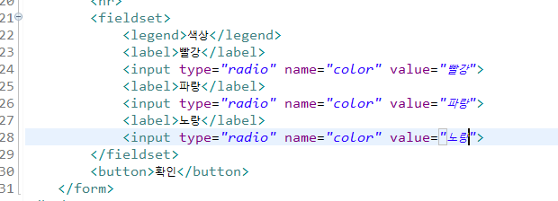
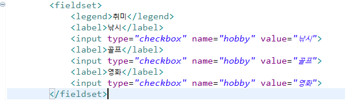
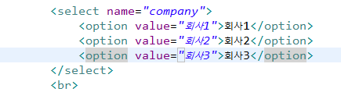
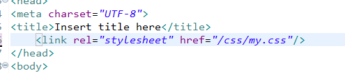
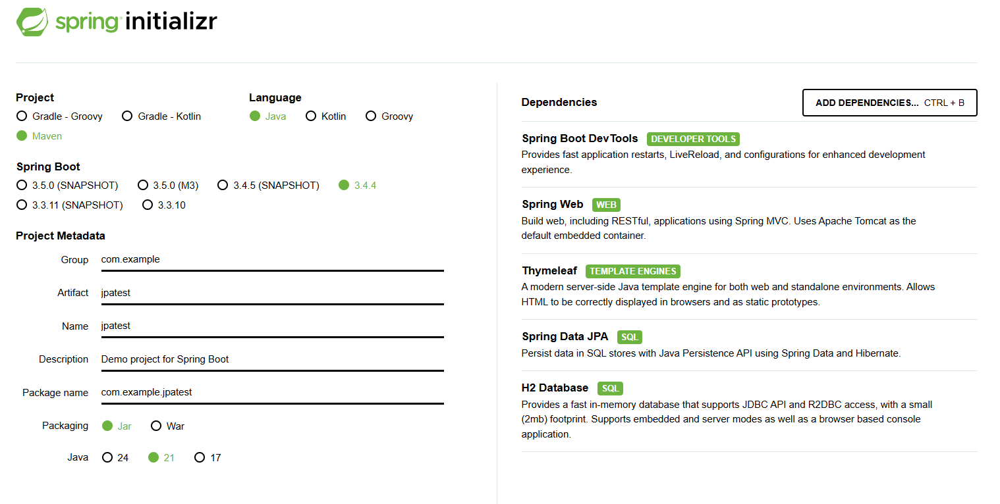

# 오전


## 과제풀이

- 어제 과제 풀이

- static(이미지, js, 스타일시트 등 고정 데이터) - 이미지 등 기본 폴더는 resources/static이 기본 경로.
  따라서 이미지 설정 시 images/이미지파일로 경로 지정하면 됨 (images 폴더 생성 후)
- 마찬가지로 뷰가 기본적으로 바라보는 위치는 resources/templates

- html form 에서 target의 경우 _self (새로운 창),  _balck(새 탭) 에서 염


- [HTML5test - How well does your browser support HTML5?](https://html5test.com/)

- [html 소수 - Google 검색](https://www.google.com/search?q=html+소수&sca_esv=02f67723ec48d2b9&ei=ku0FaMm1A4-y0-kPhLDP4AM&ved=0ahUKEwjJxqeix-iMAxUP2TQHHQTYEzwQ4dUDCBA&uact=5&oq=html+소수&gs_lp=Egxnd3Mtd2l6LXNlcnAiC2h0bWwg7IaM7IiYMgUQABiABDIEEAAYHjIEEAAYHjIEEAAYHjIEEAAYHjIFEAAY7wUyCBAAGKIEGIkFMgUQABjvBUjhCFC3BVioB3ADeAGQAQGYAXigAb0DqgEDMC40uAEDyAEA-AEBmAIFoAL7AcICChAAGLADGNYEGEeYAwCIBgGQBgqSBwMzLjKgB5gTsgcDMC4yuAftAQ&sclient=gws-wiz-serp)

- [[HTML\] number타입 INPUT입력창에 소수점 입력 허용 방법(step속성 활용)](https://curryyou.tistory.com/220)

- [vscode cursor - Google 검색](https://www.google.com/search?q=vscode+cursor&oq=vscode+cursor&gs_lcrp=EgRlZGdlKgkIABBFGDkYgAQyCQgAEEUYORiABDIHCAEQABiABDIHCAIQABiABDIHCAMQABiABDIHCAQQABiABDIHCAUQABiABDIHCAYQABiABDIHCAcQABiABNIBCDMyNzFqMGo0qAIAsAIB&sourceid=chrome&ie=UTF-8)

- [브라우저는 어떻게 작동하는가?](https://d2.naver.com/helloworld/59361)

- [프로젝트 이미지 위치](https://www.google.com/search?q=%ED%94%84%EB%A1%9C%EC%A0%9D%ED%8A%B8+%EC%9D%B4%EB%AF%B8%EC%A7%80+%EC%9C%84%EC%B9%98&oq=%ED%94%84%EB%A1%9C%EC%A0%9D%ED%8A%B8+%EC%9D%B4%EB%AF%B8%EC%A7%80+%EC%9C%84%EC%B9%98&gs_lcrp=EgZjaHJvbWUyBggAEEUYOTIHCAEQIRigATIHCAIQIRigATIHCAMQIRigAdIBCDYxNDhqMWo3qAIAsAIA&sourceid=chrome&ie=UTF-8)
- [타임리프 이미지경로](https://www.google.com/search?q=%ED%83%80%EC%9E%84+%EB%A6%AC%ED%94%84+%EC%9D%B4%EB%AF%B8%EC%A7%80+%EA%B2%BD%EB%A1%9C&sca_esv=722f758a1a99b9f3&ei=NwQGaN_CNbLk2roPwP3i8QU&oq=%EC%9D%B4%EB%AF%B8%EC%A7%80+%EA%B2%BD%EB%A1%9C&gs_lp=Egxnd3Mtd2l6LXNlcnAaAhgCIhDsnbTrr7jsp4Ag6rK966GcKgIICDIGEAAYBxgeMgYQABgHGB4yBhAAGAcYHjIGEAAYBxgeMgYQABgHGB4yBhAAGAcYHjIGEAAYBxgeMgYQABgHGB4yBhAAGAcYHjIGEAAYBxgeSIBPUNIgWMk8cAh4AJABAZgBeaAB4QyqAQQxLjE0uAEByAEA-AEBmAIRoAK3CKgCBMICChAAGLADGNYEGEfCAgsQABiABBixAxiDAcICDhAuGIAEGLEDGNEDGMcBwgIHEC4YgAQYCsICERAuGIAEGLEDGNEDGIMBGMcBwgIdEAAYgAQYtAIY1AMY5QIYtwMYigUY6gIYigPYAQHCAgsQLhiABBixAxiDAcICBBAAGAPCAg4QABiABBixAxiDARiLA8ICBxAAGAMYiwPCAhQQLhiABBixAxiDARioAxiaAxiLA8ICCBAAGIAEGLEDwgIXEAAYgAQYsQMYgwEYpgMY-AUYqAMYiwPCAhoQLhiABBixAxiDARimAxioAxiaAxiLAxibA8ICCBAuGIAEGLEDwgIKEAAYgAQYQxiKBcICBRAAGIAEwgIIEAAYgAQYiwPCAg0QABiABBhDGIoFGIsDwgIEEAAYHsICBhAAGAUYHsICBxAAGIAEGA3CAgYQABgNGB7CAggQABgFGA0YHpgDAvEF5M5x6VNTN9CIBgGQBgq6BgQIARgHkgcDOC45oAe7lAGyBwMwLjm4B5kI&sclient=gws-wiz-serp)
- [thymeleaf if문](https://www.google.com/search?q=thymeleaf+if+%EB%AC%B8&sca_esv=2d77d5a7ae89fe5c&ei=YwEGaKSsNs7h2roPw8qbyQ8&ved=0ahUKEwjk6dmV2uiMAxXOsFYBHUPlJvkQ4dUDCBA&uact=5&oq=thymeleaf+if+%EB%AC%B8&gs_lp=Egxnd3Mtd2l6LXNlcnAiEHRoeW1lbGVhZiBpZiDrrLgyBRAAGIAEMgQQABgeMgUQABjvBTIIEAAYgAQYogRIyRpQmg1Y1xhwBHgAkAEAmAGFAaAB5waqAQMyLja4AQPIAQD4AQGYAgugApUGwgIKEAAYsAMY1gQYR8ICChAAGIAEGEMYigXCAgYQABgIGB6YAwCIBgGQBgqSBwM1LjagB9cjsgcDMS42uAf_BQ&sclient=gws-wiz-serp)

- [target blank self](https://www.google.com/search?q=target+blank+self&oq=target+blank&gs_lcrp=EgZjaHJvbWUqBwgBEAAYgAQyBggAEEUYOTIHCAEQABiABDIJCAIQABgKGIAEMgcIAxAAGIAEMgkIBBAAGAoYgAQyCggFEAAYxwMYgAQyCQgGEAAYChiABDIHCAcQABiABDIHCAgQABiABDIJCAkQABgKGIAE0gEINzU4N2oxajeoAgCwAgA&sourceid=chrome&ie=UTF-8)
- https://www.w3schools.com/bootstrap5/bootstrap_tables.php


- 궁금한거 - 의존성 주입, 빈 개념, controller 리턴


- radio 버튼 생성시 꼭 value를 넣어야함(실제 값 부분)
- 
- checkbox같이 다중데이터를 받을 경우 arraylist로 받기 (서버에서)
- 
- select 도 실제 value 생성 필요
- 


- css파일 생성시 <style> 태그 사용하면 안됨
- 


## JPA


- ORM
- JPA - 자바 표준 인터페이스
- Hibernate - JPA의 대표적인 구현체 (다른 구현체도 존재함, 자주 사용됨)

- 


- ```properties
  spring.application.name=jpatest
  # if source code changed, then auto restart server
  spring.devtools.restart.enabled=true
  # change server port
  server.port=8090
  
  # thymeleaf setting
  spring.thymeleaf.prefix=classpath:/templates/
  spring.thymeleaf.suffix=.html
  # no cache
  spring.thymeleaf.cache=false
  
  # DB setting 
  spring.datasource.url=jdbc:h2:file:./data/testdb
  # DB driver
  spring.datasource.driver-class-name=org.h2.Driver
  spring.datasource.username=sa
  spring.datasource.password=1234
  # H2 DB schema check This URL or Using DBeaver for check Schema
  spring.h2.console.enabled=true
  spring.h2.console.path=/h2-console
  
  # JPA setting platform 중요
  spring.jpa.database-platform=org.hibernate.dialect.H2Dialect
  spring.jpa.show-sql=true
  # 반드시 세팅 - 안할경우 기본값 none (아무것도 안함)
  # update - 테이블 구조 변경이나 재시작시 기존 테이블 있으면 보존 or 수정, 없으면 생성
  # create - 서버 실행시 테이블 매번 새로 생성(기존 데이터 유지 X)
  spring.jpa.hibernate.ddl-auto=update
  # hibernate sql 자동 세팅 예쁘게 표기, 주석표기
  spring.jpa.properties.hibernate.format_sql=true 
  spring.jpa.properties.hibernate.use_sql_comments=true
  ```

- 
