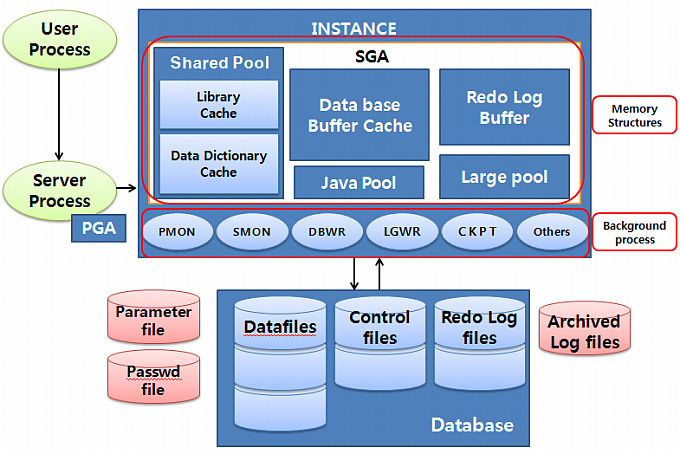
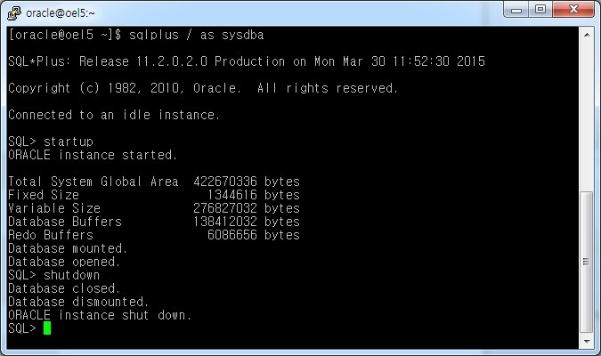
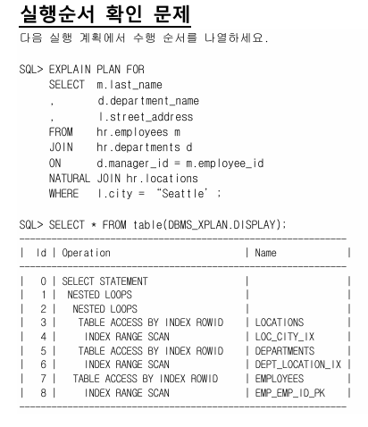

# 오라클 SQL 튜닝 1일차


## 오전

- https://url.kr/hlk6mn (sw)
- https://url.kr/xvnx87 (자료)


- 윤정원 강사님
- yunjw@etevers.com


- response time (DB time) 을 줄이자 - DB 튜닝
- DB time = SQL processing time(처리 시간) + wait time(대기 시간)
- 처리 시간을 줄이는 부분은 SQL 튜닝, 대기 시간을 줄이는 부분은 서버 튜닝


- sql의 실행에 있어 먼저 어떻게 실행 할지에 대한 절차를 짬 - plan
- 이번 과정에서는 plan 문제 상황을 분석 및 해결 방법을 배움
- plan - oracle optimizer가 만듬, 좋은 정보가 제공 될 수록 좋은 플랜을 만들 수 있음
- 즉 요약하자면 oracle optimizer가 양질의 plan을 만들 수 있도록 힌트를 주거나, 다양한 방법을 배우는 과정이 이번 과정
- 기본 지식 및 간단한 예제만 제공하며 해당 지식을 토대로 추후 튜닝을 직접 하기는 어렵지만(데이터 및 테이블까지 분석할 능력이 필요하므로) 기본적인 이해를 할 수 있게 된다.


### SQL 처리 과정

- oracle db server = instance + database
- smon, pmon 등 - 백그라운드 프로세서, sga(system global area) - 메모리
- 

- 서버가 기동이 되어있어도 인스턴스가 켜져있지 않으면 db 접근 불가
- 

- 


#### select 명령 처리

- user process 실행(토드 같은 툴) 및 계정 정보 입력 후 접속 -> server process 실행 (커넥션)
- 서버 내 인증 절차 후 정상일 경우 세션이 생성 (dedicated server 1 - 1:1 매핑)
- 세션에서 명령어를 받아서 처리
- 명령어 수행 주체 = 서버 프로세스
- 툴 종료시 서버 프로세스도 같이 종료됨
- parse -> execute -> fetch 의 단계로 명령 처리 진행


##### parse

- 주체 - 서버 프로세스
- 실행 계획 및 row source생성(p-code)
- 문법 오류 체크
- 의미상 오류 체크 (오브젝트 테이블 존재, 컬럼 존재, 권한 여부 등등)

- shared pool에 기존에 해당 쿼리로 만들어진 shared sql area가 있는지 확인. 
- 있으면 재사용 (soft parse), 없으면 새롭게 생성(p-code) 후 shared pool에 저장 (hard parse)


##### execute

- p-code를 실행
- sql 수행단계에서 알려준 data block addr(데이터 주소)로 데이터 찾기
- 먼저 찾기전에 버퍼 캐시에 데이터가 있는지 확인. 있으면 바로 서버 프로세스로 보냄(logical read)
- 없으면 db 파일 내 주소로 찾아간 db 블럭(db_block_size = default 8k) 에서 데이터 검색 extend?(각 테이블 별 연속적으로 할당 된 블럭 범위)
- 찾아낸 데이터는 블럭 단위로 db buffer cache에 올림(physical read)
- 버퍼에 올린 데이터를 서버 프로세스로 보냄(logical read)
- physical read는 상황에 따라 다양해서 별도로 튜닝하긴 어려움
- 다만 logical read 자체를 줄이면 physical read를 줄어들게 되므로 해당 부분을 줄이도록 짜는게 튜닝
- 튜닝에서 i/o의 사용값 측정은 logical read로 계산


##### fetch

- 서버 프로세스 별로 pga로 부터 별도로 전용 공간을 할당 받음.
- 해당 공간에서 담긴 데이터(execute 단계에서 받은)를 유저 프로세스로 보내줌
- 유저 프로세스 내 fetch array의 한도가 있어서 (보통 50?) 이 있어 한번 select 에 여러 개의 fetch가 있을 수 있음
- 그리고 대량 데이터 조회 시 fetch array 한도까지만 만들어서 보내고 추가로 fetch 콜이 들어올 경우 다음 부분 던져주는 방식으로 효율적인 자원 사용을 하려고 함


- shared pool 관리 방식은 LRU 방식으로 관리, buffer cache도 동일
- hard parse를 비교적 덜 하도록 관리하는게 좋음 recursive call?
- hard parse 에서 실행 계획 작성시 조인의 경우 각 테이블 갯수별 n!의 경우의 수가 존재하지만 옵티마이저 자체 경험 데이터로 조인을 자체 설정 해서 어느정도 parse 속도를 줄이도록 관리하고 있음


##### soft parse

- shared pool 내 library cache 에서 데이터를 가져옴 

- 서버 프로세스는 sql문 전체(너무 길면 앞 64바이트, 뒷 64바이트)를 아스키코드값으로 바꿔서 hash function으로 돌림 => library cache의 주소로 만들어서 찾아감

- 찾아간 주소에서 명령문 재확인 후(다른 명령문에 같은 해시 주소 값을 리턴 받을 수 있으므로) 동일한 명령문이면 재활용

- 같은 명령문이라도 대소문자의 차이가 아스키코드값이 다르므로 hash function 값도 다름

- 대소문자 일치, 공백문자 일치(탭, 스페이스바), 동일한 오브젝트(같은 이름의 테이블이라도 소유주에 따라 오브젝트가 다름), 변수(bind)의 타입이 일치

- ```sql
  HR> select * from emp; // 둘다 emp 테이블을 가지고 있을 경우
  SH> select * from emp;
  ```

- 바인드 변수의 활용

  - 각 db 툴에서 bind variable을 통해 환경 변수(외부 변수)를 사용하여 쿼리 가능
  - select * from emp where empno = :b (:b = number)
  - 변수의 타입이 같으면 바인드 사용 된 쿼리도 재사용 가능

- ```sql
  empno = 7788; // 모두 hard
  empno = 7409;
  empno = 7588;
  empno = :b; // soft
  ```

- 데이터 결과 값의 차이가 클 경우(7788 - 90만건, 7409-10건) bind 변수를 사용하지 않고 각각 hard parse로 사용하는게 낫지만 비슷한 규모에 결과 값이 나온다면 bind 변수를 사용하는게 자원 관리에 용이

- cursor_sharing=force 사용시 sql 문을 분석하여 특정 컬럼을 오라클이 자동으로 bind 변수로 바꿔서 사용 다만 여러 케이스가 존재하므로 전 시스템에 적용은 비추

- alter session set cursor_sharing=force; 와 같이 특정 세션에서만 사용하는 식으로 필요에 따라 사용하는 것이 권장

- ```sql
  select * from emp where id=:b1;
  select * from emp where id=:v1; // 바인드 변수는 이름이 달라도 상관없음 - 나중에 통일함
  ```

- ```sql
  var b1 number
  select * from emp where id=:b1;
  var v1 char
  select * from emp where id=:v1; // 바인드 변수라도 타입이 다르면 soft parse가 안됨
  ```


- SQL 튜닝의 목표는 논리적 i/o를 줄이는 것
- 그래서 튜닝 후 성능 분석시 2~3번 돌려서 물리적 i/o를 최대한 배제한 상황에서 성능 분석함


## 오후


### 2. 오라클 옵티마이저

- 표현식 및 조건 평가
- 객체 및 시스템 통계를 사용
- 데이터 액세스 방법 결정
- 테이블 조인 순서, 방법 결정
- 각 방법별 cost 비교 후 가장 비용이 적은 플랜으로 결정 (소요 시간, i/o 등의 소요 = 비용)


- mod - all_rows(전체 갯수), first_rows_n(특정 갯수)


#### 옵티마이저가 필요한 이유

- data dictionary = oracle's tables (write by oracle - object, priv, storage, 통계)
- 유저, 권한, 테이블 등 오라클에서 발생하는 사건에 대해 기록 (유저 리스트, 권한 리스트 등등)
- read by oracle, user(user_tables, all_tables, dba_tables)
- 옵티마이저에서 데이터 딕셔너리를 통해 후보 플랜 선정 후 예측을 통해 가장 빠를 것 같은 플랜 선정


#### 옵티마이저가 하는 일

- 구문 분석 작업중 최적화

1. query transformer(logical optimizer) - 유저의 명령어를 오라클에서 가장 사용하기 좋게 변경 (ex-서브쿼리를 join으로 풀려고 한다던가)
   1. QT하는 자체가 일종의 비용을 사용하니 가능하면 QT가 최소화 되도록 쿼리를 짜는게 중요
   2. or연산자 사용시 중첩된 조건절 제거 (cse)
   3. 직접 사용하지 않은 테이블은 sql에서 삭제(fk 사용시, je)
   4. 서브쿼리를 semi join으로 변환(sj)
2. estimator - 각각의 후보 플랜에 대한 비용을 예측
   1. 선택성(SELECTIVITY) - 조건을 충족하는 행 수 / 총 행 수 (0.0~1.0)  (%)
      1. 데이터 딕셔너리의 통계 정보로 계산
      2. = 비교의 경우 충족 / 행 = 7행에서 1개를 찾으면 1/7
      3. '>' 비교의 경우 (between 등) between 100 and 1000 -  데이터 범위는 10~10000 이라면
         1000-100/10000-10
      4. 데이터가 적절히 분산되어 있어야 최적의 결과가 나옴 분산되어 있지 않을 경우 힌트 등을 통해 옵티마이저에 알려야 최적의 계산을 할 수 있음
      5. 분포도를 버켓에 엔드포인트 값으로 정리해서 최적화할 수도 있음 (분포도)
      6. OPTIMIZER_DYNAMIC_SAMPLING - 0(ORACLE 기본값), 2(통계 없으면 샘플링 사용), 10 (항상 샘플링 사용)
      7. 통계정보 수집은 매일 밤에 수집 OR 10% 이상 변동된 오브젝트 (우선 순위를 정해서)
      8. 데이터 변동이 컸을 경우 통계정보 수집이 이루어지기 전까지(보통 그날 밤) 이전 통계정보로 선택성 계산을 하므로 수동으로 통계정보 수집을 실행하여 예측을 정확하게 만들어줘도 좋다.
   2. 기수(CARDINALITY) - 선택성 * 총 행 수 = 실제 조회 될 예측 행 수
   3. 비용(COST) - 단위 = 1SRds(단일블록 비용으로 표준화 해서 표시)
      1. 단일 블록 IO비용(주로 인덱스 스캔) + 다중 블록 IO비용(주로 풀스캔) + CPU 비용 / sreadtim(단일 블록 읽기 시간)
      2. io 서브시스템
3. plan generator - 최적화를 위한 여러 기법 시도, 실행계획 선정
4. row-source generator - 머신소스로 변경


#### 옵티마이저에 영향을 미치는 요소

- 작성된 명령어
- 테이블, 인덱스, 파티션등 제공되는 데이터 구조
- 통계정보
- 힌트
- 옵티마이저 관련 파라메터


#### 옵티마이저의 한계

- 부족한 factor 
- 부정확한 통계
- 히스토그램의 한계
- 조건절 컬럼들의 상관관계
- 바인드 변수 사용시 균등분포라고 가정해서 플랜을 작성함
- 동일 비용의 경우 최신, 알파벳 순 인덱스 선택을 규칙으로 함(특정 쿼리 필요로 만든 인덱스가 다른 쿼리에도 영향을 줌)
- 하드웨어 성능 특성 반영하지 않음(시스템 통계 제공 필요)
- 조인 순서 결정시 가능한 순서를  모두 고려하지는 않음, 건수 적은 테이블의 조인을 우선시함
- 최적화에 사용되는 시간이 제한됨


### 실행계획 확인

#### explain plan

- 옵티마이저가 실행계획 생성
- 예상 실행계획을 plan_table(세션 별로 공간이 다름)에 저장
- 명령문을 실행하지 않음(예상)

```sql
EXPLAIN PLAN FOR select * from employees where employee_id = 100;

select * from table(DBMS_XPLAN.DISPLAY);

Plan hash value: 3541774394
 
----------------------------------------------------------------------------------------------
| Id  | Operation                   | Name           | Rows  | Bytes | Cost (%CPU)| Time     |
----------------------------------------------------------------------------------------------
|   0 | SELECT STATEMENT            |                |     1 |    67 |     1   (0)| 00:00:01 |
|   1 |  TABLE ACCESS BY INDEX ROWID| EMPLOYEES      |     1 |    67 |     1   (0)| 00:00:01 |
|*  2 |   INDEX UNIQUE SCAN         | EMPLOYEES_IX01 |     1 |       |     0   (0)| 00:00:01 |
----------------------------------------------------------------------------------------------
 
Predicate Information (identified by operation id):
---------------------------------------------------
 
   2 - access("EMPLOYEE_ID"=100)
```

- plan을 개인이 관리하기 위해서는 별도로 테이블 만들어서 관리하면 됨(유저가 관리할정도로 만들어서 사용하는 경우는 극히 드뭄)


- 
- 436528710


#### AUTOTRACE

- SQL 명령의 예상 실행계획 및 실행통계를 자동으로 얻을 수 있음

- PLAN_TABLE + PLUSTRACE ROLE 필요

- ```sql
  -- plustrace 역할 추가
  @C:\oraclexe\app\oracle\product\11.2.0\server\sqlplus\admin\plustrce.sql
  ```


```cmd
PS C:\labs\test> SQLPLUS

SQL*Plus: Release 11.2.0.2.0 Production on 월 8월 18 15:08:18 2025

Copyright (c) 1982, 2014, Oracle.  All rights reserved.

Enter user-name: test
Enter password:

Connected to:
Oracle Database 11g Express Edition Release 11.2.0.2.0 - 64bit Production

SQL> show linesize
linesize 150
SQL> set linesize 300
SQL> show pagesize
pagesize 1000
SQL> show autotrace
autotrace OFF
SQL> set autot on
SQL> show autotrace
autotrace ON EXPLAIN STATISTICS
SQL> select * from emp where empno=7788;

     EMPNO ENAME                JOB                       MGR HIREDATE          SAL       COMM     DEPTNO
---------- -------------------- ------------------ ---------- ---------- ---------- ---------- ----------
      7788 SCOTT                ANALYST                  7566 1987/04/19       3000                    20

1 row selected.

Elapsed: 00:00:00.01

Execution Plan
----------------------------------------------------------
Plan hash value: 247672086

--------------------------------------------------------------------------------------------
| Id  | Operation                   | Name         | Rows  | Bytes | Cost (%CPU)| Time     |
--------------------------------------------------------------------------------------------
|   0 | SELECT STATEMENT            |              |     1 |    38 |     1   (0)| 00:00:01 |
|   1 |  TABLE ACCESS BY INDEX ROWID| EMP          |     1 |    38 |     1   (0)| 00:00:01 |
|*  2 |   INDEX UNIQUE SCAN         | EMP_EMPNO_IX |     1 |       |     0   (0)| 00:00:01 |
--------------------------------------------------------------------------------------------

Predicate Information (identified by operation id):
---------------------------------------------------

   2 - access("EMPNO"=7788)


Statistics
----------------------------------------------------------
         96  recursive calls
          0  db block gets
        119  consistent gets
          0  physical reads
          0  redo size
        891  bytes sent via SQL*Net to client
        513  bytes received via SQL*Net from client
          1  SQL*Net roundtrips to/from client
          7  sorts (memory)
          0  sorts (disk)
          1  rows processed

SQL> set autot off
SQL> select * from emp where empno=7788;

     EMPNO ENAME                JOB                       MGR HIREDATE          SAL       COMM     DEPTNO
---------- -------------------- ------------------ ---------- ---------- ---------- ---------- ----------
      7788 SCOTT                ANALYST                  7566 1987/04/19       3000                    20

1 row selected.

Elapsed: 00:00:00.00
SQL>
```


```sql
-- sql developer에서는 autotrace 사용시 추가 권한 필요
grant select on v_$sql to hr;
grant select on v_$sql_plan_statistics_all to hr;
grant select on v_$parameter to hr;
```

##### 통계정보

- recursive calls - 대체로 데이터 딕셔너리에 찾는 과정
- db block gets - current 모드로 읽은 블록 수 (로지컬 io)
- consistent gets - consistent 모드로 읽은 블록 수 (로지컬 io)
- client - 유저 프로세스

```sql
SQL> set autot on
SQL> show autotrace
autotrace ON EXPLAIN STATISTICS
SQL>  select * from employees where employee_id = 100;

EMPLOYEE_ID FIRST_NAME                               LAST_NAME
----------- ---------------------------------------- --------------------------------------------------
EMAIL                                              PHONE_NUMBER                             HIRE_DATE  JOB_ID          SALARY COMMISSION_PCT
-------------------------------------------------- ---------------------------------------- ---------- -------------------- ---------- --------------
MANAGER_ID DEPARTMENT_ID
---------- -------------
        100 Steven                                   King
SKING                                              515.123.4567                             2003/06/17 AD_PRES          24000
                      90


1 row selected.

Elapsed: 00:00:00.00

Execution Plan
----------------------------------------------------------
Plan hash value: 1833546154

---------------------------------------------------------------------------------------------
| Id  | Operation                   | Name          | Rows  | Bytes | Cost (%CPU)| Time     |
---------------------------------------------------------------------------------------------
|   0 | SELECT STATEMENT            |               |     1 |    69 |     1   (0)| 00:00:01 |
|   1 |  TABLE ACCESS BY INDEX ROWID| EMPLOYEES     |     1 |    69 |     1   (0)| 00:00:01 |
|*  2 |   INDEX UNIQUE SCAN         | EMP_EMP_ID_PK |     1 |       |     0   (0)| 00:00:01 |
---------------------------------------------------------------------------------------------

Predicate Information (identified by operation id):
---------------------------------------------------

   2 - access("EMPLOYEE_ID"=100)


Statistics
----------------------------------------------------------
          8  recursive calls
          0  db block gets
          4  consistent gets
          0  physical reads
          0  redo size
       1167  bytes sent via SQL*Net to client
        512  bytes received via SQL*Net from client
          1  SQL*Net roundtrips to/from client
          0  sorts (memory)
          0  sorts (disk)
          1  rows processed

SQL>  select * from employees where employee_id = 100;

EMPLOYEE_ID FIRST_NAME                               LAST_NAME
----------- ---------------------------------------- --------------------------------------------------
EMAIL                                              PHONE_NUMBER                             HIRE_DATE  JOB_ID          SALARY COMMISSION_PCT
-------------------------------------------------- ---------------------------------------- ---------- -------------------- ---------- --------------
MANAGER_ID DEPARTMENT_ID
---------- -------------
        100 Steven                                   King
SKING                                              515.123.4567                             2003/06/17 AD_PRES          24000
                      90


1 row selected.

Elapsed: 00:00:00.00

Execution Plan
----------------------------------------------------------
Plan hash value: 1833546154

---------------------------------------------------------------------------------------------
| Id  | Operation                   | Name          | Rows  | Bytes | Cost (%CPU)| Time     |
---------------------------------------------------------------------------------------------
|   0 | SELECT STATEMENT            |               |     1 |    69 |     1   (0)| 00:00:01 |
|   1 |  TABLE ACCESS BY INDEX ROWID| EMPLOYEES     |     1 |    69 |     1   (0)| 00:00:01 |
|*  2 |   INDEX UNIQUE SCAN         | EMP_EMP_ID_PK |     1 |       |     0   (0)| 00:00:01 |
---------------------------------------------------------------------------------------------

Predicate Information (identified by operation id):
---------------------------------------------------

   2 - access("EMPLOYEE_ID"=100)


Statistics
----------------------------------------------------------
          0  recursive calls
          0  db block gets
          2  consistent gets
          0  physical reads
          0  redo size
       1167  bytes sent via SQL*Net to client
        512  bytes received via SQL*Net from client
          1  SQL*Net roundtrips to/from client
          0  sorts (memory)
          0  sorts (disk)
          1  rows processed
```


AUTOTRACE 추가 통계 항목 정리

아래 표는 Oracle SQL*Plus에서 `SET AUTOTRACE ON STATISTICS` 모드로 확인할 수 있는 기본 통계 항목을 모두 정리한 것입니다.

| 항목 이름                              | 설명                                                         |
| -------------------------------------- | ------------------------------------------------------------ |
| recursive calls                        | 내부적으로 Oracle이 수행한 추가 SQL 호출 수 (데이터 딕셔너리 접근 등) |
| db block gets                          | 버퍼 캐시에서 블록을 가져온 횟수 (현재 모드의 논리적 읽기)   |
| consistent gets                        | 일관된(read-consistent) 읽기를 위해 수행된 논리적 블록 읽기 횟수 (UNDO 참조 포함) |
| physical reads                         | 버퍼 캐시에 없는 블록을 디스크에서 실제로 읽은 횟수          |
| redo size                              | 생성된 REDO 로그의 크기 (바이트 단위)                        |
| bytes sent via SQL*Net to client       | SQL*Net을 통해 클라이언트로 전송된 데이터 크기 (바이트 단위) |
| bytes received via SQL*Net from client | SQL*Net을 통해 클라이언트에서 수신된 데이터 크기 (바이트 단위) |
| SQL*Net roundtrips to/from client      | 클라이언트 ↔ 서버 간 요청/응답 횟수                          |
| sorts (memory)                         | 메모리 영역에서 수행된 정렬 작업 수                          |
| sorts (disk)                           | 디스크로 스필(spill)된 정렬 작업 수                          |
| rows processed                         | SQL 실행 중 처리된(읽거나 변환한) 전체 행(row) 수            |

위 항목들은 Autotrace 통계 모드의 기본값이며, SQL*Plus에서 별도 옵션 없이 `SET AUTOTRACE ON STATISTICS` 만 실행하면 모두 출력됩니다.

추가로, CPU 사용량이나 경과 시간(elapsed time) 등 더 상세한 퍼포먼스 메트릭이 필요하다면 SQL Trace & TKPROF 또는 Oracle Enterprise Manager 같은 도구를 활용해야 합니다.


혹시 항목별로 성능 이슈 해석이나 실습 예제가 필요하면 알려주세요.


#### V$SQL_PLAN

- 라이브러리 캐시에 있는 sql 커서의 실제 사용 실행계획 제공
- DBMS_XPLAN.DISPLAY_CURSOR('sql_id', child_number, 'format')


#### V$SQL_PLAN_STATISTICS_ALL

- 실제 실행통계를 제공 (단, 설정이나 힌트를 통해 실제 실행 단계에서 통계를 수집하도록 해야 함)

V$SQL_PLAN_STATISTICS_ALL 통계항목 정리

V$SQL_PLAN_STATISTICS_ALL 뷰는 실행 계획 단계별 메모리 사용 및 실행 통계를 제공하며, V$SQL_PLAN, V$SQL_PLAN_STATISTICS, V$SQL_WORKAREA 정보를 결합해 보여줍니다.

1. 기본 플랜 식별자 (Plan Identifiers)

(아래 항목들은 V$SQL_PLAN에서 참조)

| 컬럼 이름            | 데이터 타입  | 설명                                             |
| -------------------- | ------------ | ------------------------------------------------ |
| ADDRESS              | RAW(4\|8)    | 부모 커서 핸들의 주소                            |
| HASH_VALUE           | NUMBER       | 라이브러리 캐시 내 SQL 문 해시 값                |
| SQL_ID               | VARCHAR2(13) | SQL 문 식별자                                    |
| PLAN_HASH_VALUE      | NUMBER       | 실행 계획 모양(plan shape)의 해시 값             |
| FULL_PLAN_HASH_VALUE | NUMBER       | 전체 실행 계획의 해시 값 (릴리스 간 호환성 없음) |
| CHILD_ADDRESS        | RAW(4\|8)    | 자식 커서 핸들의 주소                            |
| CHILD_NUMBER         | NUMBER       | 해당 실행 계획을 사용하는 자식 커서 번호         |
| TIMESTAMP            | DATE         | 해당 실행 계획이 생성된 일시                     |

2. 플랜 스텝 정보 (Plan Step Info)

(아래 항목들은 V$SQL_PLAN에서 참조)

| 컬럼 이름    | 데이터 타입   | 설명                                              |
| ------------ | ------------- | ------------------------------------------------- |
| OPERATION    | VARCHAR2(120) | 단계별 수행된 내부 작업 이름 (예: TABLE ACCESS)   |
| OPTIONS      | VARCHAR2(120) | OPERATION에 대한 세부 옵션 (예: FULL, INDEX)      |
| OBJECT_NODE  | VARCHAR2(160) | DB 링크 또는 병렬 실행 노드 정보                  |
| OBJECT#      | NUMBER        | 테이블 또는 인덱스의 오브젝트 번호                |
| OBJECT_OWNER | VARCHAR2(128) | 스키마 소유자 이름                                |
| OBJECT_NAME  | VARCHAR2(128) | 테이블 또는 인덱스 이름                           |
| OBJECT_ALIAS | VARCHAR2(261) | 객체의 별칭                                       |
| OBJECT_TYPE  | VARCHAR2(80)  | 객체 유형 (TABLE, INDEX 등)                       |
| OPTIMIZER    | VARCHAR2(80)  | 해당 단계의 옵티마이저 모드 (CHOOSE, ALL_ROWS 등) |
| ID           | NUMBER        | 실행 계획 단계 식별을 위한 고유 번호              |
| PARENT_ID    | NUMBER        | 상위 단계 ID                                      |
| DEPTH        | NUMBER        | 트리 구조에서의 깊이 수준                         |

3. 실행 통계 항목 (Execution Statistics)

(아래 항목들은 V$SQL_PLAN_STATISTICS 및 블로그 사례에서 참조)

| 컬럼 이름           | 데이터 타입 | 설명                                              |
| ------------------- | ----------- | ------------------------------------------------- |
| LAST_STARTS         | NUMBER      | 해당 단계가 시작된 횟수                           |
| LAST_OUTPUT_ROWS    | NUMBER      | 실제 출력된 행(row) 수                            |
| LAST_ELAPSED_TIME   | NUMBER      | 총 경과 시간 (마이크로초 단위)                    |
| LAST_CPU_TIME       | NUMBER      | 총 CPU 사용 시간 (마이크로초 단위)                |
| LAST_CR_BUFFER_GETS | NUMBER      | 일관된 읽기(consistent read)용 버퍼 가져오기 횟수 |
| LAST_CU_BUFFER_GETS | NUMBER      | 현재 읽기(current read)용 버퍼 가져오기 횟수      |
| LAST_DISK_READS     | NUMBER      | 디스크에서 실제로 읽은 블록 수                    |
| LAST_DISK_WRITES    | NUMBER      | 디스크에 실제로 쓴 블록 수                        |

4. 워크어라운드(메모리) 통계 (Workarea Statistics)

(아래 항목들은 V$SQL_WORKAREA에서 참조)

| 컬럼 이름              | 데이터 타입 | 설명                                         |
| ---------------------- | ----------- | -------------------------------------------- |
| ESTIMATED_OPTIMAL_SIZE | NUMBER      | 최적 실행에 필요한 메모리 예상 크기 (바이트) |
| ESTIMATED_ONEPASS_SIZE | NUMBER      | 단일 패스에 필요한 메모리 예상 크기 (바이트) |
| LAST_MEMORY_USED       | NUMBER      | 실제 사용된 메모리 크기 (바이트)             |
| MULTI_PASS_EXECUTIONS  | NUMBER      | 멀티패스 실행 횟수                           |
| LAST_EXECUTION         | VARCHAR2    | 실행 모드 정보 (예: OPTIMAL, ONE PASS)       |

5. 예측(predicates) 정보 (Predicate Information)

(접근 및 필터 예측 조건)

| 컬럼 이름         | 데이터 타입 | 설명                                         |
| ----------------- | ----------- | -------------------------------------------- |
| ACCESS_PREDICATES | VARCHAR2    | 접근 시도된 예측(Access) 절 조건 표현식      |
| FILTER_PREDICATES | VARCHAR2    | 필터링 시 적용된 예측(Filter) 절 조건 표현식 |

이상으로 V$SQL_PLAN_STATISTICS_ALL의 주요 통계·워크어라운드·예측 항목을 정리했습니다.

추가로 각 컬럼 활용 예제나 성능 이슈 해석이 필요하면 알려주세요!


HR 계정 대상 권한 부여 스크립트

아래 스크립트를 SYS 또는 DBA 권한으로 실행하면 HR 계정에서
 `DBMS_XPLAN.DISPLAY_CURSOR(NULL,NULL,'ALLSTATS LAST')` 를 포함한 실행 계획·통계 조회가 가능합니다.

1. 패키지 실행 권한 부여

GRANT EXECUTE  ON SYS.DBMS_XPLAN  TO HR;

2. 동적 성능 뷰 조회 권한 부여

2.1 역할(Role) 방식 (간편)

GRANT SELECT_CATALOG_ROLE  TO HR;

2.2 개별 뷰(View) 방식 (최소 권한)

GRANT SELECT ON V_$SQL                      TO HR; GRANT SELECT ON V_$SQL_PLAN                 TO HR; GRANT SELECT ON V_$SQL_PLAN_STATISTICS_ALL  TO HR; GRANT SELECT ON V_$SESSION                  TO HR; GRANT SELECT ON V_$SQL_PLAN_STATISTICS      TO HR; GRANT SELECT ON V_$SQL_WORKAREA             TO HR; GRANT SELECT ON V_$SQL_WORKAREA_ACTIVE      TO HR;

3. 테스트 예시

HR 계정으로 접속 후, 아래와 같이 실행 계획·통계가 보이는지 확인합니다.

SELECT * FROM   TABLE( DBMS_XPLAN.DISPLAY_CURSOR(NULL, NULL, 'ALLSTATS LAST') );


정상 출력되면 권한 설정이 완료된 것입니다.

추가로 더 궁금한 점이 있으면 알려주세요!


- bind 변수 사용 시에는 plan_table에서 변수 값까지 bind 된 상태의 계획이 아니므로 v$sql_plan으로 비교해야 한다.


#### SQL Trace

- 세션 레벨에서 활성화
- 세션별로 그룹화된 sql문에 대한 통계 수집
- tkprof 유틸리티로 읽기 쉬운 출력 생성


- # SQL Trace 사용 순서 (DBMS_SESSION & DBMS_MONITOR 활용)

  아래 절차는 DBMS_SESSION으로 단순 SQL_TRACE를 토글하고
   DBMS_MONITOR으로 10046 이벤트 트레이스를 켜고 끄는 방법을 단계별로 정리한 것입니다.

  ------

  ## 1. Trace 파일 저장 위치 확인

  다음 명령으로 diagnostic_dest 경로를 확인합니다.

  ```sql
  SHOW PARAMETER diagnostic_dest;
  ```

  트레이스 파일(.trc)은
   `<diagnostic_dest>/diag/rdbms/<DB_NAME>/<INSTANCE_NAME>/trace`에 생성됩니다.

  ------

  ## 2. SQL*Plus 접속

  터미널에서 다음 명령을 실행하여 SYSDBA 권한으로 접속합니다.

  ```bash
  sqlplus / as sysdba
  ```

  ------

  ## 3. DBMS_SESSION을 이용한 SQL_TRACE 활성화/비활성화

  현재 세션에 대해 SQL_TRACE를 켜거나 끕니다.

  ```sql
  -- 활성화
  EXEC DBMS_SESSION.SET_SQL_TRACE(TRUE);
  
  -- (트레이스 대상 SQL 실행)
  
  -- 비활성화
  EXEC DBMS_SESSION.SET_SQL_TRACE(FALSE);
  ```

  ------

  ## 4. DBMS_MONITOR을 이용한 10046 이벤트 트레이스 활성화/비활성화

  세션 단위로 레벨 12(바인드/대기) 트레이스를 설정하거나 해제합니다.

  ```sql
  -- 전체 세션 대상 활성화
  EXEC DBMS_MONITOR.SESSION_TRACE_ENABLE(
    session_id => NULL,
    serial_num => NULL,
    waits      => TRUE,
    binds      => TRUE,
    plan_stat  => 'ALL_EXECUTIONS'
  );
  
  -- 특정 SID/Serial# 예시
  EXEC DBMS_MONITOR.SESSION_TRACE_ENABLE(
    session_id => 1153,
    serial_num => 29713,
    waits      => TRUE,
    binds      => TRUE
  );
  
  -- 전체 세션 대상 해제
  EXEC DBMS_MONITOR.SESSION_TRACE_DISABLE(
    session_id => NULL,
    serial_num => NULL
  );
  
  -- 특정 세션 해제 예시
  EXEC DBMS_MONITOR.SESSION_TRACE_DISABLE(
    session_id => 1153,
    serial_num => 29713
  );
  ```

  ------

  ## 5. 대상 SQL 실행

  힌트 MONITOR를 추가하면 레벨 12 트레이스가 확실히 걸립니다.

  ```sql
  SELECT /*+ MONITOR */
         employee_id,
         last_name
    FROM employees
   WHERE department_id = 50;
  ```

  ------

  ## 6. Trace 완전 종료

  ```sql
  -- DBMS_MONITOR 트레이스 해제
  EXEC DBMS_MONITOR.SESSION_TRACE_DISABLE(NULL, NULL);
  
  -- DBMS_SESSION SQL_TRACE 해제
  EXEC DBMS_SESSION.SET_SQL_TRACE(FALSE);
  ```

  ------

  ## 7. Trace 파일 확인 및 TKPROF 분석

  1. OS 쉘이나 Alert 로그에서 최신 `.trc` 파일명을 확인합니다.
  2. TKPROF로 분석합니다.

  ```bash
  tkprof \
    /path/to/your_trace_file.trc \
    output.txt \
    explain=hr/hr@ORCL \
    sys=no \
    sort=(prsela,exeela,fchela)
  ```

  output.txt에서 CPU, I/O, 대기 이벤트, 실행 계획 통계를 확인하세요.

  ------

  ## 더 알아보기

  - ADRCI를 이용한 트레이스 파일 관리
  - 서비스/모듈 단위 트레이스: DBMS_MONITOR.SERV_MOD_ACT_TRACE_ENABLE
  - Extended SQL Trace와 Oracle Performance Analyzer 활용
  - TKPROF 외에 Oracle SQL Developer나 Toad의 트레이스 뷰어 사용
  - ASH(Active Session History) 및 AWR 리포트로 병목 원인 진단


### 옵티마이저 힌트

- 옵티마이저 결정에 영향
- 최후의 수단으로만 사용해야 함

##### 규칙

- sql 명령의 첫 키워드 바로 뒤에 위치
- 힌트는 여러 개를 지정 가능
- 해당 명령어 블록에만 적용
- 명령어에서 별칭을 사용하는 경우는 반드시 별칭으로 힌트에 사용
- 잘못된 힌트는 오류를 발생하지 않고 무시됨

다수의 힌트를 한 query-block(쿼리 블록)에 적용할 땐,
 해당 블록의 `SELECT` 바로 뒤에 한 번에 모아서 쓸 수 있고,
 다른 블록(서브쿼리 등)은 별도의 `/*+ … */` 블록에 넣어야 합니다.

즉,

1. 메인 블록 힌트 → 메인 `SELECT /*+ … */`
2. 서브쿼리 블록 힌트 → 서브쿼리 `SELECT /*+ … */`

처럼 **블록별로** 구분해 주셔야 의도대로 옵티마이저에 전달됩니다.

------

## 1. 블록별 힌트 예시

```sql
SELECT /*+ 
         QB_NAME(MAIN) 
         INDEX(e@MAIN emp_idx) 
       */
       e.employee_id,
       e.last_name
  FROM employees e
 WHERE e.employee_id IN (
       SELECT /*+ 
                 QB_NAME(INLINE) 
                 INDEX(departments@INLINE dept_idx) 
               */
               d.employee_id
          FROM departments d
         WHERE d.department_id = 10
       );
```

- `QB_NAME(MAIN)`·`INDEX(e@MAIN emp_idx)` 은 **MAIN** 블록에만
- `QB_NAME(INLINE)`·`INDEX(departments@INLINE dept_idx)` 은 **INLINE** 블록에만

각각 적용됩니다.

------

## 2. 한 블록에 여러 힌트를 쓸 때

- 같은 블록 내 힌트들은 모두 `/*+ … */` 안에
- 공백(Whitespace)으로 구분해 나열
- 여러 줄로 써도 무방

```sql
SELECT /*+ QB_NAME(MYBLK) 
              PARALLEL(e,4) 
              NO_ELIM_GROUP_BY */
       …
  FROM …
```

------

## 3. 잘못된 예시

아래처럼 모든 힌트를 한 comment 에 몰아넣으면,
 Optimizer는 첫 번째 `SELECT` 블록에만 인식하고 나머지 블록엔 무시합니다.

```sql
-- NG: INLINE 블록의 INDEX 힌트가 먹히지 않습니다
SELECT /*+ QB_NAME(MAIN) INDEX(e@MAIN emp_idx)
              QB_NAME(INLINE) INDEX(departments@INLINE dept_idx) */
  …
 FROM employees e
 WHERE e.employee_id IN (
       SELECT employee_id
         FROM departments
        WHERE department_id = 10
      );
```

------

### 요약

- 힌트는 무조건 `SELECT` 바로 뒤
- 블록(메인, 서브쿼리 등)마다 **별도** `/*+ … */`
- 한 블록 내 여러 힌트는 한 comment 에 공백으로 구분

이 원칙만 지키시면 의도한 대로 옵티마이저 힌트가 적용됩니다.

No—not quite. 지금 예시는 `INDEX(departments@INLINE dept_idx)` 힌트가 여전히 MAIN 블록에 들어가 있어서, 옵티마이저가 서브쿼리에는 적용하지 않습니다. 인라인 블록용 힌트는 반드시 그 블록의 `SELECT /*+…*/` 안으로 옮겨야 해요.

## 올바른 예시

```sql
SELECT /*+
         QB_NAME(MAIN)
         INDEX(e@MAIN emp_idx)
       */
       e.employee_id,
       e.last_name
  FROM employees e
 WHERE e.employee_id IN (
       SELECT /*+
                 QB_NAME(INLINE)
                 INDEX(d@INLINE dept_idx)
               */
               d.employee_id
          FROM departments d
         WHERE d.department_id = 10
       );
```

- MAIN 블록: `QB_NAME(MAIN)`, `INDEX(e@MAIN emp_idx)`
- INLINE 블록: `QB_NAME(INLINE)`, `INDEX(d@INLINE dept_idx)`

이렇게 블록별로 분리해야 의도한 대로 각 블록에 힌트가 적용됩니다.

------

## 더 깊이 살펴보기

- 힌트를 적용한 뒤엔 반드시 `EXPLAIN PLAN` 또는
   `DBMS_XPLAN.DISPLAY_CURSOR` 로 실제 접근경로를 검증하세요.
- 복잡한 쿼리 블록에는 `LEADING`, `USE_NL`/`USE_HASH` 같은 조인 힌트를 추가해
   원하는 조인 순서·방식을 강제할 수도 있습니다.
- `QB_NAME` 으로 블록 이름을 붙였더라도, 블록 경계(서브쿼리, 뷰 포함)를 벗어나면
   힌트가 전파되지 않으니 주의해야 합니다.
- 대규모 쿼리 튜닝 시엔 동적 샘플링(`OPT_PARAM('dynamic_sampling', 4)`)이나
   통계 재수집도 함께 고려해 보세요.


## 4장 인덱스 튜닝

# High Water Mark(HWM)이란?

데이터베이스 세그먼트(테이블, 인덱스 등)에서 사용된 공간과 미사용 공간을 구분하는 경계 지점을 말합니다. 이 지점보다 왼쪽 블록은 한 번이라도 데이터를 담았던 영역이고, 오른쪽 블록은 아직 데이터가 들어가지 않은 영역입니다.

------

## 1. HWM의 동작 원리

- 테이블 생성 직후

  모든 데이터 블록은 비어 있지만 첫 번째 블록이 HWM이 됩니다.

  ```
  [B][ ][ ][ ][ ]  ← HWM
  ```

- 데이터 삽입 시

  블록이 차면 새로운 익스텐트(extent)가 할당되고, HWM은 새 영역의 첫 번째 블록까지 올라갑니다.

  ```
  [x][x][x][x][x][B][ ][ ][ ]  ← HWM 상승
  ```

- 데이터 삭제 시
   블록 안의 로우만 지워지며, HWM은 하강하지 않습니다.

- TRUNCATE TABLE
   세그먼트를 완전히 비우고 HWM을 초기 위치(첫 번째 블록)로 되돌립니다.

------

## 2. HWM이 중요한 이유

- Full Table Scan
   Oracle은 HWM까지의 모든 블록을 읽으므로, 실제 데이터가 없는 블록까지 스캔하며 불필요한 I/O가 발생할 수 있습니다.
- 세그먼트 단편화
   삽입·삭제가 반복되면 사용 가능한 빈 블록(holes)이 HWM 아래에 남아 단편화를 초래합니다.

------

## 3. HWM 관리 및 최적화

1. ALTER TABLE … MOVE

   테이블을 새 위치로 옮겨 데이터를 연속 배치하고 HWM을 재설정합니다.

   ```sql
   ALTER TABLE employees MOVE;
   ```

2. ALTER TABLE … SHRINK SPACE

   Oracle 10g 이상에서 세그먼트 내 빈 공간을 압축하고 HWM을 낮춥니다.

   ```sql
   ALTER TABLE employees ENABLE ROW MOVEMENT;
   ALTER TABLE employees SHRINK SPACE COMPACT;
   ALTER TABLE employees SHRINK SPACE;
   ```

3. TRUNCATE TABLE

   모든 데이터를 제거하고 HWM을 초기화할 때 사용합니다.

   ```sql
   TRUNCATE TABLE temp_table;
   ```

4. 주기적인 통계 수집
    `DBMS_STATS.GATHER_TABLE_STATS`로 옵티마이저 최신 통계를 유지하면 불필요한 풀 스캔 대신 인덱스 접근을 유도할 수 있습니다.

------

## 4. HWM 모니터링

- DBMS_SPACE.UNUSED_SPACE

  세그먼트별 사용 블록 수 및 총 블록 수, HWM 위치 정보를 반환합니다.

  ```plsql
  SELECT
    TABLE_NAME,
    BLOCKS,           -- 총 블록 수
    UNUSED_BLOCKS,    -- 미사용 블록 수
    HWM_BLOCKS        -- HWM 아래(사용) 블록 수
  FROM
    (SELECT * FROM USER_SEGMENTS)
  CROSS APPLY
    TABLE(DBMS_SPACE.UNUSED_SPACE(
      segment_owner => USER,
      segment_name  => TABLE_NAME,
      segment_type  => 'TABLE'
    ));
  ```

------

HWM 개념을 이해하고 관리하면 풀 스캔 비용을 줄이고, 테이블·인덱스 성능 저하 문제를 예방할 수 있습니다.

추가로 궁금한 사항이나 실습 예제가 필요하시면 언제든 알려 주세요!


### full table scan

- high-water mark 아래 모든 블록 읽기 (hwm - 이 마크 이전의 블록은 최소한 과거에 데이터가 쌓여있던 블록 - 지금 비었지만 쌓을 예정이거나, 쌓았는데 지워졌거나, 이미 쌓고 있거나)


### rowid scan

- user rowid, index rowid를 이용하여 소량의 데이터 검색에 유용
- single block i/o 수행
- index를 뒤져서 rowid를 찾아낸 뒤 scan할 때 사용 (오라클 옵티마이저가)
