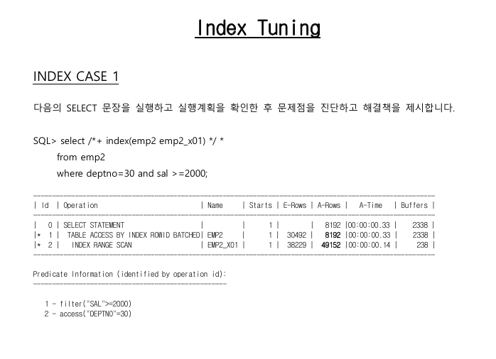
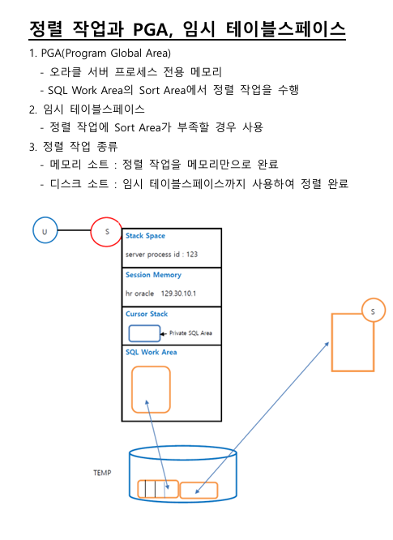
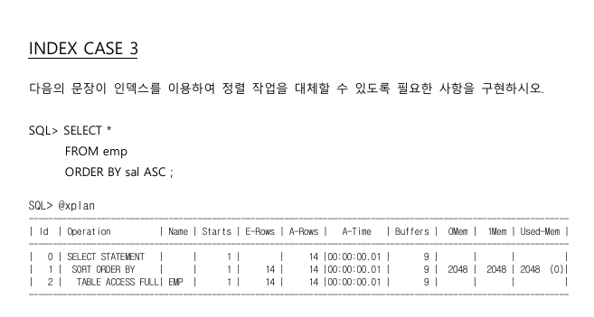
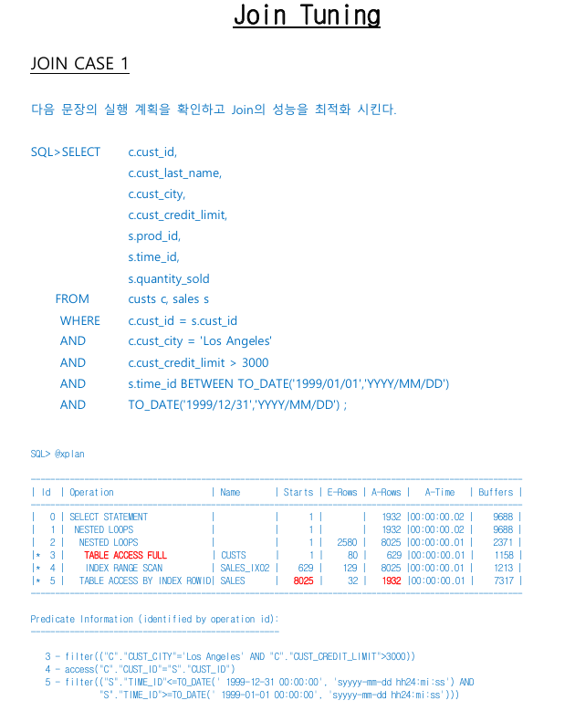

# 2일차 오전


## 4장 인덱스 사용 튜닝 이어서


### b*tree index

- hwm
- root, branch, leaf block의 트리 구조(값, rowid가 정렬된 상태)
- null 값은 제외
- 자동 생성 - pk, unique 제약조건이 선언된 컬럼
- 수동 생성 - 유저가 생성한 인덱스
- index 서치는 싱글 블록 io


### index range scan

- random io 줄이기(index 키값 중복이라던가), 가능한 수평 검색 범위도 줄이기(index range)

#### 튜닝

- 결합 인덱스를 이용한 튜닝
  - 두 개 이상 컬럼을 결합해서 생성(최대 32개 컬럼까지)
  - 테이블의 액세스, 인덱스 스캔 최소화에 이용
  - 결합 인덱스 생성시 컬럼의 순서도 중요함(1번 컬럼, 2번 컬럼)
- 결합 인덱스를 이용한 테이블 랜덤 액세스를 최소화하도록 튜닝
- 결합 인덱스의 선행 컬럼을 지정에 따른 인덱스 수평 스캔의 효율화 튜닝
  - 점 조건 (=, in)
  - 선분 조건 (>, <, >=, <=, between, like)
  - 선행 컬럼 설정시 우선 순위
    - where 절에서 자주 사용하는 컬럼
    - '=' 조건을 사용하는 컬럼
    - 많이 걸러낼 수 있는 컬럼
    - 점 조건 사용 컬럼

  - in 연산자는 = 조건으로 in 갯수 만큼 탐색(inlist iterator 방식)하므로 너무 많은 갯수는 오히려 between 보다 느릴 수 있음

- sort order by 작업 대신 인덱스를 이용하여 성능 튜닝
  - sort area 사용 대신 이미 정렬된 인덱스로 결과값 받기
  - 인덱스로 인한 정렬 사용시 null 값 존재하지 않도록 쿼리를 짜야함 (존재하면 인덱스를 사용하지 않음)


- 기존 운영 데이터에 인덱스 추가는 생각보다 쉽지않음 (기존 인덱스에 컬럼 추가도, 변경에 따른 영향을 파악하고 검토해야함)




- deptno에 대한 idx만 존재하여 sal에 대한 인덱스 필요

- ```
  create index emp2_x01 on emp2 (deptno, JOB) nologging;
  
  SQL_ID  7n5ak9hwwduax, child number 0
  -------------------------------------
    select /*+ index(emp2 emp2_x01) */ *  from emp2  where deptno=30 and 
  sal >=2000
   
  Plan hash value: 3451918632
   
  --------------------------------------------------------------------------------------------------
  | Id  | Operation                   | Name     | Starts | E-Rows | A-Rows |   A-Time   | Buffers |
  --------------------------------------------------------------------------------------------------
  |   0 | SELECT STATEMENT            |          |      1 |        |   8192 |00:00:00.02 |    2215 |
  |*  1 |  TABLE ACCESS BY INDEX ROWID| EMP2     |      1 |  30492 |   8192 |00:00:00.02 |    2215 |
  |*  2 |   INDEX RANGE SCAN          | EMP2_X01 |      1 |  38229 |  49152 |00:00:00.01 |     173 |
  --------------------------------------------------------------------------------------------------
   
  Predicate Information (identified by operation id):
  ---------------------------------------------------
   
     1 - filter("SAL">=2000)
     2 - access("DEPTNO"=30)
   
  ```

- ```
  create index emp2_new on emp2 (deptno, sal) nologging;
  
  SQL_ID  bs0mqkggm0cx3, child number 1
  -------------------------------------
    select /*+ index(emp2 emp2_new) */ *  from emp2  where deptno=30 and 
  sal >=2000
   
  Plan hash value: 2378551592
   
  --------------------------------------------------------------------------------------------------
  | Id  | Operation                   | Name     | Starts | E-Rows | A-Rows |   A-Time   | Buffers |
  --------------------------------------------------------------------------------------------------
  |   0 | SELECT STATEMENT            |          |      1 |        |   8192 |00:00:00.01 |     732 |
  |   1 |  TABLE ACCESS BY INDEX ROWID| EMP2     |      1 |   8192 |   8192 |00:00:00.01 |     732 |
  |*  2 |   INDEX RANGE SCAN          | EMP2_NEW |      1 |   8192 |   8192 |00:00:00.01 |      40 |
  --------------------------------------------------------------------------------------------------
   
  Predicate Information (identified by operation id):
  ---------------------------------------------------
   
     2 - access("DEPTNO"=30 AND "SAL">=2000 AND "SAL" IS NOT NULL)
   
  Note
  -----
     - cardinality feedback used for this statement
   
  ```

- ```
  create index emp2_new on emp2 (deptno, job, sal) nologging;
  
  SQL_ID  bs0mqkggm0cx3, child number 1
  -------------------------------------
    select /*+ index(emp2 emp2_new) */ *  from emp2  where deptno=30 and 
  sal >=2000
   
  Plan hash value: 2378551592
   
  -----------------------------------------------------------------------------------------------------------
  | Id  | Operation                   | Name     | Starts | E-Rows | A-Rows |   A-Time   | Buffers | Reads  |
  -----------------------------------------------------------------------------------------------------------
  |   0 | SELECT STATEMENT            |          |      1 |        |   8192 |00:00:00.02 |     909 |    106 |
  |   1 |  TABLE ACCESS BY INDEX ROWID| EMP2     |      1 |  30492 |   8192 |00:00:00.02 |     909 |    106 |
  |*  2 |   INDEX RANGE SCAN          | EMP2_NEW |      1 |  30492 |   8192 |00:00:00.02 |     217 |    106 |
  -----------------------------------------------------------------------------------------------------------
   
  Predicate Information (identified by operation id):
  ---------------------------------------------------
   
     2 - access("DEPTNO"=30 AND "SAL">=2000)
         filter("SAL">=2000)
   
  ```

  



- sort의 단점
  - sort 사용시 부분 범위 처리 불가
  - 메모리 부족시 디스크 소트까지 진행 (i/o, 느림)
- index range scan descending
  - asc와 같이 정렬된 index에서 탐색하되, leaf 블록 큰 값 부터 스캔


### index inlist iterator

- in이나 = 조건이 or로 연결되어 있을 때 각각 값마다 인덱스를 별개로 돌림(starts - 시행 횟수 증가)
- empno in (7876, 7900, 7902) 의 경우 3번 인덱스 스캔
- starts 방문횟수
- in으로 사용하기 좋은 경우는 in 내에 값이 적거나 각각 값의 범위가 따로따로 띄워져 있을때 (10, 388, 685)
- 각각의 값이 비슷한 범위 내에 (10, 11, 12 와 같이) 있을 경우 between 을 통한 range scan이 더 빠를 수 있음
- in 내에 값을 아무렇게나 넣어도 적은 순서대로 스캔함 (52, 10, 23, 40) -> 10, 23, 40, 52


### index full scan

- 인덱스 전체 조회
- 모든 리프 블록을 logical 정렬 순서대로 읽음 (asc)
- 인덱스 컬럼이외 컬럼 조회시에도 사용 될 수 있음
- 사용되는 컬럼에 not null 제약조건이나 조건식 필요(a is not null)
- 싱글 블록 리드
- 사용 사례
  - full table scan 대신 사용
  - sort 대신 사용


# 오후


### index fast full scan

- 모든 leaf block을 읽는다
- 인덱스에 포함된 컬럼으로만 조회할 때 사용
- 사용되는 컬럼에 not null 제약조건이나 조건식 필요(a is not null)
- 멀티 블록 리드 (db_file_multiblock_read_count)
- 병렬 처리 가능
- 넓은 범위의 검색에서 사용
- index_ffs 힌트


### index join

- 인덱스 끼리 조인 select, where 절 컬럼이 모두 인덱스에 존재해야 함
- 테이블 접근 없이 인덱스만 이용
- hash join의 형태




```sql
SQL_ID  gza75s4wxz3tp, child number 0
-------------------------------------
SELECT *  FROM emp  --where sal is not null ORDER BY sal ASC
 
Plan hash value: 150391907
 
----------------------------------------------------------------------------------------------------------------
| Id  | Operation          | Name | Starts | E-Rows | A-Rows |   A-Time   | Buffers |  OMem |  1Mem | Used-Mem |
----------------------------------------------------------------------------------------------------------------
|   0 | SELECT STATEMENT   |      |      1 |        |     14 |00:00:00.01 |       2 |       |       |          |
|   1 |  SORT ORDER BY     |      |      1 |     14 |     14 |00:00:00.01 |       2 |  2048 |  2048 | 2048  (0)|
|   2 |   TABLE ACCESS FULL| EMP  |      1 |     14 |     14 |00:00:00.01 |       2 |       |       |          |
----------------------------------------------------------------------------------------------------------------
 
```


```sql
SQL_ID  cyjsd6wvqak6c, child number 0
-------------------------------------
SELECT *  FROM emp  where sal is not null ORDER BY sal ASC
 
Plan hash value: 4171131156
 
----------------------------------------------------------------------------------------------------
| Id  | Operation                   | Name       | Starts | E-Rows | A-Rows |   A-Time   | Buffers |
----------------------------------------------------------------------------------------------------
|   0 | SELECT STATEMENT            |            |      1 |        |     14 |00:00:00.01 |       2 |
|   1 |  TABLE ACCESS BY INDEX ROWID| EMP        |      1 |     14 |     14 |00:00:00.01 |       2 |
|*  2 |   INDEX FULL SCAN           | EMP_SAL_IX |      1 |     14 |     14 |00:00:00.01 |       1 |
----------------------------------------------------------------------------------------------------
 
Predicate Information (identified by operation id):
---------------------------------------------------
 
   2 - filter("SAL" IS NOT NULL)
 
```


### 인덱스 스캔  못하는 경우

- <>, !=, ^= 등 부정형 비교
- 인덱스 컬럼의 변형이 발생한 경우
  - 변형 되지 않도록 쿼리를 짜거나
    - 암시적 변형 
      where cust_id like '7%' -> where to_char(cust_id) like '7%'
      where id = 3(id가 문자일 경우) -> where to_number(id) = 3
    - where id(id가 숫자일 경우) = '3' -> where id = to_number('3') => 컬럼의 타입이 변경되지 않아 인덱스 사용됨 
      to_date(char) = date
    - 명시적 변형
  - function based index 를 생성
- like '%문자열%'
  - like '문자%' 는 가능
  - like '%문자' 는 불가 - 인덱스 시작점을 찾을 수 없음
- is null (B*tree) - null 값 자체를 인덱스에 가지고 있지 않음 (default 값을 지정하거나 임의의 다른 값으로 null 을 대체 하도록 설계)
  - 다만 null 값이 다수일 경우에는 between 등을 통해 범위만 제한하는 테이블 스캔으로 하는게 나을 수도있음
- 가공하지 않은 선행 컬럼이 조건절에 없을 때

- 


### table full scan & index scan

- 모든 sql 문장이 실행될 때 인덱스를 사용하는 것이 항상 올바른 것은 아님
- 전체 데이터 중 많은 행을 검색하는 경우 풀 스캔이 효율적일 수 있음
- 항상 인덱스를 사용하는 것 보다 전체  데이터 중 어느 정도의 행을 검색 하는 지 생각하여 인덱스 사용 유무 결정하는 것이 바람직 함.


### 인덱스 관리를 위한 지침

- 인덱스가 필요한 테이블과 컬럼을 결정
  - 큰 테이블에서 적은 건수의 행을 자주 검색하는 경우
  - 조인에 사용되는 컬럼
  - 조건절에 빈번히 사용되는 컬럼
  - '=' 연산자로 비교되는 컬럼
  - 정렬에 사용되는 컬럼

- 테이블당 인덱스 수 제한
  - 수행 빈도가 높은 명령어를 위한 인덱스

- 인덱스 삽입과 삭제
  - 삭제가 자주 발생해 인덱스 트리 내 공백이 많아질 경우 주기적으로 리빌드 해주는게 좋음
- index invisible - 비활성화 (옵티마이저가 고려하지 않음)


### 인덱스 튜닝 정리

- 테이블 랜덤 액세스를 최소화
  - 결합 인덱스 사용
  - 인덱스만 읽고 처리
  - iot 테이블, cluster 테이블, 파티션 테이블 이용
- 인덱스 스캔의 효율화
  - 조건절의 컬럼을 선행컬럼으로 사용
  - '=' 비교 연산자를 사용


## 5장 조인 튜닝

### 조인

- 두 개의 row source의 결합 (3개 이상의 조인 쿼리라도 두 개씩 나누어서 진행됨)
- 업무적으로 정확한 조인 조건을 적어줘야함 (특정 데이터가 같다는 의미 자체가 오라클에서 결정되는 부분이 아니므로)
- sql 문법은 대체로 비슷하지만 일부 시스템 별로 조금씩 다름
- 대표적으로 오라클 조인의 경우 오리지널 버전이 있고 표준 문법인 ansi가 있음
- 옵티마이저에서는 조인 순서 정하고 조인 테크닉 정함


### 조인 관련 힌트

- use_nl(d e) - nested loops join
- use_merge(d e) - sort merge join
- use_hash(d e) - hash join
- ordered - from 절의 나열된 테이블으이 순서로 조인
- leading(d e) - 지시된 순서로 조인
- swap_join_inputs(b) - b를 build table로 hash join 실행
- 예시) ordered leading(a b c) -> 2개가 충돌하는데, 이럴 때는 ordered 가 실행


### nested loops join

- outer table 행 소스 스캔
- outer table의 각 행에 대해 조인 조건을 만족하는 inner table의 모든 행 검색
- outer table 검색 조건의 행이 적을 경우 적합
- 조인에 참여하는 테이블의 순서가 중요
- outer table(driving, 선행 테이블) 결정 후 후행 테이블(inner table, drived)에 반복적인 접근
- 후행 테이블의 조인 컬럼에 인덱스 필요
- 소량의 데이터를 조인 시 사용 (oltp 업무 환경)
- 한 코드씩 순차적으로 처리하므로 부분 범위 (first_rows) 처리에 최적화
- 많은 양의 데이터 조인 시 random access 증가
- 선행, 후행 테이블 조건
  - 1건 걸러내는 조건이 있는 테이블을 선행 테이블로 선정
  - 조인 조건 컬럼에 인덱스가 있는 것을 후행 테이블로 선정(fk 컬럼에 인덱스 생성)
  - 양쪽에 인덱스가 있고 추가 조건이 있다면 추가 조건이 있는 쪽이 선행 테이블

```sql
// 실행 계획: Nested Loops Join

// 1. 외부 테이블(OUTER)을 선택합니다.
//    - 일반적으로 더 작은 테이블을 외부 테이블로 선택하여 비교 횟수를 줄입니다.

// 2. 내부 테이블(INNER)을 선택합니다.
//    - 외부 테이블의 각 행과 비교될 테이블입니다.

// FOR EACH row_outer IN OUTER
//    외부 테이블의 각 행(row_outer)에 대해 반복합니다.
//    -----------------------------------------------------
//    FOR EACH row_inner IN INNER
//       내부 테이블의 각 행(row_inner)에 대해 반복합니다.
//       -------------------------------------------------
//       IF row_outer.join_key == row_inner.join_key
//          // 조인 키(예: user_id, product_id)가 일치하는지 확인합니다.
//          // 이 조건이 조인 조건(JOIN predicate)입니다.
//          THEN
//             // 일치하는 행 쌍(pair)을 결과 집합에 추가합니다.
//             ADD (row_outer, row_inner) TO RESULTSET
//       END IF
//    END FOR
// END FOR

// 결과 집합(RESULTSET)은 조인 결과로 반환됩니다.
// 이 방식은 중첩된 반복문으로 인해 O(N * M)의 시간 복잡도를 가집니다.

```


#### nlj

#### nlj prefetching

- 인덱스 조회시 주변 블록도 같이 미리 읽어와서 처리하는 기법 (prefetch, 병렬 블록 읽기)

#### nlj batching

- 버퍼 캐시에 있는 데이터를 활용하여 먼저 조인 데이터를 만든 뒤, 조인 되지 않았던 내용만 묶어서(batch)inner 테이블 블록을 병렬로 한번에 요청
- 버퍼 캐시에 있는 데이터를 우선적으로 만들다보니 order by 까진 보장되지 않음


- inner table의 경우 조건이 있더라도 조인 후에 조건을 걸게 됨

### sort merge join

- 대형 데이터 조인시 사용
- sort 작업을 조인에 사용 (pga 소트 공간 사용)
- 둘 다 sort해서 사용하는 경우도 있지만 드물고 대부분 인덱스가 있어서 인덱스를 활용한 sort merge나 아니면 한쪽만 sort 한 뒤 사용

### hash join

- 대형 데이터 조인시 사용
- 작은 행 소스(build table)를 사용하여 해시 맵을 생성 (가능한 작은쪽 테이블)
- 두 번째 행 소스(probe table)가 해싱 처리되어 해시 맵에 대해 검사
- pga sql workarea 사용 (hash area)
- build table이 가능한 workarea에 들어갈 정도로 작을 수록 유리함
- equi join만 가능 (non equi - 같지 않거나 크거나 작거나 등 같지 않은 모든 케이스)
- 전체 범위 처리에 최적화(all_rows)
- 소량의 데이터를 조인할 때 hash join이 사용되면 불필요한 i/o증가
- 각 집합의 비조인 조건 컬럼을 선행으로 하는 결합 인덱스 사용 고려


- 쿼리 튜닝시 count(*) 와 같은 쿼리로 작성하면 안되고, 실제 사용할 컬럼까지 정확히 지정해주어야함.


### outer join 튜닝

- 모두 나와야 하는 테이블은 기준 테이블
- 비교 테이블은 참조 테이블
- 기본적으로 기준 테이블 을 메인으로 실행계획 생성 (hash - build, nested - outer)
- 다만 hash의 경우 swap_join_inputs으로 build table 강제 설정 가능


### 예제



#### 처리

```sql

select * from table(dbms_xplan.display_cursor(null,null, 'ALLSTATS LAST'));

create index emp2_new on emp2 (deptno, job, sal) nologging;

create index custs_new on custs (cust_id, cust_city, cust_credit_limit) nologging;


create index sales_new on sales (cust_id, time_id) nologging;


SELECT /* index(c custs_new s sales_new) */
    c.cust_id,
    c.cust_last_name,
    c.cust_city,
    c.cust_credit_limit,
    s.prod_id,
    s.time_id,
    s.quantity_sold
FROM
    custs c
    JOIN sales s ON c.cust_id = s.cust_id
WHERE
    c.cust_city = 'Los Angeles'
    AND c.cust_credit_limit > 3000
    AND s.time_id BETWEEN TO_DATE('1999/01/01', 'YYYY/MM/DD')
                      AND TO_DATE('1999/12/31', 'YYYY/MM/DD');
                      
 SELECT /* use_nl(s c) index(c custs_new2 s sales_new) */
    c.cust_id,
    c.cust_last_name,
    c.cust_city,
    c.cust_credit_limit,
    s.prod_id,
    s.time_id,
    s.quantity_sold
FROM
    custs c
  ,  sales s
WHERE
    c.cust_id = s.cust_id
    and c.cust_city = 'Los Angeles'
    AND c.cust_credit_limit > 3000
    AND s.time_id BETWEEN TO_DATE('1999/01/01', 'YYYY/MM/DD')
                      AND TO_DATE('1999/12/31', 'YYYY/MM/DD');
                      
create index custs_new2 on custs (cust_city) nologging;
```


```sql
SQL_ID  233cyxvff9b7u, child number 0
-------------------------------------
SELECT     c.cust_id,     c.cust_last_name,     c.cust_city,     
c.cust_credit_limit,     s.prod_id,     s.time_id,     s.quantity_sold 
FROM     custs c     JOIN sales s ON c.cust_id = s.cust_id WHERE     
c.cust_city = 'Los Angeles'     AND c.cust_credit_limit > 3000     AND 
s.time_id BETWEEN TO_DATE('1999/01/01', 'YYYY/MM/DD')                   
    AND TO_DATE('1999/12/31', 'YYYY/MM/DD')
 
Plan hash value: 2766340661
 
-----------------------------------------------------------------------------------------------------
| Id  | Operation                    | Name       | Starts | E-Rows | A-Rows |   A-Time   | Buffers |
-----------------------------------------------------------------------------------------------------
|   0 | SELECT STATEMENT             |            |      1 |        |     50 |00:00:00.01 |     103 |
|   1 |  NESTED LOOPS                |            |      1 |        |     50 |00:00:00.01 |     103 |
|   2 |   NESTED LOOPS               |            |      1 |   2580 |     54 |00:00:00.01 |      52 |
|*  3 |    TABLE ACCESS FULL         | CUSTS      |      1 |     80 |     11 |00:00:00.01 |      28 |
|*  4 |    INDEX RANGE SCAN          | SALES_IX02 |     11 |    129 |     54 |00:00:00.01 |      24 |
|*  5 |   TABLE ACCESS BY INDEX ROWID| SALES      |     54 |     32 |     50 |00:00:00.01 |      51 |
-----------------------------------------------------------------------------------------------------
 
Predicate Information (identified by operation id):
---------------------------------------------------
 
   3 - filter(("C"."CUST_CITY"='Los Angeles' AND "C"."CUST_CREDIT_LIMIT">3000))
   4 - access("C"."CUST_ID"="S"."CUST_ID")
   5 - filter(("S"."TIME_ID"<=TO_DATE(' 1999-12-31 00:00:00', 'syyyy-mm-dd hh24:mi:ss') AND 
              "S"."TIME_ID">=TO_DATE(' 1999-01-01 00:00:00', 'syyyy-mm-dd hh24:mi:ss')))
 
```

```sql
SQL_ID  85p70xwj3k657, child number 0
-------------------------------------
SELECT /* index(c custs_new s sales_new) */     c.cust_id,     
c.cust_last_name,     c.cust_city,     c.cust_credit_limit,     
s.prod_id,     s.time_id,     s.quantity_sold FROM     custs c     JOIN 
sales s ON c.cust_id = s.cust_id WHERE     c.cust_city = 'Los Angeles'  
   AND c.cust_credit_limit > 3000     AND s.time_id BETWEEN 
TO_DATE('1999/01/01', 'YYYY/MM/DD')                       AND 
TO_DATE('1999/12/31', 'YYYY/MM/DD')
 
Plan hash value: 408975872
 
-----------------------------------------------------------------------------------------------------
| Id  | Operation                     | Name      | Starts | E-Rows | A-Rows |   A-Time   | Buffers |
-----------------------------------------------------------------------------------------------------
|   0 | SELECT STATEMENT              |           |      1 |        |   1932 |00:00:00.01 |    3601 |
|   1 |  NESTED LOOPS                 |           |      1 |        |   1932 |00:00:00.01 |    3601 |
|   2 |   NESTED LOOPS                |           |      1 |   2580 |   1932 |00:00:00.01 |    1748 |
|   3 |    TABLE ACCESS BY INDEX ROWID| CUSTS     |      1 |     80 |    629 |00:00:00.01 |     848 |
|*  4 |     INDEX SKIP SCAN           | CUSTS_NEW |      1 |     80 |    629 |00:00:00.01 |     231 |
|*  5 |    INDEX RANGE SCAN           | SALES_NEW |    629 |     32 |   1932 |00:00:00.01 |     900 |
|   6 |   TABLE ACCESS BY INDEX ROWID | SALES     |   1932 |     32 |   1932 |00:00:00.01 |    1853 |
-----------------------------------------------------------------------------------------------------
 
Predicate Information (identified by operation id):
---------------------------------------------------
 
   4 - access("C"."CUST_CITY"='Los Angeles' AND "C"."CUST_CREDIT_LIMIT">3000)
       filter(("C"."CUST_CITY"='Los Angeles' AND "C"."CUST_CREDIT_LIMIT">3000))
   5 - access("C"."CUST_ID"="S"."CUST_ID" AND "S"."TIME_ID">=TO_DATE(' 1999-01-01 00:00:00', 
              'syyyy-mm-dd hh24:mi:ss') AND "S"."TIME_ID"<=TO_DATE(' 1999-12-31 00:00:00', 'syyyy-mm-dd 
              hh24:mi:ss'))
 
```

```sql
SQL_ID  85vdm0xry4z4n, child number 0
-------------------------------------
SELECT /* use_nl(s c) index(c custs_new2 s sales_new) */     c.cust_id, 
    c.cust_last_name,     c.cust_city,     c.cust_credit_limit,     
s.prod_id,     s.time_id,     s.quantity_sold FROM     custs c   ,  
sales s WHERE     c.cust_id = s.cust_id     and c.cust_city = 'Los 
Angeles'     AND c.cust_credit_limit > 3000     AND s.time_id BETWEEN 
TO_DATE('1999/01/01', 'YYYY/MM/DD')                       AND 
TO_DATE('1999/12/31', 'YYYY/MM/DD')
 
Plan hash value: 855735575
 
---------------------------------------------------------------------------------------------------------------
| Id  | Operation                     | Name       | Starts | E-Rows | A-Rows |   A-Time   | Buffers | Reads  |
---------------------------------------------------------------------------------------------------------------
|   0 | SELECT STATEMENT              |            |      1 |        |   1932 |00:00:00.01 |    3631 |      4 |
|   1 |  NESTED LOOPS                 |            |      1 |        |   1932 |00:00:00.01 |    3631 |      4 |
|   2 |   NESTED LOOPS                |            |      1 |   2580 |   1932 |00:00:00.01 |    1778 |      4 |
|*  3 |    TABLE ACCESS BY INDEX ROWID| CUSTS      |      1 |     80 |    629 |00:00:00.01 |     603 |      4 |
|*  4 |     INDEX RANGE SCAN          | CUSTS_NEW2 |      1 |     90 |    932 |00:00:00.01 |       9 |      4 |
|*  5 |    INDEX RANGE SCAN           | SALES_NEW  |    629 |     32 |   1932 |00:00:00.01 |    1175 |      0 |
|   6 |   TABLE ACCESS BY INDEX ROWID | SALES      |   1932 |     32 |   1932 |00:00:00.01 |    1853 |      0 |
---------------------------------------------------------------------------------------------------------------
 
Predicate Information (identified by operation id):
---------------------------------------------------
 
   3 - filter("C"."CUST_CREDIT_LIMIT">3000)
   4 - access("C"."CUST_CITY"='Los Angeles')
   5 - access("C"."CUST_ID"="S"."CUST_ID" AND "S"."TIME_ID">=TO_DATE(' 1999-01-01 00:00:00', 
              'syyyy-mm-dd hh24:mi:ss') AND "S"."TIME_ID"<=TO_DATE(' 1999-12-31 00:00:00', 'syyyy-mm-dd hh24:mi:ss'))
 
```


### 서브쿼리

- sql 명령어에 포함된 select 명령어
- 서브쿼리를 포함하면 명령어는 조인처럼 여러 테이블을 참조할 수 있음
- 서브쿼리 유형
  - 중첩 서브쿼리 - where 절에 사용된 서브쿼리
  - 인라인뷰 - from 절에 사용된 서브쿼리
- 서브쿼리에 사용된 컬럼들은 서브쿼리 바깥에서 사용 불가
- 단일 행 서브쿼리의 경우 변형하지 않고 순서대로 처리
- 다중 행 서브쿼리의 경우 조인 기법을 이용하여 변형 작업 시도(옵티마이저)
- 세미조인?


### 예제 4 일반 그룹핑 vs 인라인뷰 서브쿼리를 활용한 최적화

```sql
SQL_ID  9j3d7wwq95z4n, child number 0
-------------------------------------
select a.prod_id, a.prod_name, sum(b.quantity_sold) from prods a , 
sales b where a.prod_id = b.prod_id(+) group by a.prod_id, a.prod_name
 
Plan hash value: 954948947
 
------------------------------------------------------------------------------------------------------------------
| Id  | Operation           | Name  | Starts | E-Rows | A-Rows |   A-Time   | Buffers |  OMem |  1Mem | Used-Mem |
------------------------------------------------------------------------------------------------------------------
|   0 | SELECT STATEMENT    |       |      1 |        |     50 |00:00:00.31 |    4463 |       |       |          |
|   1 |  HASH GROUP BY      |       |      1 |   3565 |     50 |00:00:00.31 |    4463 |   793K|   793K| 3040K (0)|
|*  2 |   HASH JOIN OUTER   |       |      1 |    913K|    913K|00:00:00.23 |    4463 |   933K|   933K| 1259K (0)|
|   3 |    TABLE ACCESS FULL| PRODS |      1 |     72 |     72 |00:00:00.01 |       2 |       |       |          |
|   4 |    TABLE ACCESS FULL| SALES |      1 |    913K|    913K|00:00:00.05 |    4461 |       |       |          |
------------------------------------------------------------------------------------------------------------------
 
Predicate Information (identified by operation id):
---------------------------------------------------
 
   2 - access("A"."PROD_ID"="B"."PROD_ID")
 
```

```sql
SQL_ID  ac0wb1cbauhsd, child number 0
-------------------------------------
select a.prod_id, a.prod_name, b.sum_sold from prods a , (select 
b.prod_id, sum(quantity_sold) as sum_sold      from sales b     group 
by b.prod_id) b where a.prod_id = b.prod_id(+)
 
Plan hash value: 1503004506
 
-------------------------------------------------------------------------------------------------------------------------------
| Id  | Operation                    | Name      | Starts | E-Rows | A-Rows |   A-Time   | Buffers |  OMem |  1Mem | Used-Mem |
-------------------------------------------------------------------------------------------------------------------------------
|   0 | SELECT STATEMENT             |           |      1 |        |     50 |00:00:00.11 |    4463 |       |       |          |
|   1 |  MERGE JOIN OUTER            |           |      1 |     72 |     50 |00:00:00.11 |    4463 |       |       |          |
|   2 |   TABLE ACCESS BY INDEX ROWID| PRODS     |      1 |     72 |     50 |00:00:00.01 |       2 |       |       |          |
|   3 |    INDEX FULL SCAN           | PROD_IX01 |      1 |     72 |     50 |00:00:00.01 |       1 |       |       |          |
|*  4 |   SORT JOIN                  |           |     50 |     71 |     50 |00:00:00.11 |    4461 |  9216 |  9216 | 8192  (0)|
|   5 |    VIEW                      |           |      1 |     71 |     71 |00:00:00.11 |    4461 |       |       |          |
|   6 |     HASH GROUP BY            |           |      1 |     71 |     71 |00:00:00.11 |    4461 |   941K|   941K| 2646K (0)|
|   7 |      TABLE ACCESS FULL       | SALES     |      1 |    913K|    913K|00:00:00.05 |    4461 |       |       |          |
-------------------------------------------------------------------------------------------------------------------------------
 
Predicate Information (identified by operation id):
---------------------------------------------------
 
   4 - access("A"."PROD_ID"="B"."PROD_ID")
       filter("A"."PROD_ID"="B"."PROD_ID")
 
```

https://drive.google.com/drive/folders/1XJGIuRfjqlFhn5e29zy-cEjgXjfKLJ13
