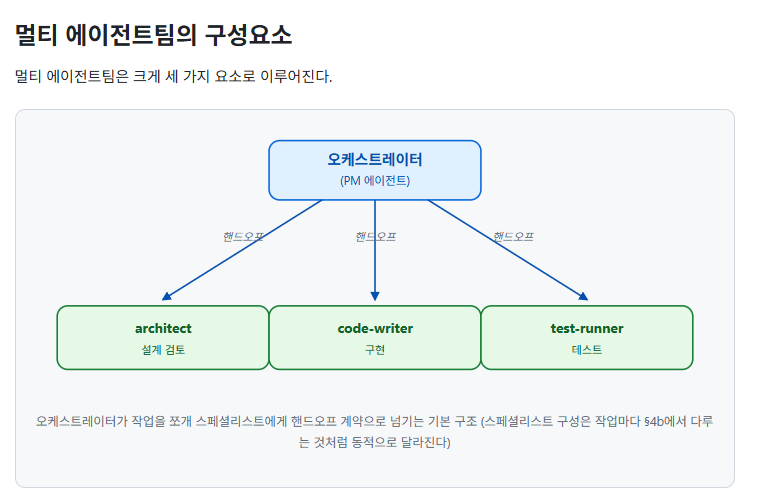
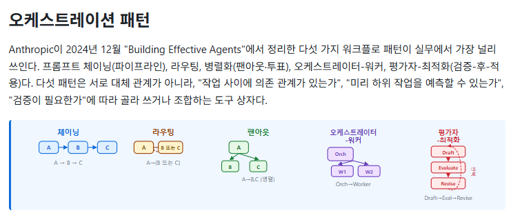

# 2일차

엔탈그래피티?

### 어제 내용 정리

- ai의 발전으로 점점 일자리가 줄어드는 추세

- fd(frontend deploy) - ds및 조회 등 제작하는 플랫폼? 하는 업무

- ai를 현업도 사용할 수 있게 되면서 개발이 가능해지니 보안적인 이슈가 지속적으로 발생할 가능성이 높음
- 
- 어제는 2단계를 실제 사용해보는 느낌이고 오늘은 실제 시스템을 만드는 과정
- 멀티에이전트의 장단점 (하네스 구축)

- 단일 llm과 멀티에이전트의 차이
- 에이전트화 되면서 사람이 하는일이 계속 줄어듬
- /compact - 컨텍스트 윈도우가 좀 차면 정리하는 기능(줄이기)
- 서브에이전트끼리 통신이 안됨(현재 기준)
- 서브에이전트에게 작업 취소를 예전엔 못했는데, 최근에는 작업 취소를 할 수 있음(하나하나 이야기를 해볼 순 있음)
- 서브에이전트에서 짜증나던 상황 - 특정 서브에이전트가 실패하면 해당 실패한 작업에 대한 토큰을 돌려주지 않아 문제

- 

- 주기적으로 회고해서 놓치는 부분을 방지하는 것도 좋다

- 서브에이전트는 그래서 실제 작업 지시하기전에 잘 계획하는게 중요하고 여러번 검토 후 맡기는게 좋아보인다.(최대한 실패가 안뜨게끔)
- 하네스가 아니라고 해도 서브에이전트화를 할 순 있다. -> 명령어에 다중 에이전트를 띄워서 해줘 라고 하면 돌아가긴함
- 서브에이전트 사전 정의 vs 동적 생성
- 도구 중립적으로 (어떤 도구를 쓸때도 적용되도록 세팅) 정리하는게 꽤 어려움
  - 클로드 vs 클로드 데스크톱 - hook+host?
  - 클로드 vs 제미나이 
  - 클로드, 클로드 데스크톱 - 클로드.md을 같이써도 문제가 덜함
  - antigravity, antigravity cli - 두 개의 세팅이 다름 (antigravity는 윈드서프 기반이므로)
  - 동적 워크플로우(클로드 데스크톱) - 토큰 소모가 순식간에 삭제됨
  - 동적 워크플로우(클로드 코드) - 내가 사이즈를 정할 수 있음(에이전트를)

- 오케스트레이션 패턴
- 

- bpmd (business process markup down)?
- 체이닝이나 오케스트레이터-워커가 제일 무난한 방식

- 실패했을 때 방안
  - 재시도
  - 롤백
  - 에스컬레이션
  - fallback - a라는게 실패하면 B로 가게끔

- oop - 객체(에이전트)와 클래스(md파일)

- agent.md - 부트스트랩같은 표준
- 에이전트 서비스 사용시 네트워크 트래픽 비용 부담 
- 오라클 
- 테일스케일

#### 가드레일

- 백업 파일 만들도록 해두기(sql이든 파일 생성이든)
- 브랜치 정리 기능
- 수정 및 깃에 올리고 mr 및 머지하도록 자동 루틴 짜두면 편할듯

#### 승인 게이트 (워크플로우)

- 중간에 사람이 검증이나 승인이 필요한 부분은 반드시 승인을 거친 이후에 진행하도록 구성

- 플랫폼 중립적으로 만드는게 좋긴한데..

- 샌드박스 사용시 장단점

  - 장점 - 해당 작업으로 인해 샌드박스 바깥에 영향을 끼치지 않음, 보안 문제 해결에 용이
  - 도커로 클로드 코드 띄우면 내 pc 내용까지 바꾸지 못하니까
  - 단점 - 실패거나 문제 발생시 데이터 다 날아감

  

- 윈도우에서 리눅스 써야하는 작업이 필요할 때 윈도우 내장 리눅스는 안쓰는걸 추천?

- xwindows?

- 윈도우즈에도 샌드박스는 있긴함

- slm?

## 하네스 만들어 보기 실습

- 하네스 엔지니어링 기반의 멀티 에이전트팀을 활용한 ...을 만들고 싶어

- git pull

- 에이전트 추가, 워크플로우, 스킬1~2개 추가

- 계획파일을 docs 같은곳에 만들어서 나중에 사용해보기

- 디자인, 정보보안
- 상세요건 정리 - prd만드는것과 유사함
- adr을 만들어달라고 명확하게 이야기 하기
- 11장 팀만들기 참고

- 루틴한 부분은 스크립트나 코드로 실행
- write는 mcp로 하지 않는걸 추천
- 계산 ai로 하지 않는걸 추천(python 코드등으로 구현) - 
- 스펙, ui, 문서, 코딩 - 동시 진행이 과연 가능할까? - 과거는 체이닝 느낌으로 일하긴 했지만
  - 최근에는 내가 일하는 방식에서 발상의 전환이 필요하다 (구조 설계)
  - 에이전트와 워크플로우를 어떻게 짜야할까? - 제일 중요

## 오후

- ai workspace std - L0 
  - templates/common - L1
  - templates/<variant> - L2
    - project - L3

- constitution.md - 현재 프로젝트 구조에 대해 알 수 있음
  - context.md
  - <variant>context.md

- vatiant 
- 분권형 구조에서 형상관리하는 하네스 구조를 구현할 때 
- 하네스 구현 -> variant 화 하기?
- 공통과 비공통의 차이

- 실제 제로에서 하네스엔지니어링 만들기 사례를 통해 알아보기
  - 워크플로우
- 구매 관련 업무를 총괄하는 하네스 엔지니어링을 통한 구매 멀티에이전트팀을 만들어줘

- 조달 구매 업무를 담당하는 에이전트와 워크플로우를 만들어줘
- 각 에이전트들에게 필요한 스킬을 검토해서 만들어줘

- 지금 만들어진 프로젝트를 codex, claude destop app, claude code, antigravity cli, antigravity 에서 사용할 수 있도록 바꾸어 줘