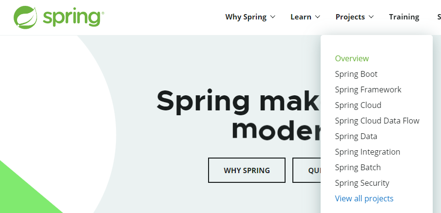
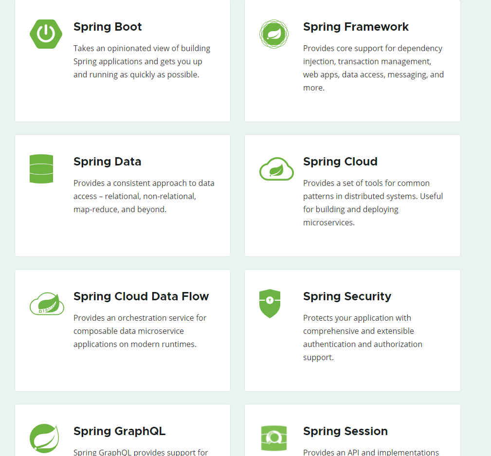

# 211123 - 스프링이란?

## 스프링 생태계

- 스프링은 여러가지 기술들의 모음

#### 필수 기술

- 스프링 프레임워크 - 기본 프레임워크
- 스프링 부트 - 스프링의 기본 설정을 편하게 세팅하도록 도와주는 기술

#### 선택 기술

- 스프링 데이터 - 어떤 sql, db든 기본적인 crud 로직은 유사하기 때문에 해당 db나 sql에 맞추어 crud를 쉽게 구현할 수 있도록 도와주는 기술, 제일 많이 쓰이는 기술은 스프링 데이터 JPA
- 스프링 세션 - 세션 기능을 편리하게 사용하도록 도와줌
- 스프링 시큐리티 - 보안 관련 보조
- 스프링 Rest Docs - api 문서와 테스트를 묶어서 api 테스트를 편리하게 구성해줌
- 스프링 배치 - 실무에서 대량의 데이터를 업데이트 하거나 하는 등, 시간이 오래 걸릴만 한 일을 자동으로 돌리기 위한 배치 처리에 특화된 기술
- 스프링 클라우드 - 클라우드 특화 기술

- 이외에도 많은 spring.io -> project 탭을 가보면 스프링 관련 프로젝트를 확인 가능

### 스프링 프레임워크

- 핵심 기술 - 스프링 DI 컨테이너, AOP, 이벤트, 기타
- 웹 기술 - 스프링 MVC, 스프링 WebFlux
- 데이터 접근 기술 - 트랜잭션, JDBC, ORM 지원, XML 지원
- 기술 통합 - 캐시, 이메일, 원격접근, 스케줄링
- 테스트 - 스프링 기반 테스트 지원
- 언어 - 코틀린, 그루비
- 최근에는 스프링 부트를 통해서 스프링 프레임워크의 기술들을 편리하게 사용 

### 스프링 부트

- **스프링을 편리하게 사용할 수 있도록 지원, 최근에는 기본으로 사용** - 매우 편리
- 단독으로 실행할 수 있는 스프링 애플리케이션을 쉽게 생성
- Tomcat 같은 웹 서버를 내장해서 별도의 웹 서버를 설치하지 않아도 됨
  - 이전에는 빌드, Tomcat 서버 설치, Tomcat 서버가 설치된 경로에 빌드한 스프링 프로젝트를 넣고 띄워야했음
  - 부트 이후로 빌드 및 서버에 띄우는 과정을 자체적으로 처리해줌
- 손쉬운 빌드 구성을 위한 starter 종속성 제공
  - 과거에는 특정 프로젝트 별로 설치해야하는 라이브러리가 복잡했음(특정 라이브러리와 연계된 종속성 문제라던가 버전 문제라던가)
  - 지금은 특정 목적별로 starter가 존재하여 해당 목적에 맞는 라이브러리를 묶어 둠으로써 편하게 세팅이 가능해짐(특정 라이브러리 설치시 필요한 라이브러리를 자동적으로 묶어서 설치)
- 스프링과 3rd parth(외부) 라이브러리 자동 구성
  - 과거에는 스프링 버전에 맞는 외부 라이브러리 버전 관리가 매우 어려웠었음 (스프링 3.x 에는 특정 라이브러리 5.x 버전이 좋다.)
  - 부트에서는 이것을 자동으로 매핑하여 스프링 버전에 맞추어 외부 라이브러리 버전을 맞춰줌
- 메트릭, 상태 확인, 외부 구성 같은프로덕션 준비 기능 제공
  - 운영 환경에서 모니터링하는 것이 중요한데, 스프링부트가 기본적인 모니터링 툴 제공
- 관례에 의한 간결한 설정
  - 스프링 자체로는 설정이 매우 어려웠는데, 부트에서는 디폴트 설정이 존재하고 메뉴얼을 통해 보고 필요한 설정을 조금만 변경해주면 됨

- 스프링 부트에 대한 오해
  - 스프링 부트는 스프링 프레임워크와 별도로 사용할 수 없다.
  - 스프링 부트는 다양한 스프링 프레임워크 중에서 편리하게 사용할 수 있는 기능만 제공
  - 그래서 스프링 부트는 꼭 스프링 프레임워크와 연계되어 있다.

### 스프링 단어?

- 스프링이라는 단어는 문맥에 따라 다르게 사용된다.
  - 스프링 DI 컨테이너 기술
  - 스프링 프레임워크
  - 스프링 부트, 스프링 프레임워크 등을 모두 포함한 스프링 생태계

## 스프링은 왜 만들었는가?

### 핵심 개념 - 모든 프레임워크에서 가장 중요한 키워드

- 이 기술을 왜 만들었는가?
- 이 기술의 핵심 컨셉은? 보통 컨셉은 매우 단순함 -> 컨셉이 좋으면 사람들이 키워나가며 커짐

#### **모든 기술은 핵심 컨셉과 개념이 중요**

- 왜 모든 사람들이 3만줄의 코드에 열광을 해서 스프링을 오픈 소스로 만들자고 했는지?
- 도대체 로드 존슨이 어떤 컨셉을 가지고 만들었기에 그렇게 열광한걸까?
- 핵심 컨셉에 대해 제대로 이해하고 사용을 해야 본인만의 기술이 된다.
- 컨셉을 이해해야 왜 이런 기능이 만들어졌는지 자연스럽게 이해하고 받아들일 수 있다.
- 컨셉을 이해하지 못한 채 단순한 스프링 강의는 API 사용법만 배우는 것이 된다.
- 단순히 API 사용법만 안다고 스프링을 잘하는 것이 아니다.
- 핵심 컨셉을 아는 것이 매우 중요하다.

#### 스프링의 핵심 개념, 컨셉?

- 웹 애플리케이션 만들고, DB 접근 편리하게 해주는 기술?
- 전자정부 프레임워크?
- 이런 것은 스프링의 결과물로 나온 것일 뿐

#### 스프링의 진짜 핵심

- 스프링은 자바 언어 기반의 프레임워크
- 자바 언어의 가장 큰 특징 - **객체 지향 언어**

- 스프링은 객체 지향 언어가 가진 강력한 특징을 살려내는 프레임워크
- 스프링은 **좋은 객체 지향** 애플리케이션을 개발할 수 있게 도와주는 프레임워크

- 당시 EJB를 사용하던 시절에는 EJB 코드를 상속받으면서 EJB 의존적으로 개발을 진행해야 했음
  - 이렇게 개발하게 되면 객체 지향의 장점을 모두 잃어버림
  - EJB에 종속되어 EJB 스타일로만 개발이 가능하게 되어버림
  - 그래서 순수한 자바로 돌아가자는 의미로 POJO 활동까지 할 정도로 EJB에 대한 회의감이 개발자들에게선 만연한 상태
  - 이런 상황에서 스프링의 DI 컨테이너 (IOC 컨테이너)가 객체 지향 프로그래밍을 할 수 있도록 보조하는 기능을 가지면서 사람들이 열광을 함
  - 즉 기존의 자바 언어 특성을 잘 살릴 수 있는(객체 지향) 프레임워크 였기 때문에 인기가 많았던 것
- 그렇다면 좋은 객체 지향 프로그래밍이란 무엇인가?를 이해해야 스프링 프레임워크를 제대로 이해할 수 있다.
- 그래서 다음은 좋은 객체 지향 프로그래밍에 대해 알아봐야 한다.