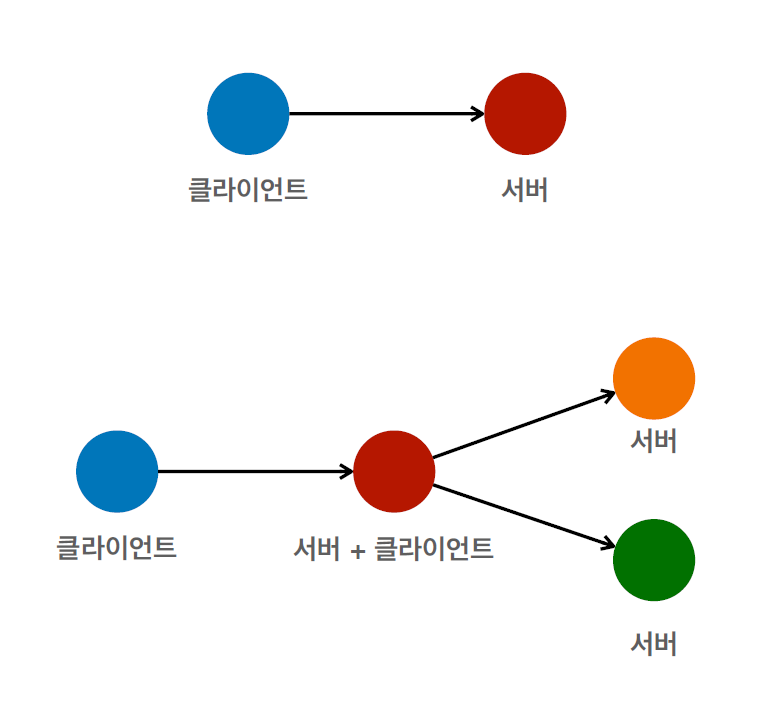
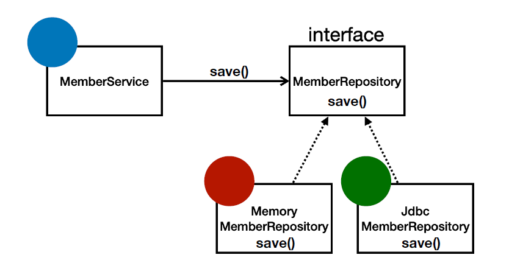
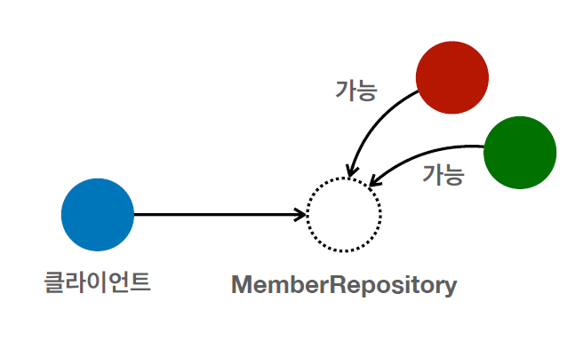
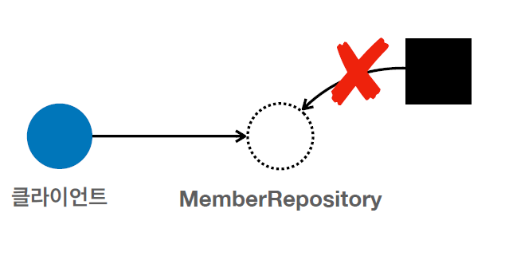
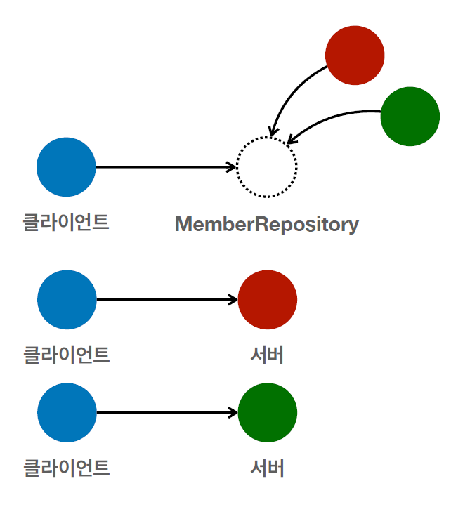

# 211123 - 좋은 객체 지향 프로그래밍


#### 객체 지향 특징


#### 객체 지향 프로그래밍

- 객체 지향 프로그래밍은 컴퓨터 프로그램을 명령어 목록으로 보는 시각에서 벗어나 여러개의 독립된 단위, 즉 **"객체"** 들의 **모임**으로 파악하고자 하는 것이다. 각각의 **객체**는 **메세지**를 주고 받고, 데이터를 처리할 수 있다. (**협력**)
- 객체 지향 프로그래밍은 프로그램을 **유연**하고 **변경**이 용이하게 만들기 때문에 대규모 소프트웨어 개발에 많이 사용된다.
- 객체, 모임, 메세지, 협력, 유연, 변경


#### 유연하고, 변경이 용이? => 다형성

- 레고 블럭 조립하듯이
- 키보드, 마우스 갈아 끼우듯이
- 컴퓨터 부품 갈아 끼우듯이
- 컴포넌트를 쉽게 유연하게 변경하면서 개발할 수 있는 방법


### 다형성

- 다형성이 객체 지향에서 왜 중요한지 배워보자

#### 다형성의 실세계 비유

- 실세계와 객체 지향을 1:1로 매칭 X
- 그래도 실세계의 비유로 이해하기에는 좋음
- **역할**과 **구현**으로 세상을 구분
  - 역할 - 인터페이스
  - 구현 - 구현된 객체


#### 운전자 - 자동차의 관계

- 운전자 - 역할
- 자동차 - 역할
  - K3, 아반떼, 테슬라 모델 3 - 자동차가 구현된 객체 (구현)
- 자동차가 바뀌어도 운전하는데 지장이 없음 -> 자동차가 운전자에게 영향을 끼치지 않음
- 유연하고 변경이 용이 -> 내가 자동차를 K3 에서 테슬라로 바꿔도 운전하는데 지장이 없음
- 왜 그것이 가능하냐? 자동차 역할의 인터페이스에 따라서 모든 자동차들이 구현되었기 때문
- 운전자는 자동차의 인터페이스(역할)에 대해서만 알고 있음 (역할에 대해서만 의존)
- 자동차라는 역할을 구현과 분리한 이유는?
  - 운전자를 위해서 역할과 구현을 분리했음 (클라이언트)
  - 클라이언트는 자동차의 내부 구조를 몰라도 된다. 구현된 내부 구조가 바뀌더라도 자기 역할만 잘 하고 있으면 클라이언트에 영향을 주지 않음. 심지어 아반떼를 테슬라로 바꿔도 운전자는 바꿀 필요가 없이 바로 운전 가능 
- 다른 대상으로 변환이 가능하고 심지어 기존 자동차 역할을 그대로 따라할 수 있으면 새로운 자동차가 나올 수 있다. (자동차 세상의 무한한 확장 가능)
- 즉 클라이언트에 영향을 주지 않고 새로운 기능을 제공 가능 
  - 왜 가능하냐? 역할과 구현으로 나누었기 때문
- 가장 핵심은 내가 자동차 역할을 여러개 구현할 수 있는게 중요한 것이 아닌, 새로운 자동차가 나와도 클라이언트는 새로운 것을 배울 필요가 없다. (클라이언트를 바꿀 필요가 없다.)


#### 공연 무대 - 로미오와 줄리엣 공연

- 로미오 역할 - 장동건, 원빈 (구현)
- 줄리엣 역할 - 김태희, 송혜교 (구현)
- 로미오와 줄리엣 공연할 때, 배우는 교체가 가능해야한다. 
- 역할과 구현을 나눴을 때, 변경 가능한, 대체 가능성이 생긴다. -> 유연하고, 변경이 용이하다.
- 내부 구조를 몰라도 된다.
  - 로미오 역할을 하는 사람은 줄리엣 역할에 대해 몰라도 본인 역할에만 충실해도 진행하는데 무리가 없다.
  - 줄리엣의 구현이 바뀐다고 로미오에 영향을 주지 않음 
  - 다른 대상으로 대체 가능함


#### 다형성 실세계 비유 추가

- 운전자 - 자동차
- 공연 무대
- 키보드, 마우스, 세상의 표준 인터페이스들
- 정렬 알고리즘
- 할인 정책 로직


### 역할과 구현을 분리

- **역할**과 **구현**으로 구분하면 세상이 **단순**해지고, **유연**해지며 **변경**도 편리해진다.
- 장점
  - **클라이언트**는 대상의 역할(인터페이스)만 알면 된다.
  - **클라이언트**는 구현 대상의 **내부 구조를 몰라도** 된다.
  - **클라이언트**는 구현 대상의 **내부 구조가 변경**되어도 영향을 받지 않는다.
  - **클라이언트**는 구현 **대상 자체를 변경**해도 영향을 받지 않는다.

#### 자바 언어

- 자바 언어의 다형성을 활용
  - 역할 - 인터페이스(자바의 인터페이스 Interface)
  - 구현 - 인터페이스를 구현한 클래스, 구현 객체
- 객체를 설계할 때 **역할**과 **구현**을 명확히 분리
- 객체 설계시 역할(인터페이스)을 먼저 부여하고, 그 역할을 수행하는 구현 객체 만들기
- 일반 상속관계에서의 다형성도 있긴 한데 인터페이스의 상속 관계가 다중으로 구현 가능하므로(일반 클래스는 단일 상속만 가능) 인터페이스를 기준으로 보는 것이 유용 
- 핵심은 구현 보다 인터페이스(역할)이 더 우선 (중요)


#### 객체의 협력이라는 관계부터 생각

- 다형성을 공부할 때 오해하는 부분이 부모가 있고 그것을 상속받아 구현받은 것이라고 정의를 내리고 끝내는데, 중요한 클라이언트를 빼놓고 생각한다.
- 다형성에서 중요한 것은 클라이언트를 포함해서 생각하는 것이다.
- 혼자 있는 객체는 없다.
- 클라이언트 - **요청**하는 사람, 서버 - **응답**하는 사람
- 수 많은 객체 클라이언트와 객체 서버는 서로 협력 관계를 가진다.
- 작은 개념에서는 객체끼리 커지면 서버끼리, 시스템끼리 요청을 주고 받을 수 있다.


#### 클라이언트와 서버의 관계

- 클라이언트 -> 서버
- 클라이언트 -> 서버 + 클라이언트 -> 서버
- 꼭 특정 값을 데이터에 담아 리턴하는 것이 응답이 아니라 클라이언트가 요청하는대로 처리하는 것 자체가 응답 (프린트 처리, 리턴 값이 void)




#### 자바 언어의 다형성

- **오버라이딩**을 떠올려보자
- 오버라이딩 자바 기본 문법
- 오버라이딩 된 메서드가 실행

- 다형성으로 인터페이스를 구현한 객체를 실행 시점에 유연하게 변경할 수 있다.
- 물론 클래스 상속 관계도 다형성, 오버라이딩 적용가능
- 오버로딩, 오버라이딩 짤막 정의
  - 오버로딩 - 여러개 초과해서 로딩했다. 메서드를 여러 개 재정의하는 것
  - 오버라이딩 - 기능을 넘어서 아예 타서 재정의한다. (상속)



- 클라이언트(멤버 서비스)는 멤버 레포지토리를 의존한다. (의존 = 알고 있다.)
- 멤버 레포지토리를 구현한 객체는 2가지 (메모리 멤버 레포지토리, Jdbc 멤버 레포지토리)



- 부모 클래스에서 자식 클래스를 모두 선언 가능하다. (다형성)
  - 부모는 마음이 넓어 자식들을 품을 수 있다. 자식들은 부모의 마음을 잘 모르기에 자식에 부모를 대입하는 것은 안된다.(외울 때 좋을 듯)

```java
public class MemberService {
    // 둘 중에 하나를 기능에 따라 자유롭게 가져와서 사용 가능
    // private MemberRepository memberRepository = new MemoryMemberRepository();
    private MemberRepository memberRepository = new JdbcMemberRepository();
}
```

- 멤버 레포지토리 인터페이스와 전혀 관련이 없는 클래스(부모)는 할당 할 수 없다.



- 다시 돌아와서 클라이언트에서 해당하는 멤버 레포지토리 구현 객체를 선택하면 해당하는 객체에 맞춰서 멤버 레포지토리가 작동한다.




#### 다형성의 본질

- 인터페이스를 구현한 객체 인스턴스를 **실행 시점**에 **유연**하게 **변경**할 수 있다.
- 다형성의 본질을 이해하려면 **협력**이라는 객체사이의 관계에서 시작해야함
- **클라이언트를 변경하지 않고, 서버의 구현 기능을 유연하게 변경할 수 있다.**


#### 역할과 구현을 분리 

##### 정리

- 실세계의 역할과 구현이라는 편리한 컨셉을 다형성을 통해 객체 세상으로 가져올 수 있음
- 유연하고, 변경이 용이
- 확장 가능한 설계
- 클라이언트에 영향을 주지 않는 변경 가능
- **인터페이스를 안정적으로 잘 설계하는 것이 중요**

##### 한계

- 역할(인터페이스) 자체가 변하면, 클라이언트, 서버 모두에 큰 변경이 발생한다.
- 자동차를 비행기로 변경해야 한다면?
- 대본 자체가 변경된다면?
- USB 인터페이스가 변경된다면?
- 인터페이스를 안정적으로 잘 설계하는 것이 중요 (모든 웹, 앱 개발 설계에 있어서 가장 중요함 - API 설계를 잘하는 개발자가 잘 하는 개발자)


#### 스프링과 객체 지향

- 다형성이 가장 중요하다!
- 스프링은 다형성을 극대화해서 이용할 수 있게 도와준다.
- 스프링에서 이야기하는 제어의 역전(IoC), 의존관계 주입(DI)은 다형성을 활용해서 역할과 구현을 편리하게 다룰 수 있도록 지원한다.
- 스프링을 사용하면 마치 레고 블럭 조립하듯이, 공연 무대의 배우를 선택하듯이 구현을 편리하게 변경할 수 있다.


- 스프링과 객체 지향에 있어서 다형성외에도 꼭 알아둬야할 핵심 개념이 한 가지 더 있다.
  - SOLID라고 불리는 좋은 객체 지향 설계의 5가지 원칙이 그것인데(면접에서도 자주 나옴), 다음 강의로 정리할 것
- 다형성 + SOLID를 잘 이해해야 스프링과 객체 지향에 대해 제대로 된 이해가 가능하다.

