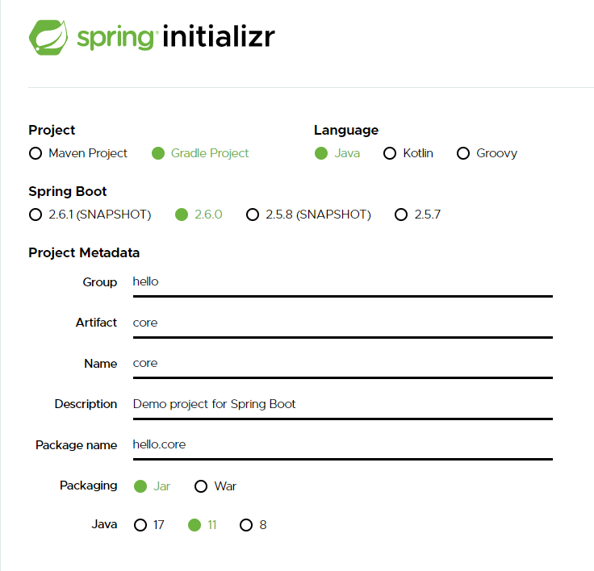

# 211124 - 프로젝트 생성


### 강의 기준 사전 준비물

- Java - 11버전
- IDE : IntelliJ 또는 Eclipse 설치
  - 강의는 IntelliJ로 진행되므로 IntelliJ로 같이 따라갈 예정


### 기본 프로젝트 생성법

- https://start.spring.io 로 접속한다.



- 버전은 안정화된 버전 중에서 최신 버전을 선택 권장한다. (Snapshot, m버전은 정식 버전이 아님)
- Artifact - bulid 이름
- packaging은 대부분 jar를 사용함
- 현재는 코어 기능만 사용할 것 이므로 종속성 부분은 패스한다.


- 이후에 밑에 Generate 버튼을 눌러 .zip 파일을 다운 받는다.


- 압축을 원하는 위치에 풀고 인텔리제이를 열어 프로젝트를 연다.
  - projects -> open -> 해당 프로젝트 경로\build.gradle 클릭 -> ok -> open as a project


- 초기에 실행하면 필요한 라이브러리를 설치해야하므로 빌드까지 시간이 조금 걸릴 것

- build.gradle 관련 정리

- ```groovy
  plugins {
  	id 'org.springframework.boot' version '2.6.0' // 기본 라이브러리
  	id 'io.spring.dependency-management' version '1.0.11.RELEASE' // 의존관계 관리
  	id 'java'
  }
  
  group = 'home' // 그룹 이름
  version = '0.0.1-SNAPSHOT'
  sourceCompatibility = '11' // 사용할 자바 버전
  
  repositories {
  	mavenCentral()
  }
  
  // 사용하는 의존 관계
  dependencies {
  	// 스프링 부트 스타터 (기본)
  	implementation 'org.springframework.boot:spring-boot-starter'
  	// 테스트 관련 라이브러리
  	testImplementation 'org.springframework.boot:spring-boot-starter-test'
  }
  
  test {
  	useJUnitPlatform()
  }
  ```

- 


#### 잘 실행되는지 테스트 해보기

- src/main/java/hello.core/CoreApplication.java를 연다.
- 
- 7번째 줄 클래스 옆 실행 버튼을 눌러 프로그램을 실행한다.
- 
- 정상적으로 실행되면 아래와 같은 결과가 뜨면서 실행 후 종료된다.
- 


#### 팁

- 좌측 상단 File -> settings 클릭
- 
- settings 에서 gradle 검색
- 
- build and run using과 run test using을 Intellij IDEA로 변경한다.
- 
- 이렇게 세팅하는 이유는 프로그램을 돌릴 때 gradle을 통해서 돌리면 조금 더 느린편(강의 기준으로)
- Intellij로 세팅하면 바로 자바를 바로 실행하므로 비교적 빠른 편이므로 이 방법을 추천
- 언젠가는 gradle이 빨라 질 수 있겠지만 지금은 IDEA가 더 빠른편

