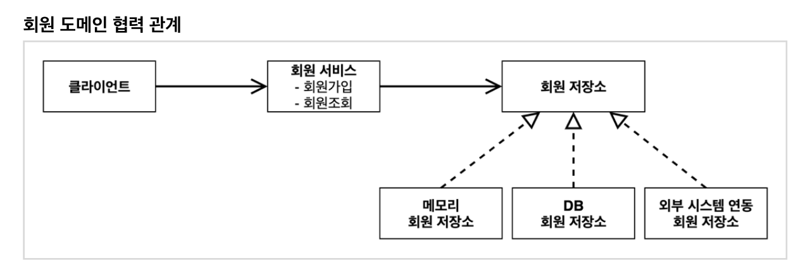
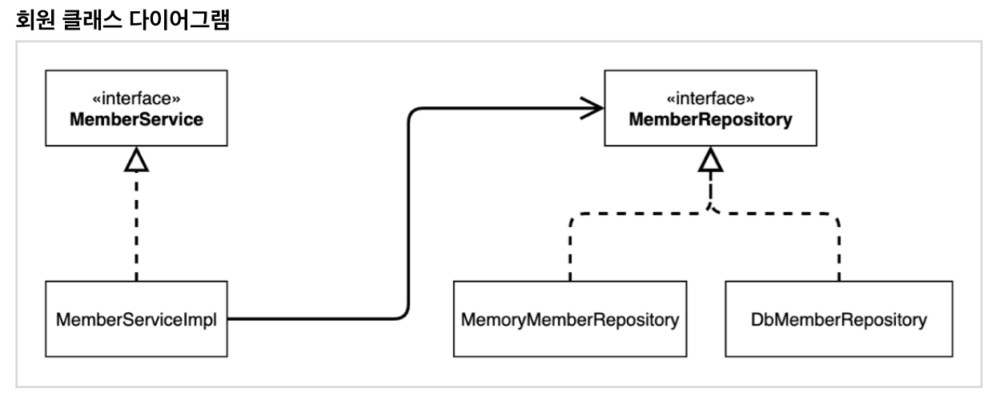

# 211129 - 회원 도메인 설계

### 회원 도메인 요구사항

- 회원을 가입하고 조회할 수 있다.
- 회원은 일반과 VIP 두 가지 등급이 있다.
- 회원 데이터는 자체 DB를 구축할 수 있고, 외부 시스템과 연동할 수 있다. (미확정)

#### 회원 도메인 협력 관계 - 전체적인 큰 그림

- 클라이언트 -> 회원 서비스(회원가입, 조회) -> 회원 저장소(어떤 저장소를 쓸지 모르지만 저장소와 연결하기 위한 인터페이스)
- 회원 저장소는 구현 방법에 따라 메모리 회원, DB 회원, 외부 시스템 연동 회원 저장소로 구현될 수 있다. 

- 현재로써는 어디다 저장할지 미정이므로 가장 간단한 구현인 메모리 회원 저장소를 통해 로컬 단위에서 객체로 데이터를 넣다 뺐다 하는 방법으로 개발 및 테스트를 진행할 예정
- 다만 메모리에 저장하는 방식이므로 서버가 재부팅 되면 데이터가 다 날아감 (딱 개발용도)
- 차후에 DB나 시스템이 정해지면 해당 모듈과 연결하는 방식(구현을 갈아끼우기)

#### 회원 클래스 다이어그램

- Impl - Implement = 구현이라는 의미. 인터페이스에 대한 구체적인 구현부를 나타냄

#### 회원 객체 다이어그램

- 실제 서버에 올라왔을 때 객체(메모리) 간의 참조가 어떻게 되는지 그린 다이어그램

- 서버상에서 클라이언트 객체가 실제로 사용하는(참조하는) 주소값의 인스턴스는 멤버서비스Impl 이다.

#### 정리

- 도메인 협력 관계 그림은 기획자들도 볼 수 있는 그림
- 위의 협력 관계 그림을 바탕으로 개발자가 클래스 다이어그램을 만든다.
- 클래스 다이어그램은 실제 서버에 부팅한 것이 아닌 전체적인 클래스 구성도만 보는 느낌이다.
- 그런데 실제 서버에 부팅할 당시에 결정되는 변수들(동적 변수, 지금 주어진 상황에서는 메모리멤버 vs DB멤버)는 클래스 다이어그램으로 판단하기 어렵다.
- 이러한 부분을 고려해서 객체 다이어그램을 작성하여 클라이언트가 실제 사용하는 인스턴스 간의 관계를 그려낸다.