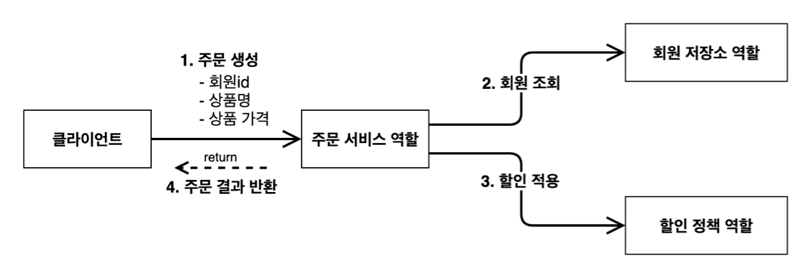
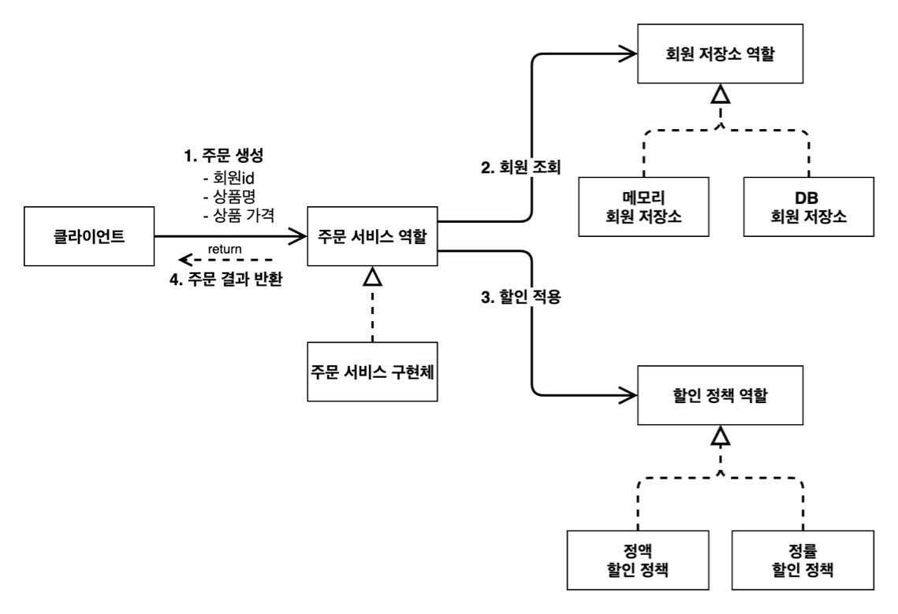
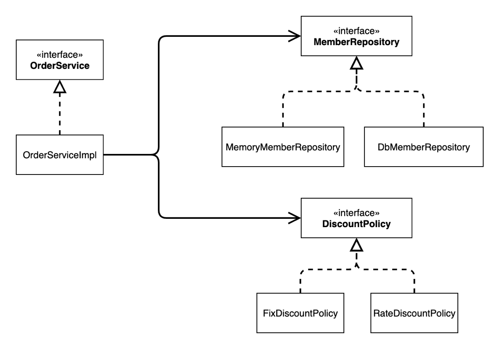
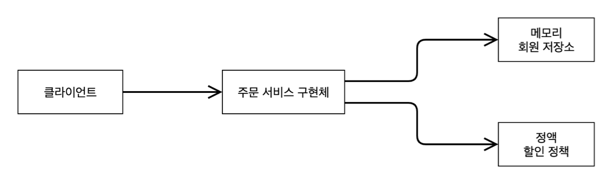
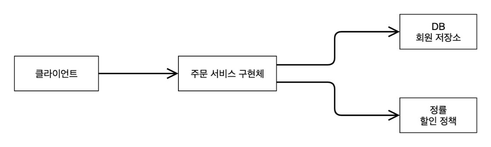

# 211201 - 주문과 할인 도메인 설계

## 주문과 할인 정책

- 회원은 상품을 주문할 수 있다.
- 회원 등급에 따라 할인 정책을 적용할 수 있다.
- 할인 정책은 모든 VIP는 1000원을 할인해주는 고정 금액 할인을 적용해달라. (나중에 변경 될 수 있다.)
- 할인 정책은 변경 가능성이 높다. 회사의 기본 할인 정책을 아직 정하지 못했고, 오픈 직전까지 고민을미루고 싶다. 최악의 경우 할인을 적용하지 않을 수 도 있다. (미확정)

### 주문 도메인 협력, 역할, 책임

1. 주문 생성: 클라이언트는 주문 서비스에 주문 생성을 요청한다. (java-main, spring-controller)
   - 예제를 간단히 하기 위해서 상품 가격, 상품 명을 가진 테이블을 별도로 만들진 않고 데이터를 바로 넘김
2. 회원 조회: 할인을 위해서는 회원 등급이 필요하다. 그래서 주문 서비스는 회원 저장소에서 회원을
    조회한다.
3. 할인 적용: 주문 서비스는 회원 등급에 따른 할인 여부를 할인 정책에 위임한다.
4. 주문 결과 반환: 주문 서비스는 할인 결과를 포함한 주문 결과를 반환한다.

> 참고: 실제로는 주문 데이터를 DB에 저장하겠지만, 예제가 너무 복잡해 질 수 있어서 생략하고, 단순히 주문 결과를 반환한다.

### 주문 도메인 전체 (역할과 구현)

- 역할과 구현을 분리해서 자유롭게 구현 객체를 조립할 수 있게 설계했다. 덕분에 회원 저장소는 물론이고, 할인 정책도 유연하게 변경할 수 있다.

### 주문 도메인 클래스 다이어그램

### 주문 도메인 객체 다이어그램1

- 회원을 메모리에서 조회하고, 정액 할인 정책(고정 금액)을 지원해도 주문 서비스를 변경하지 않아도 된다. 역할들의 협력 관계를 그대로 재사용 할 수 있다.

### 주문 도메인 객체 다이어그램2

- 회원을 메모리가 아닌 실제 DB에서 조회하고, 정률 할인 정책(주문 금액에 따라 % 할인)을 지원해도 주문 서비스를 변경하지 않아도 된다. 협력 관계를 그대로 재사용 할 수 있다.

