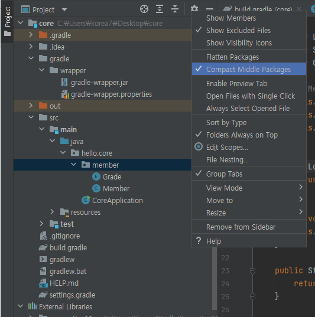
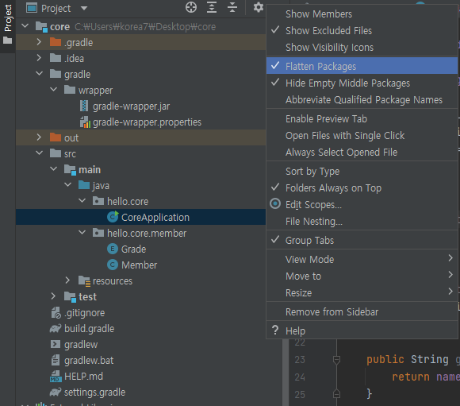
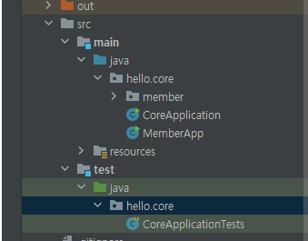

# 211201 - 회원 도메인 개발


## 개발 관련 팁

- File -> Settings -> Keymap 에서 원하는 단축키 찾아서 세팅 가능
  - 강의에서 사용하는 클래스 생성이나 파일 생성 관련 단축키 = alt + insert (윈도우 기준)

- 인텔리제이 기준으로 왼쪽 프로젝트 구조가 어떤 화면으로 세팅하냐에 따라 달라짐
  - compact
  - 
  - flatten
  - 

- compact 모드일땐 다음과 같이 hello 폴더 바로 밑에 새 폴더나 파일을 만들기 어려워서 flatten으로 변경하고 파일 추가한 뒤, 다시 compact로 바꿔서 사용해야한다.

- 현재는 강의상 보기 편하게 interface와 impl이 같은 폴더에 존재하지만 기본적으로는 다른 폴더로 나눠서 관리하는 것을 권장
- 구현체가 하나만 있을때는 구현체 이름을 Interface명+Impl 형태로 관례처럼 쓰인다.
- enter - 포인터 기준 뒷 내용과 함께 다음 줄로 이동
- ctrl + shift + enter - 해당 문장에 따라 자동 완성 한 뒤, 다음줄로 이동(매우 좋음, 기본 문장에선 세미콜론을 넣고 다음줄로 이동)
- shift + enter - 뒷 내용을 건들지 않고 포인터만 다음 줄로 이동
- alt + shift + 위,아래 - 해당 줄을 위, 아래로 이동


## 테스트

- 클래스 다이어그램 (정적), 객체 다이어그램(동적 - new를 통해 실제로 집어넣어야 알 수 있는 관계)

- psvm - public static void main의 줄임말.. 인텔리제이에서 자동완성 해준다.

- 변수 자동완성 해주는 단축키 ctrl + alt + v

  ```java
  // 여기까지 넣은 상태에서 ctrl + alt + v 를 누르면
  new Member(1L, "memberA", Grade.VIP);
  // 이렇게 자동 완성 해준다.
  Member member = new Member(1L, "memberA", Grade.VIP);
  ```

- soutv - system.out.println 의 줄임말
- 어플리케이션 단위(main, app)에서 테스트하는 것은 한계가 존재함 (매번 원하는 위치에 출력하도록 하던가 하는 번거로움 + 눈으로 확인해야함)
- jUnit 이라는 테스크 프레임워크를 써서 테스트를 진행 (기본 세팅 되어 있음)
- 테스트 폴더 내에서 파일을 생성해서 진행
  - 
- 빌드해서 배포로 나갈 때, test 폴더에 있는 파일은 빌드되지 않는다.(테스트 용도 이므로)
- Assertions 사용시 org.assertj.core.api 에 있는 것을 사용 추천 (편리한 API가 많음)
- 메인앱에서 검증을 할 땐, 눈으로 직접 보면서 이상이 있는지 확인해야하는데, 테스트 툴로 돌렸을 경우 테스트 실패시 에러 메세지가 뜨면서 어떤 부분에서 어떻게 에러가 나왔는지 자세히 설명해준다. (좋다)
  - 그러므로 요즘 현대적인 앱개발에서 테스트 코드는 선택이 아니라 필수다.
  - 잘 작성된 테스트 코드가 많은 개발 시간을 줄여준다.


### 회원 도메인 설계의 문제점

- 이 코드의 설계상 문제점은 무엇일까요? - OCP,  DIP를 제대로 지키기 어렵다.
- 다른 저장소로 변경할 때 OCP 원칙을 잘 준수할까요? - Interface와 구현체 모두를 의존하기 때문에 어렵다.
- DIP를 잘 지키고 있을까요? - OCP와 마찬가지로 잘 지키기 어렵다.
- 의존관계가 인터페이스 뿐만 아니라 구현까지 모두 의존하는 문제점이 있음
  - (MemberRepository = new MemoryMemberRepository();) 인터페이스를 의존하지만 할당하는 부분이 구현체를 의존함 (추상화에도 의존, 구체화에도 의존)
  - 주문까지 만들고나서 문제점과 해결 방안을 설명

