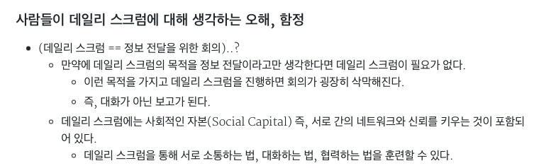
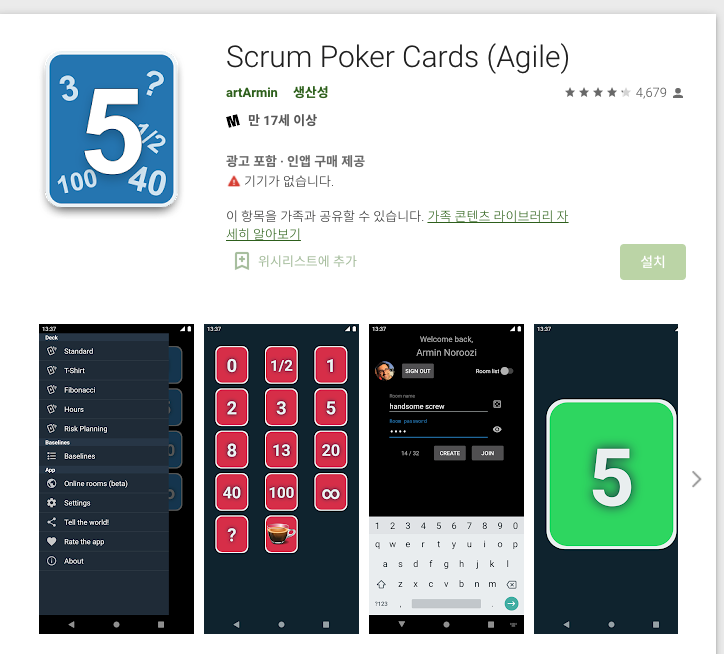
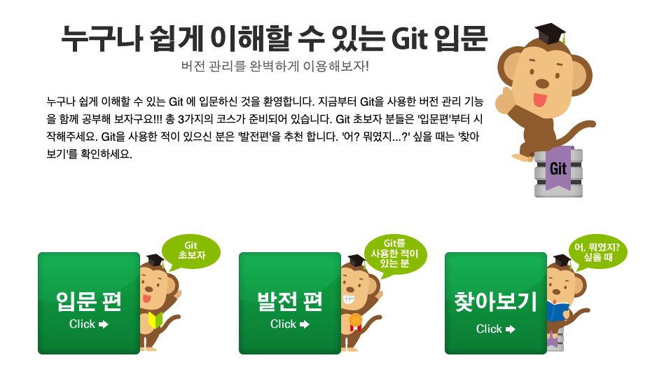
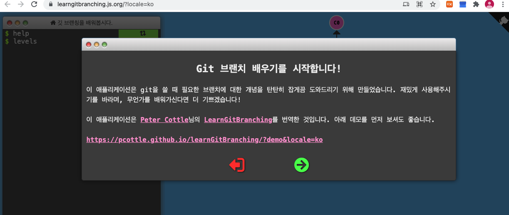

# 공통프로젝트 조례 관련 링크

##### 종례때 언급드렸던 '데일리 스크럼'과 관련되어 정리된 내용이 있어 공유 드립니다!! 내일뵈요 여러분!!!

>  https://gmlwjd9405.github.io/2018/06/01/agile-dailyscrum.html

##### Dodgy Scrum Stand-up

> https://www.youtube.com/watch?v=kKIc1NFO-AU

##### 방송 잘 보고 계신가요? ^^* 오늘 아침미팅은 방송종료후 5분정도 쉬었다가 진행하도록 하겠습니다. 시간되실때 Google Play Store 나  Apple AppStore 에서 다음앱을 다운로드 받아서 들어와 주세요!! ^^*

##### 우아한 형제들 기술블로그 gitflow 자료입니다.!!

> https://techblog.woowahan.com/2553/

##### 누구나 쉽게 이해할 수 있는 Git 입문

> https://backlog.com/git-tutorial/kr/

##### 깃 브랜칭을 배워봅시다

>https://learngitbranching.js.org/?locale=ko

##### 종례때 소개드린 Teachable Machine 사이트 입니다.

> https://teachablemachine.withgoogle.com/

##### WebRTC 기반의 서비스 구현을 간단하게 할 수 있는 openVidu를 소개드립니다. 참고하세요. ^^

- Demo : https://openvidu.io/demos#0
- Tutorials : https://openvidu.io/tutorials
- Docs : https://docs.openvidu.io/en/2.18.0/
- 

##### 에필로그 요청하신 분들이 있으셔서 URL로만 접근가능한 부분 공개로 드립니다.  혹시 불편하신 분은 DM주시면 바로 내려드릴께요!

https://www.youtube.com/watch?v=TkwMewyfw2s

안녕하세요 혹시 도움이 될까 싶어, 오늘 발표 때 말씀드렸던, 특강 관련 참고했던 블로그 혹은 기사 링크 공유합니다 :slightly_smiling_face: 지금 특강에서도 oss 추천해주시네요?! 오픈소스 컨트리뷰션 관련 소식 접하고 싶으실 때 들어가보시길 추천합니다 - :point_right: 오픈소스 컨트리뷰터

- 초보 개발자가 오픈소스에 기여하는 5단계(2014) https://www.bloter.net/newsView/blt201407020001
- 기업이 오픈소스를 좋아하는 10가지 이유(2019) https://www.oss.kr/news/show/98ea46e2-431b-42da-95b8-680c571fe2c1
- 오픈소스 컨트리뷰터의 팁(2020) https://dc7303.github.io/essay/2020/12/13/opensource-contribution/

\- :point_right: Docker와 쿠버네티스

- Docker 와 쿠버네티스의 이해(2018) https://zzsza.github.io/development/2018/04/17/docker-kubernetes/